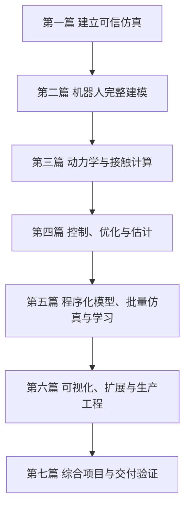

# 《MuJoCo机器人仿真实战》

## 本书定位

本书是一部面向机器人研发工程师的 MuJoCo 3.11.0 C++ 系统教材，覆盖从刚体仿真基础、机器人模型构建、动力学与接触计算，到控制、状态估计、批量仿真、可视化和生产部署的完整技术链。

全书以人形机器人和机械臂的工程问题为主线，强调三种能力的统一：

1. 理解 MuJoCo 背后的物理、数学和数值计算原理；
2. 正确使用 MJCF、`mjModel`、`mjData` 和 C API；
3. 将仿真结果转化为可以验证、调试和部署的机器人系统。

本书既适合第一次接触 MuJoCo 的读者循序学习，也可作为机器人仿真、控制和模型验证工作中的长期参考手册。

## 适合的读者

- 人形机器人、双足机器人和四足机器人研发工程师；
- 工业机械臂、协作机械臂、灵巧手和夹爪研发工程师；
- 从事机器人动力学、控制、规划、强化学习和状态估计的算法工程师；
- 负责机器人模型、仿真平台、数字孪生和 sim-to-real 的平台工程师；
- 希望从 Python 原型进入 C/C++ 工程实现的研究人员；
- 需要系统掌握 MuJoCo，而不是只会运行现成模型的学习者。

读者不需要预先掌握 MuJoCo。具备基础 C/C++、线性代数、刚体运动学和经典控制知识会有帮助；相关数学概念也会在正文中结合实验重新解释。

## 本书目标

完成全书学习后，读者应能够：

- 独立搭建和诊断 MuJoCo C++ 仿真程序；
- 正确理解 `nq`、`nv`、四元数、坐标系和状态流形；
- 建立机械臂、浮动基人形、执行器、传感器、肌腱和接触模型；
- 审计质量、惯量、关节范围、传动、碰撞和传感器接口；
- 使用 Jacobian、质量矩阵、偏置力、正逆动力学和外力映射；
- 解释软约束、摩擦锥、接触 wrench 和约束求解器；
- 实现多速率控制、逆运动学、计算力矩、LQR 和 EKF；
- 使用有限差分、Gauss–Newton 和 LM 完成线性化与系统辨识；
- 使用 `mjSpec` 构造和修改模型，组织批量 rollout 与并行仿真；
- 理解 MJX、策略梯度和可微仿真的适用范围；
- 实现无窗口 RGB/depth 渲染、插件和内存资源加载；
- 为机械臂和人形机器人建立验证、回归及 sim-to-real 交付流程。

## 本书特色

### 1. 从零开始，但不止于入门

全书从第一个单摆程序开始，逐步进入状态流形、递归动力学、软接触、约束优化、系统辨识、LQR、EKF、策略梯度和浮动基控制。知识按照依赖关系展开，避免读者在尚未理解状态和坐标系时直接套用高级控制器。

### 2. 面向机器人，而不是通用物理演示

示例和综合项目围绕机器人工程中的真实问题设计，包括：

- 机械臂末端 Jacobian、逆运动学和计算力矩控制；
- 人形机器人的 free joint、质心、双脚支撑力和站立平衡；
- 电机传动、执行器延迟、饱和和关节反射惯量；
- IMU、力传感器、接触观测和状态估计；
- 足底摩擦、滑移、接触软硬度和求解器收敛；
- 批量策略评估、系统辨识和 sim-to-real 验证。

### 3. 原理、API 与实验闭环

每个核心主题都按照统一逻辑展开：

```text
工程问题 → 物理与数学原理 → MuJoCo 数据结构
         → C++ 独立实验 → 输出解释 → 故障诊断 → 工程迁移
```

读者不仅知道调用哪个函数，还能理解数据何时有效、数组维度如何确定、结果应满足什么不变量，以及错误结果通常由什么造成。

### 4. 以量化证据代替“看起来能运行”

实验不会只打开窗口观察动画，而会输出可以验收的指标，例如：

- Jacobian 解析值与有限差分误差；
- 质量矩阵的对称性、正定性和动能一致性；
- 正动力学与逆动力学残差；
- 接触穿入深度、峰值力和世界系合力；
- 求解器迭代次数、耗时和稳态误差；
- 控制 RMS、力矩峰值、饱和比例和延迟影响；
- LQR 闭环误差、EKF 估计误差和策略优化代价；
- 双足支撑力与整机重量的一致性。

### 5. 每个示例都是独立、最小的学习工程

每个示例单独存放在一个目录中，只有一个 `main.cc`，通常配一个 `model.xml` 和极简 `CMakeLists.txt`。示例之间不共享 `common.h`、工具类或隐藏框架。

读者可以只进入当前知识点的目录进行构建：

```bash
cmake -S . -B build -DCMAKE_BUILD_TYPE=Release
cmake --build build -j
./build/demo model.xml
```

这种组织方式让每段代码都能被独立阅读、修改和迁移，不需要先理解整套教材工程。

### 6. C++ 工程实现与生产边界并重

本书不仅讨论算法，还覆盖：

- model/data 生命周期和多线程所有权；
- state snapshot、warmstart 和可复现边界；
- UI、物理线程和渲染线程同步；
- EGL 无窗口渲染和 RGB/depth 数据生成；
- engine plugin、VFS、MJZ 和资源扩展；
- 动态链接、版本迁移、错误快照和性能回归；
- 模型许可证、安全边界和跨平台部署。

### 7. 两个贯穿全书的综合项目

机械臂项目将模型审计、DLS、质量矩阵、偏置力、力矩限幅和任务验收组合起来；浮动基双足项目将 free-joint 状态、质心、脚底接触 wrench 和站立可行性组合起来。

综合项目的目的不是展示更长的代码，而是训练读者建立端到端验证链。

## 全书结构



## 第一篇　建立可信仿真

第一篇解决“仿真是否被正确建立”这一基础问题。读者将掌握 MuJoCo 生命周期、刚体树、状态、编译器、积分器和数值复现。

1. 第一次可信的 MuJoCo 仿真
2. 刚体树、坐标系与广义坐标
3. `mjModel` 与 `mjData`
4. MJCF 编译器与默认类
5. 数值积分、能量与时间步收敛
6. 混沌、确定性与可复现性
7. 几何体、网格资产与碰撞建模

完成本篇后，读者能够独立加载、运行和检查模型，并能区分模型错误、状态错误和数值误差。

## 第二篇　机器人完整建模

第二篇围绕机器人本体模型，讲解关节、传动、执行器、传感器、肌腱、闭链、柔性结构和 URDF/MJCF 工程组织。

8. 关节限位、摩擦、弹簧与反射惯量
9. 执行器统一模型
10. 有状态执行器、延迟与肌肉模型
11. 传感器、坐标系、延迟与机器人观测
12. 肌腱、差动传动、闭链与柔性体
13. URDF 导入、模块化 MJCF 与模型审计

完成本篇后，读者能够建立具有明确驱动和传感接口的机器人模型，并系统审计其质量、惯量、碰撞和控制语义。

## 第三篇　动力学与接触计算

第三篇进入 MuJoCo 计算核心，建立运动学、动力学、约束、碰撞和求解器之间的统一认识。

14. 前向运动学、速度与 Jacobian
15. 质量矩阵、偏置力与关节空间动力学
16. 正动力学、逆动力学与计算流水线
17. 软约束、`solref`、`solimp` 与约束阻抗
18. 碰撞、摩擦锥与接触力
19. 约束求解器、约束岛与休眠
20. 被动力、流体力与用户外力

完成本篇后，读者能够从广义坐标和任务空间解释机器人受力，并能量化诊断接触、摩擦及求解器问题。

## 第四篇　控制、优化与估计

第四篇把动力学能力转化为机器人算法，覆盖实时控制、逆运动学、系统辨识、轨迹跟踪、线性化、最优控制和状态估计。

21. 离散控制循环、延迟与饱和
22. 逆运动学与阻尼最小二乘
23. 非线性最小二乘与系统辨识
24. 轨迹生成与计算力矩控制
25. 离散动力学线性化与有限差分
26. LQR：从平衡点到局部最优反馈
27. 状态估计：从仿真真值到 EKF

完成本篇后，读者能够建立从状态、目标到控制命令的完整闭环，并能正确评价控制误差、稳定性、饱和和估计精度。

## 第五篇　程序化模型、批量仿真与学习

第五篇讨论大规模生成、优化和学习任务所需的模型与仿真基础设施。

28. `mjSpec`：程序化模型的生命周期
29. 批量 rollout、状态规范与 CPU 并行
30. MJX、策略梯度与 APG

完成本篇后，读者能够程序化构造模型、组织多线程批量轨迹，并理解 CPU rollout、MJX 和可微策略学习之间的适用边界。

## 第六篇　可视化、扩展与生产工程

第六篇从研究代码进入工具和产品，覆盖场景、相机、离屏渲染、UI、多线程、插件、资源系统和部署。

31. 抽象场景、相机、选择与交互扰动
32. OpenGL 离屏渲染、RGB、深度与相机标定
33. UI、Studio 架构与物理—渲染线程同步
34. Engine plugin、VFS、MJZ 与资源扩展
35. 生产部署、生态互操作与版本迁移

完成本篇后，读者能够建立无窗口视觉数据管线、扩展 MuJoCo 能力，并将模型和程序可靠地交付到目标平台。

## 第七篇　综合项目与交付验证

第七篇将全书知识组合为完整机器人任务，并建立最终验证标准。

36. 7-DoF 机械臂从模型审计到任务空间控制
37. 浮动基双足的站立平衡
38. 验证、回归与 sim-to-real 交付

完成本篇后，读者能够将模型、算法、接触、传感、性能和部署证据组合成可审查的工程交付物。

## 附录

- 附录 A：C API、数组形状与生命周期速查
- 附录 B：MJCF 全元素族检索表
- 附录 C：线性代数、四元数、单位与坐标系速查
- 附录 D：实验、输出与习题导航

## 推荐学习路线

### 初学者路线

按 1～27 章顺序学习，先建立正确的模型和状态认识，再进入控制与估计。完成每章实验后再修改一个参数，观察输出指标如何变化。

### 机械臂工程师路线

重点学习 1～5、7～16、20～26、28、31～36、38 章。建议以第 36 章项目为主线，向前回查 Jacobian、质量矩阵、执行器和系统辨识。

### 人形机器人工程师路线

重点学习 1～20、21、25～27、29～30、33～35、37～38 章。接触、状态流形、足底 wrench、估计器和浮动基动力学应作为一个整体理解。

### 强化学习与批量仿真路线

重点学习 1～6、9～11、17～19、21、23、25、27～30、35、38 章。先建立 CPU 单环境和可复现基线，再进入并行 rollout 与 accelerator backend。

### 仿真平台与工具链路线

重点学习 1～7、13、16、19、28～35、38 章，关注模型生命周期、线程所有权、资源加载、错误恢复、渲染、插件和版本迁移。

## 学习方法

每个知识点建议遵循以下顺序：

1. 阅读章节中的工程问题和原理；
2. 独立构建当前示例；
3. 保存原始输出作为基线；
4. 每次只修改一个模型或算法参数；
5. 用误差、守恒、收敛或性能指标解释变化；
6. 完成习题并写出自己的故障诊断过程；
7. 将知识点迁移到目标机械臂或人形机器人模型。

本书最终希望培养的不是记忆 API 的能力，而是建立可信机器人仿真、发现错误、解释结果并完成工程交付的能力。
