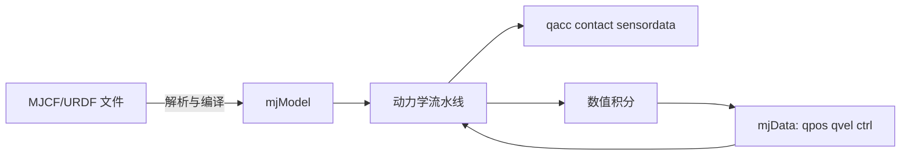
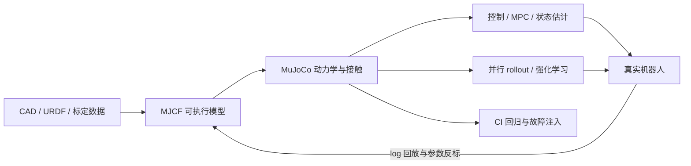
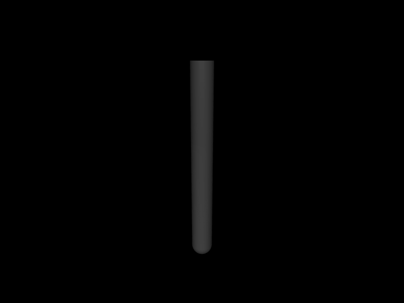

# 第 1 章　第一次可信的 MuJoCo 仿真

一个仿真程序“跑起来”并不等于结果可信。本章不从复杂人形模型开始，而是用单摆回答五个最基本的问题：MuJoCo 接收什么、计算什么、状态放在哪里、一步如何推进、怎样判断输出不是一串没有意义的数字。

## 1.1 学习目标

完成本章后，你应该能够：

- 独立编译并运行一个无窗口 C++ 仿真程序；
- 解释 MJCF、`mjModel`、`mjData` 和 `mj_step` 的职责；
- 区分模型参数、仿真状态、控制输入和派生结果；
- 说明 MuJoCo 在研究、控制、强化学习、虚拟硬件和 sim-to-real 中的工程位置；
- 正确处理模型编译错误和对象释放；
- 通过改变初态、阻尼和时间步验证单摆结果的物理合理性。

前置知识只有 C/C++ 指针、命令行和最基本的角度/角速度概念。

## 1.2 MuJoCo 究竟做什么

MuJoCo 是多关节接触动力学引擎。它不是机器人中间件，也不会替你生成轨迹或决定电机目标。应用程序给它模型、当前状态和输入，它计算加速度、约束力、传感器量，并把状态积分到下一个时刻。



对机器人系统，最常见的闭环是：

```text
读取 qpos/qvel/sensordata
        ↓
控制器计算 ctrl
        ↓
MuJoCo 计算力、接触和加速度
        ↓
积分得到下一时刻状态
```

渲染并不在这个闭环中。无窗口仿真更适合算法开发、性能测试和服务器部署，因此本书先建立数值主线，后面再加入可视化。

## 1.3 MuJoCo 在研究机构与机器人公司中的位置

在教学示例中，MuJoCo 可能看起来只是“读入 XML，然后调用 `mj_step`”。但在研究机构和头部机器人公司中，它更常处在模型、算法与真实硬件之间，承担“可计算的虚拟机器人”角色。



研究机构更关心快速验证新算法、进行大规模对照实验并保证论文可复现；公司则更关心模型与硬件接口一致、控制器上机前验证、故障注入、版本回归和 sim-to-real。两者的工具链不同，但对“模型可信”的要求完全一致。

### 1.3.1 Google DeepMind：从单机动力学到 GPU 训练和在线 MPC

Google DeepMind 是 MuJoCo 开源项目的主要维护者，也是公开工具链最完整的使用者之一：

| 层次 | 公开工具 | 典型用途 |
|---|---|---|
| 单机精确仿真 | MuJoCo C/Python | 建模、接触、控制器、回归测试 |
| 任务与研究环境 | `dm_control` | 统一 observation、action、reward 和评估 |
| GPU 批量仿真 | MJX / MuJoCo Warp | 大量并行环境和策略训练 |
| 机器人学习工具链 | MuJoCo Playground | 四足、人形、操作和 sim-to-real |
| 滚动时域规划 | MuJoCo MPC | iLQG、预测采样、实时重规划 |

其典型流程是：先在 MuJoCo Menagerie 中维护高质量机器人模型，再在 MJX 的大量并行环境中训练，回到 CPU MuJoCo 做交叉检查，最后部署到真实机器人。MuJoCo Playground 已公开四足、双足、机械臂、灵巧操作和视觉环境，其中包括本书第 37 章使用的 Unitree G1 生态。

MuJoCo MPC 则展示了另一条路线：不一定先离线训练一个神经网络，也可以在运行期不断使用 MuJoCo rollout 评估候选动作。Google 公开的 Language to Rewards 工作将语言生成的奖励函数与 MJPC 连接，用于四足和灵巧操作，并对真实机械臂任务进行了验证。

### 1.3.2 Unitree：用与真机一致的 SDK 消息连接仿真

Unitree 公开的 `unitree_mujoco` 体现了公司中常见的“虚拟硬件”架构。MuJoCo 进程不直接内嵌业务控制器，而是通过 Unitree SDK2/DDS：

- 订阅 `LowCmd` 并映射到仿真 actuator；
- 发布 `LowState`、IMU、机身位置和速度；
- 保持电机编号、单位和控制周期与硬件一致；
- 让同一个控制程序切换仿真与真实机器人后端。

```text
控制器进程                       MuJoCo 进程
read LowState  <----- DDS ------  qpos/qvel/IMU
运行原有控制算法
write LowCmd   ------ DDS ----->  ctrl -> mj_step
```

这与“另外打开一个 `simulate` 窗口”不同：这里有明确的进程间通信协议，因此控制器确实能操作仿真进程中的机器人。企业还会在这一层注入网络延迟、丢包、传感器噪声、执行器饱和和故障状态。

### 1.3.3 OpenAI 的历史案例：批量仿真与 domain randomization

OpenAI 早期机器人研究曾将 `mujoco-py` 描述为核心工具，并专门增强批量仿真和高性能纹理随机化。Dactyl 灵巧手代表了一种影响深远的 sim-to-real 思路：

1. 在仿真中生成远超实机可承受的交互数据；
2. 随机化质量、摩擦、视觉、延迟和外部扰动；
3. 不要求策略只在某一套“完美参数”下成功；
4. 将在大量可能世界中都稳健的策略迁移到真实 Shadow Hand。

这是公开的历史案例，不能由此推断 OpenAI 当前内部所有机器人项目的技术栈。但“用参数分布代替单一参数拟合”的方法已经成为机器人学习的基础工程思路。

### 1.3.4 Berkeley 等研究机构：sim-to-real 与跨仿真器复核

高校实验室常用 MuJoCo 建立可复现的控制和学习 benchmark。Berkeley/Google 公开的 ROBEL 平台在 MuJoCo 中训练 D'Claw 灵巧手和 D'Kitty 四足策略，并将具有外部扰动和随机地形的策略迁移到硬件。

另一种更谨慎的做法是跨仿真器复核：在 Isaac Gym/Isaac Lab 中训练，再不经重新训练地将策略放入 MuJoCo。若策略在数值积分、接触和求解器实现不同的引擎中仍然稳定，它更可能没有利用单一引擎的数值漏洞。Berkeley Humanoid 的公开研究就包含这类 sim-to-sim 评估。

### 1.3.5 头部团队如何验收一个 MuJoCo 模型

业界不会把“画面像真”当成模型通过的证据。常见验收至少包含五层：

| 层次 | 关键问题 | 典型可执行检查 |
|---|---|---|
| 结构 | joint/frame/方向/限位是否与硬件一致 | name、ID、address、range 快照 |
| 惯性 | 质量、CoM、主惯量是否合理 | 总质量、分段质量、惯量正定性 |
| 执行器 | 减速比、饱和、带宽和延迟是否接近真机 | 阶跃、扫频、力矩—速度包络 |
| 接触 | collision 和摩擦是否支持任务 | 穿入、支撑力、滑移、solver 统计 |
| 行为 | 控制任务是否在扰动下仍成立 | 站立、行走、抓取、跌倒和故障恢复 |

因此，高精度 visual mesh、简化 collision geom 和明确 inertial 通常是三套不同的数据。对控制结果影响最大的往往不是外观，而是：

```text
inertial + collision + actuator + sensor + delay + solver
```

### 1.3.6 MuJoCo 不是公司里唯一的仿真器

成熟团队通常使用多仿真器和多保真度技术栈。MuJoCo 擅长刚体动力学、关节机器人、接触、导数、控制和快速 rollout；但高保真摄影机数据、工厂级场景、流体、电磁、电池和精细软体往往需要其他工具。

常见组合是：

- MuJoCo 做控制、动力学、接触和学习主循环；
- Unity、Unreal 或 Isaac Sim 做复杂场景和视觉数据；
- ROS 2、DDS 或厂商 SDK 保持控制软件与真机接口一致；
- 实机日志回放和参数辨识不断修正 MuJoCo 模型。

所以学习 MuJoCo 的目标不是认住一组 API，而是建立一套可验证的机器人实验方法。本书从本章的单摆开始，逐步走到模型审计、接触、控制、LQR/EKF、并行 rollout、MJX 策略优化、机械臂和 Unitree G1。

### 1.3.7 公开案例与延伸阅读

- [Google DeepMind：Opening up a physics simulator for robotics](https://deepmind.google/blog/opening-up-a-physics-simulator-for-robotics/)
- [Google DeepMind：MuJoCo Playground](https://github.com/google-deepmind/mujoco_playground)
- [Google Research：Language to Rewards for Robotic Skill Synthesis](https://research.google/blog/language-to-rewards-for-robotic-skill-synthesis/)
- [Unitree Robotics：unitree_mujoco](https://github.com/unitreerobotics/unitree_mujoco)
- [OpenAI：Faster Physics in Python](https://openai.com/index/faster-physics-in-python/)
- [OpenAI：Learning Dexterity](https://openai.com/index/learning-dexterity/)
- [Google Research / Berkeley：ROBEL](https://www.research.google/blog/robel-robotics-benchmarks-for-learning-with-low-cost-robots/)
- [Berkeley Humanoid：Learning Smooth Humanoid Locomotion](https://people.eecs.berkeley.edu/~sastry/pubs/Pdfs%20of%202024/ChenLearning2024.pdf)

上述内容只描述可以从公开仓库、论文和机构文章验证的用法。公司的完整内部技术栈通常不公开，不应将一项历史论文或开源模型外推为某公司当前的唯一方案。

## 1.4 两个核心对象

### 1.4.1 mjModel：编译后的模型

`mjModel` 保存模型拓扑、质量与惯量、几何、关节、执行器、传感器、求解器参数以及大量预计算索引。它不是 XML 文本的简单镜像，而是为运行时计算组织好的低层数据结构。

典型字段包括：

| 字段 | 含义 | 单摆示例 |
|---|---|---:|
| `nbody` | body 数，包含 world | 2 |
| `njnt` | joint 数 | 1 |
| `nq` | 广义位置数组长度 | 1 |
| `nv` | 广义速度和力空间维度 | 1 |
| `nu` | 控制输入数 | 0 |
| `opt.timestep` | 物理时间步 | 0.002 s |

模型通常在仿真期间保持不变。修改部分 option 是允许的，但不能把 `mjModel` 当成每步随意重建的对象。

### 1.4.2 mjData：一个仿真实例

`mjData` 保存时间、状态、输入、接触、传感器输出以及动力学流水线的中间量。同一个 model 可以创建多个 data：它们描述同一种机器人处在不同状态，适合轨迹采样和并行 rollout。

| 字段 | 类型角色 | 是否由用户直接写入 |
|---|---|---|
| `time` | 仿真时间 | 重置/恢复状态时可写 |
| `qpos` | 广义位置 | 可以 |
| `qvel` | 广义速度 | 可以 |
| `ctrl` | 执行器输入 | 控制器写入 |
| `qacc` | 广义加速度 | forward dynamics 计算 |
| `xpos` | body 世界位置 | 由运动学计算 |
| `sensordata` | 传感器拼接输出 | 由流水线计算 |

`qpos` 改变后，`xpos` 不会神奇地同步改变。必须调用 `mj_forward` 或执行仿真步，派生量才重新计算。这种数据导向设计避免了隐藏计算，也是 MuJoCo 高性能的重要原因。

## 1.5 阅读第一个 MJCF

打开 `examples/01_hello/model.xml`：

```xml
<mujoco model="pendulum">
  <option timestep="0.002" gravity="0 0 -9.81"/>
  <worldbody>
    <light pos="0 -2 3"/>
    <body name="link" pos="0 0 1.5">
      <joint name="hinge" type="hinge" axis="0 1 0" damping="0.05"/>
      <geom type="capsule" fromto="0 0 0 0 0 -1"
            size="0.05" mass="1"/>
    </body>
  </worldbody>
</mujoco>
```

逐行理解：

- `worldbody` 是静止世界，ID 总是 0。
- `body` 的原点位于世界坐标 `(0,0,1.5)`，也是关节默认位置。
- hinge 轴为 body 坐标系的 Y 轴，因此摆在 X–Z 平面转动。
- capsule 从 body 原点延伸到局部 `(0,0,-1)`，长度约 1 m。
- geom 指定 `mass=1`，编译器据几何形状推断质心和转动惯量。
- `damping=0.05` 产生与关节速度反向的黏性阻尼力矩。
- 时间、长度、质量分别按 s、m、kg 理解；运行时角度使用 rad。

这里没有 actuator，所以它是被动系统。初始位置如果恰好竖直向下，重力力矩为零，程序会一直输出零运动。示例在 C++ 中把初始角设为 0.7 rad，主动打破平衡。

## 1.6 阅读完整 main.cc

本书每个示例只有一个 C++ 源文件。模型加载代码不封装，目的是让生命周期一眼可见：

```cpp
int main(int argc, char** argv) {
  if (argc != 2) {
    std::fprintf(stderr, "用法: %s model.xml\n", argv[0]);
    return EXIT_FAILURE;
  }

  char error[1024] = {0};
  mjModel* m = mj_loadXML(argv[1], NULL, error, sizeof(error));
  if (!m) {
    std::fprintf(stderr, "无法加载 %s:\n%s\n", argv[1], error);
    return EXIT_FAILURE;
  }

  mjData* d = mj_makeData(m);
  d->qpos[0] = 0.7;
  mj_forward(m, d);

  while (d->time < 2.0) {
    mj_step(m, d);
  }

  mj_deleteData(d);
  mj_deleteModel(m);
}
```

### 加载和编译

`mj_loadXML` 同时解析 XML 和编译模型。第二个参数是可选虚拟文件系统，本例从磁盘读取，所以传 `NULL`。失败时返回 `NULL`，并把元素名称、行号或属性问题写进 error buffer。不要只打印“加载失败”而丢掉这段诊断。

### 创建状态

`mj_makeData(m)` 根据 model 的维度分配状态和工作内存。生产程序必须检查返回值。本例模型极小，为保持核心流程紧凑只做简单检查。

### 设置初态和 forward

写入 `qpos[0]` 只改变主状态。`mj_forward` 重新计算运动学、势能、加速度和传感器等派生量，但不推进 `time`。如果下一步立即调用 `mj_step`，某些计算会再次发生；这里保留 forward 是为了明确“设置状态后使数据一致”的通用规则。

### 步进和释放

`mj_step` 完成一次正动力学和积分，`d->time` 增加 `timestep`。data 必须先于 model 删除，因为其布局和内部指针依赖 model。

## 1.7 独立构建与运行

```bash
cd examples/01_hello
cmake -S . -B build -DCMAKE_BUILD_TYPE=Release
cmake --build build -j
./build/demo model.xml
```

输出前五行类似：

```text
t= 0.10  q=0.65403  dq=-0.89118
t= 0.20  q=0.52386  dq=-1.66939
t= 0.30  q=0.32596  dq=-2.23353
t= 0.40  q=0.08646  dq=-2.49511
t= 0.50  q=-0.16156 dq=-2.40852
```

如何读这些数：初始 `q=0.7` 且 `dq=0`；重力使角度向零减小，速度变负；通过最低点后角度变负；阻尼逐渐消耗机械能，振幅应越来越小。如果角度单调发散、出现 `nan` 或振幅无缘无故增长，就要检查模型和积分设置。

<!-- EMBEDDED_EXAMPLE_BEGIN: 01_hello -->
### 可视化运行与效果

```bash
../../mujoco-3.11.0/bin/simulate model.xml
```

该命令使用发布包自带的官方 `simulate` 界面，可暂停、单步、施加扰动并开启接触等可视化标志。



*01_hello 的真实 MuJoCo 原生渲染结果。*

### 实验完整源码

以下文件与 `examples/01_hello/` 中可直接编译的版本一致。

#### 模型文件：`model.xml`

```xml
<mujoco model="pendulum">
  <option timestep="0.002" gravity="0 0 -9.81"/>
  <worldbody>
    <light pos="0 -2 3"/>
    <body name="link" pos="0 0 1.5">
      <joint name="hinge" type="hinge" axis="0 1 0" damping="0.05"/>
      <geom type="capsule" fromto="0 0 0 0 0 -1" size="0.05" mass="1"/>
    </body>
  </worldbody>
</mujoco>
```

#### 程序源码：`main.cc`

```cpp
#include <cstdio>
#include <cstdlib>
#include <mujoco/mujoco.h>

int main(int argc, char** argv) {
  if (argc != 2) {
    std::fprintf(stderr, "用法: %s model.xml\n", argv[0]);
    return EXIT_FAILURE;
  }
  char error[1024] = {0};
  mjModel* m = mj_loadXML(argv[1], NULL, error, sizeof(error));
  if (!m) {
    std::fprintf(stderr, "无法加载 %s:\n%s\n", argv[1], error);
    return EXIT_FAILURE;
  }
  mjData* d = mj_makeData(m);
  if (!d) return EXIT_FAILURE;
  if (m->nq > 0) {
    d->qpos[0] = 0.7;  // 给摆一个可观察的初始偏角
    mj_forward(m, d);
  }

  while (d->time < 2.0) {
    mj_step(m, d);
    if (mju_abs(d->time * 10.0 - mju_round(d->time * 10.0)) < m->opt.timestep / 2) {
      std::printf("t=%5.2f  q=%.5f  dq=%.5f\n", d->time, d->qpos[0], d->qvel[0]);
    }
  }

  mj_deleteData(d);
  mj_deleteModel(m);
  return EXIT_SUCCESS;
}
```

#### 构建文件：`CMakeLists.txt`

```cmake
cmake_minimum_required(VERSION 3.16)
project(01_hello LANGUAGES CXX)

set(CMAKE_CXX_STANDARD 17)
add_executable(demo main.cc)

set(MUJOCO_ROOT ${CMAKE_CURRENT_LIST_DIR}/../../mujoco-3.11.0)
target_include_directories(demo PRIVATE ${MUJOCO_ROOT}/include)
target_link_directories(demo PRIVATE ${MUJOCO_ROOT}/lib)
target_link_libraries(demo PRIVATE mujoco)
set_target_properties(demo PROPERTIES BUILD_RPATH ${MUJOCO_ROOT}/lib)
```
<!-- EMBEDDED_EXAMPLE_END: 01_hello -->

## 1.8 三组对照实验

### 实验 A：改变初始角

将 `d->qpos[0]` 改为 `0.1`、`0.7`、`2.8`。小角度下周期接近线性单摆公式：

\[
T\approx 2\pi\sqrt{\frac{L_c}{g}},
\]

其中实际周期还取决于刚体转动惯量和质心距离，不能机械地把 capsule 当成质点。大角度下小角近似失效，周期会变长。这个实验提醒我们：仿真结果不是公式的“错误”，两者可能建模假设不同。

### 实验 B：改变阻尼

把 `damping` 设为 `0`、`0.05`、`1.0`：

- 0：理想情况下总机械能近似守恒，但离散积分仍有误差；
- 0.05：欠阻尼振荡并逐渐静止；
- 1.0：衰减明显，是否过阻尼取决于惯量和重力线性化刚度。

不要用很大 damping 掩盖控制器振荡。真实关节阻尼、摩擦和电机闭环是不同物理机制。

### 实验 C：改变 timestep

分别使用 `0.0005`、`0.002`、`0.02` s，记录 2 s 时的 `q`。不同时间步给出不同离散轨迹；过大时间步可能产生明显相位误差甚至不稳定。判断时间步是否足够小，应逐次减半并观察任务指标是否收敛，而不是只看动画是否流畅。

## 1.9 常见错误与诊断

| 现象 | 可能原因 | 检查方法 |
|---|---|---|
| 模型加载返回 NULL | XML 拼写、非法属性、惯量错误 | 完整打印 error buffer |
| 状态改了但位置没变 | 派生量尚未更新 | 调用 `mj_forward` 后再读 `xpos` |
| 程序找不到共享库 | 构建方式绕过了示例 CMake | 检查 CMake RPATH 和仓库 SDK |
| 摆完全不动 | 初态正好在平衡点 | 给 qpos 非零偏角 |
| 结果快速爆炸 | 时间步过大、质量/惯量异常 | 缩小步长并检查编译 warning |
| 运行越久内存越大 | 循环内反复创建 data/model | 初始化一次，退出时配对释放 |

MuJoCo warning 不是“可以忽略的日志”。`nan`、约束缓冲或惯量相关 warning 应保存当时状态并构造最小复现。

## 1.10 从单摆迁移到机器人

单摆的一个 `qpos` 会扩展成机械臂的关节向量或人形机器人的自由基座加关节状态，但生命周期不变：加载一个 model、为每个仿真实例创建 data、写输入、步进、读输出。真正变化的是数组索引、坐标系、约束和控制维度。

机械臂通常固定基座且 `nq≈nv`；浮动基座人形的 free joint 使用 7 个位置数和 6 个速度自由度，所以 `nq != nv`。从第一天就避免把 qpos 和 qvel 当作同长度数组，是后面控制算法正确性的基础。

## 1.11 本章小结

- MJCF 是高层模型源，`mjModel` 是编译后的只读运行表示。
- `mjData` 保存一个实例的状态、输入、输出和工作区。
- 修改主状态后，用 forward 更新派生量；`mj_step` 才推进时间。
- 第一次可信验证应包含初态、阻尼和时间步对照，而不只是成功运行。
- 每个 data 必须在对应 model 之前释放。

## 1.12 练习

1. 将重力改为月球近似值 `-1.62 m/s²`，预测周期怎样变化，再运行验证。
2. 删除 `mass`，增加 `density="1000"`，解释编译器如何得到质量和惯量。
3. 在每一步计算并记录 `qpos` 最大绝对值，验证阻尼系统的峰值包络是否下降。
4. 把初始角改成 30。你预期它是 30 rad 还是 30 degree？运行时 C API 的单位是什么？
5. 故意把 geom size 改成负数，观察并抄录完整编译错误。

## 1.13 参考答案

1. 小角周期与 `1/√g` 成正比，月球重力下周期约为地球的 `√(9.81/1.62)≈2.46` 倍；刚体摆的绝对周期需用实际惯量计算。
2. compiler 根据 geom 体积乘密度得到质量，再由 capsule 几何计算质心和惯量；结果可从 `body_mass/body_inertia` 检查。
3. 无外部驱动且阻尼为正时，总能量整体下降，离散采样的角度峰值包络也应下降；单步角度绝对值不必单调。
4. C API 运行时角度为 rad，30 rad 是多圈大角度，不是 30°；XML 的 angle 设置不改变运行时 API 单位。
5. loader 返回 NULL，error buffer 指向 geom 的非法 size；准确文本以 3.11.0 编译器输出为准。
