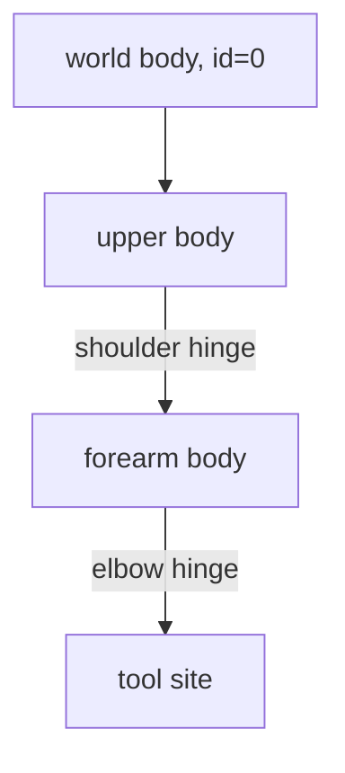
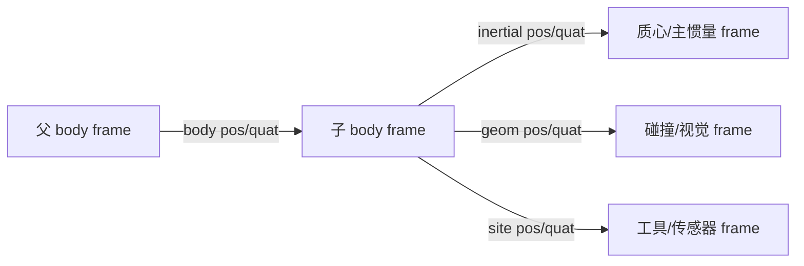

# 第 2 章　刚体树、坐标系与广义坐标

机器人模型首先是坐标关系，其次才是漂亮的 mesh。许多“动力学错误”其实源自父子坐标、关节轴或惯性坐标理解错误。本章建立贯穿全书的运动学语言，并通过四类关节实验解释 MuJoCo 最重要的维度关系：`nq`、`nv` 和 `njnt` 为什么不一定相等。

## 2.1 学习目标

完成本章后，你应该能够：

- 从 MJCF body 嵌套画出运动学树；
- 区分 world、body、inertial、geom 和 site 坐标系；
- 正确解释 hinge、slide、ball、free joint；
- 使用 `jnt_qposadr`、`jnt_dofadr` 查找状态地址；
- 解释四元数为何让 `nq != nv`；
- 发现错误 joint axis、重复自由度和不合理惯量。

前置知识：刚体位姿、旋转矩阵或四元数的基本概念。不会四元数也可以先读，2.6 节会从旋转自由度出发解释。

## 2.2 MuJoCo 的树形建模思想

MJCF 用 `<body>` 嵌套定义父子关系：

```xml
<worldbody>
  <body name="upper" pos="0 0 1">
    <joint name="shoulder" axis="0 1 0"/>
    <body name="forearm" pos="0 0 -0.5">
      <joint name="elbow" axis="0 1 0"/>
    </body>
  </body>
</worldbody>
```

对应的树是：



没有 joint 的 body 与父 body 刚性焊接；joint 是“增加自由度”，而不是把两个自由刚体用约束连接起来。这与某些游戏引擎的笛卡尔刚体建模思路相反。

MuJoCo 不允许 body 树本身形成环。四连杆、并联机构和闭链机械臂先选一棵生成树，再用 equality constraint 闭合缺失连接。这样最小广义坐标仍沿树组织，而闭环误差交给约束求解器。

### 树在 mjModel 中的排列

`body_parentid[i]` 给出 body `i` 的父 ID。除 world 外，父 ID 总小于子 ID；元素按深度优先顺序排列，因此同一子树通常占连续区间。这种布局支持递归 Newton–Euler 和稀疏质量矩阵算法。

不要把 body ID 写死为业务协议。模型插入一个 body 后，后续 ID 都可能改变。启动时用名称解析并缓存：

```cpp
int forearm = mj_name2id(m, mjOBJ_BODY, "forearm");
if (forearm == -1) {
  // 模型与控制程序不匹配
}
```

## 2.3 五种容易混淆的坐标实体

### world frame

世界坐标系是所有全局量的参考，world body 的 ID 为 0，不能移动。`gravity`、body 的运行时 `xpos/xmat` 和许多 frame sensor 默认都与世界系有关。

### body frame

body frame 是建立父子树和放置子元素的局部坐标系。MJCF 中 body 的 `pos/quat` 相对父 body frame；运行时 `d->xpos[3*bodyid]` 和 `d->xmat[9*bodyid]` 是 body frame 在世界系的位姿。

### inertial frame

每个动态 body 有惯性坐标系，原点在质心，轴与主惯量轴对齐。它与 body frame 不必重合。运行时对应 `xipos/ximat`，质量和三项主惯量在 `body_mass/body_inertia`。

对控制和系统辨识，混淆 body 原点与质心是严重错误。末端 link 的 body frame 可能位于关节轴，而重力作用点在 inertial frame 原点。

### geom frame

geom 是附着在 body 上的形状，可参与碰撞、渲染和惯量推断。它有相对 body 的 `pos/quat`，但没有独立自由度。一个 link 常包含多个 geom：精细 visual mesh 和若干简单 collision geom。

### site frame

site 是无质量、无碰撞的标记坐标系，适合定义 TCP、IMU、力传感器截面、tendon 路径点和相机标定点。site 的世界位置在 `site_xpos`，姿态在 `site_xmat`。



## 2.4 关节位姿如何作用

joint 定义在所属 body 内，位置 `pos` 和轴 `axis` 都用该 body 的参考坐标表达。运行时，joint 变换叠加在 body 相对父 body 的静态变换上。

对标量 hinge/slide，`ref` 定义参考位置。模型初始 `qpos0` 保存参考值，而实际空间变换由 `qpos-ref` 决定。它适合表达“CAD 装配姿态对应编码器 90°”之类的零位关系。

joint 的常用属性分两类：

| 位置相关 | 速度/力相关 |
|---|---|
| range、limited、stiffness、ref、springref | damping、frictionloss、armature |

`armature` 是反映到关节侧的附加转动/平动惯量，常用于近似电机转子经减速器放大的惯量。它不是阻尼，也不是 link 惯量。

## 2.5 四类 joint

### hinge

一个旋转自由度，`qpos` 和 `qvel` 各占一个数。关节速度沿 `axis`，广义力是绕轴力矩。机械臂旋转关节、膝关节的第一近似都属于 hinge。

### slide

一个平移自由度，状态各占一个数，广义力沿轴方向。直线模组、液压缸简化模型和伸缩腿可用 slide。

### ball

三个旋转自由度，位置用单位四元数表示，因此占 4 个 `qpos`；角速度只需 3 个数，所以占 3 个 `qvel`。球关节没有平移，适合肩关节或抽象万向连接。

### free

六个自由度：世界位置 3 个数加单位四元数 4 个数，共 7 个 `qpos`；线速度和角速度共 6 个 `qvel`。浮动基座人形、空中机器人和自由物体使用 free joint。MJCF 既可写 `<joint type="free"/>`，也可用语义更明确的 `<freejoint/>`。

## 2.6 为什么 qpos 和 qvel 维度不同

三维姿态具有三个自由度，但没有一个全局无奇异的三参数坐标。MuJoCo 用四元数：

\[
q_R=(w,x,y,z),\qquad \|q_R\|=1.
\]

四个分量加一个单位约束，实际仍是三个自由度。角速度 `ω∈R³` 位于姿态流形的切空间，所以 ball joint 的位置维度为 4、速度维度为 3。

因此：

```text
nq = 所有关节位置表示长度之和
nv = 所有自由度/速度/广义力维度之和
```

对两个 hinge 的机械臂，`nq=nv=2` 只是特例。不能据此写出通用机器人程序。

### 四元数不能直接做普通减法

`q_desired - q_current` 的四元数分量差不是三维旋转误差，还存在 `q` 与 `-q` 表示同一姿态的问题。MuJoCo 提供 `mj_differentiatePos` 在配置流形上计算速度型差值，`mj_integratePos` 用切空间增量更新位置：

```cpp
mj_differentiatePos(m, dq, 1.0, qpos1, qpos2);  // dq 长度 nv
mj_integratePos(m, qpos, qvel, dt);
```

这两个函数是浮动基座控制、有限差分和状态插值的基础。

## 2.7 状态地址：不要猜数组位置

第 `j` 个 joint 的位置从 `m->jnt_qposadr[j]` 开始，速度从 `m->jnt_dofadr[j]` 开始。其长度由 joint type 决定：

| type | 枚举 | qpos 长度 | qvel 长度 |
|---|---|---:|---:|
| free | `mjJNT_FREE` | 7 | 6 |
| ball | `mjJNT_BALL` | 4 | 3 |
| slide | `mjJNT_SLIDE` | 1 | 1 |
| hinge | `mjJNT_HINGE` | 1 | 1 |

推荐初始化模式：名称 → joint ID → qpos/dof 地址。热循环中只使用缓存地址。

对于 actuator，不要假设 actuator ID 与 joint ID 一致。执行器可通过 tendon、site 或 body 传动，也可能多个执行器作用于一个 joint。

## 2.8 独立实验：四种关节的内存布局

进入新示例：

```bash
cd examples/13_joint_types
cmake -S . -B build
cmake --build build
./build/demo model.xml
```

模型包含四棵互不相连的运动树，分别使用 hinge、slide、ball 和 free joint。程序打印每个 joint 的 type、位置地址和自由度地址，并检查 ball/free 四元数范数。

预期规模：

```text
njnt=4, nq=13, nv=11
hinge: qposadr=0, dofadr=0
slide: qposadr=1, dofadr=1
ball : qposadr=2, dofadr=2
free : qposadr=6, dofadr=5
```

手工核对：`nq=1+1+4+7=13`，`nv=1+1+3+6=11`。free joint 从 qpos 6 开始，是因为 ball 已占据索引 2–5；它从 dof 5 开始，因为 ball 速度只占 2–4。

程序随后调用 `mj_integratePos` 给每个自由度施加一个小速度增量。MuJoCo 会在流形上更新并归一化四元数，输出范数仍应接近 1。

## 2.9 二连杆机械臂逐项建模

打开 `examples/03_pd_control/model.xml`。它使用嵌套 body 建立两个 hinge：

1. upper body 位于基座 `(0,0,1)`；shoulder 绕局部 Y 轴。
2. upper capsule 从关节向局部 `-Z` 延伸 0.5 m。
3. forearm body 的原点位于 upper 末端，所以 elbow 轴自然落在连接处。
4. forearm capsule 长 0.4 m，tool site 位于末端。

当 shoulder 旋转时，forearm 整棵子树跟随；elbow 再产生相对 upper 的旋转。这就是前向运动学的递归结构。

`fromto` 很适合 capsule：两个端点直接给出轴线，编译器计算中心、长度和姿态。若用 `pos+quat`，更容易出现视觉杆件与关节轴错位。

## 2.10 质量与惯量：看不见但决定一切

body 本身没有形状，geom 本身没有运动自由度。若没有 `<inertial>`，编译器根据属于该 body 的、参与惯量推断的 geom 计算：

\[
m=\sum_i \rho_i V_i,
\]

再将各 geom 的惯量平移到总质心并合成。显式 `mass` 会取代 density 对该 geom 的质量计算。

工程模型应验证：

- 单位是否从 mm、g 正确转换为 m、kg；
- 质心是否位于合理位置；
- 三项主惯量为正并满足刚体惯量约束；
- mesh 是否只是视觉资产，碰撞是否已凸分解；
- 电机、减速器、线缆等质量是否被遗漏。

错误惯量会表现为控制增益无法迁移、碰撞响应异常或 solver 困难。画面正常不能证明惯量正确。

## 2.11 常见建模错误

| 错误 | 现象 | 根因 |
|---|---|---|
| joint axis 用世界系填写 | 某些姿态下转轴“歪掉” | axis 属于局部参考 frame |
| 为每个 geom 建 body | body 数和计算量膨胀 | geom 可共享同一刚体 |
| ball 当成 3 个 qpos | 数组越界或状态错位 | ball 使用 4D quaternion |
| 直接线性插值 quaternion | 姿态路径/范数错误 | 未在旋转流形上操作 |
| body frame 当作 COM | 重力矩和 Jacobian 错 | inertial frame 可有偏移 |
| 精细非凸 mesh 直接碰撞 | 接触不符外观且很慢 | mesh 碰撞基于凸表示 |
| 把多个 joint ID 当连续业务编号 | 改模型后控制错关节 | ID 只对当前编译模型有效 |

## 2.12 面向人形机器人的状态布局

典型浮动基座人形的第一个 joint 是 free：

```text
qpos = [base_xyz(3), base_quat(4), joint_angles...]
qvel = [base_linear_velocity(3), base_angular_velocity(3), joint_velocities...]
```

但基座速度具体在哪个坐标系表达、空间向量排列方式，必须以 MuJoCo API 定义为准，不能从数组名字猜测。机器人中间件状态与 MuJoCo 状态互转时，应建立显式映射层，并用一个已知旋转/平移的测试验证符号和 frame。

## 2.13 本章小结

- body 嵌套定义树，joint 为 body 相对父 body 增加自由度。
- body、inertial、geom、site frame 各有职责，不能混用。
- hinge/slide 的位置与速度各 1 维；ball 为 4/3；free 为 7/6。
- 用 `jnt_qposadr/jnt_dofadr` 定位状态，不硬编码索引。
- 四元数状态差和积分必须在配置流形上处理。
- 质量、质心和惯量虽不可见，却决定动力学可信度。

## 2.14 练习

1. 一个 free base、两个 ball shoulder、12 个 hinge 的人形模型，`nq` 和 `nv` 分别是多少？
2. 在四关节实验中交换 ball 和 slide 的 XML 顺序，预测所有地址再运行验证。
3. 把 ball quaternion 的四个分量全设为 0 后调用 forward，解释为什么这是非法状态。
4. 给二连杆 forearm body 添加相对 body 原点偏移 5 cm 的 inertial frame，说明哪些几何位置不会改变、哪些动力学量会改变。
5. 使用 `mj_name2id` 和地址数组，只把 elbow 设为 30°，不得假定它是 `qpos[1]`。

## 2.15 参考答案

1. `nq=7+2×4+12=27`，`nv=6+2×3+12=24`。
2. 地址按编译后的 joint 顺序重新累加；交换后 slide 先占一个 qpos/dof，ball 的起点相应后移，必须以程序输出为准。
3. 零四元数没有单位范数，不能表示旋转；应使用 `(1,0,0,0)` 表示单位旋转，或调用规范化/积分 API 生成合法状态。
4. geom 和 site 的 body-relative 几何位置不变；质心世界位置、重力矩、质量矩阵和动响应会改变。
5. 先取 `jid=mj_name2id(...,"elbow")`，再取 `qadr=m->jnt_qposadr[jid]`，写 `d->qpos[qadr]=30*mjPI/180`。

