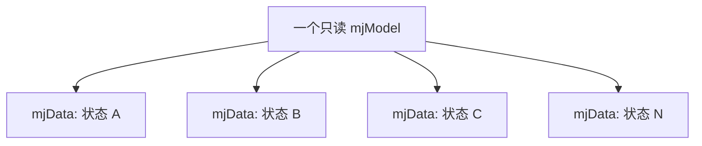
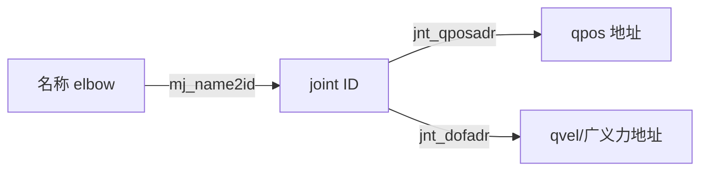
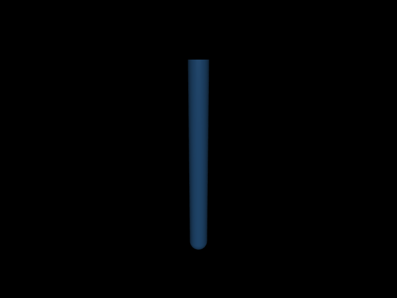
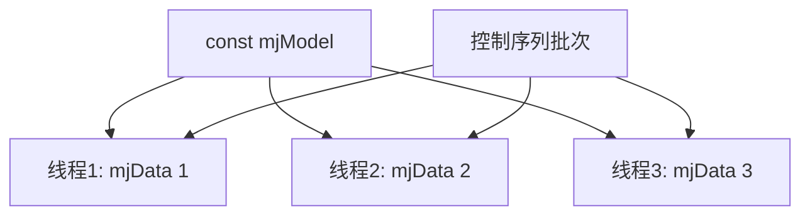

# 第 3 章　mjModel、mjData 与数据一致性

> 本书示例代码仓库：[libing403/mujoco_tutorial](https://github.com/libing403/mujoco_tutorial)

MuJoCo 的 API 看起来像“许多结构体和数组”，但背后有一条清晰原则：模型常量与仿真数据分离，主状态与派生结果分离。理解这条原则，才能正确修改状态、读取坐标、复制仿真、编写多线程 rollout，并避免使用陈旧缓存。

## 3.1 学习目标

完成本章后，你应该能够：

- 判断一个字段属于模型常量、状态、输入、输出还是工作区；
- 根据 `mjModel` 字段推导扁平数组长度；
- 用名称、ID 和地址安全访问机器人元素；
- 解释 `mj_forward`、`mj_step` 和 `mj_resetData` 对数据的影响；
- 用 state specification 保存和恢复仿真状态；
- 为并行仿真正确组织一个 model 和多个 data。

## 3.2 为什么分成 model 和 data

同一个机器人模型可以处在成千上万个状态。例如轨迹优化会从不同候选控制序列 rollout，人形策略评估会并行运行许多初始姿态。如果拓扑、质量、mesh 和名称表被复制到每个状态，内存浪费严重。

MuJoCo 因此采用：



`mjModel` 保存共享模型，`mjData` 保存每条轨迹独占的数据。运行时计算通常写成：

```cpp
void mj_step(const mjModel* m, mjData* d);
```

`const mjModel*` 表明引擎把 model 当作只读输入；data 同时是输入、输出和预分配工作区。

## 3.3 mjModel 中有什么

`mjModel` 不是面向对象的 body/joint 列表，而是按类型分组的结构化数组。以 joint 为例：

```text
jnt_type[0 ... njnt-1]
jnt_bodyid[0 ... njnt-1]
jnt_qposadr[0 ... njnt-1]
jnt_dofadr[0 ... njnt-1]
jnt_pos[3*joint_id + 0 ... 2]
jnt_axis[3*joint_id + 0 ... 2]
```

这种 structure-of-arrays 布局有利于顺序访问、向量化和稳定 C ABI。代价是用户必须理解字段维度。

### 五类常用模型字段

| 类别 | 示例 | 用途 |
|---|---|---|
| 规模 | `nq nv nu nbody ngeom nsensor` | 分配、循环与维度检查 |
| 拓扑 | `body_parentid`, `jnt_bodyid` | 树关系与元素归属 |
| 地址 | `jnt_qposadr`, `sensor_adr` | 在拼接数组中定位 |
| 物理参数 | `body_mass`, `dof_damping`, `geom_friction` | 动力学与接触 |
| option/statistic | `opt`, `vis`, `stat` | 算法、环境和视觉尺度 |

修改模型参数并不总是立刻安全。例如直接改变 `body_mass` 后，一些由质量推导的常量可能仍是旧值。官方提供 `mj_setConst` 用于特定运行时模型修改后的重计算，但拓扑变化必须回到 mjSpec/MJCF 重新编译。

## 3.4 mjData 的五层数据

### 第一层：时间与物理状态

```text
time
qpos[nq]
qvel[nv]
act[na]
```

这是连续动力系统的核心状态。`act` 只在有状态执行器存在时非空。插件历史或延迟状态可能还有额外组成，不能永远把物理状态简化成 qpos/qvel。

### 第二层：用户输入

```text
ctrl[nu]
qfrc_applied[nv]
xfrc_applied[6*nbody]
mocap_pos[3*nmocap]
mocap_quat[4*nmocap]
userdata[nuserdata]
```

`ctrl` 经过 actuator 模型生成力；`qfrc_applied` 直接加入广义力；`xfrc_applied` 是作用在 body 上的笛卡尔 wrench。三者不可互换。

### 第三层：运动学和动力学派生量

```text
xpos/xquat/xmat
site_xpos/site_xmat
qacc
qfrc_bias/qfrc_passive/qfrc_actuator
qM
```

它们由 forward pipeline 的不同阶段产生。手动修改 qpos 后，旧的 xpos 仍留在内存里，直到重新执行相应阶段。

### 第四层：约束、接触与传感器

`contact[0...ncon)` 保存当前接触几何信息；约束 Jacobian、阻抗、参考加速度和求解结果存于动态管理区域；`sensordata[nsensordata]` 按 sensor 地址拼接。

### 第五层：工作区与诊断

MuJoCo 在初始化后避免普通堆分配，data 内包含 arena/stack、solver statistics、timer 和 warning 计数。用户不应 memcpy 整个 `mjData`，因为其中有内部指针和依赖 model 的布局。

## 3.5 主状态与派生量

考虑二连杆机械臂。程序执行：

```cpp
d->qpos[0] = 1.0;
std::printf("%.3f\n", d->site_xpos[0]);
```

打印的不一定是新姿态末端位置，因为赋值只改变 qpos。正确顺序是：

```cpp
d->qpos[qadr] = 1.0;
mj_forward(m, d);
std::printf("%.3f\n", d->site_xpos[3*site]);
```

### 为什么 MuJoCo 不自动更新

如果每次写一个 qpos 元素都触发整条运动学和动力学流水线，大规模优化会极其低效，而且 C 数组写入无法可靠拦截。显式函数让计算边界可见：用户可以一次修改完整状态，再计算一次。

### 三个顶层函数的区别

| 函数 | 推进时间 | 典型用途 |
|---|---:|---|
| `mj_forward` | 否 | 给定状态，计算派生量和加速度 |
| `mj_step` | 是 | 完整正动力学并积分一步 |
| `mj_inverse` | 否 | 给定状态和 qacc，计算所需广义力 |

`mj_kinematics` 只执行运动学子阶段，适合明确只需要坐标的场景；但初学阶段优先使用 `mj_forward`，避免遗漏依赖阶段。

## 3.6 名称、ID 和地址三层访问

名称是模型作者和控制程序之间的稳定语义接口；ID 是当前编译模型中的紧凑编号；地址是在 qpos、qvel、sensordata 等拼接数组中的起点。



安全模式：

```cpp
int jid = mj_name2id(m, mjOBJ_JOINT, "elbow");
if (jid < 0) {
  std::fprintf(stderr, "模型缺少 elbow joint\n");
  return EXIT_FAILURE;
}
int qadr = m->jnt_qposadr[jid];
int dadr = m->jnt_dofadr[jid];
```

名称解析放在初始化阶段，实时循环缓存 `qadr/dadr`。`mj_id2name` 可能返回 `NULL`，因为 MJCF 允许无名元素。

### 不能混用对象类型

body、joint、geom、site 各自有独立 ID 空间。`body id=2` 与 `geom id=2` 没有语义关联。调用 `mj_name2id` 时必须传正确 `mjtObj`。

## 3.7 扁平数组的形状

常见索引规则：

```cpp
// body i 世界位置
const mjtNum* p = d->xpos + 3*i;

// body i 世界旋转矩阵，行主序 3x3
const mjtNum* R = d->xmat + 9*i;

// actuator i 的 6D gear 行
const mjtNum* gear = m->actuator_gear + 6*i;

// sensor i 数据
int adr = m->sensor_adr[i];
int dim = m->sensor_dim[i];
const mjtNum* value = d->sensordata + adr;
```

不要通过 `sizeof(pointer)` 推导数组长度；长度都来自 model。MuJoCo 3.11 的部分计数字段采用 `mjtSize`，打印时应使用兼容类型转换或正确格式。

### 配套实验：用程序读出模型布局

`examples/02_inspect` 把“不要猜数组下标”变成一个可运行的检查程序。它加载任意 MJCF，输出模型规模、joint 的 `qposadr/dofadr`，以及 forward 后的 body 世界坐标。

```bash
cd examples/02_inspect
cmake -S . -B build
cmake --build build
./build/demo ../../models/two_link.xml
```

<!-- EMBEDDED_EXAMPLE_BEGIN: 02_inspect -->
### 可视化运行与效果

```bash
../../mujoco-3.11.0/bin/simulate model.xml
```

该命令使用发布包自带的官方 `simulate` 界面，可暂停、单步、施加扰动并开启接触等可视化标志。



*02_inspect 的真实 MuJoCo 原生渲染结果。*

### 实验完整源码

以下文件与 `examples/02_inspect/` 中可直接编译的版本一致。

#### 模型文件：`model.xml`

```xml
<mujoco model="two_link_arm">
  <compiler angle="radian"/>
  <option timestep="0.001" gravity="0 0 -9.81" integrator="implicitfast"/>
  <default>
    <joint axis="0 1 0" damping="0.2" limited="true" range="-3.14 3.14"/>
    <geom type="capsule" size="0.04" rgba="0.25 0.55 0.85 1"/>
    <motor ctrllimited="true" ctrlrange="-100 100"/>
  </default>
  <worldbody>
    <body name="upper" pos="0 0 1">
      <joint name="shoulder"/>
      <geom fromto="0 0 0 0 0 -0.5" mass="1.0"/>
      <body name="forearm" pos="0 0 -0.5">
        <joint name="elbow"/>
        <geom fromto="0 0 0 0 0 -0.4" mass="0.7"/>
        <site name="tool" pos="0 0 -0.4" size="0.025" rgba="1 0.2 0.1 1"/>
      </body>
    </body>
  </worldbody>
  <actuator>
    <motor name="shoulder_motor" joint="shoulder" gear="1"/>
    <motor name="elbow_motor" joint="elbow" gear="1"/>
  </actuator>
</mujoco>
```

#### 程序源码：`main.cc`

```cpp
#include <cstdio>
#include <cstdlib>
#include <mujoco/mujoco.h>

int main(int argc, char** argv) {
  if (argc != 2) {
    std::fprintf(stderr, "用法: %s model.xml\n", argv[0]);
    return EXIT_FAILURE;
  }
  char error[1024] = {0};
  mjModel* m = mj_loadXML(argv[1], NULL, error, sizeof(error));
  if (!m) {
    std::fprintf(stderr, "无法加载 %s:\n%s\n", argv[1], error);
    return EXIT_FAILURE;
  }
  mjData* d = mj_makeData(m);
  mj_forward(m, d);

  std::printf("nbody=%lld njnt=%lld nq=%lld nv=%lld nu=%lld nsensor=%lld\n",
              (long long)m->nbody, (long long)m->njnt, (long long)m->nq,
              (long long)m->nv, (long long)m->nu, (long long)m->nsensor);
  for (int i = 0; i < m->njnt; ++i) {
    const char* name = mj_id2name(m, mjOBJ_JOINT, i);
    std::printf("joint[%d] %-10s type=%d qposadr=%d dofadr=%d\n", i,
                name ? name : "(unnamed)", m->jnt_type[i],
                m->jnt_qposadr[i], m->jnt_dofadr[i]);
  }
  for (int i = 1; i < m->nbody; ++i) {
    const char* name = mj_id2name(m, mjOBJ_BODY, i);
    std::printf("body[%d] %-10s world_pos=(%.3f %.3f %.3f)\n", i,
                name ? name : "(unnamed)", d->xpos[3*i], d->xpos[3*i+1], d->xpos[3*i+2]);
  }

  mj_deleteData(d);
  mj_deleteModel(m);
  return EXIT_SUCCESS;
}
```

#### 构建文件：`CMakeLists.txt`

```cmake
cmake_minimum_required(VERSION 3.16)
project(02_inspect LANGUAGES CXX)

set(CMAKE_CXX_STANDARD 17)
add_executable(demo main.cc)

set(MUJOCO_ROOT ${CMAKE_CURRENT_LIST_DIR}/../../mujoco-3.11.0)
target_include_directories(demo PRIVATE ${MUJOCO_ROOT}/include)
target_link_directories(demo PRIVATE ${MUJOCO_ROOT}/lib)
target_link_libraries(demo PRIVATE mujoco)
set_target_properties(demo PROPERTIES BUILD_RPATH ${MUJOCO_ROOT}/lib)
```
<!-- EMBEDDED_EXAMPLE_END: 02_inspect -->

## 3.8 独立实验：观察陈旧派生量

```bash
cd examples/14_data_consistency
cmake -S . -B build
cmake --build build
./build/demo model.xml
```

程序依次执行：

1. `mj_forward` 后读取初始 tool 位置；
2. 只修改 shoulder qpos，再读取 tool 位置；
3. 调用 `mj_forward`，第三次读取；
4. 用 `mj_getState` 保存状态；
5. 推进若干步后用 `mj_setState` 恢复并 forward。

预期结果中，“修改 qpos 后、forward 前”的 site 坐标与初始值完全相同；forward 后才改变。状态恢复后 qpos 和 tool 坐标应与快照一致。

这个实验不是展示 bug，而是展示 API 契约：派生数据只在相应计算函数之后有效。

<!-- EMBEDDED_EXAMPLE_BEGIN: 14_data_consistency -->
### 可视化运行与效果

```bash
../../mujoco-3.11.0/bin/simulate model.xml
```

该命令使用发布包自带的官方 `simulate` 界面，可暂停、单步、施加扰动并开启接触等可视化标志。


*14_data_consistency 的真实 MuJoCo 原生渲染结果。*

### 实验完整源码

以下文件与 `examples/14_data_consistency/` 中可直接编译的版本一致。

#### 模型文件：`model.xml`

```xml
<mujoco model="data_consistency">
  <compiler angle="radian"/>
  <option timestep="0.001"/>
  <worldbody>
    <body name="upper" pos="0 0 1">
      <joint name="shoulder" axis="0 1 0" damping=".2"/>
      <geom type="capsule" fromto="0 0 0 0 0 -.5" size=".04" mass="1"/>
      <body name="forearm" pos="0 0 -.5">
        <joint name="elbow" axis="0 1 0" damping=".2"/>
        <geom type="capsule" fromto="0 0 0 0 0 -.4" size=".035" mass=".7"/>
        <site name="tool" pos="0 0 -.4" size=".02"/>
      </body>
    </body>
  </worldbody>
</mujoco>
```

#### 程序源码：`main.cc`

```cpp
#include <cstdio>
#include <cstdlib>
#include <vector>
#include <mujoco/mujoco.h>

int main(int argc, char** argv) {
  if (argc != 2) {
    std::fprintf(stderr, "用法: %s model.xml\n", argv[0]);
    return EXIT_FAILURE;
  }
  char error[1024] = {0};
  mjModel* m = mj_loadXML(argv[1], NULL, error, sizeof(error));
  if (!m) {
    std::fprintf(stderr, "无法加载 %s:\n%s\n", argv[1], error);
    return EXIT_FAILURE;
  }
  mjData* d = mj_makeData(m);
  int shoulder = mj_name2id(m, mjOBJ_JOINT, "shoulder");
  int tool = mj_name2id(m, mjOBJ_SITE, "tool");
  int qadr = m->jnt_qposadr[shoulder];

  mj_forward(m, d);
  mjtNum initial[3];
  mju_copy3(initial, d->site_xpos + 3*tool);
  std::printf("initial             tool=(%.6f %.6f %.6f)\n",
              initial[0], initial[1], initial[2]);

  d->qpos[qadr] = 0.8;
  std::printf("qpos changed        tool=(%.6f %.6f %.6f)  <- stale\n",
              d->site_xpos[3*tool], d->site_xpos[3*tool+1], d->site_xpos[3*tool+2]);
  mj_forward(m, d);
  std::printf("after mj_forward    tool=(%.6f %.6f %.6f)\n",
              d->site_xpos[3*tool], d->site_xpos[3*tool+1], d->site_xpos[3*tool+2]);

  int spec = mjSTATE_INTEGRATION;
  std::vector<mjtNum> snapshot(mj_stateSize(m, spec));
  mj_getState(m, d, snapshot.data(), spec);
  mjtNum saved_q = d->qpos[qadr];
  mjtNum saved_tool[3];
  mju_copy3(saved_tool, d->site_xpos + 3*tool);
  for (int i = 0; i < 200; ++i) mj_step(m, d);
  mj_setState(m, d, snapshot.data(), spec);
  mj_forward(m, d);
  mjtNum position_error[3];
  mju_sub3(position_error, d->site_xpos + 3*tool, saved_tool);
  std::printf("restored errors     q=%.3g tool_norm=%.3g\n",
              d->qpos[qadr]-saved_q, mju_norm3(position_error));

  mj_deleteData(d);
  mj_deleteModel(m);
  return EXIT_SUCCESS;
}
```

#### 构建文件：`CMakeLists.txt`

```cmake
cmake_minimum_required(VERSION 3.16)
project(14_data_consistency LANGUAGES CXX)

set(CMAKE_CXX_STANDARD 17)
add_executable(demo main.cc)

set(MUJOCO_ROOT ${CMAKE_CURRENT_LIST_DIR}/../../mujoco-3.11.0)
target_include_directories(demo PRIVATE ${MUJOCO_ROOT}/include)
target_link_directories(demo PRIVATE ${MUJOCO_ROOT}/lib)
target_link_libraries(demo PRIVATE mujoco)
set_target_properties(demo PROPERTIES BUILD_RPATH ${MUJOCO_ROOT}/lib)
```
<!-- EMBEDDED_EXAMPLE_END: 14_data_consistency -->

## 3.9 重置、keyframe 与状态快照

### mj_resetData

将 data 恢复到模型默认状态：time 清零，qpos 取 `qpos0`，qvel/act/input 等按定义初始化。重置后若要立即读取派生量，调用 forward。

### mj_resetDataKeyframe

从模型 keyframe 恢复 time、qpos、qvel、act、ctrl、mocap 等已保存字段。keyframe 很适合标准站立姿态、抓取预备姿态和可复现测试初态。

### state specification API

`mj_stateSize`、`mj_getState`、`mj_setState` 根据 `mjtState` bitmask 操作明确的状态子集：

```cpp
int spec = mjSTATE_INTEGRATION;
int n = mj_stateSize(m, spec);
std::vector<mjtNum> state(n);
mj_getState(m, d, state.data(), spec);
// ...改变并推进 data...
mj_setState(m, d, state.data(), spec);
mj_forward(m, d);
```

`mjSTATE_PHYSICS`、`FULLPHYSICS`、`USER`、`INTEGRATION` 覆盖范围不同。保存控制优化 rollout 时，遗漏 warmstart 或 plugin state 可能改变后续轨迹；只做纯运动学时又没必要保存所有输入。

### 配套实验：快照保存与恢复

`examples/07_state_snapshot` 使用 state specification API 保存积分状态，在人为扰动并推进仿真后恢复，最后打印逐元素误差。

```bash
cd examples/07_state_snapshot
cmake -S . -B build
cmake --build build
./build/demo model.xml
```

<!-- EMBEDDED_EXAMPLE_BEGIN: 07_state_snapshot -->
### 可视化运行与效果

```bash
../../mujoco-3.11.0/bin/simulate model.xml
```

该命令使用发布包自带的官方 `simulate` 界面，可暂停、单步、施加扰动并开启接触等可视化标志。


*07_state_snapshot 的真实 MuJoCo 原生渲染结果。*

### 实验完整源码

以下文件与 `examples/07_state_snapshot/` 中可直接编译的版本一致。

#### 模型文件：`model.xml`

```xml
<mujoco model="two_link_arm">
  <compiler angle="radian"/>
  <option timestep="0.001" gravity="0 0 -9.81" integrator="implicitfast"/>
  <default>
    <joint axis="0 1 0" damping="0.2" limited="true" range="-3.14 3.14"/>
    <geom type="capsule" size="0.04" rgba="0.25 0.55 0.85 1"/>
    <motor ctrllimited="true" ctrlrange="-100 100"/>
  </default>
  <worldbody>
    <body name="upper" pos="0 0 1">
      <joint name="shoulder"/>
      <geom fromto="0 0 0 0 0 -0.5" mass="1.0"/>
      <body name="forearm" pos="0 0 -0.5">
        <joint name="elbow"/>
        <geom fromto="0 0 0 0 0 -0.4" mass="0.7"/>
        <site name="tool" pos="0 0 -0.4" size="0.025" rgba="1 0.2 0.1 1"/>
      </body>
    </body>
  </worldbody>
  <actuator>
    <motor name="shoulder_motor" joint="shoulder" gear="1"/>
    <motor name="elbow_motor" joint="elbow" gear="1"/>
  </actuator>
</mujoco>
```

#### 程序源码：`main.cc`

```cpp
#include <cstdio>
#include <cstdlib>
#include <mujoco/mujoco.h>

#include <vector>

int main(int argc, char** argv) {
  if (argc != 2) {
    std::fprintf(stderr, "用法: %s model.xml\n", argv[0]);
    return EXIT_FAILURE;
  }
  char error[1024] = {0};
  mjModel* m = mj_loadXML(argv[1], NULL, error, sizeof(error));
  if (!m) {
    std::fprintf(stderr, "无法加载 %s:\n%s\n", argv[1], error);
    return EXIT_FAILURE;
  }
  mjData* d = mj_makeData(m);
  int spec = mjSTATE_INTEGRATION;
  int nstate = mj_stateSize(m, spec);
  std::vector<mjtNum> snapshot(nstate);

  d->ctrl[0] = 3.0;
  for (int i = 0; i < 100; ++i) mj_step(m, d);
  mj_getState(m, d, snapshot.data(), spec);
  mjtNum saved_time = d->time, saved_q0 = d->qpos[0];

  for (int i = 0; i < 100; ++i) mj_step(m, d);
  mj_setState(m, d, snapshot.data(), spec);
  mj_forward(m, d);
  std::printf("state_size=%d restored_time=%.6f restored_q0=%.9f errors=(%.3g %.3g)\n",
              nstate, d->time, d->qpos[0], d->time-saved_time, d->qpos[0]-saved_q0);

  mj_deleteData(d); mj_deleteModel(m);
  return EXIT_SUCCESS;
}
```

#### 构建文件：`CMakeLists.txt`

```cmake
cmake_minimum_required(VERSION 3.16)
project(07_state_snapshot LANGUAGES CXX)

set(CMAKE_CXX_STANDARD 17)
add_executable(demo main.cc)

set(MUJOCO_ROOT ${CMAKE_CURRENT_LIST_DIR}/../../mujoco-3.11.0)
target_include_directories(demo PRIVATE ${MUJOCO_ROOT}/include)
target_link_directories(demo PRIVATE ${MUJOCO_ROOT}/lib)
target_link_libraries(demo PRIVATE mujoco)
set_target_properties(demo PROPERTIES BUILD_RPATH ${MUJOCO_ROOT}/lib)
```
<!-- EMBEDDED_EXAMPLE_END: 07_state_snapshot -->

### 配套实验：keyframe 是可命名的标准初态

`examples/12_keyframe` 依次恢复三个 keyframe，调用 `mj_forward`，并输出末端 site 位置。它展示 keyframe 不只是 qpos 列表，而是可用于回归测试和任务初始化的模型数据。

```bash
cd examples/12_keyframe
cmake -S . -B build
cmake --build build
./build/demo model.xml
```

<!-- EMBEDDED_EXAMPLE_BEGIN: 12_keyframe -->
### 可视化运行与效果

```bash
../../mujoco-3.11.0/bin/simulate model.xml
```

该命令使用发布包自带的官方 `simulate` 界面，可暂停、单步、施加扰动并开启接触等可视化标志。


*12_keyframe 的真实 MuJoCo 原生渲染结果。*

### 实验完整源码

以下文件与 `examples/12_keyframe/` 中可直接编译的版本一致。

#### 模型文件：`model.xml`

```xml
<mujoco model="keyframe_arm">
  <compiler angle="degree"/>
  <worldbody>
    <body pos="0 0 1">
      <joint name="j1" axis="0 1 0"/>
      <geom type="capsule" fromto="0 0 0 0 0 -.5" size=".04" mass="1"/>
      <body pos="0 0 -.5">
        <joint name="j2" axis="0 1 0"/>
        <geom type="capsule" fromto="0 0 0 0 0 -.4" size=".035" mass=".7"/>
        <site name="tool" pos="0 0 -.4" size=".02"/>
      </body>
    </body>
  </worldbody>
  <keyframe>
    <key name="home" qpos="0 0"/>
    <key name="reach" time="1" qpos="45 -70"/>
    <key name="fold" time="2" qpos="-30 110"/>
  </keyframe>
</mujoco>
```

#### 程序源码：`main.cc`

```cpp
#include <cstdio>
#include <cstdlib>
#include <mujoco/mujoco.h>

int main(int argc, char** argv) {
  if (argc != 2) {
    std::fprintf(stderr, "用法: %s model.xml\n", argv[0]);
    return EXIT_FAILURE;
  }
  char error[1024] = {0};
  mjModel* m = mj_loadXML(argv[1], NULL, error, sizeof(error));
  if (!m) {
    std::fprintf(stderr, "无法加载 %s:\n%s\n", argv[1], error);
    return EXIT_FAILURE;
  }
  mjData* d = mj_makeData(m);
  for (int key = 0; key < m->nkey; ++key) {
    mj_resetDataKeyframe(m, d, key);
    mj_forward(m, d);
    const char* name = mj_id2name(m, mjOBJ_KEY, key);
    std::printf("key[%d] %-8s time=%.2f q=(%.4f %.4f) tool=(%.4f %.4f %.4f)\n",
                key, name ? name : "(unnamed)", d->time, d->qpos[0], d->qpos[1],
                d->site_xpos[0], d->site_xpos[1], d->site_xpos[2]);
  }
  mj_deleteData(d); mj_deleteModel(m);
  return EXIT_SUCCESS;
}
```

#### 构建文件：`CMakeLists.txt`

```cmake
cmake_minimum_required(VERSION 3.16)
project(12_keyframe LANGUAGES CXX)

set(CMAKE_CXX_STANDARD 17)
add_executable(demo main.cc)

set(MUJOCO_ROOT ${CMAKE_CURRENT_LIST_DIR}/../../mujoco-3.11.0)
target_include_directories(demo PRIVATE ${MUJOCO_ROOT}/include)
target_link_directories(demo PRIVATE ${MUJOCO_ROOT}/lib)
target_link_libraries(demo PRIVATE mujoco)
set_target_properties(demo PROPERTIES BUILD_RPATH ${MUJOCO_ROOT}/lib)
```
<!-- EMBEDDED_EXAMPLE_END: 12_keyframe -->

## 3.10 复制 data 与并行 rollout

创建多个状态：

```cpp
mjData* a = mj_makeData(m);
mjData* b = mj_makeData(m);
mj_copyData(b, m, a);
```

`mj_copyData` 复制与 model 对应的数据内容，而不是错误地 memcpy 结构体。并行规则是：

- model 在运行期只读，可由多个线程共享；
- 每个线程必须独占自己的 data；
- 全局 callback 和 handler 仍需线程安全；
- 应在并行区外创建 data 和临时缓冲区。



## 3.11 数据一致性的阶段概念

forward pipeline 大体分为 position、velocity、actuation/acceleration 阶段。修改输入的影响范围不同：

| 修改内容 | 最早失效的阶段 |
|---|---|
| qpos | position |
| qvel | velocity |
| ctrl / applied force | actuation/acceleration |

高级 API `mj_forwardSkip` 可跳过未失效阶段。例如有限差分只改变 control，就无需重复位置运动学。但 skip 错误会得到看似正常的陈旧结果，必须在掌握完整 forward 后使用。

## 3.12 常见错误

| 错误 | 后果 | 正确做法 |
|---|---|---|
| 修改 qpos 后直接读 xpos | 读到旧坐标 | `mj_forward` |
| `memcpy(mjData)` | 内部指针损坏 | `mj_copyData` 或 state API |
| 假定 `nq==nv` | 浮动基座越界 | 分别按 nq/nv 处理 |
| 名称不存在仍使用 -1 | 数组越界 | 每个 ID 都检查 |
| 跨模型复用 ID | 控制错元素 | 每次编译后重建映射 |
| 多线程共享 data | 数据竞争和随机结果 | 每线程独占 data |
| 把 xpos 当质心位置 | 动力学分析错误 | 使用 xipos 或 subtree COM |
| 保存 qpos/qvel 就称“完整状态” | rollout 不可复现 | 明确 state specification |

## 3.13 工程模式：模型接口表

大型机器人程序应在启动时建立一张接口表：

```text
left_knee.qpos_address
left_knee.dof_address
left_knee.actuator_id
left_foot.site_id
left_foot.force_sensor_address/dimension
```

建立后检查数量、joint type、sensor dim 和 actuator transmission。模型版本不匹配应立即失败，而不是运行到控制循环才表现为机器人摔倒。

## 3.14 本章小结

- model 保存共享常量，data 保存一个仿真实例。
- qpos/qvel 等是主状态，xpos/qacc/sensordata 等是计算得到的派生量。
- 名称解析为对象 ID，再由地址数组定位拼接状态。
- 修改状态不会自动更新派生量；forward 是显式一致性边界。
- state API 和 `mj_copyData` 比手工复制结构安全。
- 并行 rollout 共享只读 model，每线程独占 data。

## 3.15 练习

1. 为什么 `d->xpos` 的长度是 `3*nbody`，而不是 `3*nq`？
2. 手动修改 elbow qvel 后，只想更新依赖速度的量；完整正确方法是什么，高级优化方法是什么？
3. 一个 sensor dim 为 3、后面 sensor dim 为 1，它们的地址一定是 0 和 3 吗？什么情况下不是？
4. 设计一个函数，启动时验证模型恰有 12 个受控 hinge，且每个名称都存在。
5. 为什么两个线程可以同时调用 `mj_step(m,d1)` 和 `mj_step(m,d2)`，但不应同时调用 `mj_step(m,d)`？

## 3.16 参考答案

1. xpos 是每个 body 的三维世界位置，与广义坐标个数没有一一关系；固定 body 也有 xpos。
2. 保守方法是修改后调用 `mj_forward`；确认 qpos 未变时可研究从 velocity stage 开始的 `mj_forwardSkip`。
3. 不一定。sensor 在最终编译模型中的顺序和前面所有 sensor 的 dim 决定地址，应读取 `sensor_adr`，不能自行累加配置假设。
4. 遍历预期名称，`mj_name2id(m,mjOBJ_JOINT,name)`，检查 ID、`jnt_type[id]==mjJNT_HINGE`，再验证对应 actuator mapping 和总数。
5. 引擎把 model 当只读，两个 data 的状态和工作区互不重叠；共享同一个 data 会并发读写 qpos、arena、constraint 和 solver 缓冲区。
