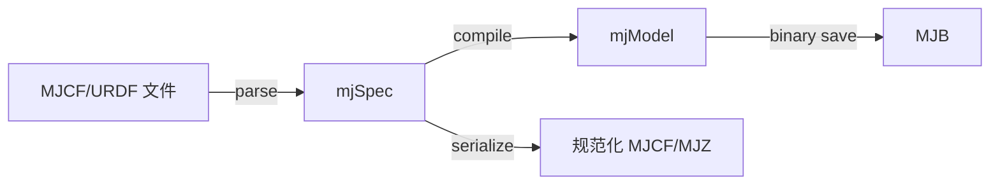
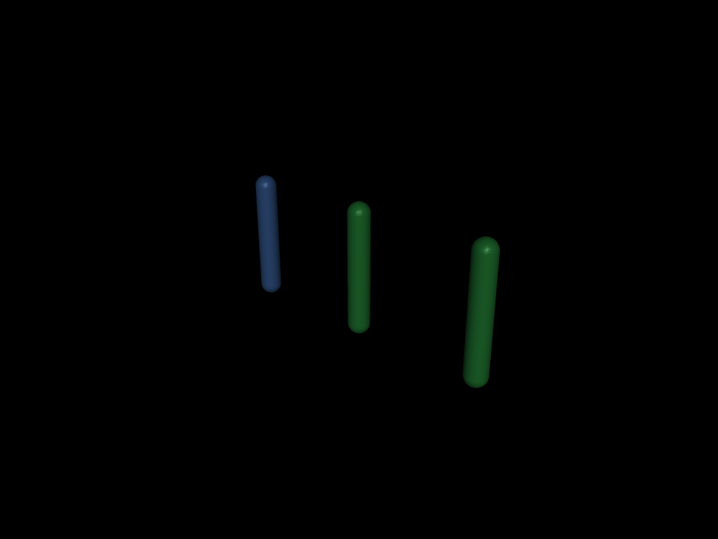

# 第 4 章　MJCF 编译器、默认类与模型资产

真实机器人 MJCF 很少是一个平铺的大 XML。它往往由默认类、include 文件、mesh 资产和编译器推断共同生成最终 `mjModel`。只读源文件而不理解编译过程，就无法回答“这个关节最终阻尼是多少”“这个 link 的惯量从哪里来”“为什么 mesh 看得见却碰撞不对”。

## 4.1 学习目标

- 解释 MJCF 高层模型到 `mjModel` 的编译过程；
- 掌握 default class 的继承与覆盖规则；
- 理解 body 惯量由 geom 推断的过程和风险；
- 正确组织 include、asset 路径和模块名称；
- 区分 MJCF、MJB、mjSpec、MJZ 的用途；
- 导出规范化 MJCF，检查编译器得到的最终属性。

## 4.2 高层模型与低层模型

MuJoCo 存在两层模型表示：



`mjSpec` 与 MJCF 元素基本一一对应，适合增删改和组合；`mjModel` 是扁平、交叉索引、面向计算的结果。运行时函数只使用 `mjModel`，不要手工构造它。

编译器会完成大量工作：

- 解析 default 并填充未显式指定的属性；
- 将 motor、position 等 shortcut 展开为通用 actuator 参数；
- 根据 geom 推断 body 质量、质心和主惯量；
- 规范化 quaternion、axis 等数据；
- 加载 mesh、texture、height field 等资产；
- 建立名称哈希、ID、父子关系和数组地址；
- 检查惯量、范围、引用和模型一致性；
- 预计算运行时所需的稀疏结构和统计量。

所以“XML 里没写”不等于最终模型没有该属性。

## 4.3 compiler：控制编译语义

`<compiler>` 不改变每步动力学，而是决定源模型如何解释。常用设置包括：

### angle

控制 MJCF 中角度属性使用 degree 还是 radian。它只影响 XML 编译；C API 运行时角度始终是 radian。

```xml
<compiler angle="radian"/>
```

大型团队建议入口文件明确写出，避免模型片段的隐含假设。

### assetdir、meshdir、texturedir

控制相对资产路径。路径相对关系还受到入口 XML 和 include 所在位置影响，应通过固定仓库布局和自动加载测试保证。不要把开发者机器绝对路径写进模型。

### inertiafromgeom 与 inertial 推断

控制是否/如何由 geom 推断惯量。教学模型常省略 `<inertial>`；从 CAD 导入的工程模型通常应显式审计惯量，不能盲信 visual mesh。

### autolimits

允许编译器根据 range 等属性推断 limited。它能减少重复，但团队必须知道最终 limited 值，并避免不同版本默认行为造成误解。

### balanceinertia、boundmass、boundinertia

可修正或限制异常惯量，用于导入不完美模型。它们是模型清洗工具，不应成为掩盖单位错误的常规开关。一个毫米模型误当米模型时，自动 bound 得到的“能编译模型”仍不可信。

### discardvisual、fusestatic

用于导入/部署优化。丢弃纯视觉资产可减小无渲染部署内存；融合静态 body 可简化树，但会改变 body ID 和应用层引用，应在接口验证后使用。

## 4.4 default 像层叠样式，但不是运行时对象

default class 保存元素属性模板。创建元素时，它继承当前 class 的 dummy element 属性，显式属性再覆盖继承值。编译后 default 本身不参与动力学。

```xml
<default>
  <joint damping="0.1"/>
  <geom type="capsule" size="0.04" rgba=".3 .5 .8 1"/>

  <default class="leg">
    <joint damping="1.0" armature="0.02"/>
    <geom rgba=".2 .7 .3 1"/>
  </default>
</default>
```

未指定 class 的 joint 继承顶层默认；`class="leg"` 的 body 会让其中可继承元素使用 leg class，元素自己的 `class` 又可以覆盖 active class。

### 继承不是运行时链接

修改一个 default 定义后重新编译，相关元素改变；编译后的 `mjModel` 只保存最终数值，不保留“这个 damping 来自哪一层”的运行时引用。

### 一旦设定便难以“取消”

某些属性在父 default 中设为具体值后，子 class 无法恢复成“未定义，让编译器自动推断”的状态。设计 default 树时，应把真正全局的属性放上层，把功能专属属性放近使用点。

### shortcut 的覆盖陷阱

多个 actuator shortcut 都写入同一个 general actuator dummy。若在同一 default class 中交错配置 motor、position 等 shortcut，后写属性可能遗留或覆盖前面展开字段。稳妥做法是每类 actuator 使用独立 default class，并通过编译后字段验证。

## 4.5 独立实验：观察继承后的真值

```bash
cd examples/15_defaults_compiler
cmake -S . -B build
cmake --build build
./build/demo model.xml
```

模型创建三个 joint：

- `base_joint` 使用顶层默认阻尼 0.1；
- `leg_joint` 继承 leg class，阻尼 1.0、armature 0.02；
- `override_joint` 继承 leg class，但显式把 damping 改为 0.3。

程序不解析 XML，而是读取 `mjModel.dof_damping` 和 `dof_armature`。这是最终仿真真正使用的数值。随后调用 `mj_saveLastXML` 生成 `compiled.xml`，可对照源文件观察编译器补齐的属性。

<!-- EMBEDDED_EXAMPLE_BEGIN: 15_defaults_compiler -->
### 可视化运行与效果

```bash
../../mujoco-3.11.0/bin/simulate model.xml
```

该命令使用发布包自带的官方 `simulate` 界面，可暂停、单步、施加扰动并开启接触等可视化标志。



*15_defaults_compiler 的真实 MuJoCo 原生渲染结果。*

### 实验完整源码

以下文件与 `examples/15_defaults_compiler/` 中可直接编译的版本一致。

#### 模型文件：`model.xml`

```xml
<mujoco model="defaults_compiler">
  <compiler angle="radian"/>
  <default>
    <joint type="hinge" axis="0 1 0" damping="0.1"/>
    <geom type="capsule" size="0.04" rgba="0.3 0.5 0.8 1"/>
    <default class="leg">
      <joint damping="1.0" armature="0.02"/>
      <geom rgba="0.2 0.7 0.3 1"/>
    </default>
  </default>
  <worldbody>
    <body pos="-0.5 0 1">
      <joint name="base_joint"/>
      <geom name="base_geom" fromto="0 0 0 0 0 -.4" mass="1"/>
    </body>
    <body pos="0 0 1" childclass="leg">
      <joint name="leg_joint"/>
      <geom name="leg_geom" fromto="0 0 0 0 0 -.4" mass="1"/>
    </body>
    <body pos="0.5 0 1" childclass="leg">
      <joint name="override_joint" damping="0.3"/>
      <geom name="override_geom" fromto="0 0 0 0 0 -.4" mass="1"/>
    </body>
  </worldbody>
</mujoco>
```

#### 程序源码：`main.cc`

```cpp
#include <cstdio>
#include <cstdlib>
#include <mujoco/mujoco.h>

int main(int argc, char** argv) {
  if (argc != 2) {
    std::fprintf(stderr, "用法: %s model.xml\n", argv[0]);
    return EXIT_FAILURE;
  }
  char error[1024] = {0};
  mjModel* m = mj_loadXML(argv[1], NULL, error, sizeof(error));
  if (!m) {
    std::fprintf(stderr, "无法加载 %s:\n%s\n", argv[1], error);
    return EXIT_FAILURE;
  }

  for (int j = 0; j < m->njnt; ++j) {
    int dof = m->jnt_dofadr[j];
    const char* name = mj_id2name(m, mjOBJ_JOINT, j);
    std::printf("%-14s damping=%.2f armature=%.2f\n",
                name, m->dof_damping[dof], m->dof_armature[dof]);
  }
  for (int g = 0; g < m->ngeom; ++g) {
    const char* name = mj_id2name(m, mjOBJ_GEOM, g);
    std::printf("%-14s rgba=(%.1f %.1f %.1f %.1f)\n", name,
                m->geom_rgba[4*g], m->geom_rgba[4*g+1],
                m->geom_rgba[4*g+2], m->geom_rgba[4*g+3]);
  }

  if (!mj_saveLastXML("compiled.xml", m, error, sizeof(error))) {
    std::fprintf(stderr, "保存 compiled.xml 失败: %s\n", error);
  } else {
    std::printf("已生成 compiled.xml，可与 model.xml 对照。\n");
  }
  mj_deleteModel(m);
  return EXIT_SUCCESS;
}
```

#### 构建文件：`CMakeLists.txt`

```cmake
cmake_minimum_required(VERSION 3.16)
project(15_defaults_compiler LANGUAGES CXX)

set(CMAKE_CXX_STANDARD 17)
add_executable(demo main.cc)

set(MUJOCO_ROOT ${CMAKE_CURRENT_LIST_DIR}/../../mujoco-3.11.0)
target_include_directories(demo PRIVATE ${MUJOCO_ROOT}/include)
target_link_directories(demo PRIVATE ${MUJOCO_ROOT}/lib)
target_link_libraries(demo PRIVATE mujoco)
set_target_properties(demo PROPERTIES BUILD_RPATH ${MUJOCO_ROOT}/lib)
```
<!-- EMBEDDED_EXAMPLE_END: 15_defaults_compiler -->

## 4.6 惯量推断的物理过程

如果 body 没有显式 inertial，编译器把参与推断的各 geom 当作均匀密度实体。对第 `i` 个 geom：

\[
m_i=\rho_iV_i.
\]

总质量与质心：

\[
m=\sum_i m_i,\qquad
r_C=\frac{1}{m}\sum_i m_i r_i.
\]

各 geom 惯量通过旋转和平行轴定理合成到总质心：

\[
I_C=\sum_i\left(R_i I_i R_i^T+m_i(\|d_i\|^2I-d_id_i^T)\right).
\]

最后对称惯量矩阵被对角化，得到 inertial frame 的姿态和三项主惯量。

### 哪些 geom 应参与惯量

机器人常把 visual 和 collision 分开。如果两套重复几何都参与惯量推断，质量会被计算两遍。可通过 geom group 与 compiler 的 inertia group 范围控制，或显式写 inertial。

### mesh 惯量风险

mesh 可能非封闭、三角面方向错误、含重复壳层或单位错误。即使编译成功，也要把 `body_mass/body_inertia/body_ipos` 与 CAD/BOM 对照。

## 4.7 asset：可复用但不独立产生物理

asset 必须被其他元素引用才生效：

- mesh：三角网格，可用于 geom；碰撞通常基于凸表示；
- hfield：高度场，适合大尺度地形；
- texture/material：控制外观，不改变摩擦；
- skin：骨骼蒙皮，只影响视觉；
- model：可被 attach 的模型资产；
- plugin asset/config：扩展所需数据。

视觉 material 的“粗糙金属外观”与 `geom_friction` 没有自动关系。渲染材质和接触材质必须分别配置。

## 4.8 include 与大型项目组织

推荐目录：

```text
robot/
├── scene.xml
├── robot.xml
├── defaults.xml
├── actuators.xml
├── sensors.xml
└── assets/
    ├── visual/
    └── collision/
```

入口 `scene.xml` 负责全局 option、地面、灯光和机器人 include；机器人本体保持可在不同场景复用。名称在最终展开模型中必须唯一。

include 是 XML 组合机制，不提供程序语言意义上的参数、循环或命名空间。重复机器人、参数化生成和模块 attach 更适合 `replicate`、mjSpec 或外部生成工具。

## 4.9 MJCF、MJB、MJZ 的选择

| 格式 | 层级 | 优点 | 限制 |
|---|---|---|---|
| MJCF/URDF | 高层文本 | 可读、可编辑、适合版本控制 | 加载需编译和资产解析 |
| MJB | 低层二进制 | 加载快、单个编译模型 | 版本相关、不可反编译为源 |
| MJZ | 高层归档 | 打包 XML 与资产 | 仍需编译；工具链较新 |
| mjSpec | 内存高层 | 可程序化编辑/attach | 需要代码管理生命周期 |

永远维护 MJCF/mjSpec 高层源。MJB 是构建产物，不是模型唯一副本。升级 MuJoCo 后应从高层源重新编译，不能假定旧 MJB 兼容。

### 配套实验：XML 与内存 MJB 往返

`examples/10_model_io` 从 XML 编译模型，将 MJB 写入内存缓冲区，再从该缓冲区加载新的 `mjModel`，并核对两者规模。

```bash
cd examples/10_model_io
cmake -S . -B build
cmake --build build
./build/demo model.xml
```

<!-- EMBEDDED_EXAMPLE_BEGIN: 10_model_io -->
### 可视化运行与效果

```bash
../../mujoco-3.11.0/bin/simulate model.xml
```

该命令使用发布包自带的官方 `simulate` 界面，可暂停、单步、施加扰动并开启接触等可视化标志。


*10_model_io 的真实 MuJoCo 原生渲染结果。*

### 实验完整源码

以下文件与 `examples/10_model_io/` 中可直接编译的版本一致。

#### 模型文件：`model.xml`

```xml
<mujoco model="two_link_arm">
  <compiler angle="radian"/>
  <option timestep="0.001" gravity="0 0 -9.81" integrator="implicitfast"/>
  <default>
    <joint axis="0 1 0" damping="0.2" limited="true" range="-3.14 3.14"/>
    <geom type="capsule" size="0.04" rgba="0.25 0.55 0.85 1"/>
    <motor ctrllimited="true" ctrlrange="-100 100"/>
  </default>
  <worldbody>
    <body name="upper" pos="0 0 1">
      <joint name="shoulder"/>
      <geom fromto="0 0 0 0 0 -0.5" mass="1.0"/>
      <body name="forearm" pos="0 0 -0.5">
        <joint name="elbow"/>
        <geom fromto="0 0 0 0 0 -0.4" mass="0.7"/>
        <site name="tool" pos="0 0 -0.4" size="0.025" rgba="1 0.2 0.1 1"/>
      </body>
    </body>
  </worldbody>
  <actuator>
    <motor name="shoulder_motor" joint="shoulder" gear="1"/>
    <motor name="elbow_motor" joint="elbow" gear="1"/>
  </actuator>
</mujoco>
```

#### 程序源码：`main.cc`

```cpp
#include <cstdio>
#include <cstdlib>
#include <mujoco/mujoco.h>

#include <cstring>
#include <vector>

int main(int argc, char** argv) {
  if (argc != 2) {
    std::fprintf(stderr, "用法: %s model.xml\n", argv[0]);
    return EXIT_FAILURE;
  }
  char error[1024] = {0};
  mjModel* xml = mj_loadXML(argv[1], NULL, error, sizeof(error));
  if (!xml) {
    std::fprintf(stderr, "无法加载 %s:\n%s\n", argv[1], error);
    return EXIT_FAILURE;
  }
  int bytes = mj_sizeModel(xml);
  std::vector<unsigned char> buffer(bytes);
  mj_saveModel(xml, NULL, buffer.data(), bytes);
  mjModel* mjb = mj_loadModelBuffer(buffer.data(), bytes);
  if (!mjb) { std::fprintf(stderr, "无法从内存 MJB 加载\n"); return EXIT_FAILURE; }
  std::printf("MJB bytes=%d nq=%lld nv=%lld same_model_size=%s\n", bytes,
              (long long)mjb->nq, (long long)mjb->nv,
              mj_sizeModel(mjb) == bytes ? "yes" : "no");
  mj_deleteModel(mjb); mj_deleteModel(xml);
  return EXIT_SUCCESS;
}
```

#### 构建文件：`CMakeLists.txt`

```cmake
cmake_minimum_required(VERSION 3.16)
project(10_model_io LANGUAGES CXX)

set(CMAKE_CXX_STANDARD 17)
add_executable(demo main.cc)

set(MUJOCO_ROOT ${CMAKE_CURRENT_LIST_DIR}/../../mujoco-3.11.0)
target_include_directories(demo PRIVATE ${MUJOCO_ROOT}/include)
target_link_directories(demo PRIVATE ${MUJOCO_ROOT}/lib)
target_link_libraries(demo PRIVATE mujoco)
set_target_properties(demo PROPERTIES BUILD_RPATH ${MUJOCO_ROOT}/lib)
```
<!-- EMBEDDED_EXAMPLE_END: 10_model_io -->

## 4.10 规范化 MJCF 与模型审计

`mj_saveLastXML` 根据最近编译信息保存规范化 MJCF。它适合：

- 查看 default 展开后的显式值；
- 确认 shortcut actuator 的底层参数；
- 检查编译器规范化的 orientation；
- 比较模型版本迁移前后的结果。

但规范化文件不一定保持原注释、include 结构和作者组织方式，不应自动覆盖手写源文件。把它当审计报告或中间产物。

还可用官方 `compile` 工具生成文本模型转储，查看低层数组。审计流程应同时比较源、规范化 XML 和关键 `mjModel` 字段。

## 4.11 编译错误与 warning

错误使 `mj_loadXML` 返回 NULL，例如引用不存在、惯量非法、属性维度错误。warning 可能允许编译继续，例如某些资产或数值条件值得注意。模型 CI 至少应：

1. 用目标 MuJoCo 版本加载所有入口 XML；
2. 捕获并审查 warning；
3. 打印 `nq/nv/nu/nbody/ngeom` 与预期比较；
4. 验证关键名称、类型、地址和 sensor dim；
5. 检查质量、惯量和 actuator range；
6. 运行关键 keyframe 的 forward。

## 4.12 常见错误

| 错误 | 后果 | 修复 |
|---|---|---|
| 把 angle=degree 理解到 C API | 控制目标大 57.3 倍 | API 始终使用 rad |
| default 层级过深 | 无法追踪最终参数 | 按功能浅层 class，读 mjModel 验证 |
| visual/collision 双重推断质量 | link 质量翻倍 | 限制惯量 group 或显式 inertial |
| 依赖绝对 asset 路径 | 换电脑加载失败 | 仓库相对路径与加载测试 |
| 用 MJB 作为唯一模型源 | 无法升级和编辑 | 保留 MJCF/mjSpec |
| include 后名称冲突 | 编译失败或引用歧义 | 命名前缀/attach 规则 |
| 用自动修正掩盖单位错误 | 模型能跑但物理错误 | 回到 CAD/BOM 核验 SI 单位 |

## 4.13 本章小结

- MJCF/mjSpec 是高层模型，`mjModel` 是编译后的低层真值。
- compiler 控制角度、路径、惯量推断和导入语义。
- default 在编译期展开，运行时只剩最终属性。
- 惯量推断方便原型，但工程机器人必须审计质量、质心和主惯量。
- asset、include 和名称规范决定大型模型是否可维护。
- MJCF 是源，MJB 是版本相关构建产物，规范化 XML 是审计工具。

## 4.14 练习

1. 为什么把 joint damping 写在 default 中后，不能只搜索 joint 元素判断最终阻尼？
2. 一个 body 有完全重叠的 visual geom 和 collision geom，两者密度相同且都参与推断，会发生什么？
3. 设计 arm、leg 两个 default class，它们共享 joint range，但阻尼和颜色不同。
4. 解释为什么修改 mesh 的显示缩放可能同时改变惯量，并给出避免方案。
5. 哪种格式适合提交 Git，哪种适合低延迟部署缓存，为什么？

## 4.15 参考答案

1. joint 会继承 active default class，最终值可能来自父/子 class 或元素显式覆盖，必须解析继承或读取 mjModel。
2. 编译器把两套几何都计入，质量和惯量被重复合成；应只让一组参与推断或显式 inertial。
3. 把公共 range 放顶层 joint default；在 `class="arm"`、`class="leg"` 子 default 分别覆盖 damping，并覆盖各自 geom rgba。
4. mesh scale 改变体积、质心距离和惯量尺度；视觉 mesh 不参与惯量，碰撞/惯量采用独立几何或显式 inertial。
5. MJCF 和资产适合版本控制，因为可读可重编译；MJB 适合固定 MuJoCo 版本的部署缓存，因为加载快但版本相关。
