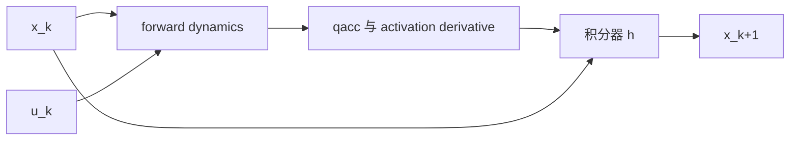

# 第 5 章　数值积分、能量与时间步收敛

MuJoCo 求解的是连续动力学，但计算机只能在离散时刻更新状态。同一个模型、同一个初态，换一个积分器或时间步就可能得到不同轨迹。工程师不能把 `timestep` 当作“动画刷新率”，也不能因为仿真没有爆炸就断言结果正确。

## 5.1 学习目标

- 从连续动力学理解 `mj_step` 的离散更新；
- 区分 Euler、implicit、implicitfast 和 RK4；
- 使用机械能漂移评价保守系统的数值误差；
- 设计时间步减半的收敛实验；
- 区分物理耗散、积分误差与接触非光滑性；
- 为机械臂和人形控制选择物理步长与控制周期。

## 5.2 从连续系统到离散仿真

刚体系统可写成一阶状态方程：

\[
x=\begin{bmatrix}q\\v\\a\end{bmatrix},\qquad
\dot x=f(x,u,t),
\]

其中 `q` 是配置、`v` 是广义速度、`a` 是有状态执行器的激活量。对简单欧氏状态，显式 Euler 是：

\[
x_{k+1}=x_k+h f(x_k,u_k),
\]

`h` 就是 `m->opt.timestep`。机器人配置包含四元数时，位置更新必须沿配置流形进行，不能逐分量套这条公式；MuJoCo 的积分函数负责正确更新和归一化姿态。



## 5.3 timestep 不是渲染帧率

物理时间步决定动力学离散精度。渲染可以是 60 Hz，而物理仿真是 1000 Hz：每一帧画面之间执行约 16 或 17 个 `mj_step`。

```cpp
mjtNum frame_start = d->time;
while (d->time - frame_start < 1.0/60.0) {
  mj_step(m, d);
}
render();
```

若把 timestep 从 0.001 改为 1/60，只为了“一帧一步”，关节刚度、接触和控制器的离散行为都会改变。

控制周期也可以不同于物理步长。例如物理 2 kHz、控制 500 Hz，则每 4 步更新一次 ctrl，其余步保持上一控制值。真实控制器的零阶保持、延迟和采样频率应明确建模。

## 5.4 MuJoCo 的四种积分器

### Euler

MuJoCo 的 Euler 是适合机械系统的半隐式形式：先更新速度，再用新速度更新位置。它比最朴素显式 Euler 对许多机械系统更稳定，计算成本最低，是实时仿真的常用基线。

优点：一次动力学评估、快、行为易理解。缺点：一阶精度，较大步长下相位和能量误差明显。

### implicit

对速度相关力的 Jacobian 做隐式处理。强阻尼、某些流体力或高速旋转系统中，显式处理会要求很小时间步，implicit 能扩大稳定范围。

隐式不等于“绝对准确”。它可能更耗时，也可能引入数值耗散；稳定只是误差性质的一部分。

### implicitfast

忽略速度 Jacobian 的部分非对称项，换取更快计算。对许多机器人模型，它是稳定性和速度的实用折中。若模型有强烈陀螺效应或复杂速度相关力，应与完整 implicit 对照。

### RK4

经典四阶 Runge–Kutta 在一步内多次评估动力学，对平滑、无接触、非刚性系统可显著降低截断误差。成本通常约为多次 forward dynamics。

接触建立/消失、摩擦切换和限位冲击是不光滑事件。RK4 的高阶假设在事件附近不成立，因此它不保证在接触机器人上比半隐式 Euler 更好。

## 5.5 局部误差、全局误差和稳定性

阶数描述 `h→0` 时误差如何缩小，不代表任意大步长下的表现。一个 `p` 阶方法通常具有全局误差：

\[
\|x_h(T)-x(T)\|=O(h^p).
\]

但机器人仿真还受以下因素影响：

- 接触/摩擦导致不光滑；
- 约束由迭代 solver 近似求解；
- controller 是离散和可能饱和的；
- 模型参数可能形成刚性时间尺度；
- 混沌系统会放大极小数值差异。

所以不能仅凭“RK4 四阶”选择积分器，必须在目标模型和指标上实验。

## 5.6 用能量建立第一条数值基线

无阻尼、无执行器、无接触的固定基座单摆是保守系统：

\[
E=T+V=\text{constant}.
\]

MuJoCo 用 `mj_energyPos` 计算位置相关能量，用 `mj_energyVel` 计算速度相关能量，结果在 `d->energy[0]` 和 `d->energy[1]`。

定义相对能量漂移：

\[
\epsilon_E(t)=\frac{|E(t)-E(0)|}{\max(|E(0)|,\epsilon)}.
\]

能量漂移不是万能指标：有阻尼时能量本来就应下降；有控制输入时系统会做功；接触碰撞可能按模型耗散。但在刻意构造的保守实验中，它能快速暴露积分误差。

## 5.7 独立实验：积分器与时间步矩阵

```bash
cd examples/16_integrator_compare
cmake -S . -B build
cmake --build build
./build/demo model.xml
```

程序对每种积分器、每个时间步都执行：

1. `mj_resetData`；
2. 设置相同初始角 `0.8 rad` 和零速度；
3. `mj_forward` 后记录初始能量；
4. 仿真 5 s；
5. 记录最大绝对能量漂移和终态。

示例比较 `h=0.0005、0.002、0.01 s`。读输出时不要只找“最小数字”，而要回答：

- 步长减小时，同一积分器误差是否趋于稳定？
- RK4 的额外计算是否在这个平滑模型上换来更小漂移？
- implicitfast 是否表现出更多数值耗散？
- 终态 q 的差异是能量误差、相位误差，还是两者共同造成？

在这个没有 damping 和其他速度相关力的单摆中，Euler 与 implicitfast 的结果会相同，因为后者没有可隐式处理的速度 Jacobian；这正好说明积分器差异依赖模型，不能脱离动力学结构比较名称。

## 5.8 时间步收敛实验

真实机器人没有解析解时，可以用更小步长解作为参考。设任务指标为 `J(h)`，依次计算：

\[
h,\quad h/2,\quad h/4.
\]

观察：

\[
|J(h)-J(h/2)|,\qquad |J(h/2)-J(h/4)|.
\]

第二个差值明显更小时，说明指标开始收敛。指标应与任务相关：

- 机械臂：末端最大误差、关节力矩峰值；
- 人形站立：质心漂移、足底冲量、跌倒时间；
- 抓取：接触滑移距离、抓取成功率；
- 强化学习：固定策略回报的分布。

不要用单个终态代替所有指标。振荡系统可能在某个终止时刻偶然相位重合。

## 5.9 物理耗散与数值耗散

机械能下降可能来自：

1. joint/tendon damping；
2. frictionloss 或接触摩擦；
3. actuator 的负功；
4. 软约束和碰撞恢复参数；
5. 积分器的数值耗散。

诊断顺序是先构造一个删除物理耗散的基线，再逐项加入。若一开始就在完整人形上观察能量，很难分离来源。

机械功率可由广义力和速度检查：

\[
P=\tau^Tv.
\]

对 actuator，还要考虑 transmission 和 activation，不能简单把 `ctrl^T qvel` 当成功率。

## 5.10 刚性来自哪里

系统同时包含很快和很慢的时间尺度时称为刚性。机器人模型中的来源包括：

- 极大的 joint stiffness 或 actuator gain；
- 很硬的接触/等式约束；
- 极小质量与正常质量连接；
- 强阻尼或速度相关力；
- 高减速比反射惯量；
- 控制器增益相对采样周期过高。

缩小 timestep 可以缓解，却可能只是隐藏不合理参数。先核查单位、惯量和增益，再选择 implicit 系列或更小步长。

## 5.11 接触系统为什么更难比较

两个积分设置可能在几乎相同时间触地，但一个先进入接触，另一个仍在空中；下一步约束集合就不同，轨迹快速分叉。此时逐点状态误差可能很大，而落地冲量、反弹高度或稳定统计量仍接近。

接触验证应报告：

- 首次触地时间；
- 法向冲量和切向冲量；
- 最大穿透/约束残差；
- 反弹高度或静止时间；
- solver iteration 与 timestep 的共同影响。

## 5.12 实时仿真与超实时仿真

实时因子：

\[
RTF=\frac{\text{simulated time}}{\text{wall-clock time}}.
\]

`RTF>1` 表示跑得比真实时间快。控制硬件在环要求按墙钟同步；优化和学习只追求吞吐，不应 sleep 等待实时。

选择 timestep 时先满足物理精度，再评估计算能否跟上。若不能：简化碰撞、减少无用传感器、优化 solver、并行 rollout，而不是直接牺牲步长精度。

## 5.13 常见错误

| 错误 | 为什么错 | 正确方法 |
|---|---|---|
| timestep 等于显示帧间隔 | 把物理与视觉耦合 | 每帧多次物理步进 |
| RK4 一定最好 | 接触不光滑且成本高 | 对任务指标做对照 |
| 仿真不爆炸就是准确 | 稳定不等于小误差 | 步长减半收敛测试 |
| 能量下降就是积分器差 | 可能有真实耗散 | 构造保守基线 |
| 只改 timestep 不改控制采样逻辑 | 控制器离散行为改变 | 明确控制更新周期 |
| 接触轨迹要求逐点相等 | 事件时间微差会分叉 | 比较冲量和任务统计 |

## 5.14 本章小结

- `mj_step` 把连续动力学离散化，timestep 是物理参数而非帧率。
- Euler 快；implicit 系列处理速度相关刚性；RK4 适合平滑系统。
- 稳定、精度、计算成本是三个不同维度。
- 保守单摆能量漂移是积分器实验的良好基线。
- 可信步长来自减半收敛，而不是经验常数。
- 接触系统应比较事件、冲量和任务指标，而不只比较逐点状态。

## 5.15 练习

1. 物理步长 0.5 ms、控制频率 500 Hz、渲染 50 Hz，每次控制更新和每帧各包含多少物理步？
2. 为什么一个能量几乎守恒的积分器仍可能有明显相位误差？
3. 给单摆加入 damping 后，如何区分物理耗散与数值耗散？
4. 若 `h、h/2、h/4` 的任务指标差值没有减小，至少列出三种可能原因。
5. 人形落地实验中，为什么比较 5 s 时的完整 qpos 不是最稳健的积分器评价？

## 5.16 参考答案

1. 每次控制更新 4 步，每帧 40 步。
2. 能量约束的是轨迹所在能量面，不保证沿能量面的运动速度和相位准确。
3. 用 damping=0 的同模型测数值基线，再比较有阻尼时的能量变化；也可积分阻尼功率并做能量平衡。
4. 尚未进入渐近收敛区；接触模式随步长改变；solver tolerance 主导误差；控制采样随步长错误改变；指标处于混沌长时区间。
5. 触地事件的微小时间差会导致完整状态快速分叉；更应比较跌倒与否、质心范围、接触冲量和统计回报。
