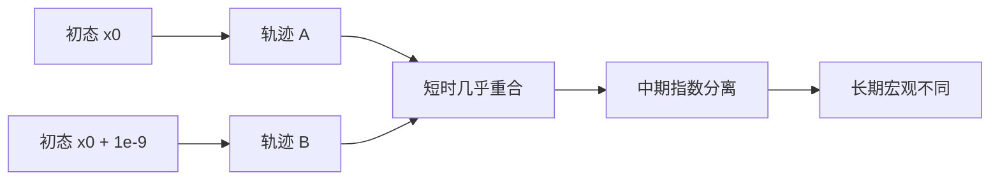
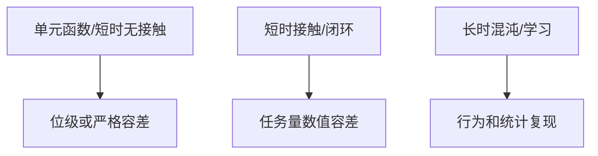

# 第 6 章　混沌、确定性与可复现性

官方 MuJoCo tutorial 用双摆展示一个关键事实：两条轨迹迅速分开，不一定意味着仿真器随机或错误。非线性系统可能对初值指数敏感；有限精度、时间步、solver 和硬件造成的微小差异都会被动力学放大。本章建立正确的复现观，避免用“长轨迹逐位相等”评价机器人仿真。

## 6.1 学习目标

- 区分确定性、数值误差、混沌和随机性；
- 解释初值扰动在双摆中如何放大；
- 使用配置空间差和任务空间距离比较轨迹；
- 设计短时数值回归与长时统计回归；
- 理解接触、solver warmstart 和并行计算对复现的影响；
- 为优化、控制和强化学习选择合理验证指标。

## 6.2 确定性不等于长期可预测

确定性系统满足：给定完全相同的状态、输入和参数，演化规律唯一。混沌系统仍是确定性的，但相邻初态会快速分开。

设两条轨迹初始差为 `δx(0)`，在一段局部区间内可能近似：

\[
\|\delta x(t)\|\approx \|\delta x(0)\|e^{\lambda t},
\]

`λ>0` 是最大 Lyapunov exponent 的局部体现。误差达到系统尺度后会饱和或复杂变化，不再保持简单指数关系。



如果两次运行的第 15 秒双摆姿态不同，不能直接推断其中一次错误。应先问：短时局部误差是否符合数值预期？物理不变量和统计量是否一致？

## 6.3 双摆为什么容易混沌

两个连杆的重力势能、惯性和速度耦合形成非线性方程。第二个 link 的运动同时受两个角度和速度影响，能量在多种运动模式间交换。当初始能量足够高，轨迹可在旋转与摆动区域之间复杂切换。

本章模型使用两个 hinge，省略阻尼、接触和 actuator，采用 RK4 和 1 ms 步长。这样尽量把观察到的分离归因于连续系统初值敏感性，而非接触切换或控制噪声。

## 6.4 独立实验：十亿分之一弧度

```bash
cd examples/17_chaotic_double_pendulum
cmake -S . -B build
cmake --build build
./build/demo model.xml
```

程序用同一个 `mjModel` 创建两个 `mjData`：

```cpp
mjData* a = mj_makeData(m);
mjData* b = mj_makeData(m);
a->qpos[0] = b->qpos[0] = 2.0;
a->qpos[1] = 1.0;
b->qpos[1] = 1.0 + 1e-9;
```

除了第二关节 `10⁻⁹ rad` 的扰动外，两条轨迹完全相同。程序每秒报告配置差和末端距离。一次实测的典型结果：

```text
time    ||delta q||   tip distance
 0.0    1.000000e-09  6.000000e-10
 3.0    1.912369e-07  9.605099e-08
 6.0    2.151189e-04  7.586190e-05
 7.0    2.735847e-02  1.165644e-02
10.0    2.541855e+00  1.006211e+00
```

10 秒后，十亿分之一弧度已放大为米级末端差异。这不是随机数，也不是两个 data 相互污染；它是系统动力学对初值敏感。

## 6.5 为什么使用 mj_differentiatePos

本例只有 hinge，直接相减也可工作，但程序刻意使用：

```cpp
mj_differentiatePos(m, dq, 1.0, a->qpos, b->qpos);
```

输出 `dq` 长度为 `nv`，是在配置流形切空间中的差。若模型包含 ball/free quaternion，直接 `b->qpos-a->qpos` 会产生四维分量差、符号二义性和错误维度；`mj_differentiatePos` 才能推广到人形机器人。

末端差：

\[
d_{tip}=\|p_A-p_B\|_2
\]

是任务空间指标。配置差大但末端差可能暂时小，反之亦然，因此应按研究问题选择度量。

## 6.6 数值误差如何成为“扰动”

即使输入 XML 和初态看起来相同，以下因素也可能产生极小差异：

- timestep 或 integrator 不同；
- 浮点指令顺序、FMA、CPU 架构不同；
- 编译器优化和 MuJoCo 版本不同；
- solver tolerance 导致迭代提前停止；
- constraint island 的求解顺序不同；
- 并行归约顺序不同；
- 模型资产编译结果或默认值变化。

稳定系统会衰减这些差异，混沌系统会放大。数值误差始终存在，关键是它是否在所需预测时间和任务指标内可接受。

## 6.7 接触带来的非光滑分叉

接触系统还有另一类敏感性：事件拓扑切换。若两个仿真中的脚底高度只差 `10⁻⁸ m`，一个时间步内可能一个已接触、另一个未接触。此后约束维度和接触力不同，轨迹迅速分开。

这不一定是经典光滑混沌，而是混合动力系统的模式切换。人形行走、抓取和碰撞任务中非常常见。

因此长时逐状态比较尤其脆弱。更合适的指标包括：

- 是否在同一时间窗口完成触地/抓取；
- 接触冲量和峰值力分布；
- 质心和末端轨迹包络；
- 成功率、能耗、跌倒时间等统计量。

## 6.8 warmstart 与 solver 复现

MuJoCo 可使用上一步约束力作为下一步 solver 初值，这就是 warmstart。它通常提高收敛速度；在迭代未完全收敛时，warmstart 状态也可能轻微影响结果。

保存 rollout 的“完整积分状态”时，应按需求包含 warmstart。若每一步 solver 都收敛到足够严格的唯一解，初值影响会变小；若固定很少 iteration 追求速度，warmstart 对轨迹更重要。

比较 solver 时应固定：

- solver 类型、iteration 和 tolerance；
- warmstart 策略；
- timestep/integrator；
- 初始完整状态；
- contact 参数和模型版本。

## 6.9 随机性来自哪里

MuJoCo 的基本刚体步进不是为了随机而随机。随机性通常由应用层加入：

- domain randomization；
- sensor noise；
- 初态分布；
- 随机控制策略；
- 程序化地形和外力。

所有随机源应由显式 seed 管理。记录 seed 只是第一步，还要记录随机算法版本、采样顺序和生成后的实际参数。并行 worker 调度改变采样顺序时，共享一个全局 RNG 可能破坏复现；更可靠的是按 episode ID 派生独立随机流。

## 6.10 三种复现等级

### 位级复现

每个浮点位完全相同。适用于同一构建、同一硬件、短程单线程单元测试，但跨平台通常要求过严。

### 数值容差复现

短时状态或派生量在绝对/相对容差内。例如 forward kinematics、质量矩阵、静态重力矩。容差应来自量纲和工程精度，而非随意写 `1e-6`。

### 行为/统计复现

长时、接触或学习任务比较成功率、回报分布、能耗、稳定时间等。应报告样本量、均值、方差/置信区间和 seed 集合。



## 6.11 回归测试设计

一个可靠机器人模型至少有四层测试：

1. 编译层：模型加载无错误，规模、名称和地址符合预期；
2. 几何层：关键 keyframe 的 site/body 位姿在容差内；
3. 动力学层：质量矩阵、重力矩、能量或已知短轨迹；
4. 行为层：站立、行走、抓取等任务指标。

不要用一个 30 秒完整 qpos 黄金文件覆盖所有层次。它难以定位失败，而且对合理的 solver/版本改进过度敏感。

### 容差必须带单位

位置可用 `1e-5 m`，角度可用 `1e-5 rad`，力矩可用额定值比例。相对误差在真值接近零时不稳定，应组合：

\[
|a-b|\le atol+rtol\max(|a|,|b|).
\]

## 6.12 混沌对控制与优化的意义

反馈控制可以抑制某些不稳定模式，提高局部可预测性；但饱和、接触切换和未建模扰动仍限制预测时域。Model Predictive Control 因此不断用新测量重规划，而不是相信一次长时 open-loop rollout。

轨迹优化中的有限差分也受敏感性影响：时域过长时 Jacobian 可能爆炸或病态；接触模式切换使导数不连续。常见策略包括缩短 shooting interval、multiple shooting、正则化、平滑接触近似和反馈 rollout。

强化学习不追求每个 episode 轨迹相同，而追求策略在状态/参数分布上的统计性能。训练复现仍需固定 seed 和软件栈，但不能用单轨迹一致性代替策略评价。

## 6.13 常见误判

| 观察 | 错误结论 | 更合理检查 |
|---|---|---|
| 双摆长期不同 | 引擎有随机 bug | 比较短时误差增长和能量 |
| 换 CPU 后末位不同 | 模型无效 | 检查任务容差与统计结果 |
| 接触时轨迹突然分叉 | solver 一定错误 | 检查接触模式切换和冲量 |
| 固定 seed 仍不一致 | seed 没作用 | 检查线程调度、RNG 流和版本 |
| 黄金长轨迹失败 | 新版本回归 | 分层定位模型/数值/行为指标 |

## 6.14 本章小结

- 混沌系统是确定性的，却对初值指数敏感。
- 数值误差是不可避免的小扰动，长期轨迹分离不自动等于错误。
- 配置差应用 `mj_differentiatePos`，任务还需任务空间指标。
- 接触模式切换会造成非光滑轨迹分叉。
- 回归应分为编译、几何、动力学和行为层。
- 短时用物理容差，长时用任务和统计指标。

## 6.15 练习

1. 根据实验 3 s 和 6 s 的配置差，粗略估计这一区间的指数增长率。
2. 把初始扰动改为 `1e-12`，预测达到 `1e-2` rad 差异的时间怎样改变。
3. 为什么用 quaternion 四个分量的欧氏距离比较人形 base 姿态可能误判？
4. 为一个站立控制器设计编译、几何、动力学和行为四层回归指标。
5. 两个 solver 的 10 秒 qpos 不同，但跌倒率和能耗分布一致，应如何表述结论？

## 6.16 参考答案

1. `λ≈ln(2.15e-4/1.91e-7)/3≈2.34 s⁻¹`，这里只是有限区间粗估，不是严格全局 Lyapunov exponent。
2. 在相同指数区间，初始误差缩小 1000 倍会把阈值到达时间推迟约 `ln(1000)/λ`，并非永远保持三位数量级差。
3. `q` 与 `-q` 表示同一旋转，且合法姿态在单位球面上；应计算相对旋转或使用配置流形差。
4. 编译层检查维度/名称；几何层检查站立 keyframe 足底和质心；动力学层检查静态重力矩/质量矩阵；行为层检查扰动后稳定时间、质心范围和跌倒率。
5. 说明逐轨迹不可复现但选定行为指标统计等价，同时报告样本量、置信区间、版本和 seed；不能声称位级或状态级一致。

