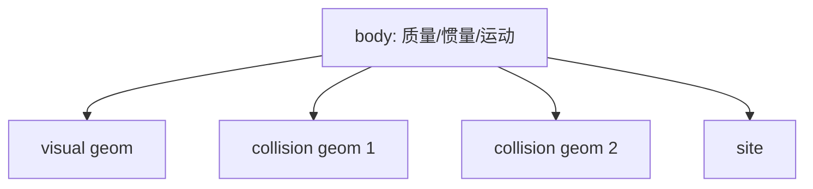
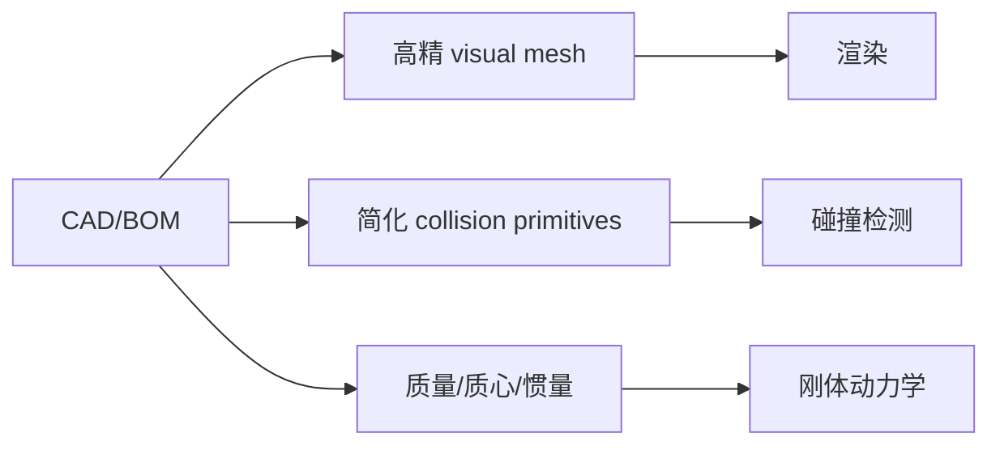
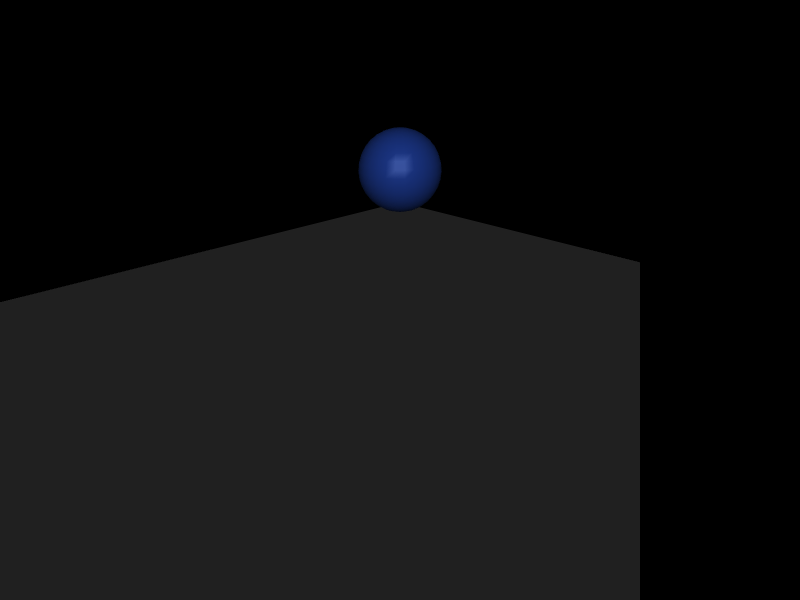

# 第 7 章　几何体、网格资产与碰撞建模

机械臂 link 在渲染器里看起来像什么，与碰撞检测器和惯量计算器看到什么，可以是三件不同的事。工程模型通常使用精细 mesh 表现外观、简化 primitive/凸体计算碰撞、显式 inertial 表达真实质量。把三者混成一个 geom，是模型慢、不稳定和不可信的常见根源。

## 7.1 学习目标

- 区分 body、geom、mesh asset 和 material；
- 掌握 sphere、capsule、box、cylinder、ellipsoid、plane、mesh、hfield 的适用范围；
- 建立 visual/collision/inertia 三层模型；
- 使用 group、contype、conaffinity、pair 和 exclude；
- 理解 mesh 凸碰撞、尺度和惯量推断风险；
- 通过 `mjModel` 与实际 contact 验证碰撞配置。

## 7.2 body 与 geom 的职责边界

`body` 是动力学实体：它有质量、惯量、速度和树关系。`geom` 是附着在 body 上的形状：它可参与渲染、碰撞和惯量推断，但没有独立状态。



一个 body 可以有多个 geom。多个 geom 随 body 刚性运动，不会增加 `nq/nv`。只有当两个形状需要相对运动时才应拆成不同 body 和 joint。

错误模式是“CAD 有多少零件就建多少动态 body”。螺钉、壳体、电机外壳若相互刚性连接，可属于同一 body；否则无谓增加树节点、惯量计算和碰撞 pair。

## 7.3 primitive 几何体

### sphere

参数只有半径，碰撞最快、法向连续，适合关节外壳近似、足端点、球形障碍。它不能表达方向。

### capsule

圆柱加两个半球，适合四肢和连杆。用 `fromto` 指定轴线两端，通常比手工姿态更不易错。capsule 的平滑端部比 cylinder 边缘更适合稳定接触。

### box

`size` 是半尺寸而非全长。适合足底、桌面、箱体和近似凸 link。box 边角会产生离散接触变化，足底可通过多个 geom 或接触参数优化。

### cylinder

`size="radius half-length"`。适合轮、轴和圆柱障碍，但锐边附近的接触法向切换可能比 capsule 更敏感。

### ellipsoid

三个半轴，提供比 sphere 更灵活的平滑凸近似，适合躯干和有方向性的圆滑壳体。

### plane

无限平面，通常只属于 world body。`size` 主要影响渲染，不把碰撞平面裁成有限矩形。需要有限台面时用 box。

## 7.4 size 和 fromto 的常见误解

| 类型 | size 含义 |
|---|---|
| sphere | 半径 |
| capsule/cylinder | 半径、半长度 |
| box | X/Y/Z 半尺寸 |
| ellipsoid | 三个半轴 |
| plane | 渲染半尺寸等参数，碰撞仍无限 |

使用 `fromto` 时，capsule/cylinder 的轴线由两个三维点确定，元素 `pos/quat` 的使用受该模式约束。模型审阅应直接计算端点距离，而不是凭画面估长度。

## 7.5 visual、collision、inertia 三层分离

### visual 层

目标是外观和相机图像。可使用高细节 mesh、texture、material；设置 `contype="0" conaffinity="0"`，并避免参与惯量推断。

### collision 层

目标是快速、稳定、物理合理的接触。优先使用少量 primitive 或凸分解，并适当留出/缩小碰撞余量，避免相邻 link 初始穿插。

### inertia 层

目标是真实质量、质心和惯量。可显式 `<inertial>`，或由专用低复杂度 geom 推断。它不必与 visual 或 collision 形状完全相同。



三层最终都通过同一 body 位姿运动，但服务不同计算目标。

## 7.6 group 不等于碰撞过滤

`group` 是整数分组，常用于可视化开关和 compiler 惯量推断范围。它本身不决定两个 geom 是否碰撞。

碰撞候选主要由位掩码决定。两个 geom `i,j` 满足下式之一才通过 affinity 检查：

\[
(contype_i \land conaffinity_j)\ne0
\quad\text{or}\quad
(contype_j \land conaffinity_i)\ne0.
\]

将 visual geom 设为：

```xml
<geom group="2" contype="0" conaffinity="0" density="0"/>
```

可使它既不主动也不被动碰撞；`density=0` 防止它被计入自动惯量。collision geom 使用另一个 group 和正常碰撞位。

位掩码是二进制集合，不是“碰撞等级”。例如 `contype=2` 表示第 1 位，不是“只与 type 2 相撞”。大型机器人应在模型规范中列出每一位的语义。

## 7.7 自动碰撞筛选

MuJoCo 在位掩码之前/之外还考虑 body 关系和模型规则。相邻刚性结构、同一 body 的 geom 等通常无需自碰撞。显式：

- `<pair>` 强制为特定 geom pair 定义接触参数；
- `<exclude>` 按 body pair 排除碰撞。

pair 不只是开关，还能覆盖 condim、friction、solref/solimp、margin/gap 等。关键足底—地面、夹爪—物体接触可用 pair 获得明确参数；其余组合仍用 geom 合成规则。

不要为每一对 geom 都写 pair。`N` 个 geom 的全 pair 数是 `O(N²)`，维护和编译成本都会增长。

## 7.8 mesh asset 与凸碰撞

MJCF 中先声明 asset：

```xml
<asset>
  <mesh name="forearm_visual" file="forearm.obj" scale="0.001 0.001 0.001"/>
</asset>
```

再由 geom 引用：

```xml
<geom type="mesh" mesh="forearm_visual"/>
```

mesh 可由 OBJ、STL 等支持格式加载。渲染能显示任意三角面，但动态碰撞使用凸几何逻辑；凹形夹爪、碗或外壳不能期待一个 mesh geom 保留所有凹槽碰撞。

解决方法：

1. 将凹物体离线凸分解；
2. 每个凸块建立 geom，全部附着同一 body；
3. 用简单 primitive 手工近似；
4. 若任务不需要内部接触，使用整体凸包。

凸分解越细，接触对越多。应以任务需要的接触面精度为准，不追求视觉三角面级碰撞。

## 7.9 mesh 尺度、原点和姿态

CAD 常用 mm，MuJoCo 工程通常按 m。mesh `scale="0.001 0.001 0.001"` 只缩放 mesh 顶点；body、joint、site 的位置仍需统一转换。

若 visual mesh 与 collision geom 总有固定偏差，检查：

- mesh 文件坐标原点；
- 导出时坐标轴约定；
- asset scale；
- geom pos/quat；
- body frame 与 CAD link frame 的映射。

不要通过反复手调 joint 轴去配合错误 mesh 原点。joint frame 是运动学权威，visual 应对齐它。

## 7.10 height field

height field 是规则网格标高数据，适合地形。数据会归一化，实际水平范围和高度由 hfield size 与引用 geom 决定。它必须用于 world body 上的 hfield geom。

地形特征应显著大于接触物体尺度。一个足底同时覆盖过多微小三角形会产生大量候选接触；若要模拟碎石，独立凸体或程序化 primitive 可能更合适。

height field 的视觉 texture 与实际高度数据独立。看起来凸起的纹理不会自动产生物理起伏。

## 7.11 material、texture 与物理摩擦

material 控制 rgba、specular、shininess、emission、reflectance 和 texture 映射等视觉属性。物理摩擦来自 geom/pair 的 `friction`。

```text
material roughness appearance  ≠  contact friction coefficient
```

同一橡胶 material 可用于多个 geom，但若一个是湿地面、一个是干地面，物理摩擦仍需分别配置。

## 7.12 独立实验：两个重叠形状，只有一个参与物理

```bash
cd examples/18_visual_collision
cmake -S . -B build
cmake --build build
./build/demo model.xml
```

自由刚体包含两个完全重叠的 sphere：

- `visual_shell`：蓝色、稍大、`density=0`、碰撞位均为 0；
- `collision_core`：半透明红色、质量 1 kg、正常碰撞。

程序先打印 body mass 和两个 geom 的 group/contype/conaffinity，再让物体落到地面。落地后遍历 contact，打印参与接触的 geom 名称。

预期：body 质量仍是 1 kg，而不是 2 kg；所有球—地面接触都引用 `collision_core`，不会引用 `visual_shell`。这用运行数据证明三层分离，而不是只依赖 XML 注释。

<!-- EMBEDDED_EXAMPLE_BEGIN: 18_visual_collision -->
### 可视化运行与效果

```bash
../../mujoco-3.11.0/bin/simulate model.xml
```

该命令使用发布包自带的官方 `simulate` 界面，可暂停、单步、施加扰动并开启接触等可视化标志。



*18_visual_collision 的真实 MuJoCo 原生渲染结果。*

### 实验完整源码

以下文件与 `examples/18_visual_collision/` 中可直接编译的版本一致。

#### 模型文件：`model.xml`

```xml
<mujoco model="visual_collision_layers">
  <option timestep="0.002"/>
  <worldbody>
    <geom name="floor" type="plane" size="2 2 .1"/>
    <body name="ball" pos="0 0 1">
      <freejoint/>
      <geom name="visual_shell" type="sphere" size=".105" density="0"
            group="2" contype="0" conaffinity="0" rgba=".2 .4 1 1"/>
      <geom name="collision_core" type="sphere" size=".1" mass="1"
            group="3" rgba="1 .2 .2 .25"/>
    </body>
  </worldbody>
</mujoco>
```

#### 程序源码：`main.cc`

```cpp
#include <cstdio>
#include <cstdlib>
#include <mujoco/mujoco.h>

int main(int argc, char** argv) {
  if (argc != 2) {
    std::fprintf(stderr, "用法: %s model.xml\n", argv[0]);
    return EXIT_FAILURE;
  }
  char error[1024] = {0};
  mjModel* m = mj_loadXML(argv[1], NULL, error, sizeof(error));
  if (!m) {
    std::fprintf(stderr, "无法加载 %s:\n%s\n", argv[1], error);
    return EXIT_FAILURE;
  }
  mjData* d = mj_makeData(m);
  int body = mj_name2id(m, mjOBJ_BODY, "ball");
  std::printf("ball body mass = %.3f kg\n", m->body_mass[body]);
  for (int g = 0; g < m->ngeom; ++g) {
    const char* name = mj_id2name(m, mjOBJ_GEOM, g);
    std::printf("%-15s group=%d contype=%d conaffinity=%d\n",
                name, m->geom_group[g], m->geom_contype[g], m->geom_conaffinity[g]);
  }

  while (d->time < 1.0) mj_step(m, d);
  std::printf("contacts after falling: %d\n", d->ncon);
  for (int i = 0; i < d->ncon; ++i) {
    int g1 = d->contact[i].geom[0];
    int g2 = d->contact[i].geom[1];
    std::printf("  %s <-> %s\n",
                mj_id2name(m, mjOBJ_GEOM, g1),
                mj_id2name(m, mjOBJ_GEOM, g2));
  }

  mj_deleteData(d);
  mj_deleteModel(m);
  return EXIT_SUCCESS;
}
```

#### 构建文件：`CMakeLists.txt`

```cmake
cmake_minimum_required(VERSION 3.16)
project(18_visual_collision LANGUAGES CXX)

set(CMAKE_CXX_STANDARD 17)
add_executable(demo main.cc)

set(MUJOCO_ROOT ${CMAKE_CURRENT_LIST_DIR}/../../mujoco-3.11.0)
target_include_directories(demo PRIVATE ${MUJOCO_ROOT}/include)
target_link_directories(demo PRIVATE ${MUJOCO_ROOT}/lib)
target_link_libraries(demo PRIVATE mujoco)
set_target_properties(demo PROPERTIES BUILD_RPATH ${MUJOCO_ROOT}/lib)
```
<!-- EMBEDDED_EXAMPLE_END: 18_visual_collision -->

## 7.13 接触几何的工程简化

### 机械臂

- 上臂/前臂：1–3 个 capsule 或 box；
- 关节壳体：sphere/ellipsoid；
- 夹爪指尖：与真实接触面匹配的 capsule/box；
- 视觉 mesh 完整保留，但禁用碰撞。

### 人形机器人

- 躯干和四肢：capsule/box/ellipsoid 组合；
- 足底：少量 box 或凸块，确保平整支撑面；
- 相邻 link 合理 exclude，保留关键自碰撞；
- 手掌/手指按任务选择粒度，避免全身无差别高精碰撞。

碰撞简化必须通过任务验证。例如足底用单 capsule 虽稳定，却无法正确形成支撑多边形；抓取杯把若用整体凸包，会丢失孔洞。

## 7.14 接触数量与性能

碰撞成本由候选 pair、narrow phase 复杂度和产生的约束维度共同决定。优化顺序：

1. 用 contype/conaffinity 排除不可能交互的类别；
2. exclude 相邻或机构内部不需碰撞的 body pair；
3. 简化动态物体 collision mesh；
4. 减少无意义重叠 geom；
5. 再分析 solver iteration。

只减少渲染三角形不一定加速物理；只降低 solver iteration 也不会消除昂贵 narrow phase。

## 7.15 常见错误

| 错误 | 结果 | 诊断 |
|---|---|---|
| 把 group 当 collision mask | 不该碰的仍碰 | 打印 contype/conaffinity |
| visual 与 collision 都有密度 | 质量重复 | 对照 body_mass 和 BOM |
| 凹 mesh 当完整凹碰撞 | 孔洞被凸包封住 | 显示 contact/凸分解 |
| box size 写全长 | 几何放大 2 倍 | 记住 size 是半尺寸 |
| plane 当有限地板 | 远处仍发生碰撞 | 用 box 建有限平台 |
| mesh 缩放但 site 未缩放 | TCP 与外观错位 | 统一坐标变换 |
| 用材质外观推断摩擦 | 仿真摩擦不符 | 检查 geom_friction/pair |

## 7.16 本章小结

- body 负责运动和惯量，geom 负责形状，一个 body 可有多个 geom。
- visual、collision、inertia 应按用途分层建模。
- group 用于显示/惯量分组，contype/conaffinity 才是碰撞位掩码。
- mesh 渲染和凸碰撞能力不同，凹物体需要凸分解或 primitive 组合。
- size 多为半尺寸；plane 碰撞无限。
- 碰撞模型的好坏由任务接触需求、稳定性和性能共同决定。

## 7.17 练习

1. `contype=2, conaffinity=4` 的 geom A 与 `contype=4, conaffinity=0` 的 geom B 是否通过 affinity 检查？写出位运算。
2. 为什么人形足底用一个 sphere 可能稳定，却不适合 ZMP/支撑多边形研究？
3. 一个 1 m CAD mesh 误用 `scale=0.001`，如果由它推断质量，体积和惯量大致缩放多少？
4. 为七轴机械臂设计 visual、collision 和 inertia 三层资产检查清单。
5. 怎样用 `d->contact` 证明 visual geom 没参与接触？

## 7.18 参考答案

1. `(2&0)=0`，但 `(4&4)=4`，第二项非零，所以通过。
2. sphere 只形成点状/圆滑接触，不能表达平足有限面积和边缘，支撑多边形及合力矩能力失真。
3. 长度缩小 `10⁻³`，体积和同密度质量缩小 `10⁻⁹`，关于相似尺度的惯量约缩小 `10⁻¹⁵`。
4. visual 检查外观/轴/单位；collision 检查凸性、关键接触面、自碰撞和 pair 数；inertia 对照 BOM/CAD 的质量、COM、主惯量并确认没有重复 geom。
5. 仿真到接触后遍历 `contact[i].geom[0/1]`，用 `mj_id2name` 输出名称，确认只有 collision geom 与地面成对。
