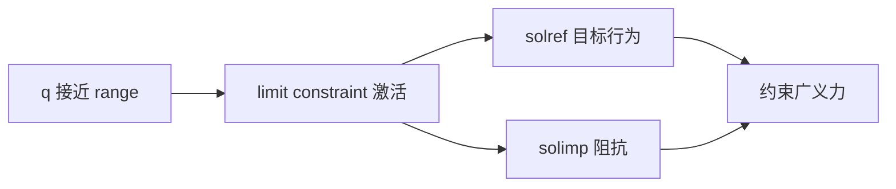
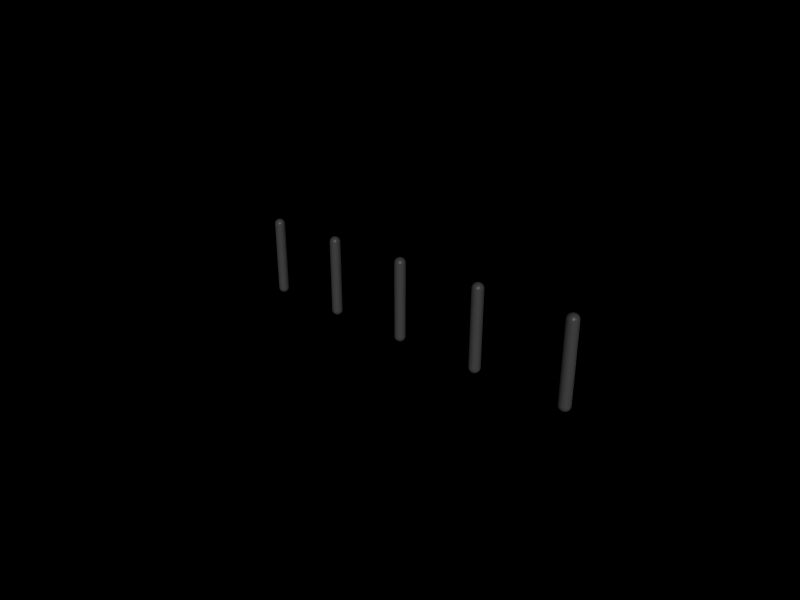

# 第 8 章　关节限位、摩擦、弹簧与反射惯量

> 本书示例代码仓库：[libing403/mujoco_tutorial](https://github.com/libing403/mujoco_tutorial)

一个 joint 不只是“能转动的轴”。它还携带零位、范围、弹簧、黏性阻尼、干摩擦和附加惯量。这些参数决定无控制时的被动行为，也决定控制增益是否能从仿真迁移到真机。本章用关节台架把每个机制分开观察。

## 8.1 学习目标

- 区分 joint position 属性与 DOF velocity/force 属性；
- 理解 limit 是软约束而非硬裁剪；
- 区分 damping、frictionloss 和 contact friction；
- 使用 stiffness、ref、springref 建立关节弹簧；
- 解释 armature 和减速器反射惯量；
- 用自由衰减与力矩阶跃实验识别参数。

## 8.2 joint 与 DOF 的两层属性

joint 描述配置坐标，DOF 描述速度和广义力。hinge/slide 各产生一个 DOF，ball 产生三个，free 产生六个。

| joint 层 | DOF 层 |
|---|---|
| type、pos、axis | damping、frictionloss、armature |
| limited、range、margin | solver friction 参数 |
| stiffness、ref、springref | 速度、力、惯性稀疏关系 |

运行时，joint 属性常在 `jnt_*` 数组，DOF 属性在 `dof_*` 数组。对 ball/free，多个 DOF 共享一个 joint，因此不能假设 joint ID 等于 DOF ID。

## 8.3 joint limit 是约束

hinge/slide 的 `range` 给出允许区间，ball joint 的 range 表达最大旋转角。`limited` 决定是否启用；compiler 的 autolimits 可根据 range 推断，但工程模型最好明确语义。

MuJoCo 不会在越界瞬间把 qpos 强行裁剪到边界。接近/越过 limit 时，会生成与接触同一框架下的软约束力。约束受：

- `margin`：距离边界多远开始激活；
- `solref`：参考加速度/时间常数和阻尼；
- `solimp`：误差相关阻抗；
- solver iteration/tolerance；
- timestep。

共同影响。



软限位允许有限误差，避免无限刚冲击要求极小时间步。真实机械臂也常有软件限位、缓冲区和机械止挡多层结构，可用不同机制表达。

## 8.4 damping：与速度成正比

对单 DOF，黏性阻尼力：

\[
\tau_d=-b v,
\]

`b=damping`。瞬时功率：

\[
P_d=\tau_dv=-bv^2\le0,
\]

因此被动 damping 只耗散能量。它在 `qfrc_passive` 中体现，并进入 implicit 积分器的速度 Jacobian。

自由转动惯量 `I` 在纯黏性阻尼下：

\[
I\dot v+bv=0,\qquad v(t)=v_0e^{-bt/I}.
\]

观察速度指数衰减可以估计 `b/I`，但只有已知有效惯量时才能分离 damping。

## 8.5 frictionloss：近似干摩擦

`frictionloss` 是速度方向相反、幅值近似恒定的摩擦约束。理想化形式：

\[
|\tau_f|\le f_{loss},
\]

滑动时抵抗运动，静止时可在范围内平衡外力。这与 `-b v` 不同：速度接近零时，黏性阻尼也接近零，而干摩擦仍可阻止启动。

frictionloss 由约束 solver 处理，受 solver 参数影响。它适合轴承/密封的库仑摩擦近似，但不包含 Stribeck、温度、方向不对称等真实细节。

### 不要混淆三种摩擦

| 参数 | 位置 | 物理含义 |
|---|---|---|
| joint/tendon `frictionloss` | DOF/肌腱约束 | 内部干摩擦 |
| joint `damping` | 被动力 | 黏性摩擦 |
| geom/pair `friction` | 接触约束 | 表面滑动/扭转/滚动摩擦 |

## 8.6 stiffness、ref 与 springref

标量 joint 的弹簧力近似：

\[
\tau_s=-k(q-q_s),
\]

`k=stiffness`，`q_s` 是 spring reference。`ref` 定义初始几何姿态对应的数值关节位置，`springref` 定义弹簧零力位置，它们可以不同。

例如机器人在 CAD 弯曲姿态装配，编码器读数为 90°，但扭簧自然长度对应 60°：可用 `ref=90°` 表达坐标零位关系，用 `springref=60°` 表达弹性平衡。

所有 joint/tendon 弹簧参考共同形成 `m->qpos_spring`。ball/free 的弹簧参考与配置流形有关，不应按标量公式逐分量解释。

## 8.7 armature：附加到 DOF 的惯量

`armature` 将一个非负惯量直接加到广义坐标质量矩阵对角线。对转动 DOF 单位为 `kg·m²`，平动 DOF 单位为 kg。

电机转子惯量 `J_m` 经理想减速比 `N` 反射到关节侧：

\[
J_{reflected}=N^2J_m.
\]

100:1 减速器会把转子惯量放大 10,000 倍，因此小转子也可能显著影响关节加速度。armature 是这一效应的紧凑近似。

对给定净力矩：

\[
\dot v=M_{effective}^{-1}\tau.
\]

armature 增大，初始加速度下降。它不直接耗散能量，所以无外力时不会让已有速度衰减。

## 8.8 被动力在 mjData 中的位置

执行 `mj_forward` 后：

- `qfrc_passive`：joint/tendon spring、damping、部分流体/被动插件力；
- frictionloss：属于约束力，不应简单只在 qfrc_passive 中寻找；
- limit：约束系统贡献；
- `qfrc_bias`：重力、科氏和离心等偏置力；
- `qfrc_actuator`：执行器映射后的广义力；
- `qfrc_applied`：用户直接写入的广义力。

诊断关节为什么运动时，应按力来源逐项查看，不能只看 ctrl。

## 8.9 独立实验：五个关节台架

```bash
cd examples/19_joint_passive
cmake -S . -B build
cmake --build build
./build/demo model.xml
```

模型在零重力下放置五个相同刚体：

1. plain：无阻尼、无摩擦、无弹簧；
2. damped：`damping=1`；
3. dry：`frictionloss=0.5`；
4. spring：`stiffness=5`；
5. armature：`armature=1`。

实验 A 给前四个 joint 相同 `q=0.5 rad, v=1 rad/s`，自由演化 2 s：

- plain 速度保持近似不变；
- damped 速度指数衰减；
- dry 在有限时间附近停止；
- spring 围绕 spring reference 振荡。

实验 B 重置后，对 plain 和 armature 同施 1 N·m、持续 0.2 s。armature joint 的速度明显更小，展示反射惯量而非耗散。

<!-- EMBEDDED_EXAMPLE_BEGIN: 19_joint_passive -->
### 可视化运行与效果

```bash
../../mujoco-3.11.0/bin/simulate model.xml
```

该命令使用发布包自带的官方 `simulate` 界面，可暂停、单步、施加扰动并开启接触等可视化标志。



*19_joint_passive 的真实 MuJoCo 原生渲染结果。*

### 实验完整源码

以下文件与 `examples/19_joint_passive/` 中可直接编译的版本一致。

#### 模型文件：`model.xml`

```xml
<mujoco model="joint_passive_bench">
  <compiler angle="radian"/>
  <option timestep="0.001" gravity="0 0 0" integrator="implicitfast"/>
  <default>
    <joint axis="0 1 0"/>
    <geom type="capsule" fromto="0 0 0 0 0 -.4" size=".03" mass="1" contype="0" conaffinity="0"/>
  </default>
  <worldbody>
    <body pos="-1 0 1"><joint name="plain"/><geom/></body>
    <body pos="-.5 0 1"><joint name="damped" damping="1"/><geom/></body>
    <body pos="0 0 1"><joint name="dry" frictionloss=".5"/><geom/></body>
    <body pos=".5 0 1"><joint name="spring" stiffness="5" springref="0"/><geom/></body>
    <body pos="1 0 1"><joint name="armature" armature="1"/><geom/></body>
  </worldbody>
</mujoco>
```

#### 程序源码：`main.cc`

```cpp
#include <cstdio>
#include <cstdlib>
#include <mujoco/mujoco.h>

int main(int argc, char** argv) {
  if (argc != 2) {
    std::fprintf(stderr, "用法: %s model.xml\n", argv[0]);
    return EXIT_FAILURE;
  }
  char error[1024] = {0};
  mjModel* m = mj_loadXML(argv[1], NULL, error, sizeof(error));
  if (!m) {
    std::fprintf(stderr, "无法加载 %s:\n%s\n", argv[1], error);
    return EXIT_FAILURE;
  }
  mjData* d = mj_makeData(m);
  const char* name[] = {"plain", "damped", "dry", "spring", "armature"};
  int qadr[5], dadr[5];
  for (int i = 0; i < 5; ++i) {
    int joint = mj_name2id(m, mjOBJ_JOINT, name[i]);
    qadr[i] = m->jnt_qposadr[joint];
    dadr[i] = m->jnt_dofadr[joint];
  }

  for (int i = 0; i < 4; ++i) {
    d->qpos[qadr[i]] = 0.5;
    d->qvel[dadr[i]] = 1.0;
  }
  mj_forward(m, d);
  const mjtNum sample_time[] = {0.02, 0.2, 2.0};
  std::printf("free decay velocities:\n");
  std::printf("  %6s %10s %10s %10s %10s\n",
              "time", "plain", "damped", "dry", "spring");
  for (int s = 0; s < 3; ++s) {
    while (d->time < sample_time[s]) mj_step(m, d);
    std::printf("  %6.2f %10.6f %10.6f %10.6f %10.6f\n",
                d->time, d->qvel[dadr[0]], d->qvel[dadr[1]],
                d->qvel[dadr[2]], d->qvel[dadr[3]]);
  }

  mj_resetData(m, d);
  while (d->time < 0.2) {
    d->qfrc_applied[dadr[0]] = 1.0;
    d->qfrc_applied[dadr[4]] = 1.0;
    mj_step(m, d);
  }
  std::printf("same 1 N.m torque for 0.2 s:\n");
  std::printf("  plain    v=% .6f\n", d->qvel[dadr[0]]);
  std::printf("  armature v=% .6f\n", d->qvel[dadr[4]]);

  mj_deleteData(d);
  mj_deleteModel(m);
  return EXIT_SUCCESS;
}
```

#### 构建文件：`CMakeLists.txt`

```cmake
cmake_minimum_required(VERSION 3.16)
project(19_joint_passive LANGUAGES CXX)

set(CMAKE_CXX_STANDARD 17)
add_executable(demo main.cc)

set(MUJOCO_ROOT ${CMAKE_CURRENT_LIST_DIR}/../../mujoco-3.11.0)
target_include_directories(demo PRIVATE ${MUJOCO_ROOT}/include)
target_link_directories(demo PRIVATE ${MUJOCO_ROOT}/lib)
target_link_libraries(demo PRIVATE mujoco)
set_target_properties(demo PROPERTIES BUILD_RPATH ${MUJOCO_ROOT}/lib)
```
<!-- EMBEDDED_EXAMPLE_END: 19_joint_passive -->

## 8.10 参数辨识实验设计

### 估计 damping

解除控制、避开限位，给关节初速度，记录 `ln|v(t)|`。纯黏性模型中其斜率为 `-b/I`。用 CAD/逆动力学得到有效惯量后估 `b`。

### 估计 frictionloss

缓慢增加外力矩，观察开始持续运动的 breakaway torque；再用正反向恒速实验估计方向性。MuJoCo 的对称常幅模型可能无法拟合所有真实数据，应记录残差。

### 估计 stiffness 和 springref

在多个静态位置测恢复力矩：

\[
\tau(q)=-kq+kq_s.
\]

线性拟合斜率和截距。若出现迟滞/非线性，单一 stiffness 不足。

### 估计 armature

在接触和重力影响可控时施加已知力矩，测初始加速度。总有效惯量来自 link configuration-dependent inertia 加 armature；应在多个姿态拟合，避免把 link 惯量错误吸收到 armature。

## 8.11 限位与控制器的协作

不要依赖物理 limit 替代控制安全。推荐三层：

1. 轨迹规划范围：离机械限位保留裕量；
2. 控制器软限位：接近范围时降低目标速度/施加回退力；
3. MuJoCo joint limit：模拟最终机械止挡。

位置 servo 目标超出 range 时，执行器持续推向限位，产生大约束力和热负荷。仿真没有损坏零件不代表命令安全，应监控 actuator force、limit force 和饱和持续时间。

## 8.12 参数尺度与数值稳定

高 stiffness 与低惯量形成高自然频率：

\[
\omega_n=\sqrt{k/I},\qquad T_n=2\pi/\omega_n.
\]

timestep 必须足够解析最快重要动态。经验上每个周期只有几步远远不够；应做步长收敛。增加 damping 可以减少振荡，但不能修复错误的质量单位或不合理 stiffness。

极大 frictionloss 也会制造强约束，使 solver 更困难。若模型需要“锁死”关节，应考虑 equality、移除 joint 或明确的锁定机制，而不是无限增加摩擦。

## 8.13 常见错误

| 错误 | 后果 | 正确理解 |
|---|---|---|
| damping 当库仑摩擦 | 低速保持力不足 | frictionloss 负责干摩擦 |
| armature 当阻尼 | 期待速度衰减却没有 | armature 只增加惯量 |
| range 当硬裁剪 | 看到轻微越界就判 bug | limit 是软约束 |
| ref 与 springref 混用 | 零位和弹簧平衡错误 | 分别表达坐标参考与零力参考 |
| 用大 damping 修复控制振荡 | 掩盖增益/延迟问题 | 先分析闭环离散动态 |
| 忽略减速比平方 | 关节加速度过大 | 计算反射转子惯量 |

## 8.14 本章小结

- range/limit 属于位置约束，允许由 solver 参数决定的软误差。
- damping 与速度成正比，frictionloss 近似干摩擦。
- stiffness 围绕 springref 产生恢复力；ref 定义坐标参考。
- armature 增加质量矩阵对角项，不耗散能量。
- 被动力、约束力、偏置力、执行器力应分来源诊断。
- 参数应通过隔离台架辨识，并在真实任务中交叉验证。

## 8.15 练习

1. 转子惯量 `2e-5 kg·m²`、减速比 80，忽略效率时反射 armature 是多少？
2. 两个自由衰减关节初速度相同，一个指数趋零，一个近似线性减速到零，分别可能由什么主导？
3. joint `ref=1.0, springref=0.6`，运行时 `qpos=1.0` 时弹簧是否零力？
4. 为什么高 stiffness 的轻关节比同 stiffness 的重关节需要更小 timestep？
5. 如何区分位置 servo 推限位产生的 actuator force 与 limit constraint force？

## 8.16 参考答案

1. `80²×2e-5=0.128 kg·m²`。
2. 指数衰减对应黏性 damping；近似恒减速度并可静止保持对应 frictionloss。
3. 否。弹簧偏差是 `qpos-springref=0.4`；ref 只决定参考几何坐标关系。
4. `ω_n=√(k/I)`，惯量越小自然频率越高，最快时间尺度越短。
5. 分别查看 actuator 映射后的 `qfrc_actuator` 与约束系统中 limit 对应的 force/efc 数据，并做关闭 actuator 或扩大 range 的对照实验。
