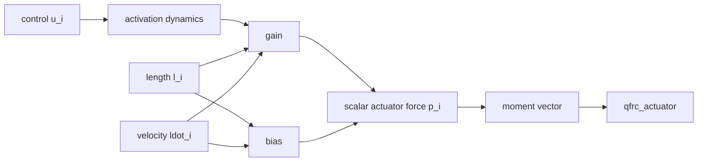
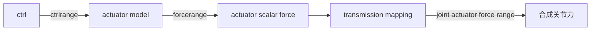
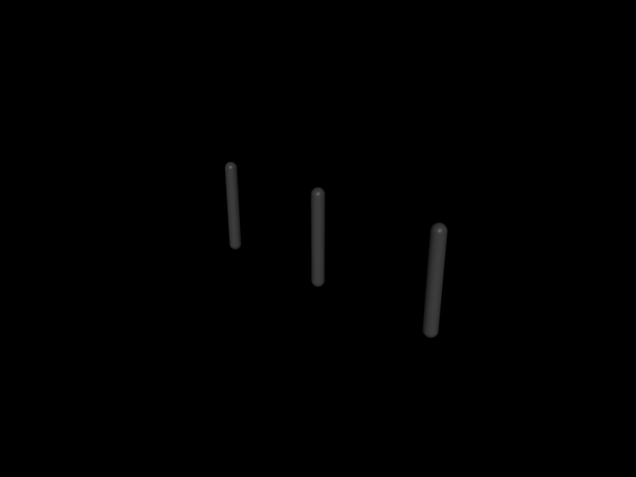

# 第 9 章　执行器统一模型：从 ctrl 到关节力

> 本书示例代码仓库：[libing403/mujoco_tutorial](https://github.com/libing403/mujoco_tutorial)

MuJoCo 的 actuator 不是“关节控制模式”枚举，而是一套可组合的传动、内部动力学和力生成模型。`d->ctrl[i]=1` 可能表示 1 N·m 电机命令、1 rad 位置目标、1 rad/s 速度目标，或肌肉激励。只有读懂 actuator 配置，控制数组才有物理意义。

## 9.1 学习目标

- 区分 joint、actuator、transmission 和 controller；
- 理解 actuator length、velocity、moment 与标量 force；
- 掌握通用 actuator 的 dynamics、gain、bias；
- 解释 motor、position、velocity shortcut 的底层行为；
- 区分 control limit、actuator force limit 和 joint actuator force limit；
- 从 `ctrl` 追踪到 `qfrc_actuator`。

## 9.2 actuator 不等于 joint

joint 定义运动自由度；actuator 通过某种 transmission 对系统施力。可能关系包括：

- 一个 motor 作用于一个 hinge；
- 多个 actuator 共同作用于同一 joint；
- 一个 tendon actuator 同时作用多个 joint；
- site transmission 产生笛卡尔方向的作用；
- body adhesion 对接触法向产生作用；
- 一个 joint 完全没有 actuator，成为被动自由度。

因此一般情况下：

```text
nu != nv != njnt
```

欠驱动人形 free base 有 6 个基座 DOF，却没有对应 actuator；肌腱手可能 `nu` 与关节数关系更复杂。

## 9.3 三段统一结构



第 `i` 个 actuator 生成标量力：

\[
p_i=g_i(l_i,\dot l_i,a_i,u_i)\,w_i+b_i(l_i,\dot l_i,a_i,u_i),
\]

其中 `w` 可能是 ctrl 或 activation。再通过 transmission moment 映射到广义力：

\[
\tau=\sum_i J_i(q)^T p_i.
\]

对简单 joint motor，moment 近似由 gear 指定；对 spatial tendon，moment 是 tendon 长度对 q 的梯度，随构型变化。

## 9.4 transmission：力作用在哪里

### joint / jointinparent

标量 joint transmission 最常见。对 hinge，gear 缩放力矩；对 slide，缩放线力。ball/free 的 gear 可表达六维轴方向，坐标解释应查 XML Reference。

### tendon

actuator force 作用于 tendon 长度坐标，经 tendon moment arms 分配到多个 DOF。适合差动、腱驱动手和肌肉。

### site

可定义作用于 site 的空间方向，并映射为 `J^T w`。适合缸、推杆和任务空间驱动近似。gear 的六维分量涉及力/力矩方向。

### body / adhesion

用于附着或 body 相关作用。它们不是普通关节电机，控制解释依 transmission 类型。

## 9.5 actuator length、velocity 和 moment

MuJoCo 为每个 actuator 定义标量长度 `l_i(q)`：

- hinge joint actuator：通常与关节角和 gear 相关；
- slide：与位移相关；
- tendon：路径长度；
- site：由传动几何定义。

速度：

\[
\dot l_i=J_i(q)v,
\]

moment 行向量：

\[
J_i(q)=\frac{\partial l_i}{\partial q}
\]

以适合广义速度的切空间形式存储。运行时可查看 `actuator_length`、`actuator_velocity` 和稀疏 actuator moment 数据，诊断传动方向和力映射。

## 9.6 motor shortcut

最简单配置：

```xml
<motor joint="elbow" gear="1"/>
```

它通常展开为无 activation dynamics、固定 gain、零 bias 的 general actuator：标量 actuator force 与 ctrl 成比例。

在 `gear=1` 的标量 hinge 上，可近似理解为：

\[
\tau=u.
\]

但必须同时考虑 ctrl/force limit。若 gear 不为 1，ctrl 的单位不再直接是关节侧 N·m；真实电机还可能需要转矩常数、电流饱和、反电动势和减速器效率模型。

## 9.7 position shortcut

position servo 生成类似 PD 的 actuator force：

\[
p=k_p(u-l)-k_v\dot l.
\]

`ctrl` 是 actuator length 的目标，joint transmission/gear 会影响它与关节角的关系。MJCF 中 `kp`、`kv` 或 timeconst/dampratio 等参数最终展开为 gain/bias。

position actuator 是引擎内部伺服器，不是“直接把 qpos 设置为目标”。它仍通过有限力驱动动力学，受惯量、重力、接触、饱和和时间步影响。

若 position actuator 只给 `kp` 不给足够速度阻尼，系统会振荡。`kv` 的临界阻尼值依有效惯量和构型变化，不能用一个常数在所有姿态精确临界。

## 9.8 velocity shortcut

velocity servo 典型形式：

\[
p=k_v(u-\dot l).
\]

`ctrl` 是目标 actuator velocity。它不保持位置；达到目标速度后若没有外界平衡，关节继续运动。使用时必须配合 joint range、上层轨迹或位置环。

## 9.9 ctrlrange 与三个限幅层次

### control limit

`ctrllimited/ctrlrange` 限制 `d->ctrl[i]` 进入 actuator 模型的数值。对 position actuator，它限制目标位置范围，不直接限制输出力。

### actuator force limit

`forcelimited/forcerange` 限制 actuator 的标量 force `p_i`。经 gear/moment 映射后的关节广义力范围会变化。

### joint actuator force limit

多个 actuator 共同作用一个 joint 时，可限制它们合成到 joint 的 actuator force。它更接近“这个关节总电机力矩不得超过额定值”。



三个范围的单位和物理意义不同。一个 position servo 即使目标在 ctrlrange 内，若误差大仍可能需要 forcerange 限力。

## 9.10 独立实验：同一个 ctrl=1 的三种含义

```bash
cd examples/20_actuator_shortcuts
cmake -S . -B build
cmake --build build
./build/demo model.xml
```

零重力模型包含三个相同 hinge：

- motor：`ctrl=1` 是直接标量驱动力；
- position：`ctrl=1` 是 1 rad 目标；
- velocity：`ctrl=1` 是 1 rad/s 目标。

程序持续 1 s 写入三个相同数值，并在 0.1、0.5、1.0 s 打印 qpos、qvel、actuator force 和映射后的 DOF force。

预期：motor 不断加速；position 接近 1 rad 后速度下降；velocity 接近 1 rad/s 后继续匀速改变位置。这证明 ctrl 数组没有统一物理单位。

<!-- EMBEDDED_EXAMPLE_BEGIN: 20_actuator_shortcuts -->
### 可视化运行与效果

```bash
../../mujoco-3.11.0/bin/simulate model.xml
```

该命令使用发布包自带的官方 `simulate` 界面，可暂停、单步、施加扰动并开启接触等可视化标志。



*20_actuator_shortcuts 的真实 MuJoCo 原生渲染结果。*

### 实验完整源码

以下文件与 `examples/20_actuator_shortcuts/` 中可直接编译的版本一致。

#### 模型文件：`model.xml`

```xml
<mujoco model="actuator_shortcuts">
  <compiler angle="radian"/>
  <option timestep="0.001" gravity="0 0 0" integrator="implicitfast"/>
  <default>
    <joint axis="0 1 0" damping=".1"/>
    <geom type="capsule" fromto="0 0 0 0 0 -.4" size=".03" mass="1" contype="0" conaffinity="0"/>
  </default>
  <worldbody>
    <body pos="-.6 0 1"><joint name="motor_joint"/><geom/></body>
    <body pos="0 0 1"><joint name="position_joint"/><geom/></body>
    <body pos=".6 0 1"><joint name="velocity_joint"/><geom/></body>
  </worldbody>
  <actuator>
    <motor name="motor" joint="motor_joint" gear="1"/>
    <position name="position" joint="position_joint" kp="20" kv="3"/>
    <velocity name="velocity" joint="velocity_joint" kv="3"/>
  </actuator>
</mujoco>
```

#### 程序源码：`main.cc`

```cpp
#include <cstdio>
#include <cstdlib>
#include <mujoco/mujoco.h>

int main(int argc, char** argv) {
  if (argc != 2) {
    std::fprintf(stderr, "用法: %s model.xml\n", argv[0]);
    return EXIT_FAILURE;
  }
  char error[1024] = {0};
  mjModel* m = mj_loadXML(argv[1], NULL, error, sizeof(error));
  if (!m) {
    std::fprintf(stderr, "无法加载 %s:\n%s\n", argv[1], error);
    return EXIT_FAILURE;
  }
  mjData* d = mj_makeData(m);
  for (int i = 0; i < m->nu; ++i) d->ctrl[i] = 1.0;

  const mjtNum sample[] = {0.1, 0.5, 1.0};
  std::printf("all controls are numerically 1, but have different meanings\n");
  for (int s = 0; s < 3; ++s) {
    while (d->time < sample[s]) mj_step(m, d);
    std::printf("t=%.1f\n", d->time);
    for (int i = 0; i < 3; ++i) {
      const char* name = mj_id2name(m, mjOBJ_ACTUATOR, i);
      std::printf("  %-8s q=% .5f v=% .5f actuator_force=% .5f dof_force=% .5f\n",
                  name, d->qpos[i], d->qvel[i],
                  d->actuator_force[i], d->qfrc_actuator[i]);
    }
  }

  mj_deleteData(d);
  mj_deleteModel(m);
  return EXIT_SUCCESS;
}
```

#### 构建文件：`CMakeLists.txt`

```cmake
cmake_minimum_required(VERSION 3.16)
project(20_actuator_shortcuts LANGUAGES CXX)

set(CMAKE_CXX_STANDARD 17)
add_executable(demo main.cc)

set(MUJOCO_ROOT ${CMAKE_CURRENT_LIST_DIR}/../../mujoco-3.11.0)
target_include_directories(demo PRIVATE ${MUJOCO_ROOT}/include)
target_link_directories(demo PRIVATE ${MUJOCO_ROOT}/lib)
target_link_libraries(demo PRIVATE mujoco)
set_target_properties(demo PROPERTIES BUILD_RPATH ${MUJOCO_ROOT}/lib)
```
<!-- EMBEDDED_EXAMPLE_END: 20_actuator_shortcuts -->

## 9.11 从 ctrl 到 qfrc_actuator 的诊断链

遇到“电机有命令但关节不动”，按顺序检查：

1. `nu` 和 actuator name/ID 是否正确；
2. `ctrl[i]` 是否被 ctrlrange 截断；
3. activation 是否随 control 更新；
4. `actuator_force[i]` 是否被 forcerange 限制；
5. actuator moment 是否在当前构型接近零；
6. `qfrc_actuator[dof]` 是否映射到预期 DOF；
7. bias/passive/constraint force 是否抵消它；
8. joint 是否已顶到 limit 或受 equality/contact 锁定。

只打印 ctrl 无法判断执行器是否真正做功。

## 9.12 actuator group 与运行时禁用

actuator 可分 group，并通过 option 的 actuator disable group 在运行时禁用一组驱动。它适合比较不同控制层、模拟一组电机失效或关闭辅助 actuator。

禁用意味着引擎不生成该组 actuator force，不等于把 ctrl 清零或删除传动。记录实验时应保存 disable 状态，否则相同 ctrl 可能产生不同结果。

## 9.13 控制回调与显式循环

教学和多数应用可显式：

```cpp
while (...) {
  compute_control(m, d);  // 写 d->ctrl
  mj_step(m, d);
}
```

需要在引擎正确 stage 读取最新派生量时，可用 `mj_step1`/`mj_step2` 或全局 `mjcb_control`。callback 是进程级全局入口，多个模型和线程必须自行分发上下文，且不能抛出跨 C 边界异常。

## 9.14 真实电机模型的逐步增强

从简到繁：

1. ideal torque motor：ctrl 直接映射关节力矩；
2. 加 ctrl/force limit：电流与额定转矩；
3. 加 armature：转子反射惯量；
4. 加速度相关可用力矩：反电动势/电压限制；
5. 加 transmission efficiency、摩擦和回差；
6. 加 activation dynamics：电流环、液压/气动响应；
7. 加温度和持续功率限制（应用层或 plugin）。

模型复杂度应由任务驱动。低速站立可能 torque motor+limit 已足够，高速腿式运动则速度—力矩包络和延迟很重要。

## 9.15 常见错误

| 错误 | 后果 | 修复 |
|---|---|---|
| 假定 ctrl 单位统一 | 不同 actuator 命令错义 | 逐 actuator 记录语义/单位 |
| position actuator 当运动学赋值 | 目标有稳态误差或振荡 | 理解它生成有限力 |
| 只设 ctrlrange 当力矩限制 | servo 仍输出大力 | 同时配置 forcerange/关节限力 |
| gear 只理解为减速比 | site/tendon 映射错误 | 按 transmission 查定义 |
| actuator ID 当 joint ID | 控制错通道 | 用 trnid/moment/name 建映射 |
| 只观察 ctrl | 忽略饱和和零 moment | 查看 actuator_force/qfrc_actuator |

## 9.16 本章小结

- actuator 通过 transmission 对系统施力，与 joint 不一一对应。
- 通用模型由 activation dynamics、gain/bias 和 moment mapping 组成。
- motor、position、velocity 是 general actuator 的快捷配置。
- ctrl 的单位由 actuator 类型和传动决定。
- control、actuator force、joint actuator force 是三个不同限幅层。
- 调试必须沿 ctrl→activation→actuator force→moment→qfrc_actuator 追踪。

## 9.17 练习

1. 两个 gear 分别为 50 和 100 的 motor，若标量 actuator force 相同，理想关节力矩比是多少？
2. position actuator `ctrlrange=[-1,1]`、没有 forcerange，能否保证关节力矩不超过 20 N·m？
3. velocity actuator 达到目标速度后为什么位置仍变化？
4. 一个 tendon actuator 当前 moment arm 为零，即使 actuator_force 非零，目标 joint 会怎样？
5. 为真实机械臂电机列出从 datasheet 映射到 MuJoCo 的最小参数集合。

## 9.18 参考答案

1. 在相同标量 joint transmission 约定下约为 1:2；还需确认 gear 符号和 actuator force limit 所在侧。
2. 不能。ctrlrange 只限制位置目标；误差和 kp 可产生任意更大的力，需 forcerange 或 joint actuator force range。
3. velocity servo 只调速度，不定义停止位置；零误差时保持非零目标速度。
4. 对该 joint 的映射广义力为 moment×force，moment 为零时不产生关节力矩，可能是几何奇异位形。
5. 额定/峰值转矩、电流—转矩常数、减速比、转子惯量、速度—转矩/电压限制、效率、控制延迟和必要的摩擦参数。
