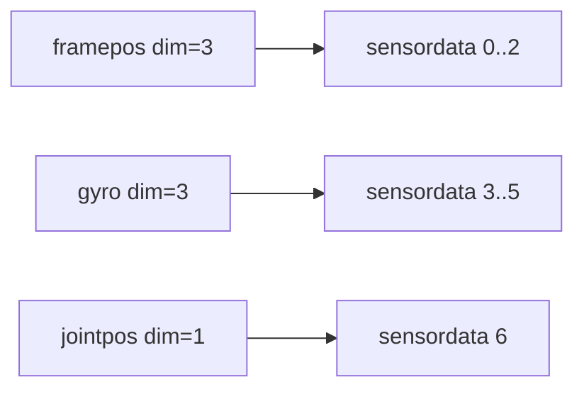
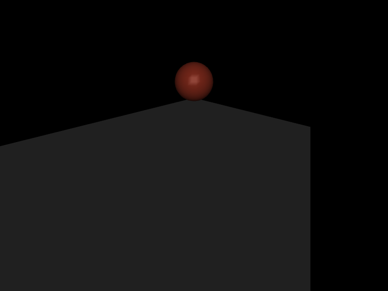
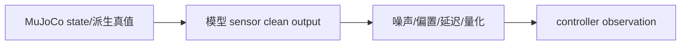

# 第 11 章　传感器、坐标系、延迟与机器人观测

> 本书示例代码仓库：[libing403/mujoco_tutorial](https://github.com/libing403/mujoco_tutorial)

传感器数据最危险的错误不是“读不到”，而是数值看似合理、坐标系或符号却错了。足底力在接触坐标系、IMU 量在 site 局部系、framepos 可能相对自定义参考系；如果接口没有写清单位、frame 和延迟，控制器可能在仿真中偶然工作，到真机立刻失败。

## 11.1 学习目标

- 使用 `sensor_adr/sensor_dim` 解包 `sensordata`；
- 按测量对象理解完整 sensor 元素族；
- 明确 IMU、F/T、frame、subtree 和 contact sensor 的坐标语义；
- 区分 accelerometer proper acceleration 与世界系运动学加速度；
- 理解 sensor stage、cutoff、noise、delay 和 history state；
- 设计 ground truth 与控制器 observation 的隔离层。

## 11.2 sensor 是模型元素，sensordata 是拼接结果

`m->nsensor` 是 sensor 元素数，`m->nsensordata` 是所有输出标量总数。第 `i` 个 sensor：

```cpp
int adr = m->sensor_adr[i];
int dim = m->sensor_dim[i];
const mjtNum* y = d->sensordata + adr;
```

例如第一个 framepos 输出 3 维，第二个 jointpos 输出 1 维，它们通常从 0 和 3 开始；但程序不能自行假定顺序和维度，必须读地址。



sensor 名称转 ID 仍使用 `mj_name2id(m,mjOBJ_SENSOR,name)`。启动时缓存 ID、adr、dim，并验证 dim 与应用接口一致。

## 11.3 按测量对象分类

### joint、tendon、actuator

- `jointpos/jointvel`：标量 hinge/slide 位置和速度；
- `ballquat/ballangvel`：ball 姿态和角速度；
- `tendonpos/tendonvel`：tendon 长度与速度；
- `actuatorpos/actuatorvel/actuatorfrc`：actuator length、velocity、force；
- `jointactuatorfrc/tendonactuatorfrc`：映射到 joint/tendon 的 actuator force；
- joint/tendon limit position、velocity、force：限位诊断。

不要用 jointpos sensor 读取 ball/free joint；它们的配置不是标量。

### site 局部惯性与力

- `accelerometer`：site 局部 proper acceleration；
- `velocimeter`：site 局部线速度；
- `gyro`：site 局部角速度；
- `magnetometer`：局部磁场；
- `force/torque`：跨 site 截面的相互作用 wrench 分量。

IMU site 的方向就是传感器安装方向。把 site quat 写错 90°，输出仍连续合理，却会把重力投影到错误轴。

### frame sensor

`framepos/framequat/framexaxis/frameyaxis/framezaxis` 测对象 frame 位姿；`framelinvel/frameangvel/framelinacc/frameangacc` 测运动量。对象可为 body、geom、site、camera 等支持类型，并可指定参考对象。

frame sensor 适合仿真 ground truth、视觉标记和任务误差，不等同于真实机器人可以直接测到的量。

### subtree sensor

- `subtreecom`：某 body 子树质心位置；
- `subtreelinvel`：子树质心线速度；
- `subtreeangmom`：子树角动量。

它们对人形质心控制很有用，但真实系统需通过状态估计和模型计算得到。仿真控制器若直接使用，必须标注为 privileged observation。

### 几何、距离与相机

- `rangefinder`：从 site 沿指定局部方向发射射线；
- `camprojection`：对象在 camera 图像中的投影；
- `distance/normal/fromto`：几何距离、法向和最近点信息；
- `insidesite`：对象是否位于 site 定义区域。

射线通常只命中可碰撞/可射线检测的 geom 规则集合，需验证 group 和方向。rangefinder 输出不是完整深度图，而是一条测距射线。

### contact 与 tactile

- `touch`：聚合与 site 区域相关的法向接触作用；
- `contact`：按 body/geom/site 等条件匹配接触并输出指定信息；
- `tactile`：在表面网格上形成分布式触觉数据；
- collision distance/normal/fromto 类 sensor：直接观察几何关系。

复杂足底压力和手指触觉要明确空间采样、接触过滤与输出维度，不能只把单一 touch 值称为“六维力传感器”。

### 系统、能量与扩展

- `e_potential/e_kinetic`：系统能量；
- `clock`：仿真时间；
- `user`：由 callback 填充；
- `plugin`：扩展传感器。

## 11.4 accelerometer 为什么静止时读 9.81

加速度计测的是 proper acceleration，也就是非重力支撑力对应的局部加速度。静止放在桌面的 IMU 并非输出零：桌面对物体提供向上的支撑力，传感器读到约 `+g`；自由落体时 proper acceleration 接近零。

概念上：

\[
a_{proper}=R^T(a_{world}-g),
\]

还需考虑 site 相对质心的角加速度和向心项。`R` 将世界向量转到 site 局部系。

这解释了现有 `04_sensors` 实验中球落地静止后的典型输出：

```text
local_velocity = 0 0 0
local_accel    = 0 0 9.81
```

如果控制器期望世界系质心加速度，却直接读取 accelerometer，就混淆了物理定义和坐标系。

## 11.5 gyro 与 angular velocity

gyro 输出 site 局部角速度。body 的空间速度数组可能采用不同 frame/参考点和排列；不要从另一个数组截三个数就假定等价。

验证 gyro frame 的最小实验：设置一个 hinge 绕已知世界轴匀速旋转，选择两个相差 90° 安装姿态的 IMU site，检查输出如何旋转。这个实验比在完整人形上晃动躯干更容易定位轴和符号。

## 11.6 force/torque sensor 的截面概念

F/T sensor 绑定 site，测量通过该 site 所在截面传递的相互作用。site 通常放在父子结构的连接截面。测得的 force/torque 在 site 局部坐标表达，符号与“子树作用于父结构”或反向的约定必须通过已知载荷实验确认。

静态标定方法：

1. 在零姿态给末端挂已知质量；
2. forward/settle 后读取 sensor；
3. 将理论重力和力矩变换到 site frame；
4. 检查轴、符号和力矩参考点。

六维 wrench 变换不仅旋转力和力矩，改变参考点时还要加入：

\[
\tau_B=R\tau_A+r_{BA}\times (RF_A).
\]

只旋转 torque 而忘记力臂项，是足底和腕部传感器融合的常见错误。

## 11.7 sensor stage 与数据何时有效

传感器按所需信息在 position、velocity 或 acceleration stage 计算。framepos 只需位置阶段；gyro 需速度；accelerometer、force 等可能需更晚阶段。

调用：

- `mj_forward`：完成全部 forward pipeline 和 sensor 计算；
- `mj_step`：在推进过程中更新 sensor；
- `mj_forwardSkip(...,skipsensor)`：可选择跳过 sensor；
- 自定义 `mjcb_sensor`：只应在声明的 stage 填充相应 user sensor。

修改 qpos 后只调用 `mj_kinematics`，framepos 相关底层坐标可能更新，但不能假定所有 sensordata 已完整刷新。教学和普通应用优先 `mj_forward`。

## 11.8 cutoff、noise 和数据类型

sensor 可配置 cutoff 等输出处理。具体语义依 sensor datatype：real、positive、axis、quaternion 等。归一化或截断规则应查当前 XML Reference，不能把所有 sensor 当任意实数。

noise 参数用于描述测量噪声尺度，但应用层是否自动注入随机噪声、随机源如何控制，应严格按 3.11.0 文档/API 核对。工程上更推荐建立明确 observation pipeline：保存 clean sensor truth，再以可控 seed 添加 bias、white noise、random walk、quantization 和 dropout。

## 11.9 delay 与 history state

MuJoCo 3.11 的 sensor 建模包含 delay。延迟意味着当前输出对应历史时刻的测量，而引擎需要保存 history。它会扩大完整物理状态/仿真状态，影响：

- reset 后最初若干输出；
- state snapshot 和 rollout；
- 线性化状态维度或等效时序；
- 多传感器时间对齐。

若控制周期 1 ms、sensor delay 7.5 ms，不能只用整数步队列草率代替而不说明插值/取样规则。应以目标版本实现为准，并通过阶跃或已知正弦轨迹测量实际延迟。

## 11.10 独立实验：落球、IMU 与接触力

```bash
cd examples/04_sensors
cmake -S . -B build
cmake --build build
./build/demo model.xml
```

球使用 free joint，从 1 m 高处落下。模型配置：

- framepos：球 body 世界位置；
- velocimeter：IMU site 局部速度；
- accelerometer：IMU site proper acceleration。

程序仿真 2 s，按 `sensor_adr/dim` 通用解包，并调用：

```cpp
mj_contactForce(m, d, 0, wrench);
```

典型静止结果：球心高度约 0.1 m、速度约 0、accelerometer Z 约 9.81、第一接触法向力约 9.81 N。注意 `mj_contactForce` 返回接触 frame 中的 wrench，第一分量沿接触法向，并非总是世界 Z。

### 对照实验

1. 在球仍自由落体的前 0.2 s 读取 accelerometer，应接近零；
2. 把 IMU site 绕 X 轴旋转 90°，重力支撑读数转到另一个局部轴；
3. 将质量改为 2 kg，静止接触法向力约翻倍，但 accelerometer 仍约 9.81；
4. 把 framepos 改为相对另一个 reference frame，验证坐标变化。

<!-- EMBEDDED_EXAMPLE_BEGIN: 04_sensors -->
### 可视化运行与效果

```bash
../../mujoco-3.11.0/bin/simulate model.xml
```

该命令使用发布包自带的官方 `simulate` 界面，可暂停、单步、施加扰动并开启接触等可视化标志。



*04_sensors 的真实 MuJoCo 原生渲染结果。*

### 实验完整源码

以下文件与 `examples/04_sensors/` 中可直接编译的版本一致。

#### 模型文件：`model.xml`

```xml
<mujoco model="sensor_contact">
  <option timestep="0.002"/>
  <worldbody>
    <geom name="floor" type="plane" size="2 2 .1"/>
    <body name="ball" pos="0 0 1">
      <freejoint/>
      <geom name="ball_geom" type="sphere" size="0.1" mass="1" rgba=".9 .3 .2 1"/>
      <site name="imu" size="0.01"/>
    </body>
  </worldbody>
  <sensor>
    <framepos name="ball_position" objtype="body" objname="ball"/>
    <velocimeter name="local_velocity" site="imu"/>
    <accelerometer name="local_accel" site="imu"/>
  </sensor>
</mujoco>
```

#### 程序源码：`main.cc`

```cpp
#include <cstdio>
#include <cstdlib>
#include <mujoco/mujoco.h>

int main(int argc, char** argv) {
  if (argc != 2) {
    std::fprintf(stderr, "用法: %s model.xml\n", argv[0]);
    return EXIT_FAILURE;
  }
  char error[1024] = {0};
  mjModel* m = mj_loadXML(argv[1], NULL, error, sizeof(error));
  if (!m) {
    std::fprintf(stderr, "无法加载 %s:\n%s\n", argv[1], error);
    return EXIT_FAILURE;
  }
  mjData* d = mj_makeData(m);
  for (int k = 0; k < 1000; ++k) mj_step(m, d);

  std::printf("time=%.3f contacts=%d sensor_data=%lld\n", d->time, d->ncon,
              (long long)m->nsensordata);
  for (int i = 0; i < m->nsensor; ++i) {
    const char* name = mj_id2name(m, mjOBJ_SENSOR, i);
    int adr = m->sensor_adr[i], dim = m->sensor_dim[i];
    std::printf("%-12s =", name ? name : "(unnamed)");
    for (int j = 0; j < dim; ++j) std::printf(" % .5f", d->sensordata[adr+j]);
    std::printf("\n");
  }
  if (d->ncon) {
    mjtNum wrench[6];
    mj_contactForce(m, d, 0, wrench);
    std::printf("contact[0] frame force=(%.4f %.4f %.4f)\n", wrench[0], wrench[1], wrench[2]);
  }
  mj_deleteData(d);
  mj_deleteModel(m);
  return EXIT_SUCCESS;
}
```

#### 构建文件：`CMakeLists.txt`

```cmake
cmake_minimum_required(VERSION 3.16)
project(04_sensors LANGUAGES CXX)

set(CMAKE_CXX_STANDARD 17)
add_executable(demo main.cc)

set(MUJOCO_ROOT ${CMAKE_CURRENT_LIST_DIR}/../../mujoco-3.11.0)
target_include_directories(demo PRIVATE ${MUJOCO_ROOT}/include)
target_link_directories(demo PRIVATE ${MUJOCO_ROOT}/lib)
target_link_libraries(demo PRIVATE mujoco)
set_target_properties(demo PROPERTIES BUILD_RPATH ${MUJOCO_ROOT}/lib)
```
<!-- EMBEDDED_EXAMPLE_END: 04_sensors -->

## 11.11 ground truth、measurement 与 observation

建议应用层明确三层：



- truth：qpos、xpos、subtreecom 等引擎真值；
- clean measurement：按真实传感器可测量定义配置的 sensordata；
- observation：加入校准误差、噪声、延迟和丢包后交给控制器。

控制器若使用 truth，应显式标为 privileged，不能在 sim-to-real 评估中与真实可观测策略混为一谈。

## 11.12 人形机器人观测接口

典型接口至少记录：

| 信号 | frame | 单位 | 延迟/频率 |
|---|---|---|---|
| base orientation | world→IMU 或反向 | unit quaternion | IMU/估计器 |
| gyro | IMU local | rad/s | 高频 |
| accelerometer | IMU local proper acceleration | m/s² | 高频 |
| joint position/velocity | joint coordinate | rad, rad/s | 编码器 |
| foot wrench | foot sensor frame | N, N·m | F/T sensor |
| contact state | foot/geom | bool/probability | 估计结果 |

必须规定 quaternion 顺序、旋转方向、速度参考点和 wrench 正方向。最好为每个信号设计静态/单轴运动测试。

## 11.13 机械臂观测接口

- 编码器：注意 ref/零位和 gear 后的关节侧换算；
- wrist F/T：工具质量重力补偿、site frame、零偏；
- TCP pose：仿真真值或外部视觉估计，不要混用；
- actuator current/force：actuator force 与 joint torque 的 transmission 映射；
- collision/contact：可从接触遍历构建，也可用 contact/touch sensor。

工具更换后，F/T sensor 下游子树质量和质心改变，应更新补偿模型。

## 11.14 自定义 sensor 与 plugin

`sensor/user` 声明维度、datatype 和 needstage，应用在 `mjcb_sensor` 中填充对应 sensordata。callback 是全局函数指针，应：

- 根据 model/data 找到实例上下文；
- 只在正确 stage 计算；
- 不在高频路径反复分配；
- 不写其他 sensor 区域；
- 保持线程安全。

plugin sensor 更适合封装可复用设备模型和内部状态。若只是把已有 MuJoCo 字段组合成 observation，应用层函数通常更简单。

## 11.15 常见错误

| 错误 | 后果 | 修复 |
|---|---|---|
| 按 sensor ID 直接索引 sensordata | 多维 sensor 后错位 | sensor_adr/dim |
| 静止 accelerometer 期望 0 | 错判 IMU | 理解 proper acceleration |
| gyro 当世界系 | 姿态控制轴错 | 按 site frame 变换 |
| F/T torque 只旋转不平移 | 参考点力矩错误 | wrench 完整变换 |
| 控制器直接使用 subtreecom truth | sim-to-real 信息泄漏 | 状态估计/privileged 标记 |
| reset 不恢复 delay history | episode 初态不一致 | 完整 state specification |
| 只给噪声标准差，不给 seed/频谱 | 实验不可复现 | 明确随机过程和 seed |

## 11.16 本章小结

- sensordata 是拼接数组，必须由 sensor_adr/dim 解包。
- 任何观测都要说明对象、参考 frame、单位、符号和时间语义。
- accelerometer 测 proper acceleration，静止支撑时约为 g，自由落体约为 0。
- F/T 和 contact wrench 需要旋转及参考点变换。
- sensor 在不同 pipeline stage 计算；状态修改后用 forward 保证一致。
- delay/history 是仿真状态的一部分。
- truth、clean measurement 和 controller observation 应分层。

## 11.17 练习

1. sensor dim 依次为 3、4、1，三个 sensor 的 adr 应如何从 model 读取？为什么不应硬编码 0、3、7？
2. IMU 平放在静止桌面，局部 Z 轴向下，accelerometer Z 预期符号是什么？
3. 足底 frame 原点向前平移 0.1 m，竖直力 500 N 对新原点的 pitch torque 改变多少，符号如何确定？
4. 为什么自由落体 accelerometer 接近零，但世界系线加速度是重力？
5. 为 wrist F/T sensor 设计一个验证 frame 和符号的静态实验。

## 11.18 参考答案

1. 每个都直接读 `sensor_adr[i]` 和 `sensor_dim[i]`；include、插件、多输出类型或模型编辑都会改变布局。
2. 支撑 proper acceleration 在世界向上；局部 Z 向下时，该轴读数约为 `-9.81 m/s²`。
3. 幅值增加 `|r×F|=0.1×500=50 N·m`；符号由从旧原点到新原点的 r 与力方向按右手叉乘确定。
4. accelerometer 不直接测引力导致的坐标加速度，而测非重力支撑/惯性反作用；自由落体没有支撑力。
5. 固定机械臂，在传感器下游沿已知 site 轴挂已知质量，计算局部重力力和力臂矩，与输出逐轴对照，再改变安装姿态复测。
