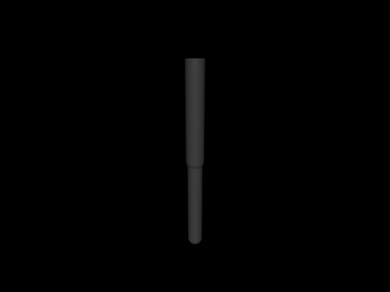

# 第 12 章　肌腱、差动传动、闭链与柔性体

> 本书示例代码仓库：[libing403/mujoco_tutorial](https://github.com/libing403/mujoco_tutorial)

机器人机构不全是串联刚体链。腱驱动手用一根绳索耦合多个关节，并联机构形成闭环，线缆和软组织会变形。MuJoCo 保持刚体运动学主干为树，再用 tendon、equality 和 flex 表达这些跨树或连续结构。

## 12.1 学习目标

- 区分 fixed tendon 和 spatial tendon；
- 从 tendon length Jacobian 推导关节广义力；
- 建模 site、wrap geom、pulley 和 tendon limit；
- 用 equality connect/weld/joint/tendon 闭合机构；
- 理解 soft equality 的误差和约束力；
- 选择 composite、flexcomp、flex/deformable 的建模层级。

## 12.2 tendon 是一个几何/组合坐标

每根 tendon 定义标量长度：

\[
l(q).
\]

其速度：

\[
\dot l=J_t(q)v,
\]

其中 `J_t` 是 tendon Jacobian/moment arm 行。若 tendon 受到标量力 `p`，虚功关系给出广义力：

\[
\tau=J_t(q)^T p.
\]

符号取决于长度定义和 actuator gear。控制程序不应从“拉绳应该屈曲”猜符号，而应在已知姿态施加单位 ctrl，读取 `qfrc_actuator` 验证。

```mermaid
flowchart LR
  Q[关节状态 q] --> L[tendon length l(q)]
  V[关节速度 v] --> TV[tendon velocity Jv]
  L --> F[tendon/actuator scalar force p]
  TV --> F
  F --> T[广义力 Jᵀp]
```

## 12.3 fixed tendon：关节坐标线性组合

fixed tendon 由若干标量 joint 项组成：

\[
l(q)=\sum_i c_i q_i+l_0.
\]

其 Jacobian 是常数系数：

\[
J_t=[c_1,c_2,\dots].
\]

用途：

- 两指同步或反向差动；
- 电机与多个关节的线性耦合；
- tendon length limit 约束组合坐标；
- 在 tendon 上布置 actuator、spring、damper 和 sensor。

fixed tendon 不表示真实三维绳路，没有 wrap、可视路径或构型相关 moment arm。

## 12.4 独立实验：单位肌腱力如何分配

```bash
cd examples/22_fixed_tendon
cmake -S . -B build
cmake --build build
./build/demo model.xml
```

模型定义：

\[
l=q_1-2q_2.
\]

设置 `q=(0.4,-0.1)`，理论 length 为 `0.6`；设置 `v=(0.3,0.2)`，理论 velocity 为 `-0.1`。tendon motor 产生单位标量力时：

\[
\tau=\begin{bmatrix}1\\-2\end{bmatrix}.
\]

程序打印 `ten_length`、`ten_velocity`、`actuator_force` 和 `qfrc_actuator`，把三个公式同时验证。这个最小实验是理解腱驱动手的基础。

<!-- EMBEDDED_EXAMPLE_BEGIN: 22_fixed_tendon -->
### 可视化运行与效果

```bash
../../mujoco-3.11.0/bin/simulate model.xml
```

该命令使用发布包自带的官方 `simulate` 界面，可暂停、单步、施加扰动并开启接触等可视化标志。



*22_fixed_tendon 的真实 MuJoCo 原生渲染结果。*

### 实验完整源码

以下文件与 `examples/22_fixed_tendon/` 中可直接编译的版本一致。

#### 模型文件：`model.xml`

```xml
<mujoco model="fixed_tendon_mapping">
  <compiler angle="radian"/>
  <option gravity="0 0 0"/>
  <worldbody>
    <body pos="0 0 1">
      <joint name="q1" axis="0 1 0"/>
      <geom type="capsule" fromto="0 0 0 0 0 -.4" size=".03" mass="1"/>
      <body pos="0 0 -.4">
        <joint name="q2" axis="0 1 0"/>
        <geom type="capsule" fromto="0 0 0 0 0 -.3" size=".025" mass=".5"/>
      </body>
    </body>
  </worldbody>
  <tendon>
    <fixed name="differential">
      <joint joint="q1" coef="1"/>
      <joint joint="q2" coef="-2"/>
    </fixed>
  </tendon>
  <actuator><motor name="tendon_motor" tendon="differential" gear="1"/></actuator>
</mujoco>
```

#### 程序源码：`main.cc`

```cpp
#include <cstdio>
#include <cstdlib>
#include <mujoco/mujoco.h>

int main(int argc, char** argv) {
  if (argc != 2) {
    std::fprintf(stderr, "用法: %s model.xml\n", argv[0]);
    return EXIT_FAILURE;
  }
  char error[1024] = {0};
  mjModel* m = mj_loadXML(argv[1], NULL, error, sizeof(error));
  if (!m) {
    std::fprintf(stderr, "无法加载 %s:\n%s\n", argv[1], error);
    return EXIT_FAILURE;
  }
  mjData* d = mj_makeData(m);
  d->qpos[0] = 0.4;
  d->qpos[1] = -0.1;
  d->qvel[0] = 0.3;
  d->qvel[1] = 0.2;
  d->ctrl[0] = 1.0;
  mj_forward(m, d);

  std::printf("l = q1 - 2*q2 = %.6f (expected 0.6)\n", d->ten_length[0]);
  std::printf("ldot = v1 - 2*v2 = %.6f (expected -0.1)\n", d->ten_velocity[0]);
  std::printf("actuator scalar force = %.6f\n", d->actuator_force[0]);
  std::printf("qfrc_actuator = (%.6f, %.6f), expected (1, -2)\n",
              d->qfrc_actuator[0], d->qfrc_actuator[1]);

  mj_deleteData(d);
  mj_deleteModel(m);
  return EXIT_SUCCESS;
}
```

#### 构建文件：`CMakeLists.txt`

```cmake
cmake_minimum_required(VERSION 3.16)
project(22_fixed_tendon LANGUAGES CXX)

set(CMAKE_CXX_STANDARD 17)
add_executable(demo main.cc)

set(MUJOCO_ROOT ${CMAKE_CURRENT_LIST_DIR}/../../mujoco-3.11.0)
target_include_directories(demo PRIVATE ${MUJOCO_ROOT}/include)
target_link_directories(demo PRIVATE ${MUJOCO_ROOT}/lib)
target_link_libraries(demo PRIVATE mujoco)
set_target_properties(demo PROPERTIES BUILD_RPATH ${MUJOCO_ROOT}/lib)
```
<!-- EMBEDDED_EXAMPLE_END: 22_fixed_tendon -->

## 12.5 spatial tendon：三维最短路径

spatial tendon 由路径元素构成：

- site：路径必经点；
- geom：绳索可绕过的 sphere/cylinder 等 wrap object；
- pulley：改变不同分支长度权重。

路径长度随 body 构型非线性变化，因此 moment arm 也是构型函数。典型应用包括肌肉绕骨、滑轮传动和跨多个 link 的绳索。

### via site

site 强制路径经过一点。site 顺序决定绳路，必须属于适当 body 并避免零长度相邻段。

### wrap geom

绳索在支持的 geom 外表面选择切线路径。接触/离开 wrap object 时，路径拓扑可能切换，moment arm 可能不光滑。用可视化显示 tendon 和 wrap 点，并在整个关节范围扫描 length/moment。

### sidesite

可引导绳索从 wrap geom 的指定侧经过，解决多个局部最短路径的二义性。错误 sidesite 会让绳索突然跳到另一侧。

### pulley

pulley 将路径分支按 divisor 加权，表达滑轮机械优势。力、长度和速度关系必须满足虚功，不能只把 divisor 当“画面上的滑轮数量”。

## 12.6 tendon 的被动与约束属性

tendon 与 joint 类似，可配置：

- `limited/range/margin`：长度限位；
- `stiffness/springlength`：围绕静息长度的弹力；
- `damping`：与 tendon velocity 相关；
- `frictionloss`：tendon 坐标干摩擦；
- `armature`：与 tendon velocity 相关的附加惯量；
- solver 参数：limit/friction 的软约束行为。

tendon spring force 经 `J_t^T` 映射到所有相关 DOF。一根弹簧可自然耦合多个关节，而不必手工逐关节施力。

## 12.7 tendon sensor 与执行器

常用 sensor：

- tendonpos/tendonvel；
- tendonlimitpos/vel/frc；
- tendonactuatorfrc。

tendon actuator 的标量 force 与 tendon force/关节广义力不是任意等同，需要考虑 gear、多个 actuator 合力和 moment mapping。腱驱动控制器应同时记录 tendon length、force、moment arm 和关节状态。

## 12.8 闭链为何不直接写成 body 环

树结构为每个 body 提供唯一父路径，使最小坐标动力学高效。若 body A 同时成为 B 和 C 的子节点，位姿定义不唯一。

闭链建模步骤：

1. 在真实闭环中选择一处“切开”；
2. 剩余连接形成 body tree；
3. 用 equality 把切开两端重新约束；
4. 设置一致初态并检查约束残差/力。

切口选择会影响坐标、稀疏性和数值条件。优先切在约束易表达、误差易观察的位置。

## 12.9 equality 类型

### connect

约束两个 body 上的锚点重合，限制三个平移方向但允许相对旋转。适合球铰式闭合。

### weld

约束相对位置和姿态，近似把两个 body 焊接。可用 relpose 定义目标相对位姿。姿态误差使用 quaternion 相关表示，约束维度和缩放需查计算文档。

### joint

用多项式关系耦合两个标量 joint，例如：

\[
q_2=q_{20}+a_0+a_1(q_1-q_{10})+a_2(q_1-q_{10})^2+\cdots.
\]

适合齿轮、凸轮的低阶近似。线性 gear coupling 是最常用情形。

### tendon

约束两根 tendon 长度之间的多项式关系，适合传动闭合。

### flex/flexvert/flexstrain

约束柔性对象的整体或局部自由度/应变，用于固定、耦合和控制变形。

## 12.10 equality 是软约束

约束误差 `r(q)` 不一定严格为零。solver 通过 `solref/solimp` 产生修正力，在稳定、精度与计算成本间平衡。

过硬 equality 的风险：

- timestep 无法解析快速修正；
- 初始不一致产生巨大冲击力；
- 多个冗余约束导致病态；
- 与 joint limit/contact 冲突；
- 迭代 solver 难以收敛。

闭链验证应同时看几何 closure error、constraint force、solver residual 和步长收敛，而不是只看机构是否“没有散架”。

## 12.11 equality 激活与运行时切换

equality 可由模型初始 active 属性和运行时数据状态控制。它可用于抓取后闭合连接、机构锁止或分阶段装配。

突然启用一个误差很大的 weld 会注入巨大约束冲量。正确流程是先把两端引导到接近目标相对位姿，再启用，或选择足够柔软的过渡参数。

## 12.12 flex 与 deformable

flex 由顶点、边以及三角形/四面体等单元描述，可形成：

- 1D：绳、线缆；
- 2D：布、膜；
- 3D：可变形实体。

顶点可由 body 运动或自身自由度驱动；edge/elasticity 参数表达拉伸、弯曲或体材料响应；contact 控制与刚体/自身碰撞；pin 固定部分顶点；skin 提供平滑视觉表面。

柔性仿真成本随顶点、单元和接触增长。建模顺序：

1. 极粗网格验证尺寸、密度和边界；
2. 无接触验证材料振动/静态变形；
3. 加与刚体接触；
4. 必要时开启自碰撞；
5. 做网格与 timestep 收敛。

## 12.13 composite 与 flexcomp

`composite` 和 `flexcomp` 是编译期生成器，按规则创建大量标准 body/joint/geom/site/skin 或 flex 元素。它们适合规则网格、绳、布、box/ellipsoid 集合等。

生成器不是新的运行时物理类型；编译后仍落到普通 model 数组。调试时应：

- 保存规范化/展开模型；
- 检查生成元素数量和名称；
- 显示 joint、contact 和 inertia；
- 从低分辨率开始。

程序化但不规则的地形/生物结构更适合 mjSpec，后续专篇讲解。

## 12.14 柔性材料参数与单位

材料参数必须与几何维度、密度和单元离散一致。把现实 Young's modulus 直接填入一个粗糙网格，不保证宏观响应自动正确；具体 flex elasticity 参数化和有限元形式应按官方计算/XML Reference。

验证可使用：

- 悬臂端点静态挠度；
- 自由振动固有频率；
- 拉伸力—位移曲线；
- 网格加密收敛；
- 能量和阻尼响应。

接触柔度与材料内部柔度是不同机制。一个软体内部很软，但接触约束也可能配置得很硬，反之亦然。

## 12.15 mocap body 与软连接

mocap body 位于静态树，运行时位姿由 `mocap_pos/mocap_quat` 指定。常用软 weld 将动态 body 拉向 mocap target，形成可交互拖动或外部运动捕捉驱动。

它不是普通 position actuator：误差通过 equality constraint 产生空间约束力。weld 参数决定跟踪柔度，mocap 位姿跳变同样可能产生大冲击。

## 12.16 人形与机械手应用

### 腱驱动手

fixed tendon 表达线性差动，spatial tendon 表达绕滑轮/指骨路径；muscle/motor 作用 tendon。必须扫描全工作区的 length 和 moment arm，检查无意松弛、路径跳变和奇异点。

### 人形线缆和柔顺结构

多数控制研究可先将线缆质量/弹性等效为 joint 被动参数，只有线缆碰撞、摆动或精确张力重要时才显式 tendon/flex。过度建模会显著增加求解成本。

### 并联机构

选择树切口，用 equality closure；将真实执行器放在正确主动 joint/tendon 上。不要给所有树关节都加 actuator，否则会把被动闭链错误变成过驱动系统。

## 12.17 常见错误

| 错误 | 后果 | 修复 |
|---|---|---|
| tendon force 直接当某关节力矩 | 忽略 moment arm | 用 `J_t^T p` |
| fixed tendon 当真实绳路 | 无 wrap/构型变化 | 使用 spatial tendon |
| wrap sidesite 错误 | 路径跳侧 | 可视化并扫描工作区 |
| body tree 直接形成环 | 模型无法编译 | 树 + equality |
| 闭链初态不闭合 | 启动巨大约束力 | 构造一致 keyframe |
| equality 无限硬 | solver 病态/小步长 | 合理 solref/solimp |
| 柔性体一开始高分辨率自碰撞 | 性能和调参失控 | 分阶段增加复杂度 |
| mocap target 瞬移 | 约束冲击 | 平滑目标或柔软过渡 |

## 12.18 本章小结

- tendon 定义标量长度坐标，力通过长度 Jacobian 转为广义力。
- fixed tendon 是 joint 线性组合；spatial tendon 是三维路径。
- tendon 可拥有 limit、spring、damping、friction、armature、sensor 和 actuator。
- 刚体主干必须是树，闭链用 equality 补回。
- equality 是软约束，应验证 closure error、force 和 solver 残差。
- flex 表达可变形对象，composite/flexcomp 是编译期生成器。

## 12.19 练习

1. `l=2q1-0.5q2`，tendon force 为 10 N，忽略 gear 时两关节广义力是多少？
2. fixed tendon 能否表达绳索绕圆柱后 moment arm 随角度变化？
3. 四连杆切开一个转动副后，connect 和 weld 哪个更可能表达原转动副？为什么？
4. 为什么启用一个相对位姿误差 20 cm 的 weld 可能让仿真爆发大速度？
5. 柔性悬臂网格加密后端点挠度一直变化，应否相信当前材料参数？

## 12.20 参考答案

1. `τ=Jᵀp=[2,-0.5]ᵀ×10=[20,-5]`，单位按 joint 类型为 N·m 或 N。
2. 不能，fixed Jacobian 系数恒定；使用 spatial tendon 和 wrap geom。
3. connect 只约束锚点平移重合、保留相对旋转，更接近转动副闭合；weld 会同时锁死姿态。
4. 软约束会尝试在其时间常数内修正巨大误差，生成大约束力/冲量；应先对齐或渐进启用。
5. 不应。结果尚未网格收敛，当前离散或参数解释不足；继续做分辨率、timestep 和解析/实验基线对照。
