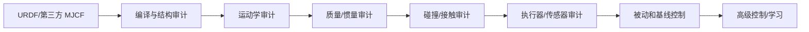
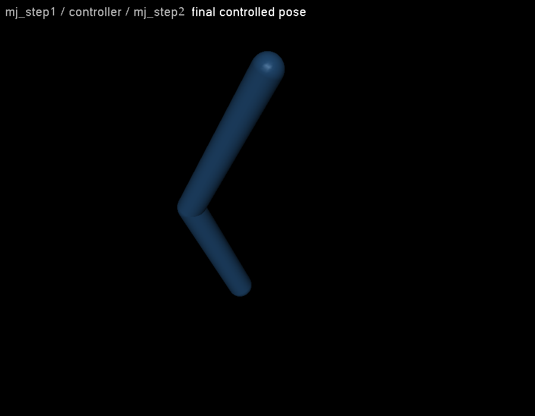
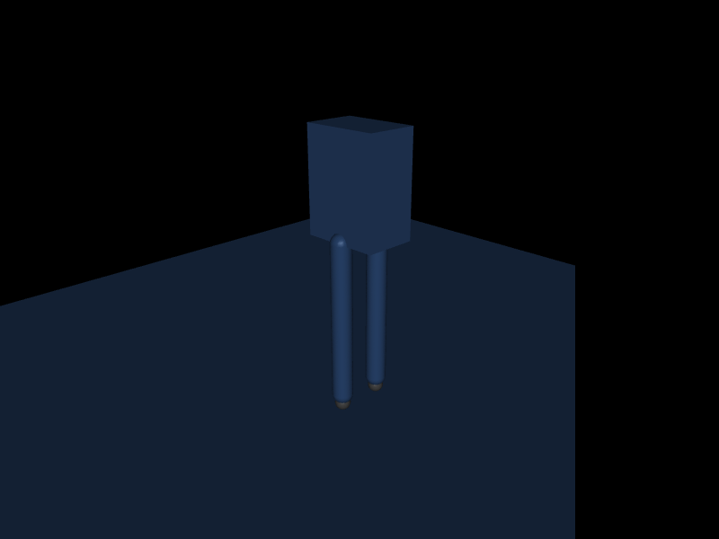

# 第 13 章　URDF 导入、模块化 MJCF 与机器人模型审计

拿到一个机器人 URDF 并成功加载，不代表拥有可用于动力学和控制的 MuJoCo 模型。URDF 擅长描述 link/joint 和视觉资产，但无法完整表达 MuJoCo 的接触、软约束、执行器、传感器、default、tendon、flex 和 solver 语义。工程流程应把导入视为迁移起点，再通过量化审计建立可信基线。

## 13.1 学习目标

- 理解 URDF 与 MJCF 的表达差异；
- 审计单位、坐标、质量、质心和惯量；
- 将 visual/collision、actuator、sensor 和 keyframe 补入导入模型；
- 组织可复用的模块化 MJCF；
- 安全使用 MuJoCo Menagerie 等模型库；
- 编写启动时模型审计器，让错误尽早失败。

## 13.2 URDF 能带来什么

典型 URDF 提供：

- link 父子结构；
- revolute/prismatic/fixed/floating 等 joint；
- joint origin、axis、limit；
- link inertial；
- visual/collision mesh 和 material；
- transmission/Gazebo 等生态扩展。

MuJoCo loader 会把支持部分转换并编译为 `mjModel`。compiler 的 URDF 相关选项可控制静态 link 融合、丢弃 visual、惯量处理等。

## 13.3 URDF 无法完整替代 MJCF

需要迁移/补充的典型内容：

| 机器人需求 | MJCF 机制 |
|---|---|
| 物理 timestep/integrator/solver | option |
| 接触阻抗和摩擦维度 | geom/pair solref/solimp/condim |
| 多层默认参数 | default class |
| general/muscle/tendon actuator | actuator/tendon |
| IMU、F/T、frame、contact sensor | sensor |
| 闭链和耦合 | equality |
| 标准站立/折叠姿态 | keyframe |
| mocap target、柔性体、插件 | mocap/flex/extension |
| 模型元数据 | custom numeric/text/tuple |

URDF transmission 也不保证能直接得到符合硬件语义的 MuJoCo actuator。电机力矩限幅、gear、rotor inertia 和控制方式应重新核对。

## 13.4 导入后的第一原则：不要立即调控制器

若模型的质量单位错 1000 倍，任何 PD 增益都没有意义。正确顺序：



每一层都应有独立实验，上一层失败时不要进入下一层。

## 13.5 结构审计

记录并与设计表比较：

```text
nbody, njnt, nq, nv, nu
ngeom, nsite, nsensor, ntendon, neq, nkey
```

对每个 joint：

- 名称是否唯一且符合接口规范；
- type、axis、range、ref 是否正确；
- qpos/dof 地址是否符合预期分组；
- damping/frictionloss/armature 是否有来源；
- 是否存在意外固定 link 融合。

浮动基座人形应明确 free joint，并验证 `nq=7+n_joint_position`、`nv=6+n_joint_dof`（若其余全为 hinge）。

## 13.6 坐标与运动学审计

准备一组人工可解释姿态：

- 全零/站立；
- 单关节 +10°；
- 左右对称姿态；
- 机械臂已知伸直/折叠位姿。

对每个姿态调用 `mj_forward`，检查：

- 关节旋转方向是否符合右手定则；
- body/site 世界位姿是否与 CAD/解析 FK 一致；
- 左右镜像是否合理；
- TCP、IMU、足底 frame 是否对齐；
- base quaternion 约定是否正确。

一次只动一个 joint 是最有效的轴向测试。完整步态动画可能掩盖某个轴符号错误。

## 13.7 SI 单位审计

MuJoCo 不在模型中强制声明单位，工程上通常使用：

| 量 | 单位 |
|---|---|
| 长度 | m |
| 质量 | kg |
| 时间 | s |
| 角度（运行时） | rad |
| 力/力矩 | N / N·m |
| 转动惯量 | kg·m² |

尺度关系帮助发现错误：长度缩放 `s`、密度不变时，质量随 `s³`、惯量随 `s⁵`。mm mesh 当 m 会导致灾难性质量/惯量；只缩 mesh 而未缩 inertial origin、joint origin 和 site 也会坐标错位。

## 13.8 质量、质心与惯量审计

对每个动态 body 输出：

```text
body_mass
body_ipos/body_iquat
body_inertia = (I1,I2,I3)
```

基本条件：

\[
m>0,\qquad I_1,I_2,I_3>0.
\]

刚体主惯量还应满足三角不等式：

\[
I_1+I_2\ge I_3,
\quad I_1+I_3\ge I_2,
\quad I_2+I_3\ge I_1.
\]

总质量应与 BOM/实测一致；subtree mass 能帮助验证手臂、腿和工具负载。质心应位于可解释区域，不能因为 inertial origin 错误落到 link 外数米。

### 惯量不只是合法，还要准确

正值和三角不等式只能排除明显非法值。一个统一小球惯量可能数学合法，却严重错估腿摆动和电机负载。至少比较关键 link 的 CAD inertia、摆动周期或 torque—acceleration 实验。

## 13.9 joint limit 与被动参数审计

- range 是否来自机械/软件限位，degree 是否已正确转换；
- continuous joint 是否真应无限旋转；
- damping/frictionloss 是测量值还是为了“稳住仿真”随意添加；
- armature 是否包含 gear² 反射转子惯量；
- stiffness/springref 是否表达真实弹性元件。

将每个 joint 移到 range 两端附近，检查 visual/collision 是否穿插以及 limit 方向。机械臂 wrist 连续关节误设有限范围会破坏规划；人形膝反向 range 会让站立姿态依靠极大约束力勉强存在。

## 13.10 visual/collision 审计

显示每个 group，检查：

- visual mesh 对齐且不参与不必要碰撞/惯量；
- collision primitives 覆盖关键表面但不过度膨胀；
- 初始 keyframe 无深度穿插；
- 相邻 link exclude 合理；
- 自碰撞没有被全局关闭；
- 足底、指尖、轮胎等任务接触面足够准确。

记录静止站立的 `ncon` 和接触 geom pair。接触数突然翻倍往往说明 visual geom 误参与或模型发生穿插。

## 13.11 actuator 审计

建立 actuator 表：

```text
name, type, transmission target, gear
ctrl semantics/range
activation type/range
force range
joint-side total force range
```

施加单位 ctrl，执行 `mj_forward`，读取 `actuator_force` 和 `qfrc_actuator`。对每个关节验证：

- 符号正确；
- 力矩幅值与 gear/limit 一致；
- 未驱动 DOF 没有意外力；
- 多 actuator 合力符合预期；
- tendon/site moment 在工作区不奇异。

人形 free base 的 6 个 DOF 通常不应有直接 motor。

## 13.12 sensor 审计

为每类 sensor 设计已知输入：

- joint encoder：单关节位姿；
- gyro：单轴恒速；
- accelerometer：自由落体和静止支撑；
- F/T：已知质量静载；
- foot contact：单脚加载；
- frame pose：解析 FK 姿态。

输出接口必须记录 sensor adr/dim、frame、单位、符号、delay 和频率。禁止仅凭名称 `imu_acc` 猜语义。

## 13.13 keyframe 与初态审计

每个 keyframe 应：

1. `mj_resetDataKeyframe`；
2. `mj_forward`；
3. 检查 qpos quaternion 单位范数；
4. 检查 joint range；
5. 检查深穿透和 equality error；
6. 检查 actuator activation/control；
7. 短时无控制 rollout，观察是否出现异常爆炸。

站立 keyframe 不一定是无控制平衡点。若没有重力补偿，人形开始下落是物理合理现象；模型错误与缺少控制要分开。

## 13.14 独立实验：浮动基座模型审计器

```bash
cd examples/23_model_audit
cmake -S . -B build
cmake --build build
./build/demo model.xml
```

示例是一个简化浮动基座双腿机器人。审计器：

- 打印规模并验证 free base 导致 `nq-nv=1`；
- 遍历 body，累计质量并检查正质量/主惯量三角不等式；
- 遍历 joint，打印 type、qpos/dof address、range；
- 检查每个 hinge 的 actuator；
- forward 后输出 base、两脚 site 和整体 subtree COM；
- 以非零退出码报告审计失败。

它不是通用静态分析器，而是展示“模型接口契约应变成可执行检查”。真实项目应把预期 body/joint/sensor 列表和质量范围写入版本化配置。

### 配套实验：用 `mj_step1/mj_step2` 显式插入控制器

`examples/08_split_step` 把一个仿真步拆成两阶段：先刷新位姿和传感器，再根据当前状态写入控制量并完成动力学。

```bash
cd examples/08_split_step
cmake -S . -B build
cmake --build build
./build/demo model.xml
```

<!-- EMBEDDED_EXAMPLE_BEGIN: 08_split_step -->
### 可视化运行与效果

```bash
./build/demo model.xml --view
```

窗口显示的是示例算法正在修改和推进的同一个 `mjData`。源码有意不封装 viewer：先用 GLFW 创建 OpenGL context，再初始化 `mjvScene/mjrContext`，用 `mjv_updateScene`读取算法使用的 `mjData`，再调用 `mjr_render` 和交换缓冲区，最后按创建的逆序释放资源。



*08_split_step 的真实 MuJoCo 原生渲染结果。*

### 实验完整源码

以下文件与 `examples/08_split_step/` 中可直接编译的版本一致。

#### 模型文件：`model.xml`

```xml
<mujoco model="two_link_arm">
  <compiler angle="radian"/>
  <option timestep="0.001" gravity="0 0 -9.81" integrator="implicitfast"/>
  <default>
    <joint axis="0 1 0" damping="0.2" limited="true" range="-3.14 3.14"/>
    <geom type="capsule" size="0.04" rgba="0.25 0.55 0.85 1"/>
    <motor ctrllimited="true" ctrlrange="-100 100"/>
  </default>
  <worldbody>
    <body name="upper" pos="0 0 1">
      <joint name="shoulder"/>
      <geom fromto="0 0 0 0 0 -0.5" mass="1.0"/>
      <body name="forearm" pos="0 0 -0.5">
        <joint name="elbow"/>
        <geom fromto="0 0 0 0 0 -0.4" mass="0.7"/>
        <site name="tool" pos="0 0 -0.4" size="0.025" rgba="1 0.2 0.1 1"/>
      </body>
    </body>
  </worldbody>
  <actuator>
    <motor name="shoulder_motor" joint="shoulder" gear="1"/>
    <motor name="elbow_motor" joint="elbow" gear="1"/>
  </actuator>
</mujoco>
```

#### 程序源码：`main.cc`

```cpp
#include <cstdio>
#include <cstdlib>
#include <cstring>
#define GLFW_INCLUDE_NONE
#include <GLFW/glfw3.h>
#include <mujoco/mujoco.h>

int main(int argc, char** argv) {
  bool view = argc == 3 && std::strcmp(argv[2], "--view") == 0;
  if (argc < 2 || argc > 3 || (argc == 3 && !view)) {
    std::fprintf(stderr, "用法: %s model.xml [--view]\n", argv[0]);
    return EXIT_FAILURE;
  }
  char error[1024] = {0};
  mjModel* m = mj_loadXML(argv[1], NULL, error, sizeof(error));
  if (!m) {
    std::fprintf(stderr, "无法加载 %s:\n%s\n", argv[1], error);
    return EXIT_FAILURE;
  }
  mjData* d = mj_makeData(m);
  const mjtNum target[2] = {0.5, -0.8};

  while (d->time < 1.0) {
    mj_step1(m, d);  // 此时最新的运动学和速度派生量可供控制器读取
    for (int i = 0; i < m->nu && i < 2; ++i) {
      d->ctrl[i] = 60*(target[i]-d->qpos[i]) - 6*d->qvel[i];
    }
    mj_step2(m, d);
  }
  std::printf("split-step final q=(%.5f %.5f), time=%.3f\n",
              d->qpos[0], d->qpos[1], d->time);
  if (view) {
    if (!glfwInit()) return EXIT_FAILURE;
    GLFWwindow* window=glfwCreateWindow(900,700,"08 split step",NULL,NULL);
    if (!window) { glfwTerminate(); return EXIT_FAILURE; }
    glfwMakeContextCurrent(window);
    mjvCamera cam; mjv_defaultCamera(&cam); mjv_defaultFreeCamera(m,&cam);
    mjvOption opt; mjv_defaultOption(&opt);
    mjvScene scene; mjv_defaultScene(&scene); mjv_makeScene(m,&scene,1000);
    mjrContext con; mjr_defaultContext(&con); mjr_makeContext(m,&con,mjFONTSCALE_150);
    while (!glfwWindowShouldClose(window)) {
      int width,height; glfwGetFramebufferSize(window,&width,&height);
      mjrRect viewport={0,0,width,height};
      mjv_updateScene(m,d,&opt,NULL,&cam,mjCAT_ALL,&scene);
      mjr_render(viewport,&scene,&con);
      mjr_overlay(mjFONT_NORMAL,mjGRID_TOPLEFT,viewport,
                  "mj_step1 / controller / mj_step2","final controlled pose",&con);
      glfwSwapBuffers(window); glfwPollEvents();
    }
    mjr_freeContext(&con); mjv_freeScene(&scene);
    glfwDestroyWindow(window); glfwTerminate();
  }
  mj_deleteData(d); mj_deleteModel(m);
  return EXIT_SUCCESS;
}
```

#### 构建文件：`CMakeLists.txt`

```cmake
cmake_minimum_required(VERSION 3.16)
project(08_split_step LANGUAGES CXX)

set(CMAKE_CXX_STANDARD 17)
add_executable(demo main.cc)

set(MUJOCO_ROOT ${CMAKE_CURRENT_LIST_DIR}/../../mujoco-3.11.0)
target_include_directories(demo PRIVATE ${MUJOCO_ROOT}/include ${MUJOCO_ROOT}/third_party/glfw/include)
target_link_directories(demo PRIVATE ${MUJOCO_ROOT}/lib ${MUJOCO_ROOT}/third_party/glfw/lib)
target_link_libraries(demo PRIVATE mujoco glfw)
set_target_properties(demo PROPERTIES BUILD_RPATH "${MUJOCO_ROOT}/lib;${MUJOCO_ROOT}/third_party/glfw/lib")
```
<!-- EMBEDDED_EXAMPLE_END: 08_split_step -->

<!-- EMBEDDED_EXAMPLE_BEGIN: 23_model_audit -->
### 可视化运行与效果

```bash
../../mujoco-3.11.0/bin/simulate model.xml
```

该命令使用发布包自带的官方 `simulate` 界面，可暂停、单步、施加扰动并开启接触等可视化标志。



*23_model_audit 的真实 MuJoCo 原生渲染结果。*

### 实验完整源码

以下文件与 `examples/23_model_audit/` 中可直接编译的版本一致。

#### 模型文件：`model.xml`

```xml
<mujoco model="floating_biped_lite">
  <compiler angle="radian"/>
  <option timestep="0.002"/>
  <default>
    <joint type="hinge" axis="0 1 0" limited="true" range="-1.5 1.5" damping=".2"/>
    <geom type="capsule" size=".04" rgba=".3 .5 .8 1"/>
    <motor ctrlrange="-50 50" ctrllimited="true"/>
  </default>
  <worldbody>
    <geom name="floor" type="plane" size="2 2 .1"/>
    <body name="torso" pos="0 0 1.1">
      <freejoint name="base"/>
      <geom type="box" size=".15 .10 .20" mass="8"/>
      <body name="left_thigh" pos="0 .09 -.2">
        <joint name="left_hip"/><geom fromto="0 0 0 0 0 -.3" mass="2"/>
        <body name="left_shin" pos="0 0 -.3">
          <joint name="left_knee" range="0 2.4"/><geom fromto="0 0 0 0 0 -.3" mass="1.5"/>
          <site name="left_foot" pos="0 0 -.34" size=".03"/>
        </body>
      </body>
      <body name="right_thigh" pos="0 -.09 -.2">
        <joint name="right_hip"/><geom fromto="0 0 0 0 0 -.3" mass="2"/>
        <body name="right_shin" pos="0 0 -.3">
          <joint name="right_knee" range="0 2.4"/><geom fromto="0 0 0 0 0 -.3" mass="1.5"/>
          <site name="right_foot" pos="0 0 -.34" size=".03"/>
        </body>
      </body>
    </body>
  </worldbody>
  <actuator>
    <motor name="left_hip_motor" joint="left_hip"/>
    <motor name="left_knee_motor" joint="left_knee"/>
    <motor name="right_hip_motor" joint="right_hip"/>
    <motor name="right_knee_motor" joint="right_knee"/>
  </actuator>
</mujoco>
```

#### 程序源码：`main.cc`

```cpp
#include <cstdio>
#include <cstdlib>
#include <mujoco/mujoco.h>

int main(int argc, char** argv) {
  if (argc != 2) {
    std::fprintf(stderr, "用法: %s model.xml\n", argv[0]);
    return EXIT_FAILURE;
  }
  char error[1024] = {0};
  mjModel* m = mj_loadXML(argv[1], NULL, error, sizeof(error));
  if (!m) {
    std::fprintf(stderr, "无法加载 %s:\n%s\n", argv[1], error);
    return EXIT_FAILURE;
  }
  mjData* d = mj_makeData(m);
  int failures = 0;
  std::printf("nbody=%lld njnt=%lld nq=%lld nv=%lld nu=%lld\n",
              (long long)m->nbody, (long long)m->njnt,
              (long long)m->nq, (long long)m->nv, (long long)m->nu);
  if (m->nq - m->nv != 1) { std::printf("FAIL: expected one free-base quaternion redundancy\n"); ++failures; }

  mjtNum total_mass = 0;
  for (int b = 1; b < m->nbody; ++b) {
    mjtNum mass = m->body_mass[b];
    const mjtNum* I = m->body_inertia + 3*b;
    const char* name = mj_id2name(m, mjOBJ_BODY, b);
    bool valid = mass > 0 && I[0] > 0 && I[1] > 0 && I[2] > 0 &&
                 I[0]+I[1] >= I[2] && I[0]+I[2] >= I[1] && I[1]+I[2] >= I[0];
    std::printf("body %-12s mass=%5.2f inertia=(%.4f %.4f %.4f) %s\n",
                name, mass, I[0], I[1], I[2], valid ? "OK" : "FAIL");
    total_mass += mass;
    if (!valid) ++failures;
  }
  std::printf("total moving-body mass = %.3f kg\n", total_mass);

  for (int j = 0; j < m->njnt; ++j) {
    const char* name = mj_id2name(m, mjOBJ_JOINT, j);
    std::printf("joint %-12s type=%d qadr=%d dadr=%d",
                name, m->jnt_type[j], m->jnt_qposadr[j], m->jnt_dofadr[j]);
    if (m->jnt_limited[j]) std::printf(" range=[%.2f %.2f]", m->jnt_range[2*j], m->jnt_range[2*j+1]);
    std::printf("\n");
  }

  mj_forward(m, d);
  int torso = mj_name2id(m, mjOBJ_BODY, "torso");
  int left = mj_name2id(m, mjOBJ_SITE, "left_foot");
  int right = mj_name2id(m, mjOBJ_SITE, "right_foot");
  std::printf("torso subtree COM=(%.3f %.3f %.3f)\n",
              d->subtree_com[3*torso], d->subtree_com[3*torso+1], d->subtree_com[3*torso+2]);
  std::printf("feet z: left=%.3f right=%.3f\n", d->site_xpos[3*left+2], d->site_xpos[3*right+2]);
  std::printf("audit result: %s\n", failures ? "FAIL" : "PASS");

  mj_deleteData(d);
  mj_deleteModel(m);
  return failures ? EXIT_FAILURE : EXIT_SUCCESS;
}
```

#### 构建文件：`CMakeLists.txt`

```cmake
cmake_minimum_required(VERSION 3.16)
project(23_model_audit LANGUAGES CXX)

set(CMAKE_CXX_STANDARD 17)
add_executable(demo main.cc)

set(MUJOCO_ROOT ${CMAKE_CURRENT_LIST_DIR}/../../mujoco-3.11.0)
target_include_directories(demo PRIVATE ${MUJOCO_ROOT}/include)
target_link_directories(demo PRIVATE ${MUJOCO_ROOT}/lib)
target_link_libraries(demo PRIVATE mujoco)
set_target_properties(demo PROPERTIES BUILD_RPATH ${MUJOCO_ROOT}/lib)
```
<!-- EMBEDDED_EXAMPLE_END: 23_model_audit -->

## 13.15 模块化 MJCF 结构

推荐把“机器人”和“场景”解耦：

```text
model/
├── robot.xml              # body tree 入口
├── defaults.xml
├── assets.xml
├── actuators.xml
├── sensors.xml
├── keyframes.xml
├── scene_flat.xml
├── scene_stairs.xml
└── assets/
```

同一 robot 可进入不同 scene；同一 scene 可 attach 不同工具。避免在 robot.xml 写固定地面和实验灯光，也避免在 scene 里重复机器人内部 actuator。

### 名称规范

例如：

```text
left_hip_yaw
left_foot_site
left_ankle_motor
imu_torso
```

左右前缀、元素后缀和层级应统一。名称是程序接口，修改需像 API breaking change 一样处理。

## 13.16 include、attach 与 replicate 的选择

- include：静态 XML 模块拼接，简单透明；
- attach/model asset：组合独立模型并处理名称前后缀，适合工具/机器人模块；
- replicate：规则复制对象并生成名称后缀；
- mjSpec：程序化生成、编辑、缩放和复杂组合。

不要用文本模板解决所有问题，也不要为简单 include 引入复杂生成器。选择能保持最终名称和资产引用可预测的最小机制。

## 13.17 使用 MuJoCo Menagerie

Menagerie 提供双足、人形、四足、机械臂、手、夹爪、无人机和生物模型，是学习和基准的重要来源。使用前检查：

- 模型许可证与资产许可证；
- 最低 MuJoCo 版本；
- README 中的已知限制；
- actuator 是 torque、position 还是其他语义；
- keyframe 与 scene 文件；
- mesh 和 collision 复杂度；
- 是否针对 MJX 提供专门 scene；
- 与真实硬件参数的差距。

“官方模型库”不代表每个参数都对你的硬件标定，也不代表可直接用于 sim-to-real。

## 13.18 从第三方模型建立派生版本

不要直接在上游目录无记录修改。建议：

1. 固定上游 commit/tag；
2. 保留原 LICENSE/NOTICE；
3. 记录补丁：惯量、collision、actuator、sensor、keyframe；
4. 建立自动审计输出；
5. 升级上游时重新应用并比较差异。

模型是代码。它需要 code review、版本、测试和 changelog。

## 13.19 常见错误

| 错误 | 后果 | 修复 |
|---|---|---|
| URDF 能加载就直接训练 | 学到错误动力学 | 分层审计 |
| 只看 visual 判断坐标 | joint/site 轴可能错 | 单轴 FK 数值测试 |
| 总质量正确就认为惯量正确 | 动态响应仍严重错误 | 逐 link COM/inertia |
| 所有关节自动加 motor | 被动/浮动 DOF 被驱动 | actuator 契约表 |
| Menagerie 当硬件数字孪生 | sim-to-real 偏差 | 对照 datasheet/实测 |
| 改元素顺序仍硬编码 ID | 控制错对象 | 名称解析+启动验证 |
| keyframe 能显示就认为平衡 | 无控制立即倒下 | 逆动力学/控制平衡检查 |

## 13.20 本章小结

- URDF 导入提供运动学起点，不能覆盖 MuJoCo 全部物理语义。
- 审计顺序是结构、运动学、惯量、碰撞、执行器、传感器、keyframe。
- 数学合法的惯量不一定物理准确，必须对照 CAD/BOM/实验。
- 模块化模型应分离 robot、scene、asset、actuator 和 sensor。
- 名称是应用 API，模型应有可执行接口契约。
- Menagerie 是高质量起点，仍需版本、许可证和硬件差异审计。

## 13.21 练习

1. 一个浮动基座、18 个 hinge 的机器人，预期 nq/nv 是多少？
2. 总质量正确但所有 link 惯量都缩小 100 倍，站立和摆腿会怎样？
3. 为什么只检查 XML 中 joint range 不足以保证单位正确？
4. 设计一个启动检查，证明 7 个机械臂 actuator 分别映射到预期 7 个 hinge。
5. 从 Menagerie 派生模型时，至少应记录哪些上游信息和本地修改？

## 13.22 参考答案

1. `nq=7+18=25`，`nv=6+18=24`。
2. 同样力矩产生过大角加速度，控制器显得异常强，碰撞和摆动频率失真；总质心静力可能仍看似正常。
3. URDF/MJCF 编译时的 angle 语义、源数据是否 degree/radian、ref 和运行时 API 单位都可能不同；需单关节数值/几何验证。
4. 对每个 actuator 读取 transmission target/单位 ctrl 后的 qfrc_actuator，确认只有目标 DOF 出现正确符号和幅值，并验证名称、type 和地址。
5. 上游仓库 URL、commit/tag、模型与资产许可证、MuJoCo 最低版本；本地对惯量、碰撞、actuator、sensor、keyframe、solver 和资产路径的全部修改及其验证结果。
