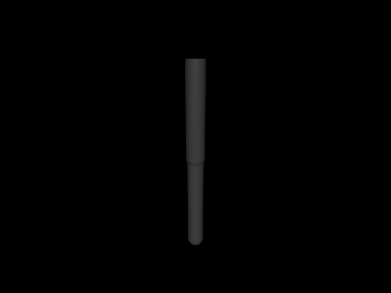

# 第 14 章　前向运动学、速度与 Jacobian

> 本书示例代码仓库：[libing403/mujoco_tutorial](https://github.com/libing403/mujoco_tutorial)

机器人控制的核心转换是：关节速度如何产生末端速度，末端力如何映射为关节力矩。Jacobian 同时回答这两个问题，也是逆运动学、操作空间控制、碰撞避障、质心控制和动力学线性化的基础。

## 14.1 学习目标

- 从 body tree 理解前向运动学递归；
- 正确读取 body、geom、site 的世界位姿；
- 区分线速度、角速度、空间速度和参考点；
- 使用 `mj_jacSite`、`mj_jacBody`、`mj_jacSubtreeCom`；
- 解释 `v_x=Jv` 与 `tau=J^T f`；
- 在配置流形上用中心有限差分验证 Jacobian。

## 14.2 前向运动学

给定广义位置 `q`，MuJoCo 沿运动学树从 world 向叶节点递归计算每个 body frame 的世界位姿：

\[
{}^WT_i(q)= {}^WT_{parent(i)}(q)\;{}^{parent}T_i(q_i).
\]

静态 body transform 与 joint transform 共同构成 `T_i`。结果包括：

| 对象 | 世界位置 | 世界姿态 |
|---|---|---|
| body frame | `xpos` | `xquat/xmat` |
| inertial frame/COM | `xipos` | `ximat` |
| geom frame | `geom_xpos` | `geom_xmat` |
| site frame | `site_xpos` | `site_xmat` |

数组中的矩阵是 3×3 行主序。不要把 `xmat` 当作 quaternion，也不要假定 body frame 就在 COM。

## 14.3 mj_kinematics 与 mj_forward

`mj_kinematics(m,d)` 执行位置运动学子阶段；`mj_comPos` 等后续函数继续计算质心相关量。`mj_forward` 完成整条 forward pipeline，包括运动学、速度、力、约束、加速度和传感器。

学习和普通应用：修改 qpos 后调用 `mj_forward` 最稳妥。性能敏感算法在明确依赖关系后，才调用低层 stage 函数或 skip-stage。

## 14.4 配置速度不是 qpos 的普通导数数组

广义速度 `v∈R^nv` 是配置流形的切向量：

\[
\dot q=N(q)v.
\]

对 hinge/slide，`N=1`；对 quaternion，q 有 4 个分量而角速度只有 3 个，因此不能用 `(q₂-q₁)/dt` 得到通用 qvel。

MuJoCo 提供：

```cpp
mj_integratePos(m, qpos, qvel, dt);
mj_differentiatePos(m, qvel, dt, qpos1, qpos2);
```

所有 IK、有限差分和状态误差代码都应沿这个接口推广到 free/ball joint。

## 14.5 点的线速度

body 上固定点 `p(q)` 的世界线速度：

\[
\dot p=J_p(q)v,qquad J_p\in R^{3\times nv}.
\]

site 是定义机器人任务点的理想对象。`mj_jacSite` 输出：

- `jacp`：site 原点的 3×nv 平移 Jacobian；
- `jacr`：site frame 的 3×nv 旋转 Jacobian。

```cpp
std::vector<mjtNum> jacp(3*m->nv);
std::vector<mjtNum> jacr(3*m->nv);
mj_jacSite(m, d, jacp.data(), jacr.data(), site_id);
```

矩阵为行主序：元素 `(row,col)` 位于 `row*nv+col`。

## 14.6 角速度 Jacobian

`jacr v` 给出 site/body frame 的角速度向量，而不是 Euler angle derivative。角速度是三维切空间量，避免 Euler 角奇异性。

组合空间速度：

\[
\mathcal{V}=
\begin{bmatrix}
v_p\\\omega
\end{bmatrix}
=
\begin{bmatrix}
J_p\\J_r
\end{bmatrix}v.
\]

MuJoCo 的空间向量在不同 API 中可能采用 rotation/translation 或 translation/rotation 排列，使用具体函数前必须查签名注释，不要只凭上述教材排列复制内存。

## 14.7 Jacobian 的稀疏结构

树结构意味着某个 site 只受其祖先 DOF 影响。与其他运动树或旁支相关的列为零。二连杆 tool 的 Jacobian 只有 shoulder 和 elbow 两列；人形左脚 Jacobian 对右臂关节通常为零，但对 floating base 六个 DOF 非零。

这个结构有三重价值：

- 解释运动学影响范围；
- 提高稀疏计算效率；
- 帮助发现模型连接错误——一个本应无关的 joint 列非零，可能说明 body 挂错父节点。

## 14.8 body、body COM 与任意点 Jacobian

- `mj_jacBody`：body frame 原点；
- `mj_jacBodyCom`：body 质心；
- `mj_jacSite`：site 原点和 frame；
- `mj_jac`：指定 body 上世界点；
- `mj_jacPointAxis`：点位置和方向轴相关 Jacobian；
- `mj_jacSubtreeCom`：body 子树质心平移 Jacobian。

选择 API 时先明确点在哪里。对腕部载荷动力学，body origin 和 COM Jacobian 不可互换；对 TCP 控制，应使用 tool site，而不是最后一个 link 的 body origin。

## 14.9 速度验证

已知 qvel，解析任务速度：

```cpp
mju_mulMatVec(vsite, jacp, d->qvel, 3, m->nv);
```

可与 MuJoCo 计算的 object velocity API 或有限时间差对照。位置有限差分：

\[
\frac{p(q\oplus hv)-p(q)}{h}\approx J_pv.
\]

`q⊕hv` 必须用 `mj_integratePos`。直接给 free joint quaternion 分量加 `h*v` 是错的。

## 14.10 虚功与力映射

末端 wrench 对虚位移做功：

\[
\delta W=f^T\delta x=f^TJ\delta q=(J^Tf)^T\delta q.
\]

因此广义力：

\[
\tau=J^Tf.
\]

这解释了：

- 外部接触力如何作用到关节；
- 操作空间控制如何生成关节力矩；
- tendon moment 为什么是 length Jacobian；
- Jacobian transpose IK 为什么沿误差梯度产生关节更新。

wrench 的 frame 和参考点必须与 Jacobian 一致。把局部力直接乘世界 Jacobian 会得到方向错误的关节力矩。

## 14.11 奇异位形

Jacobian rank 下降时，某些任务方向无法由关节瞬时产生。例如二连杆完全伸直时，沿杆方向的微小末端移动需要二阶关节变化，一阶 Jacobian 在该方向失去能力。

奇异附近：

- 直接逆 `J⁻¹` 不存在或数值爆炸；
- 伪逆产生大关节速度；
- 力映射在某些方向机械优势极端；
- 小模型/测量误差被放大。

后续 IK 章使用阻尼最小二乘：

\[
\Delta q=J^T(JJ^T+\lambda^2I)^{-1}e.
\]

## 14.12 独立实验：解析 Jacobian 与中心差分

```bash
cd examples/24_jacobian_finite_difference
cmake -S . -B build
cmake --build build
./build/demo model.xml
```

实验步骤：

1. 二连杆设 `q=(0.4,-0.7)`；
2. `mj_forward` 后调用 `mj_jacSite`；
3. 对每个 DOF 构造单位切向量；
4. 分别用 `mj_integratePos` 计算 `q⊕(+εe_i)`、`q⊕(-εe_i)`；
5. 两次 forward 得到 site 位置；
6. 中心差分：

\[
J_{FD}[:,i]=\frac{p(q\oplus\epsilon e_i)-p(q\oplus(-\epsilon e_i))}{2\epsilon}.
\]

程序报告解析矩阵、差分矩阵和最大误差。`ε=10⁻⁶` 时应接近浮点/截断误差平衡范围。

<!-- EMBEDDED_EXAMPLE_BEGIN: 24_jacobian_finite_difference -->
### 可视化运行与效果

```bash
../../mujoco-3.11.0/bin/simulate model.xml
```

该命令使用发布包自带的官方 `simulate` 界面，可暂停、单步、施加扰动并开启接触等可视化标志。



*24_jacobian_finite_difference 的真实 MuJoCo 原生渲染结果。*

### 实验完整源码

以下文件与 `examples/24_jacobian_finite_difference/` 中可直接编译的版本一致。

#### 模型文件：`model.xml`

```xml
<mujoco model="jacobian_two_link">
  <compiler angle="radian"/>
  <option gravity="0 0 0"/>
  <worldbody>
    <body pos="0 0 1">
      <joint name="shoulder" axis="0 1 0"/>
      <geom type="capsule" fromto="0 0 0 0 0 -.5" size=".04" mass="1"/>
      <body pos="0 0 -.5">
        <joint name="elbow" axis="0 1 0"/>
        <geom type="capsule" fromto="0 0 0 0 0 -.4" size=".035" mass=".7"/>
        <site name="tool" pos="0 0 -.4" size=".02"/>
      </body>
    </body>
  </worldbody>
</mujoco>
```

#### 程序源码：`main.cc`

```cpp
#include <cstdio>
#include <cstdlib>
#include <vector>
#include <mujoco/mujoco.h>

int main(int argc, char** argv) {
  if (argc != 2) {
    std::fprintf(stderr, "用法: %s model.xml\n", argv[0]);
    return EXIT_FAILURE;
  }
  char error[1024] = {0};
  mjModel* m = mj_loadXML(argv[1], NULL, error, sizeof(error));
  if (!m) {
    std::fprintf(stderr, "无法加载 %s:\n%s\n", argv[1], error);
    return EXIT_FAILURE;
  }
  mjData* d = mj_makeData(m);
  d->qpos[0] = 0.4;
  d->qpos[1] = -0.7;
  mj_forward(m, d);
  int site = mj_name2id(m, mjOBJ_SITE, "tool");

  std::vector<mjtNum> analytic(3*m->nv), rotational(3*m->nv);
  std::vector<mjtNum> finite(3*m->nv), q0(m->nq), direction(m->nv);
  mj_jacSite(m, d, analytic.data(), rotational.data(), site);
  mju_copy(q0.data(), d->qpos, m->nq);
  const mjtNum eps = 1e-6;

  for (int col = 0; col < m->nv; ++col) {
    mju_zero(direction.data(), m->nv);
    direction[col] = 1;
    mju_copy(d->qpos, q0.data(), m->nq);
    mj_integratePos(m, d->qpos, direction.data(), eps);
    mj_forward(m, d);
    mjtNum plus[3];
    mju_copy3(plus, d->site_xpos + 3*site);

    mju_copy(d->qpos, q0.data(), m->nq);
    mj_integratePos(m, d->qpos, direction.data(), -eps);
    mj_forward(m, d);
    mjtNum minus[3];
    mju_copy3(minus, d->site_xpos + 3*site);
    for (int row = 0; row < 3; ++row) {
      finite[row*m->nv+col] = (plus[row]-minus[row])/(2*eps);
    }
  }

  mjtNum max_error = 0;
  std::printf("row       analytic J                finite-difference J\n");
  for (int row = 0; row < 3; ++row) {
    std::printf(" %d   ", row);
    for (int col = 0; col < m->nv; ++col) std::printf(" % .8f", analytic[row*m->nv+col]);
    std::printf("       ");
    for (int col = 0; col < m->nv; ++col) {
      std::printf(" % .8f", finite[row*m->nv+col]);
      max_error = mju_max(max_error,
                          mju_abs(analytic[row*m->nv+col]-finite[row*m->nv+col]));
    }
    std::printf("\n");
  }
  std::printf("max absolute error = %.3g\n", max_error);

  mj_deleteData(d);
  mj_deleteModel(m);
  return max_error < 1e-7 ? EXIT_SUCCESS : EXIT_FAILURE;
}
```

#### 构建文件：`CMakeLists.txt`

```cmake
cmake_minimum_required(VERSION 3.16)
project(24_jacobian_finite_difference LANGUAGES CXX)

set(CMAKE_CXX_STANDARD 17)
add_executable(demo main.cc)

set(MUJOCO_ROOT ${CMAKE_CURRENT_LIST_DIR}/../../mujoco-3.11.0)
target_include_directories(demo PRIVATE ${MUJOCO_ROOT}/include)
target_link_directories(demo PRIVATE ${MUJOCO_ROOT}/lib)
target_link_libraries(demo PRIVATE mujoco)
set_target_properties(demo PROPERTIES BUILD_RPATH ${MUJOCO_ROOT}/lib)
```
<!-- EMBEDDED_EXAMPLE_END: 24_jacobian_finite_difference -->

## 14.13 如何选择差分 epsilon

中心差分截断误差约 `O(ε²)`，浮点消减误差随 `1/ε` 放大。ε 太大看到非线性，太小两个位置几乎相等而丢失有效数字。

建议扫描 `10⁻³...10⁻⁹`，画最大误差。通常先下降后上升，谷底是当前模型/标量精度的合理范围。不同长度尺度和任务量需要不同 ε。

有限差分验证时必须每列从同一基准 qpos 出发，不能在循环中累积扰动。

## 14.14 质心 Jacobian与人形机器人

`mj_jacSubtreeCom(m,d,jacp,body)` 给出该 body 子树 COM 的平移 Jacobian。对 torso/root subtree，可得到全机器人质心速度：

\[
v_{COM}=J_{COM}v.
\]

浮动基座列不可忽略。固定基座机械臂的 COM Jacobian只包含关节 DOF；自由人形还包含 base translation/rotation 对 COM 的影响。

质心控制需要质量加权全身关系；不要用 torso body 位置冒充 COM。

## 14.15 Jacobian 与接触约束

接触点法向相对速度可写：

\[
v_n=n^T(J_1-J_2)v.
\]

约束 Jacobian 把广义速度映射为接触/限位/equality 方向速度；其转置把约束力映射回广义力。这是 MuJoCo 统一约束求解的线性代数基础。

应用通常不需要手工构造全部 `efc_J`，但理解该关系有助于读取约束力、检查接触 frame 和分析欠约束/冗余约束。

## 14.16 坐标变换常见陷阱

| 问题 | 错误做法 | 正确做法 |
|---|---|---|
| local target velocity | 直接与世界 J 相乘 | 先旋转到同一 frame |
| 改 wrench 参考点 | 只旋转 torque | 加 `r×F` |
| quaternion orientation error | 四分量相减 | 相对旋转/流形差 |
| body velocity与site velocity | 认为同一 body 上处处相同 | 加 `ω×r` |
| angular Jacobian | 当 Euler rate Jacobian | 它映射到 angular velocity |

## 14.17 常见错误

- 修改 qpos 后未 forward 就计算 Jacobian；
- jacp 分配成 `nv×3` 并按列主序读取；
- 用 nq 代替 nv 作为 Jacobian 列数；
- TCP 控制使用 link body origin；
- 有 quaternion 时直接 qpos 加 ε；
- local wrench 乘世界 Jacobian；
- 奇异附近无阻尼求逆；
- 有限差分循环累积状态扰动。

## 14.18 本章小结

- 前向运动学沿 body tree 递归生成世界位姿。
- qvel 位于 nv 维切空间，配置积分应使用 MuJoCo 流形 API。
- `J_pv` 给点线速度，`J_rv` 给角速度。
- 虚功给出 wrench 到广义力的 `J^T` 映射。
- 选择 body origin、COM、site 或 subtree COM 要符合任务点定义。
- 中心差分是验证 Jacobian 和模型坐标的强力工具。

## 14.19 练习

1. 一个 free base 人形的 foot Jacobian 有多少列？为什么不是 nq 列？
2. body 原点线速度为 `v_o`、角速度为 `ω`，同 body 上偏移 r 的 site 线速度是多少？
3. 二连杆伸直时，为什么沿连杆轴向通常接近奇异？
4. 若局部 site 力为 `(0,0,10)`，如何与世界表达的 jacp 组合？
5. 中心差分 ε 从 `1e-4` 减到 `1e-12`，误差为何可能先降后升？

## 14.20 参考答案

1. `nv` 列，包含 base 6 个切空间 DOF 和所有关节 DOF；qpos quaternion 冗余不对应独立速度列。
2. `v_site=v_o+ω×r`，所有量先表达在同一 frame，r 从 body 原点指向 site。
3. 关节的一阶转动主要产生垂直于连杆的速度，轴向位置变化是一阶不可达或很弱，Jacobian rank/最小奇异值下降。
4. 用 site 世界旋转矩阵把局部力旋转到世界，再计算 `tau=jacp^T f_world`；若还有 torque 使用完整 jacr。
5. 大 ε 的截断/非线性误差主导，小 ε 时浮点消减和舍入误差被 `1/ε` 放大。
