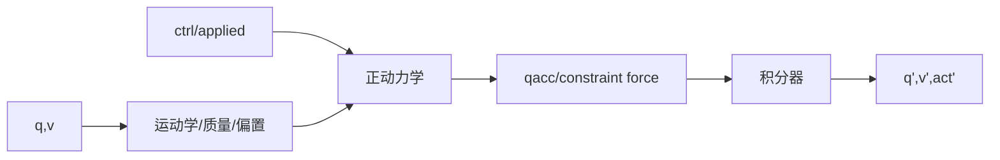

# 第 16 章　正动力学、逆动力学与计算流水线

正动力学回答“给定状态和力，机器人会怎样加速”；逆动力学回答“要实现给定加速度，需要什么广义力”。仿真、重力补偿、computed torque、系统辨识和数据校验都建立在这对互逆问题上。

## 16.1 学习目标

- 区分 forward kinematics、forward dynamics 和 inverse dynamics；
- 理解 MuJoCo forward pipeline 的 position/velocity/actuation/acceleration 阶段；
- 使用 `mj_forward`、`mj_inverse` 和 skip-stage；
- 从逆动力学构造静态重力补偿；
- 设计 forward–inverse 一致性实验；
- 理解有约束系统中解析逆动力学与迭代正动力学的差异。

## 16.2 三类“forward”不要混淆

### forward kinematics

给 q，求 body/site 世界位姿。它不需要质量、力或 qvel。

### forward dynamics

给 q、v、act/control、外力，求 qacc 和约束力：

\[
\dot v=M^{-1}(\tau+J^Tf-c).
\]

### time stepping

先做 forward dynamics，再由积分器得到下一状态。`mj_forward` 不积分；`mj_step` 才推进 time/q/v/act。



## 16.3 无约束正动力学

先忽略 contact/limit/equality：

\[
M(q)\dot v+c(q,v)=
qfrc_{actuator}+qfrc_{passive}+qfrc_{applied}+\tau_x.
\]

`τ_x` 是 body 笛卡尔外力 `xfrc_applied` 经 Jacobian transpose 映射后的贡献。

求解 qacc 不是显式计算 M inverse，而是利用质量矩阵分解。被动力和 bias 已由相应 stage 更新。

## 16.4 有约束正动力学

加入约束：

\[
M\dot v+c=\tau+J^Tf.
\]

约束力 f 由软约束优化问题求得，取决于约束 Jacobian、reference acceleration、impedance、摩擦锥和 solver。求得 `qfrc_constraint=J^Tf` 后，再得到 qacc。

contact 数量和约束维度在运行时变化，所以这部分使用 data arena 和稀疏/稠密 Jacobian策略。

## 16.5 forward pipeline 的阶段

官方 Computation 将主要计算分为：

### position stage

依赖 q：

- body/geom/site kinematics；
- COM 与 subtree quantity；
- tendon length/moment；
- transmission length/moment；
- 质量矩阵和分解；
- collision detection 与约束结构；
- position-stage sensor。

### velocity stage

再依赖 v：

- body/tendon/actuator velocity；
- passive damping；
- bias force；
- constraint reference 中的速度项；
- velocity-stage sensor。

### actuation/acceleration stage

再依赖 ctrl、act、applied force：

- actuator force 与 qfrc_actuator；
- smooth acceleration；
- constraint solve；
- qacc、constraint force；
- acceleration-stage sensor。

依赖顺序解释了为什么只改 ctrl 时可跳过 position/velocity，而改 qpos 后必须从头更新。

## 16.6 mj_forward

```cpp
mj_forward(m,d);
```

从当前 qpos/qvel/act/ctrl/applied inputs 计算一致的动力学结果，不推进 time。用途：

- 设置初态后初始化派生量；
- 控制器需要当前 qacc/contact/sensor；
- optimization 对候选状态求动力学；
- 静态分析和数值验证。

`mj_forward` 会计算 qacc，但不会把它积分到 qvel。

## 16.7 mj_step1 与 mj_step2

显式控制时序：

```cpp
mj_step1(m,d);
compute_control_from_latest_kinematics(d);
mj_step2(m,d);
```

step1 更新到控制所需的阶段，step2 使用新 ctrl 完成动力学和积分。它比“先读上一步派生量再 mj_step”少一拍信息延迟。

但 RK4 一步需要多次动力学评估，step1/step2 的语义不能简单替代所有内部 control evaluation。使用 callback 或复杂积分器时查 Programming 文档。

## 16.8 inverse dynamics

给定 q、v、qacc，逆动力学计算产生该加速度所需的广义力：

\[
\tau_{inverse}=M(q)\dot v+c(q,v)-J^Tf-	au_{passive}
\]

具体 `qfrc_inverse` 对被动/约束项的组合以 MuJoCo 定义为准。无约束、无 actuator 的已知 applied force 实验最适合建立符号直觉。

```cpp
mju_copy(d->qacc, desired_acceleration, m->nv);
mj_inverse(m,d);
// 读取 d->qfrc_inverse
```

inverse 不推进状态，也不会替你把所需广义力分配为可行 actuator ctrl。

## 16.9 静态重力补偿

固定基座机器人给定 q，设置：

\[
v=0,\qquad \dot v=0.
\]

调用 inverse，所得 qfrc_inverse 是保持静止所需的净广义力（在当前约束/被动力定义下）。现有独立实验：

```bash
cd examples/06_inverse_dynamics
cmake -S . -B build && cmake --build build
./build/demo model.xml
```

二连杆在 `q=(0.6,-0.9)` 时实测：

```text
qfrc_inverse = (2.917618, -0.405867)
```

第一个关节承受两个 link 的重力影响，第二个只承受末端子树，因此力矩幅值和符号不同。

## 16.10 从广义力到 actuator control

逆动力学给 `τ_des∈R^nv`，actuator 通过 moment matrix B 映射：

\[
\tau_{act}=B(q)p,
\]

而 actuator force p 又由 ctrl/activation/gain/bias 决定。要实现 τ_des，需解：

\[
Bp\approx\tau_{des}.
\]

全驱动、B 方阵满秩时可求解；欠驱动 free base 的基座广义力不可由关节 motor 直接产生；冗余肌肉系统有多个 p，需要最小范数、能耗或约束优化。

还要满足 ctrl/act/force range。逆动力学可行不等于 actuator 可实现。

## 16.11 独立实验：forward 后 inverse 能否找回力

```bash
cd examples/26_forward_inverse
cmake -S . -B build
cmake --build build
./build/demo model.xml
```

无接触二连杆设置 q、v 和已知 `qfrc_applied=(1.2,-0.4)`：

1. `mj_forward` 求 qacc；
2. 保存 qacc；
3. `mj_inverse`；
4. 比较 qfrc_inverse 与原 applied force。

模型含重力和 joint damping，因此恢复成功说明 inverse 正确处理了 M、bias 和 passive，而不是简单计算 `M*qacc`。

程序还调用 `mj_compareFwdInv` 或直接报告残差，用当前版本实际结果建立回归基线。

## 16.12 forward–inverse 不一致来源

无约束系统在相同浮点模型下应高度一致。有约束系统更复杂：

- forward constraint force 由迭代优化 solver 求得；
- inverse constraint force有解析、唯一定义的逆问题结构；
- solver 未完全收敛产生残差；
- friction cone 类型/接触模式影响；
- warmstart、iteration/tolerance 改变 forward 近似。

`mj_compareFwdInv` 用于诊断正逆一致性。残差大时先提高 solver 收敛精度、检查模型条件和 contact，再判断实现问题。

## 16.13 skip-stage 加速

```cpp
mj_forwardSkip(m,d,skipstage,skipsensor);
mj_inverseSkip(m,d,skipstage,skipsensor);
```

有限差分典型模式：

- 改 q：不能跳 position；
- q 不变、改 v：跳过 position；
- q/v 不变、只改 ctrl/qacc：跳过 position 和 velocity；
- 不需要 sensor：skipsensor=1。

批量求动力学导数时，按依赖复用阶段能显著加速。错误 skip 不会总是崩溃，而会返回陈旧结果，因此必须先有完整调用的数值基线。

## 16.14 inverse dynamics 与数据分析

给运动捕捉/编码器轨迹 q(t)，估计 v、qacc 后，inverse 可推算净广义力。但加速度数值微分会放大噪声：

\[
v_k\approx\frac{q_{k+1}-q_{k-1}}{2h},
\qquad
a_k\approx\frac{q_{k+1}-2q_k+q_{k-1}}{h^2}.
\]

姿态需使用流形差；接触力未知时，逆动力学的关节力和接触分配耦合。实际数据分析要做滤波、动力学平滑或优化，而不是对 noisy q 二次差分直接相信结果。

## 16.15 inverse dynamics 与 computed torque

期望加速度：

\[
\ddot q_c=\ddot q_d+K_d(\dot q_d-\dot q)+K_p(q_d-q).
\]

inverse dynamics 生成：

\[
\tau=M(q)\ddot q_c+c(q,v).
\]

理想无约束全驱动模型中，闭环误差近似成为独立二阶系统。真实系统有 actuator dynamics、饱和、模型误差和接触，必须加入可实现力分配和鲁棒反馈。

## 16.16 约束下的逆动力学

站立人形给定全身加速度时，还需满足足底不滑、接触 wrench 摩擦锥、关节力矩限制和浮动基座动力学。单纯 `mj_inverse` 给出的净力不是完整 whole-body control 分配器。

通常构造 QP：同时求 joint torque 和 contact force，满足：

\[
M\dot v+c=S^T\tau+J_c^Tf,
\]

以及接触加速度、摩擦锥和 limit。MuJoCo 提供动力学量和接触基线，上层控制器负责任务优先级和约束优化。

## 16.17 常见错误

| 错误 | 后果 | 修复 |
|---|---|---|
| 把 mj_forward 当时间步进 | time/qpos 不变 | mj_step |
| inverse 前未设置 qacc | 使用旧加速度 | 显式填充 qacc |
| qfrc_inverse 直接写 ctrl | gear/欠驱动/饱和错误 | actuator allocation |
| step1/step2 与 RK4 随意混用 | 控制评估时序错误 | 查积分器语义/callback |
| skipstage 与实际修改不符 | 陈旧缓存 | 依赖表+完整基线 |
| noisy q 二次差分做 inverse | 力矩噪声巨大 | 平滑/优化估计 |
| 人形站立只做 joint inverse | 忽略 base/contact dynamics | whole-body constrained control |

## 16.18 本章小结

- forward dynamics 从状态和力求 qacc，step 再积分状态。
- inverse dynamics 从 q/v/qacc 求所需净广义力。
- pipeline 按 position、velocity、actuation/acceleration 依赖组织。
- step1/step2 允许在最新派生量后写 control。
- 静态 inverse 给重力补偿，但还需 actuator force allocation。
- 有约束 forward–inverse 残差与 solver 收敛相关。
- skip-stage 可加速有限差分，但必须保证缓存依赖正确。

## 16.19 练习

1. 修改 ctrl、不改 q/v 时，理论上哪些 pipeline stage 可复用？
2. fixed-base 机械臂 v=0、qacc=0 的 inverse force 是否一定等于 qfrc_bias？列出例外。
3. 为什么 free-base 人形 inverse 得到的前 6 个广义力不能直接交给 motor？
4. 有接触 forward–inverse 残差大，首先调整/检查什么？
5. computed torque 在质量估计偏小 20% 时，反馈项为何仍重要？

## 16.20 参考答案

1. position 和 velocity stage 可复用，从 actuation/control 相关阶段重新计算；使用相应 skip-stage 前核对 API stage 枚举。
2. 有 spring/damping、约束、外力、actuator activation 或其他 passive 时组合不同；必须按 inverse 定义和力账本核对。
3. free base 是欠驱动 DOF，没有关节 actuator；基座动力学只能通过重力、接触和内部关节作用间接满足。
4. solver iteration/tolerance、模型条件、constraint/contact 参数、warmstart 和 forward warning；先确保 forward 约束充分收敛。
5. 前馈模型误差会留下加速度/力误差，PD 等反馈根据实际状态纠正；但反馈也受饱和和带宽限制。

