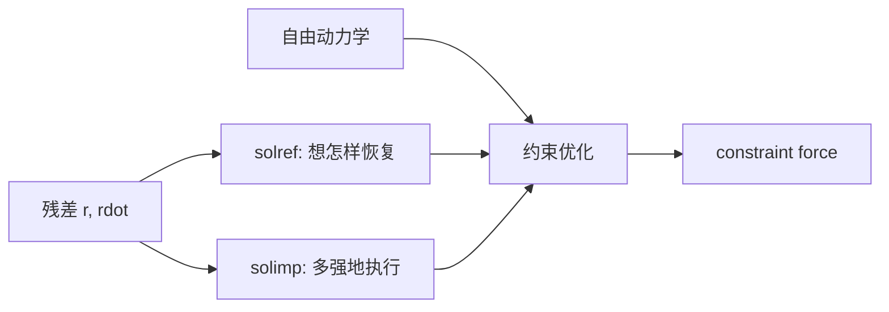
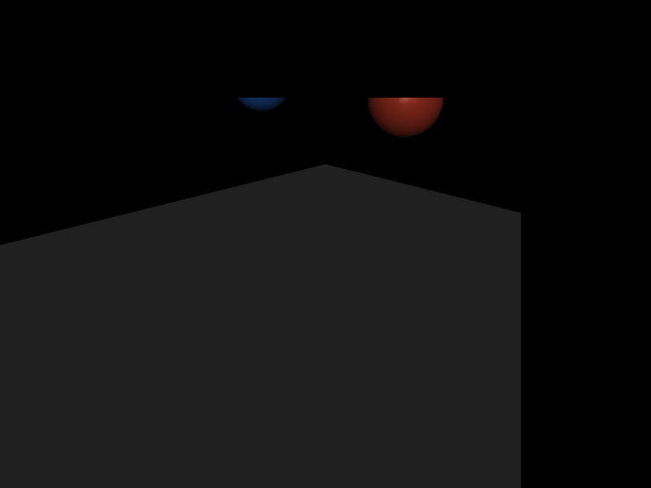

# 第 17 章　软约束、solref、solimp 与约束阻抗

接触、joint limit、tendon limit 和 equality 在 MuJoCo 中共享软约束框架。所谓“软”不是给每个接触简单装一根弹簧，而是指定参考加速度和阻抗，让约束求解器在满足自由动力学与纠正约束误差之间优化。理解这个框架，才能调接触而不是反复猜参数。

## 17.1 学习目标

- 把 contact、limit、equality 写成统一约束残差；
- 理解约束位置、速度、加速度和力；
- 区分 `solref` 与 `solimp`；
- 理解 positive/negative solref 两种参数化；
- 解释软约束穿透、恢复时间和阻尼；
- 用落球实验比较软硬接触的力—位移权衡。

## 17.2 统一约束坐标

对标量约束定义残差 `r(q)`：

- equality：目标 `r=0`；
- unilateral contact/limit：只在违反方向激活；
- friction：主要约束切向速度。

约束速度：

\[
\dot r=J(q)v,
\]

约束加速度：

\[
\ddot r=J\dot v+\dot Jv.
\]

广义约束力：

\[
\tau_c=J^Tf.
\]

MuJoCo 计算自由系统在约束空间的加速度，再求 f 使实际加速度趋向参考行为。

## 17.3 为什么不用无限刚约束

理想刚接触要求非穿透和瞬时冲量。有限 timestep 下，极硬 penalty spring 产生很高自然频率，迫使使用极小步长；刚性 complementarity 求解又可能昂贵、不唯一或不利于逆动力学。

软约束允许小的可控误差：

- 有限 penetration/closure error；
- 有限恢复时间；
- 平滑、凸、较稳定的力求解；
- 可统一处理 contact、limit、friction、equality。

物理真实性来自误差尺度与任务相符，而不是把所有约束调到数值上“最硬”。

## 17.4 参考加速度

约束希望残差像阻尼二阶系统回到参考值。概念形式：

\[
a_{ref}=-b\dot r-k r.
\]

`solref` 控制这个参考动态。默认正值参数化通常以时间常数和阻尼比表达：

```text
solref = timeconst dampratio
```

- timeconst 越小：纠正越快、接触越硬；
- dampratio≈1：接近临界阻尼；
- 太小阻尼：反弹/振荡；
- 大阻尼：恢复慢或更耗散。

内部 k、b 与 timeconst、dampratio、阻抗缩放及安全限制之间有具体换算，需以当前 Computation 文档公式为准。不要把 `1/timeconst²` 直接称为物理材料 stiffness 而忽略 impedance。

## 17.5 negative solref：直接 stiffness/damping 参数化

当 solref 分量使用文档规定的负值形式时，可选择更直接的 stiffness/damping 参数化。它适合需要控制等效约束系数的场景，但符号、单位和与 impedance 的组合必须严格按 XML Reference。

团队模型不应混用两种 solref 语义而不注明。推荐在 default class 名称中体现：如 `contact_soft_time`、`weld_direct_stiffness`，并用可测实验记录最终响应。

## 17.6 solimp：误差相关阻抗

`solimp` 定义约束阻抗 `d(r)`，取值在 `[0,1]` 范围内，控制实际加速度在自由加速度与参考加速度之间的权衡。概念上：

\[
a=(1-d)a_{free}+d a_{ref}+	ext{force coupling terms}.
\]

常用五参数控制：

```text
dmin dmax width midpoint power
```

- `dmin/dmax`：阻抗下/上限；
- `width`：残差多大范围完成过渡；
- `midpoint/power`：S 形过渡位置和曲率。

`d` 越接近 1，约束越主导；越低，系统更顺从。solimp 使刚度可随 penetration/误差变化，而不是常数弹簧。

## 17.7 solref 和 solimp 的分工



- solref：目标恢复动态；
- solimp：约束相对自由动力学的权重及其随误差变化；
- solver：在多约束耦合和摩擦锥下求一致 force；
- timestep/integrator：离散实现。

所以只改 solref、保持其他因素不变，才可比较“恢复更快”的影响。

## 17.8 contact distance、margin 和 gap

contact 记录 `dist` 是几何距离，符号按碰撞定义；负值通常表示几何 penetration。约束激活还受：

- `margin`：在实际表面之外多远开始检测/激活；
- `gap`：可在 margin 区间创建不产生力或特定用途的接触；
- pair/geom 参数合成。

视觉上看到球心高度略低于半径，不一定是碰撞错误：软约束在重力下需要有限 penetration 产生支撑力，类似弹簧静挠度。

## 17.9 静态穿透的量级

简单 penalty 直觉下，质量 m 静止在地面：

\[
k\delta\approx mg,
\quad \delta\approx\frac{mg}{k}.
\]

MuJoCo 实际软约束不是这根独立线性弹簧，但关系仍帮助理解：更重物体或更软参数通常有更大静态 penetration。评价接触参数时要覆盖真实质量范围，而不是只用 1 kg 球。

## 17.10 独立实验：相同落球，不同 solref

```bash
cd examples/27_contact_softness
cmake -S . -B build
cmake --build build
./build/demo model.xml
```

两个 1 kg 球从相同高度落到同一 plane。显式 pair 分别使用：

- soft：`solref="0.08 1"`；
- hard：`solref="0.008 1"`。

其他参数保持一致。程序按接触 geom 分类，记录：

- 最小 contact distance；
- 最大法向 contact force；
- 2 s 后球心高度；
- 最终竖直速度。

通常 hard 接触 penetration 更小、冲击峰值更尖；soft 接触变形更大、峰值较缓。精确数值依 timestep、solimp 和 solver，程序输出才是该版本/模型的证据。

<!-- EMBEDDED_EXAMPLE_BEGIN: 27_contact_softness -->
### 可视化运行与效果

```bash
../../mujoco-3.11.0/bin/simulate model.xml
```

该命令使用发布包自带的官方 `simulate` 界面，可暂停、单步、施加扰动并开启接触等可视化标志。



*27_contact_softness 的真实 MuJoCo 原生渲染结果。*

### 实验完整源码

以下文件与 `examples/27_contact_softness/` 中可直接编译的版本一致。

#### 模型文件：`model.xml`

```xml
<mujoco model="contact_softness">
  <option timestep="0.001"/>
  <worldbody>
    <geom name="floor" type="plane" size="2 2 .1" contype="0" conaffinity="0"/>
    <body name="soft_body" pos="-.3 0 1">
      <freejoint/><geom name="soft_ball" type="sphere" size=".1" mass="1" contype="0" conaffinity="0" rgba=".2 .5 1 1"/>
    </body>
    <body name="hard_body" pos=".3 0 1">
      <freejoint/><geom name="hard_ball" type="sphere" size=".1" mass="1" contype="0" conaffinity="0" rgba="1 .3 .2 1"/>
    </body>
  </worldbody>
  <contact>
    <pair geom1="floor" geom2="soft_ball" solref=".08 1"/>
    <pair geom1="floor" geom2="hard_ball" solref=".008 1"/>
  </contact>
</mujoco>
```

#### 程序源码：`main.cc`

```cpp
#include <cstdio>
#include <cstdlib>
#include <limits>
#include <mujoco/mujoco.h>

int main(int argc, char** argv) {
  if (argc != 2) {
    std::fprintf(stderr, "用法: %s model.xml\n", argv[0]);
    return EXIT_FAILURE;
  }
  char error[1024] = {0};
  mjModel* m = mj_loadXML(argv[1], NULL, error, sizeof(error));
  if (!m) {
    std::fprintf(stderr, "无法加载 %s:\n%s\n", argv[1], error);
    return EXIT_FAILURE;
  }
  mjData* d = mj_makeData(m);
  int soft_geom = mj_name2id(m, mjOBJ_GEOM, "soft_ball");
  int hard_geom = mj_name2id(m, mjOBJ_GEOM, "hard_ball");
  int soft_body = mj_name2id(m, mjOBJ_BODY, "soft_body");
  int hard_body = mj_name2id(m, mjOBJ_BODY, "hard_body");
  mjtNum min_dist[2] = {std::numeric_limits<mjtNum>::infinity(),
                        std::numeric_limits<mjtNum>::infinity()};
  mjtNum max_force[2] = {0, 0};

  while (d->time < 2.0) {
    mj_step(m, d);
    for (int i = 0; i < d->ncon; ++i) {
      int g1 = d->contact[i].geom[0], g2 = d->contact[i].geom[1];
      int which = (g1 == soft_geom || g2 == soft_geom) ? 0 :
                  (g1 == hard_geom || g2 == hard_geom) ? 1 : -1;
      if (which >= 0) {
        mjtNum wrench[6];
        mj_contactForce(m, d, i, wrench);
        min_dist[which] = mju_min(min_dist[which], d->contact[i].dist);
        max_force[which] = mju_max(max_force[which], wrench[0]);
      }
    }
  }

  std::printf("type   min_contact_dist   peak_normal_force   final_center_z   final_vz\n");
  std::printf("soft   % .9f       % .6f          %.9f      % .3g\n",
              min_dist[0], max_force[0], d->xpos[3*soft_body+2], d->qvel[2]);
  std::printf("hard   % .9f       % .6f          %.9f      % .3g\n",
              min_dist[1], max_force[1], d->xpos[3*hard_body+2], d->qvel[8]);

  mj_deleteData(d);
  mj_deleteModel(m);
  return EXIT_SUCCESS;
}
```

#### 构建文件：`CMakeLists.txt`

```cmake
cmake_minimum_required(VERSION 3.16)
project(27_contact_softness LANGUAGES CXX)

set(CMAKE_CXX_STANDARD 17)
add_executable(demo main.cc)

set(MUJOCO_ROOT ${CMAKE_CURRENT_LIST_DIR}/../../mujoco-3.11.0)
target_include_directories(demo PRIVATE ${MUJOCO_ROOT}/include)
target_link_directories(demo PRIVATE ${MUJOCO_ROOT}/lib)
target_link_libraries(demo PRIVATE mujoco)
set_target_properties(demo PROPERTIES BUILD_RPATH ${MUJOCO_ROOT}/lib)
```
<!-- EMBEDDED_EXAMPLE_END: 27_contact_softness -->

## 17.11 反弹与 restitution

接触是否反弹由相对速度、solref 阻尼/时间常数、阻抗和积分共同决定。MuJoCo 不需要单独的传统 restitution coefficient 才能产生恢复行为；参考加速度可配置速度相关反弹。

调反弹实验应记录入射速度和分离速度：

\[
e=-\frac{v_{separation}}{v_{impact}}.
\]

只看弹起高度会混入重力、旋转和摩擦。低速接触通常希望不出现微小弹跳，高速球碰撞则可能需要速度相关恢复。

## 17.12 equality 的软误差

weld/connect 也使用 solref/solimp。闭链在载荷下出现小 closure error 是软约束预期行为。调得更硬会减小误差，但提高约束力变化和数值难度。

闭链标定应测：

- 静态载荷下位置/角度误差；
- 动态峰值误差；
- constraint force；
- solver residual/iteration；
- timestep 减半后的收敛。

若多个 equality 冗余，硬度增加可能不能消除冲突，反而使问题病态。

## 17.13 joint/tendon limit 的阻抗

limit 不是“墙外接触”的独立特殊算法，它同样使用软约束。机械止挡可有比普通控制区更硬的 solref，但仍应配合 controller soft limit。

limit margin 允许提前形成缓冲区。若 trajectory target 超出 range，position actuator 会持续推压 limit，静态误差和力由 actuator saturation 与 constraint impedance 平衡。

## 17.14 参数调试流程

1. 校正几何、质量、惯量和初始 penetration；
2. 固定 timestep/integrator；
3. 用单物体落地/静载测试 solref；
4. 检查静态 penetration 和峰值力；
5. 再调 solimp 随误差的变化；
6. 加摩擦并做滑移测试；
7. 回到完整机器人，检查接触数量和 solver；
8. 做 timestep/solver 收敛。

不要同时改 friction、solref、solimp、timestep 和 controller，然后凭一次站立成功选参数。

## 17.15 与真实材料的关系

现实接触可能由橡胶形变、结构柔性、地面柔性和控制器共同决定。MuJoCo contact softness 是集总模型，参数不一定直接等于材料 Young's modulus。

可用实验拟合宏观指标：

- 静态力—位移；
- 冲击力时程；
- 反弹系数随速度；
- 接触持续时间；
- 足底压力中心变化。

若 link 本身显著柔性，仅调 contact 不能同时拟合所有现象，需要 flex、弹性 joint 或更详细结构。

## 17.16 数值安全限制

time constant 相对 timestep 过小会请求引擎在一个离散步内完成过快恢复。MuJoCo 有相关安全限制/修正选项以避免不稳定，具体行为由 option flag 和版本决定。

关闭安全限制做极硬约束前，必须做步长收敛和 warning 监控。追求 `dist=0` 的打印数字，可能付出巨大 force spike 和控制不可迁移代价。

## 17.17 常见错误

| 错误 | 后果 | 修复 |
|---|---|---|
| solref 当单一弹簧 k | 参数物理解释错误 | 参考动态+阻抗整体理解 |
| 所有约束统一极硬 | solver/步长困难 | 按任务误差尺度分 class |
| 穿透非零就判碰撞失败 | 误解软约束 | 对照支撑力和目标尺度 |
| 只看静态高度 | 忽略冲击峰值/反弹 | 动静态指标一起测 |
| 同时改多个参数 | 无法归因 | 单变量实验矩阵 |
| 用 contact softness 拟合结构柔性 | 多场景不一致 | 分离接触和结构模型 |
| 闭链误差大只提高硬度 | 冗余/初态冲突恶化 | 检查约束独立性和初态 |

## 17.18 本章小结

- contact、limit、equality 共享约束残差/Jacobian/force 框架。
- solref 定义参考恢复动态，solimp 定义误差相关阻抗。
- 软约束允许有限误差以换取稳定、高效和可逆分析。
- margin/gap 影响接触激活，不等于几何显示尺寸。
- 参数应由单体静载/冲击实验拟合，再迁移完整机器人。
- 极硬不是更真实；应以任务允许误差、力时程和步长收敛评价。

## 17.19 练习

1. 1 kg 和 10 kg 物体使用相同软接触，哪个静态 penetration 通常更大？为什么？
2. timeconst 减小 10 倍，为什么不能保证仿真误差也减小 10 倍？
3. solref 和 solimp 分别回答什么问题？
4. 一个 weld 在静态载荷下误差 1 mm，是否一定不合格？还需哪些信息？
5. 如何设计实验区分接触柔度和 leg joint 柔度？

## 17.20 参考答案

1. 10 kg 通常更大，因为需更大支撑力；在近似线性直觉中 `δ≈mg/k`。
2. 离散 timestep、impedance、solver、质量和安全限制共同决定实际响应；过快参考动态可能反而数值困难。
3. solref 描述残差希望以何种时间常数/阻尼恢复，solimp 描述约束相对自由动力学的作用强度及随误差变化。
4. 不一定。要与机构公差/任务精度比较，并检查约束力、动态峰值、solver 残差和 timestep 收敛。
5. 先用刚性 leg/单球标定接触力—位移，再在无接触或已知接触条件下测 joint torque—deflection；最后组合验证。
