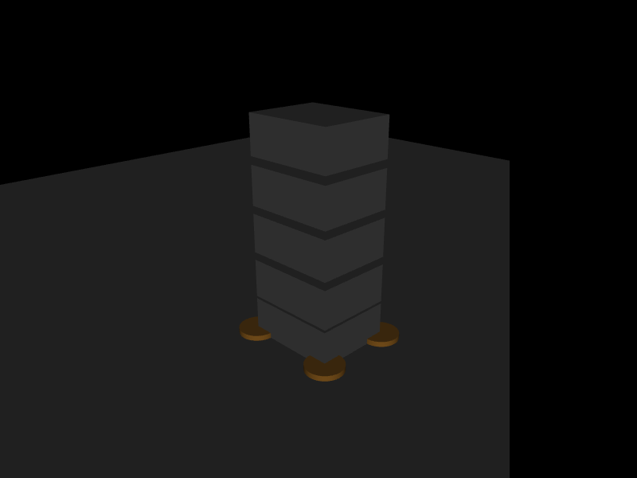

# 第 19 章　约束求解器、约束岛与休眠

> 本书示例代码仓库：[libing403/mujoco_tutorial](https://github.com/libing403/mujoco_tutorial)

接触、关节限位、干摩擦、肌腱限位和 equality 最终都进入统一的约束系统。本章不把 solver 当作一个神秘的 XML 选项，而是建立“误差—迭代—耗时—任务表现”的诊断闭环。

## 19.1 学习目标

- 理解为什么 MuJoCo 的软约束问题具有唯一的凸优化解；
- 区分 PGS、CG、Newton 的变量空间和工程特征；
- 正确使用 `iterations`、`tolerance`、warmstart 和 solver statistics；
- 理解 constraint island 为何能独立求解，以及 sleeping 改变了哪些状态管理规则；
- 为机器人模型建立可重复的求解器基准，而不是凭感觉调参。

## 19.2 从动力学到约束优化

无约束加速度记为

\[
\mathbf a_0=M^{-1}(\boldsymbol\tau-\mathbf c),
\]

约束 Jacobian 为 \(J\)，约束力为 \(\mathbf f\)，则

\[
\mathbf a=\mathbf a_0+M^{-1}J^T\mathbf f.
\]

约束空间中的有效逆质量为

\[
A=JM^{-1}J^T.
\]

MuJoCo 再结合软约束参考加速度与阻抗正则项构造严格凸问题。严格凸意味着存在唯一全局最优解；所以不同 solver 充分收敛后应趋向同一物理解，而不是三套不同的接触物理。

求解困难通常来自：质量尺度相差过大、冗余或近奇异约束、过硬 `solref`、极小 timestep 下不匹配的 tolerance，以及复杂摩擦接触。

## 19.3 三种主求解器

| solver | 空间 | 单次迭代 | 典型特征 |
|---|---|---|---|
| PGS | dual | 便宜 | 局部更新、可能慢收敛，适合教学对照和特定稀疏问题 |
| CG | primal | 中等 | 共轭方向比最速下降有效，不显式形成某些稠密对象 |
| Newton | primal | 较贵 | 默认首选，常在少数迭代内高精度收敛 |

不要把“每次迭代便宜”误当成“整步更快”。一个需要 40 次迭代的 PGS 可能比 2 次 Newton 更慢。反之，小而简单的模型中初始化和流水线其他阶段占主导，solver 差异可能淹没在噪声里。

`cone="elliptic"` 与 primal solver 搭配能直接表达椭圆摩擦锥。金字塔锥是多面近似，内部力分量沿锥边；这也是上一章强调 `mj_contactForce` 的原因。

## 19.4 终止条件

```xml
<option solver="Newton" iterations="50" tolerance="1e-10"/>
```

- `iterations` 是上限，不代表每步一定执行这么多次；
- `tolerance` 控制提前终止；设为 0 会强制执行完整迭代数，便于某些确定性基准，但会浪费计算；
- `d->solver_niter[island]` 给出各岛迭代次数；
- `d->solver[iteration]` 保存 improvement、gradient 等逐次统计；
- `d->solver_fwdinv` 可辅助检查正、逆解一致性，需启用相应计算。

只看迭代次数是不够的：Newton 的一次迭代和 PGS 的一次迭代成本并不相等。必须同时记录墙钟时间、接触数、`nefc`、穿入深度和任务指标。

## 19.5 Warmstart

`d->qacc_warmstart` 保存上一步加速度作为初值。连续轨迹的相邻状态相近，因此 warmstart 常减少迭代，PGS 尤其明显。默认 Newton 往往只需 2～3 次，收益可能很小。

做有限差分、分支 rollout 或严格对照时，要意识到 warmstart 也是仿真状态的一部分。若两个分支只复制 `qpos/qvel` 而 warmstart 不同，低迭代上限下结果可能有可见差异。完整状态复制应使用第 3 章介绍的 state specification，并明确是否包含 warmstart。

## 19.6 Constraint island

若两组自由度之间不存在活动约束耦合，约束图可拆成独立连通分量：

```text
左脚—地面—躯干—右脚     桌上方块 A     桌上方块 B
       island 0            island 1       island 2
```

每个 island 独立收敛：简单岛无需陪复杂岛继续迭代；无约束自由度可完全跳过。`mj_island` 负责发现约束岛，`mjData` 中的 island 映射可用于性能诊断。岛是由当前活动约束决定的，接触建立或断开时拓扑会变化，因此不能把 island ID 当作持久对象标识。

人形机器人双脚同时着地时，两脚通过同一运动树连接，通常属于同一约束岛；一堆互不接触的散落物体则可能形成多个岛。

## 19.7 Sleeping

Sleeping 把长期静止的 island 冻结，避免重复计算。自动休眠依据经 `dof_length` 缩放后的速度无穷范数，所以平移和转动速度可在统一长度/时间尺度比较。

休眠不是单纯性能开关，它影响状态管理：

- island 入睡时相关速度被置零；
- 修改其 `qpos`、非零 `qvel`、`qfrc_applied` 或 `xfrc_applied` 会唤醒；
- 与醒着的 tree 接触会唤醒整个岛；
- 由 equality 或活动 tendon 连接的 tree 可能一起睡眠/唤醒；
- 手工复制状态时需包含 sleep state，或明确禁用 sleeping。

对于强化学习批量环境，若 episode reset、随机外力和状态克隆非常频繁，先禁用 sleeping 建立正确基线；对于大量静态散落物体场景，再评估它的收益。

## 19.8 独立实验：PGS、CG、Newton 对照

`examples/29_solver_compare/` 对同一个方块堆叠分别运行三种 solver。每轮从全新 `mjData` 开始，统计平均步耗时、平均/最大迭代次数、最大接触穿入和最终高度。

```bash
cd examples/29_solver_compare
cmake -S . -B build -DCMAKE_BUILD_TYPE=Release
cmake --build build -j
./build/demo model.xml
```

这个微基准的绝对时间不应跨机器比较。真正有意义的是同一机器、同一构建、同一初态的相对结果。正式基准还应预热 CPU、重复多轮并报告分位数。

<!-- EMBEDDED_EXAMPLE_BEGIN: 29_solver_compare -->
### 可视化运行与效果

```bash
../../mujoco-3.11.0/bin/simulate model.xml
```

该命令使用发布包自带的官方 `simulate` 界面，可暂停、单步、施加扰动并开启接触等可视化标志。



*29_solver_compare 的真实 MuJoCo 原生渲染结果。*

### 实验完整源码

以下文件与 `examples/29_solver_compare/` 中可直接编译的版本一致。

#### 模型文件：`model.xml`

```xml
<mujoco model="solver comparison">
  <option timestep="0.001" iterations="50" tolerance="1e-10" cone="pyramidal"/>
  <default><geom type="box" size=".12 .1 .05" mass="1" friction=".8 .01 .001"/></default>
  <worldbody>
    <geom name="floor" type="plane" size="2 2 .1" mass="0"/>
    <body name="box1" pos="0 0 .08"><freejoint/><geom/></body>
    <body name="box2" pos="0 0 .20"><freejoint/><geom/></body>
    <body name="box3" pos="0 0 .32"><freejoint/><geom/></body>
    <body name="box4" pos="0 0 .44"><freejoint/><geom/></body>
    <body name="box5" pos="0 0 .56"><freejoint/><geom/></body>
  </worldbody>
</mujoco>
```

#### 程序源码：`main.cc`

```cpp
#include <chrono>
#include <cstdio>
#include <cstdlib>
#include <mujoco/mujoco.h>

int main(int argc, char** argv) {
  if (argc != 2) {
    std::fprintf(stderr, "用法: %s model.xml\n", argv[0]);
    return EXIT_FAILURE;
  }
  char error[1024] = {0};
  mjModel* m = mj_loadXML(argv[1], NULL, error, sizeof(error));
  if (!m) {
    std::fprintf(stderr, "无法加载模型:\n%s\n", error);
    return EXIT_FAILURE;
  }
  const int solvers[3] = {mjSOL_PGS, mjSOL_CG, mjSOL_NEWTON};
  const char* names[3] = {"PGS", "CG", "Newton"};
  std::puts("solver   us/step   avg_iter   max_iter   min_dist   top_z");
  for (int s = 0; s < 3; ++s) {
    m->opt.solver = solvers[s];
    mjData* d = mj_makeData(m);
    long long sum_iter = 0;
    int max_iter = 0;
    auto begin = std::chrono::steady_clock::now();
    const int steps = 3000;
    for (int k = 0; k < steps; ++k) {
      mj_step(m, d);
      int it = d->solver_niter[0];
      sum_iter += it;
      max_iter = it > max_iter ? it : max_iter;
    }
    auto end = std::chrono::steady_clock::now();
    double us = std::chrono::duration<double, std::micro>(end-begin).count()/steps;
    mjtNum min_dist = 0;  // 只比较稳态；落下过程的瞬态穿入不代表稳态精度
    for (int i = 0; i < d->ncon; ++i)
      min_dist = d->contact[i].dist < min_dist ? d->contact[i].dist : min_dist;
    int top = mj_name2id(m, mjOBJ_BODY, "box5");
    std::printf("%-7s %8.3f %10.3f %10d %10.6f %8.5f\n", names[s], us,
                double(sum_iter)/steps, max_iter, min_dist, d->xpos[3*top+2]);
    mj_deleteData(d);
  }
  mj_deleteModel(m);
  return EXIT_SUCCESS;
}
```

#### 构建文件：`CMakeLists.txt`

```cmake
cmake_minimum_required(VERSION 3.16)
project(29_solver_compare LANGUAGES CXX)

set(CMAKE_CXX_STANDARD 17)
add_executable(demo main.cc)

set(MUJOCO_ROOT ${CMAKE_CURRENT_LIST_DIR}/../../mujoco-3.11.0)
target_include_directories(demo PRIVATE ${MUJOCO_ROOT}/include)
target_link_directories(demo PRIVATE ${MUJOCO_ROOT}/lib)
target_link_libraries(demo PRIVATE mujoco)
set_target_properties(demo PROPERTIES BUILD_RPATH ${MUJOCO_ROOT}/lib)
```
<!-- EMBEDDED_EXAMPLE_END: 29_solver_compare -->

## 19.9 系统化调参流程

1. 用默认 Newton、合理 timestep 建立基准；
2. 记录 `ncon/nefc`、迭代、穿入、任务误差和每步耗时；
3. 将 tolerance 收紧一个数量级，确认任务指标是否变化；
4. iterations 翻倍，若结果仍明显变化，原设置未收敛；
5. timestep 减半，区分 solver 误差和积分误差；
6. 检查质量比、惯量、冗余 equality 与接触几何，再考虑极端 solver 参数；
7. 最后才比较其他 solver 或启用 sleeping/并行优化。

模型错误无法靠更多迭代修复。比如脚底碰撞几何倾斜、执行器饱和、惯量单位错了 1000 倍，solver 再精确也只会更精确地求解错误模型。

## 19.10 常见故障

- **每步都打满 iterations**：tolerance 太严、条件数差，或确实未收敛；查看逐迭代 improvement。
- **增加 iterations 轨迹仍不同**：可能是 timestep/积分器、接触模式切换或混沌，不一定是 solver。
- **静止堆叠缓慢蠕动**：检查软约束参数、摩擦表示和 Newton 精度，勿只增加摩擦。
- **基准结果忽快忽慢**：把模型编译、日志、渲染、首帧初始化排除，增加测量时长。
- **状态恢复后物体不动**：可能恢复了 asleep 标志却没有触发唤醒。

## 19.11 习题与答案

1. 为什么不能横向比较 PGS 迭代 10 次与 Newton 迭代 10 次？  
   **答案：**算法、每次迭代成本和收敛阶不同；应比较相同任务精度下的总耗时。

2. 把 tolerance 设为 0 有什么代价和用途？  
   **答案：**禁用提前终止，固定执行 iterations，耗时增加；可用于控制迭代路径差异的基准或复现测试。

3. 两个互不接触的自由方块为何可能属于两个 island？  
   **答案：**它们的活动约束图不连通，各自只与世界接触，约束可独立求解。

4. 外力为何会唤醒 sleeping island？  
   **答案：**否则被冻结物体不会对用户输入作出响应；引擎在步开始检查非零 applied force 并唤醒相关岛。

5. iterations 翻倍后控制任务误差不变，能否断言模型准确？  
   **答案：**不能，只说明该指标对 solver 收敛已不敏感；仍需验证 timestep、参数、接触与真实系统一致性。

下一章讨论被约束求解器之外的力：流体阻力、被动力、用户外力和回调，以及如何避免重复计力。
