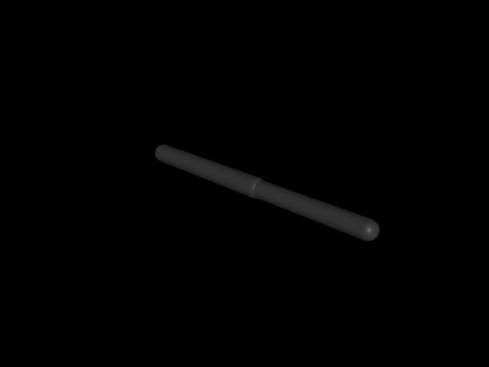

# 第 20 章　被动力、流体力与用户外力

> 本书示例代码仓库：[libing403/mujoco_tutorial](https://github.com/libing403/mujoco_tutorial)

机器人受到的力远不止 actuator 和 contact。关节弹簧阻尼、重力补偿、空气阻力、缆绳、人的推力以及控制器注入的广义力，分别落在不同的数据通道中。本章建立完整的“力从哪里来”账本。

## 20.1 学习目标

- 区分 `qfrc_actuator`、`qfrc_passive`、`qfrc_applied`、`xfrc_applied` 与 `qfrc_constraint`；
- 理解笛卡尔 wrench 通过 Jacobian 转置映射为广义力；
- 使用 `mj_applyFT` 在任意点施加力和力矩；
- 理解 MuJoCo 两类流体模型、wind 的相对速度含义及适用边界；
- 正确实现 `mjcb_passive`，避免线程、生命周期和重复计力问题。

## 20.2 广义力总账

第 16 章动力学方程可细化为

\[
M(q)\dot v+c(q,v)=
\tau_{act}+\tau_{passive}+\tau_{applied}+J_x^T w_x+J_c^Tf_c.
\]

与 `mjData` 对应：

| 项 | 字段 | 来源 |
|---|---|---|
| \(\tau_{act}\) | `qfrc_actuator` | actuator transmission |
| \(\tau_{passive}\) | `qfrc_passive` | 弹簧、阻尼、gravcomp、fluid、passive callback |
| \(\tau_{applied}\) | `qfrc_applied` | 用户直接写入的 `nv` 维广义力 |
| \(w_x\) | `xfrc_applied` | 用户施加在 body 质心的世界系 6D wrench |
| \(J_c^Tf_c\) | `qfrc_constraint` | 接触、限位、equality 等约束解 |

`qfrc_bias` 是需要移到方程左侧的偏置项，不应再次当成外力相加。`qfrc_inverse` 是逆动力学结果，也不是一个自动进入正动力学的输入缓冲区。

## 20.3 笛卡尔力为何是 `Jᵀf`

虚功守恒给出

\[
\delta W=f^T\delta x=f^TJ\delta q=(J^Tf)^T\delta q,
\]

所以广义力为 \(\tau=J^Tf\)。力矩同理使用转动 Jacobian。这个结论同时解释 actuator moment arm、接触力和操作空间控制的力映射。

`xfrc_applied` 每个 body 占 6 项，顺序是世界系三维力、世界系三维力矩，作用点固定在 body 质心。若力作用在末端某个 site 或刚体表面点，直接写 `xfrc_applied` 会漏掉力臂产生的力矩。

## 20.4 `mj_applyFT`：任意点 wrench

```cpp
mj_applyFT(m, d, force, torque, point, body, d->qfrc_applied);
```

`force`、`torque`、`point` 都按世界系表达。函数不会修改 `xfrc_applied`，而是把结果**累加**到目标广义力数组。因此每步开始应清零目标数组，再应用本步所有 wrench：

```cpp
mju_zero(d->qfrc_applied, m->nv);
mj_applyFT(..., d->qfrc_applied);
```

若多个模块都写 `qfrc_applied`，应由一个力聚合器清零一次，再依次累加；否则局部清零会擦掉其他模块的贡献。

## 20.5 被动力与重力补偿

MuJoCo 内建被动力包含 joint/tendon 弹簧和阻尼、body `gravcomp`、流体力及多项式 stiffness/damping。它们依赖 \(q,v\)，不依赖当前控制或加速度，因此正、逆动力学都将它们视作已知输入。

物理弹簧阻尼不主动增加净能量；但 `mjcb_passive` 允许用户加入任意 \(q,v\) 函数，名字叫 passive 不等于用户代码一定耗散。`gravcomp` 适合模拟配重、气弹簧或低层重力补偿。它和控制器计算的重力前馈可能重复：机械臂向上漂时应先检查是否两处都补偿了重力。

## 20.6 流体模型

```xml
<option density="1.225" viscosity="1.48e-5" wind="2 0 0"/>
```

`density` 控制随相对速度平方增长的惯性阻力/升力项，`viscosity` 控制低速下近似线性的黏性阻力。wind 从物体世界线速度中扣除，所以物体静止但有风时仍有相对流速。

MuJoCo 提供两条建模路径：

1. **基于惯量的 body 模型**：根据等效惯量推断几何尺度，配置少，适合快速加入介质阻尼；
2. **基于 geom 的椭球模型**：按 geom 形状及 `fluidshape/fluidcoef` 计算，更适合方向性阻力、Magnus/Kutta 等效应。

它们是低成本工程近似，不是 CFD。无人机近地效应、旋翼尾流相互作用、水下附加质量的高保真瞬态，通常需要辨识系数、外部模型或插件。

## 20.7 `mjcb_passive` 回调

回调在被动力阶段执行，用户向 `d->qfrc_passive` **累加**力。典型用途是电缆拖曳、非线性摩擦、磁力和简化气动力。

- `mjcb_passive` 是进程级全局函数指针，不属于某个模型；
- 回调可能被多个 `mjData`、多个线程调用，不能依赖无保护的可变全局状态；
- 引擎已经写入内建 passive force，不要清零 `qfrc_passive`；
- 为保持逆动力学语义，力应只依赖 position/velocity 与固定模型参数；
- 回调必须足够快，禁止日志、分配内存或阻塞 I/O。

## 20.8 独立实验：力、力矩和作用点

`examples/30_apply_force/` 在二连杆末端 site 施加世界系力。程序用 `mj_applyFT` 得到广义力，再独立用 `mj_jacSite` 计算 `Jpᵀf`，两者应在机器精度内一致。

```bash
cd examples/30_apply_force
cmake -S . -B build -DCMAKE_BUILD_TYPE=Release
cmake --build build -j
./build/demo model.xml
```

这是操作空间控制的最小前置实验：控制篇将反过来设计末端期望 wrench，再通过同一个转置映射驱动关节。

<!-- EMBEDDED_EXAMPLE_BEGIN: 30_apply_force -->
### 可视化运行与效果

```bash
../../mujoco-3.11.0/bin/simulate model.xml
```

该命令使用发布包自带的官方 `simulate` 界面，可暂停、单步、施加扰动并开启接触等可视化标志。



*30_apply_force 的真实 MuJoCo 原生渲染结果。*

### 实验完整源码

以下文件与 `examples/30_apply_force/` 中可直接编译的版本一致。

#### 模型文件：`model.xml`

```xml
<mujoco model="apply force">
  <option gravity="0 0 0"/>
  <worldbody>
    <body name="link1">
      <joint name="q1" axis="0 0 1"/>
      <geom type="capsule" fromto="0 0 0  .5 0 0" size=".035" mass="1"/>
      <body name="link2" pos=".5 0 0">
        <joint name="q2" axis="0 0 1"/>
        <geom type="capsule" fromto="0 0 0  .4 0 0" size=".03" mass=".7"/>
        <site name="tcp" pos=".4 0 0" size=".02"/>
      </body>
    </body>
  </worldbody>
</mujoco>
```

#### 程序源码：`main.cc`

```cpp
#include <cmath>
#include <cstdio>
#include <cstdlib>
#include <mujoco/mujoco.h>

int main(int argc, char** argv) {
  if (argc != 2) {
    std::fprintf(stderr, "用法: %s model.xml\n", argv[0]);
    return EXIT_FAILURE;
  }
  char error[1024] = {0};
  mjModel* m = mj_loadXML(argv[1], NULL, error, sizeof(error));
  if (!m) {
    std::fprintf(stderr, "无法加载模型:\n%s\n", error);
    return EXIT_FAILURE;
  }
  mjData* d = mj_makeData(m);
  d->qpos[0] = 0.4;
  d->qpos[1] = -0.7;
  mj_forward(m, d);

  int site = mj_name2id(m, mjOBJ_SITE, "tcp");
  int body = m->site_bodyid[site];
  const mjtNum force[3] = {3.0, -2.0, 1.0};
  const mjtNum torque[3] = {0, 0, 0};
  mjtNum from_api[2] = {0, 0};
  mj_applyFT(m, d, force, torque, d->site_xpos + 3*site, body, from_api);

  mjtNum jacp[6], jacr[6];
  mj_jacSite(m, d, jacp, jacr, site);
  mjtNum from_jacobian[2] = {0, 0};
  for (int j = 0; j < m->nv; ++j)
    for (int xyz = 0; xyz < 3; ++xyz)
      from_jacobian[j] += jacp[xyz*m->nv+j] * force[xyz];

  double max_error = 0;
  for (int j = 0; j < m->nv; ++j) {
    max_error = mju_max(max_error, std::fabs(from_api[j]-from_jacobian[j]));
    std::printf("dof %d: mj_applyFT=% .9f  J^T f=% .9f\n",
                j, from_api[j], from_jacobian[j]);
  }
  std::printf("max error = %.3g\n", max_error);
  mj_deleteData(d);
  mj_deleteModel(m);
  return EXIT_SUCCESS;
}
```

#### 构建文件：`CMakeLists.txt`

```cmake
cmake_minimum_required(VERSION 3.16)
project(30_apply_force LANGUAGES CXX)

set(CMAKE_CXX_STANDARD 17)
add_executable(demo main.cc)

set(MUJOCO_ROOT ${CMAKE_CURRENT_LIST_DIR}/../../mujoco-3.11.0)
target_include_directories(demo PRIVATE ${MUJOCO_ROOT}/include)
target_link_directories(demo PRIVATE ${MUJOCO_ROOT}/lib)
target_link_libraries(demo PRIVATE mujoco)
set_target_properties(demo PROPERTIES BUILD_RPATH ${MUJOCO_ROOT}/lib)
```
<!-- EMBEDDED_EXAMPLE_END: 30_apply_force -->

## 20.9 工程诊断与误区

- 在相同 `qpos/qvel` 调用 `mj_forward`，分别打印各 `qfrc_*` 字段来审计力源；
- 用单自由度、无重力模型验证外力符号；
- 改变 point 而保持 force，差异力矩应符合力臂叉乘；
- `xfrc_applied` 是世界系，任意点力直接写到 COM 会漏力矩；
- `mj_applyFT` 后又施加同一 `xfrc_applied` 会重复计力；
- passive callback 应累加而非覆盖内建力；
- 重力补偿执行器与 `gravcomp` 同时全量启用会重复补偿；
- applied buffers 不会每步替用户自动清零，脉冲力结束后要明确置零。

## 20.10 习题与答案

1. 水平力作用点从质心上移 \(h\)，广义效果怎样变化？  
   **答案：**平移合力不变，额外产生大小 \(h\|f\|\) 的力矩，方向由力臂叉乘决定。

2. 为什么 `qfrc_passive` 也进入逆动力学？  
   **答案：**它由已知 \(q,v\) 决定；求指定加速度所需主动广义力时，应扣除这些已存在的被动力。

3. 怎样区分线性黏性阻力和二次阻力？  
   **答案：**扫描受控速度，观察阻力的一次或二次标度，并分别改变 viscosity/density 对照。

4. `mj_applyFT` 的目标为何可以是临时数组？  
   **答案：**它只计算并累加 wrench 到广义坐标的映射，不要求目标一定是仿真输入。

5. passive callback 可以读取 `ctrl` 吗？  
   **答案：**技术上能访问，但会破坏“只依赖 q、v”的语义并使正逆动力学解释不一致；控制相关力应走 actuator/control 路径。
