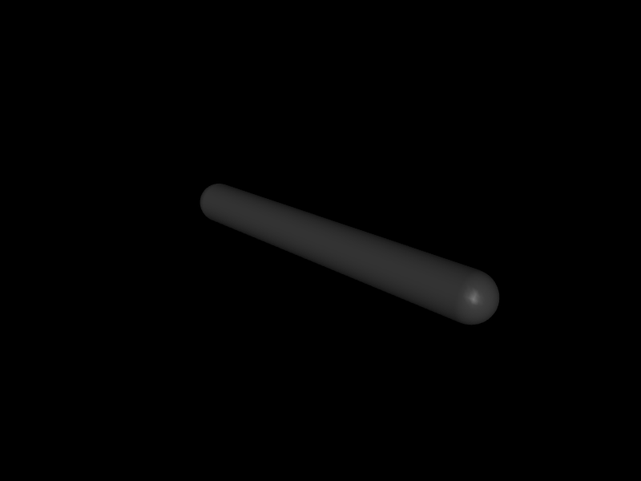

# 第 21 章　离散控制循环、延迟与饱和

仿真步长是积分器更新物理状态的周期，控制周期是传感—估计—决策—下发的周期。真实机器人中两者几乎从不相同。本章把连续控制公式落实为可执行的离散系统，并解释采样、延迟、限幅和 actuator dynamics 怎样共同决定闭环表现。

## 21.1 学习目标

- 区分 physics timestep、control period、sensor period 和日志周期；
- 正确实现零阶保持、多速率循环与 `mj_step1/mj_step2`；
- 从连续 PD 解释离散闭环稳定性和采样延迟；
- 区分 `ctrlrange`、`forcerange`、关节力矩限制与功率限制；
- 为积分环节实现 anti-windup，并设计控制回归指标。

## 21.2 四只时钟

设物理步长 \(h_p=1\,ms\)，控制周期 \(h_c=5\,ms\)，IMU 周期 \(h_s=2\,ms\)，日志周期 \(h_l=10\,ms\)。一个可靠循环不是把四种任务都塞进每次 `mj_step`：

```text
physics:  |.|.|.|.|.|.|.|.|.|.|.|.|.|.|.|.|.|.|.|
sensor:   |---|---|---|---|---|---|---|---|---|---|
control:  |---------|---------|---------|---------|
log:      |-------------------|-------------------|
```

在两个控制时刻之间，命令通常做零阶保持：\(u(t)=u_k\)。不要用浮点时间的精确相等判断任务是否到期；优先使用整数 step counter，或用 `while (next_time <= d->time + tolerance)` 处理非整数频率比。

## 21.3 离散 PD

单关节连续控制律：

\[
\tau=K_p(q_d-q)+K_d(v_d-v)+\tau_{ff}.
\]

若局部动力学近似为 \(I\ddot q+b\dot q=\tau\)，理想连续闭环特征多项式为

\[
Is^2+(b+K_d)s+K_p.
\]

按期望自然频率 \(\omega_n\) 与阻尼比 \(\zeta\) 可取

\[
K_p=I\omega_n^2,
\qquad K_d=2\zeta I\omega_n-b.
\]

但这是连续、无延迟近似。离散控制实际使用旧采样 \(q_k,v_k\) 并保持 \(h_c\)，等效加入相位滞后。提高控制周期而不重新整定增益，可能出现过冲、极限环甚至发散。

### 导数项从哪里来

MuJoCo 直接给出 `qvel`，仿真内可用它构造理想速度反馈。真实编码器通常只有位置，需要差分与滤波。若教材实验直接使用无噪声 `qvel`，必须标注这是“状态反馈上界”，不能据此断言实机导数增益可靠。

## 21.4 控制回调与拆分步进

有两种常见写法：

1. 在 `mj_step` 前写 `d->ctrl`；
2. 安装 `mjcb_control`，由引擎在 forward pipeline 需要控制时调用。

回调方便，但它是进程级全局入口，并可能在有限差分、rollout 或多线程中被多次调用。回调必须是当前状态的纯函数或显式使用每个 `mjData` 的上下文。

需要在完成位置/速度阶段后读取最新 sensor 再写控制时，可用：

```cpp
mj_step1(m, d);
// 读取派生量与 sensor，计算 d->ctrl
mj_step2(m, d);
```

RK4 不支持这种任意的 `step1/step2` 控制语义；使用前应核对官方 API 说明和积分器限制。

## 21.5 饱和不是一个 clamp

控制链中可能有多级边界：

```text
期望命令 → ctrlrange → activation dynamics → gain/bias
         → forcerange → transmission → joint actuatorfrcrange
         → 电源/热/速度相关真实限制
```

- `ctrlrange` 限制输入语义，例如期望位置或电流命令；
- `forcerange` 限制 actuator scalar force；
- joint/tendon actuator force range 限制多个 actuator 映射后的总量；
- gear 会改变 scalar force 到广义力的比例。

因此看到 `ctrl=1` 不能直接说是 1 N·m。必须结合第 9 章的 actuator gain、bias、gear 与 transmission。

## 21.6 积分与 anti-windup

PID 中

\[
I_{k+1}=I_k+h_c e_k,
\qquad
u_k=K_pe_k+K_d\dot e_k+K_iI_k.
\]

当命令饱和，积分器仍累加就会 windup，解除饱和后产生巨大过冲。最简单的条件积分是：只有未饱和，或当前误差能把命令拉回可行区时才积分。back-calculation 则使用

\[
I_{k+1}=I_k+h_c\left(e_k+K_{aw}(u_{sat}-u_{raw})\right).
\]

积分状态属于控制器，不在 `mjData` 的物理 state spec 中。做 snapshot/rollout 时必须和估计器状态、延迟队列一起复制。

## 21.7 独立实验：控制周期与饱和

`examples/31_sampled_pd/` 用相同物理步长运行三个独立仿真：1 ms 控制、20 ms 控制和 20 ms 控制加一拍延迟。控制命令都受相同力矩限幅。

```bash
cd examples/31_sampled_pd
cmake -S . -B build -DCMAKE_BUILD_TYPE=Release
cmake --build build -j
./build/demo model.xml
```

实验不追求“某组参数永远稳定”，而是训练读者观察上升时间、最大误差、饱和占空比与终值误差。把 `Kp/Kd` 增大一倍后再次运行，延迟分支通常最早暴露稳定裕量不足。

<!-- EMBEDDED_EXAMPLE_BEGIN: 31_sampled_pd -->
### 可视化运行与效果

```bash
../../mujoco-3.11.0/bin/simulate model.xml
```

该命令使用发布包自带的官方 `simulate` 界面，可暂停、单步、施加扰动并开启接触等可视化标志。



*31_sampled_pd 的真实 MuJoCo 原生渲染结果。*

### 实验完整源码

以下文件与 `examples/31_sampled_pd/` 中可直接编译的版本一致。

#### 模型文件：`model.xml`

```xml
<mujoco model="sampled PD">
  <option timestep="0.001" gravity="0 0 0" integrator="implicitfast"/>
  <worldbody>
    <body>
      <joint name="joint" axis="0 0 1" damping="0.05" armature="0.02"/>
      <geom type="capsule" fromto="0 0 0 .6 0 0" size=".04" mass="1"/>
    </body>
  </worldbody>
  <actuator><motor joint="joint" ctrlrange="-3 3" ctrllimited="true"/></actuator>
</mujoco>
```

#### 程序源码：`main.cc`

```cpp
#include <cmath>
#include <cstdio>
#include <cstdlib>
#include <mujoco/mujoco.h>

struct Result { double final_error, rms_error, peak_error, saturation; };

Result run(const mjModel* m, int control_steps, bool one_cycle_delay) {
  mjData* d = mj_makeData(m);
  double command = 0, delayed = 0, sum2 = 0, peak = 0;
  int saturated = 0, steps = 3000;
  for (int k = 0; k < steps; ++k) {
    double target = k < 500 ? 0.0 : 1.0;
    if (k % control_steps == 0) {
      double raw = 8.0*(target-d->qpos[0]) - 0.7*d->qvel[0];
      double next = mju_clip(raw, -3.0, 3.0);
      if (std::fabs(raw) > 3.0) ++saturated;
      if (one_cycle_delay) { command = delayed; delayed = next; }
      else command = next;
    }
    d->ctrl[0] = command;
    mj_step(m, d);
    double e = target-d->qpos[0];
    sum2 += e*e;
    peak = mju_max(peak, std::fabs(e));
  }
  Result r{std::fabs(1.0-d->qpos[0]), std::sqrt(sum2/steps), peak,
           double(saturated)/(steps/control_steps)};
  mj_deleteData(d);
  return r;
}

int main(int argc, char** argv) {
  if (argc != 2) { std::fprintf(stderr, "用法: %s model.xml\n", argv[0]); return 1; }
  char error[1024] = {0};
  mjModel* m = mj_loadXML(argv[1], NULL, error, sizeof(error));
  if (!m) { std::fprintf(stderr, "%s\n", error); return 1; }
  const char* names[3] = {"1 ms", "20 ms", "20 ms + one-cycle delay"};
  Result r[3] = {run(m, 1, false), run(m, 20, false), run(m, 20, true)};
  std::puts("case                    final_error   rms_error   peak_error   saturation");
  for (int i = 0; i < 3; ++i)
    std::printf("%-24s %.6f      %.6f    %.6f     %.1f%%\n", names[i],
                r[i].final_error, r[i].rms_error, r[i].peak_error, 100*r[i].saturation);
  mj_deleteModel(m);
  return 0;
}
```

#### 构建文件：`CMakeLists.txt`

```cmake
cmake_minimum_required(VERSION 3.16)
project(31_sampled_pd LANGUAGES CXX)

set(CMAKE_CXX_STANDARD 17)
add_executable(demo main.cc)

set(MUJOCO_ROOT ${CMAKE_CURRENT_LIST_DIR}/../../mujoco-3.11.0)
target_include_directories(demo PRIVATE ${MUJOCO_ROOT}/include)
target_link_directories(demo PRIVATE ${MUJOCO_ROOT}/lib)
target_link_libraries(demo PRIVATE mujoco)
set_target_properties(demo PROPERTIES BUILD_RPATH ${MUJOCO_ROOT}/lib)
```
<!-- EMBEDDED_EXAMPLE_END: 31_sampled_pd -->

## 21.8 人形与机械臂工程模式

机械臂常见分层：1 kHz 电流/力矩环、200～1000 Hz 关节控制、50～200 Hz 轨迹规划。人形机器人还会加入高频 IMU、状态估计、全身控制和较低频步态规划。仿真应复现接口频率和保持行为，而非所有算法都按物理步长运行。

建议每个控制实验至少报告：

- RMS 与峰值 tracking error；
- command/force 饱和比例；
- 峰值速度、加速度与功率；
- 扰动恢复时间；
- timestep 减半后的指标变化；
- 传感噪声、延迟和参数扰动下的统计分布。

## 21.9 常见误区

- 每个 physics step 运行重型规划器，得到实机不可实现的零延迟控制；
- 用 `d->time == next_time` 调度，多次或漏掉触发；
- 只 clamp `ctrl`，却忽略 gear 后的关节力矩；
- PD 使用仿真真值速度，部署时改用噪声差分却不重新整定；
- reset 只清 `mjData`，忘记控制积分、滤波器和命令队列；
- 在 control callback 分配内存或使用非线程安全全局变量；
- 用更小 physics timestep 掩盖低控制频率带来的相位滞后。

## 21.10 习题与答案

1. 物理步长 1 ms、控制周期 5 ms，控制器应多久更新一次？  
   **答案：**每 5 个 physics step 更新，期间保持上次命令。

2. 同样 PD 增益下，为什么增加一拍延迟可能发散？  
   **答案：**延迟增加相位滞后，降低离散闭环稳定裕量；高频处尤其明显。

3. `ctrlrange=-1 1` 是否意味着关节力矩限制为 ±1 N·m？  
   **答案：**不一定，需经过 actuator gain/bias、activation 和 gear/transmission，且可能还有 force range。

4. rollout 时为何要复制 PID 积分状态？  
   **答案：**相同物理状态但不同积分历史会产生不同控制，未来轨迹不再相同。

5. 怎样证明控制效果不是依赖过小 timestep？  
   **答案：**在保持控制周期不变的前提下减半 physics timestep，并比较误差、饱和和稳定性指标是否收敛。
