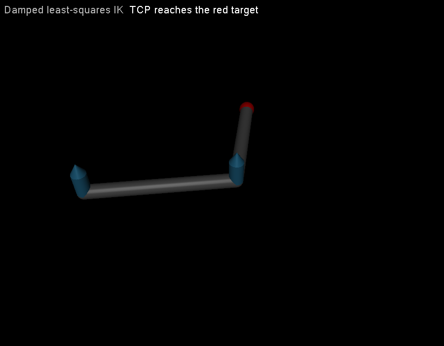

# 第 22 章　逆运动学与阻尼最小二乘

> 本书示例代码仓库：[libing403/mujoco_tutorial](https://github.com/libing403/mujoco_tutorial)

逆运动学（IK）回答：为了让末端到达目标位姿，关节配置应怎样变化？它不涉及质量和力，却是机械臂规划、人形足端约束、遥操作和模型标定的基础。本章从速度映射推导 Jacobian transpose、伪逆与阻尼最小二乘，并把算法放回 MuJoCo 的配置流形中。

## 22.1 学习目标

- 建立位置与姿态残差，并明确表达坐标系；
- 从线性化 \(e(q+\delta q)\) 推导三类 IK 更新；
- 解释奇异值、可操作度和阻尼的关系；
- 对 free/ball joint 使用 `mj_integratePos`，避免直接相加四元数；
- 处理步长、关节限位、权重、零空间和不可达目标。

## 22.2 IK 是逐次局部线性化

末端任务 \(x=f(q)\)，目标 \(x_d\)，定义位置误差

\[
e=x_d-f(q).
\]

在当前配置附近：

\[
f(q\oplus\delta q)\approx f(q)+J(q)\delta q,
\]

所以希望解

\[
J\delta q\approx e.
\]

这里 \(\delta q\) 是 `nv` 维切空间增量，不一定是 `nq` 维数组差。只有全是 slide/hinge joint 时两者维数和局部加法才恰好一致。

## 22.3 Jacobian transpose

最简单更新：

\[
\delta q=\alpha J^Te.
\]

它可视作最小化 \(\tfrac12\|e\|^2\) 的梯度下降，因为梯度为 \(-J^Te\)。优点是便宜、在奇异处不需求逆；缺点是不同奇异方向尺度差异大，一个固定 \(\alpha\) 往往收敛慢。

不要把它与操作空间力控制混淆：两者都有 `Jᵀ`，但这里把误差变成**配置更新方向**，力控制则由虚功把末端 wrench 映射为**广义力**，单位和增益完全不同。

## 22.4 伪逆

最小二乘问题

\[
\min_{\delta q}\|J\delta q-e\|^2
\]

的最小范数解是 \(\delta q=J^+e\)。当任务维数小于 DoF 且满行秩时，

\[
J^+=J^T(JJ^T)^{-1}.
\]

SVD 解释最清楚：若 \(J=U\Sigma V^T\)，伪逆把每个可达方向除以奇异值 \(\sigma_i\)。当 \(\sigma_i\to0\)，微小任务误差会变成巨大关节更新，这就是伸直机械臂附近的奇异放大。

## 22.5 阻尼最小二乘（DLS）

加入 Tikhonov 正则：

\[
\min_{\delta q}\|J\delta q-e\|^2+\lambda^2\|\delta q\|^2.
\]

解为

\[
\delta q=J^T(JJ^T+\lambda^2I)^{-1}e
          =(J^TJ+\lambda^2I)^{-1}J^Te.
\]

前一种形式求逆矩阵大小为任务维数，适合高 DoF、低维末端任务；后一种适合 DoF 较少。DLS 在奇异方向使用 \(\sigma_i/(\sigma_i^2+\lambda^2)\)，不再无限放大。

`lambda` 越大越稳健但收敛越慢、稳态残差越大。实用策略是按最小奇异值自适应阻尼，或先用固定小阻尼建立可靠基线。

## 22.6 姿态误差

不能直接把四元数四个分量相减。设当前单位四元数 \(q_c\)、目标 \(q_d\)，误差旋转

\[
q_e=q_d\otimes q_c^{-1}.
\]

把它映射为三维旋转向量 \(e_R=\theta\hat u\)，再与 `mj_jacSite` 的转动 Jacobian 对应。MuJoCo 提供 `mju_subQuat` 计算切空间姿态差；同时要处理 \(q\) 与 \(-q\) 表示同一姿态的双覆盖。

六维位姿任务常写为

\[
e=\begin{bmatrix}w_p(p_d-p)\\w_R e_R\end{bmatrix},
\qquad
J=\begin{bmatrix}w_pJ_p\\w_RJ_R\end{bmatrix}.
\]

位置单位是米，姿态单位是弧度，权重决定二者折中，不能不加说明地直接拼接。

## 22.7 在配置流形上更新

求得 `nv` 维 `dq` 后：

```cpp
mj_integratePos(m, d->qpos, dq, step_size);
mj_forward(m, d);
```

`mj_integratePos` 对 hinge/slide 做加法，对 ball/free joint 做四元数指数映射并保持单位范数。直接执行 `qpos[i] += dq[i]` 在浮动基座机器人上维数就不匹配。

大步更新会让线性化失效。可限制 `||dq||`，或使用 line search：尝试 \(\alpha=1,1/2,1/4,...\)，只接受降低代价的步长。

## 22.8 关节限位与零空间

简单 clip 关节角虽然实用，但它破坏了求解方向，目标靠近限位时容易震荡。更系统的方法包括 box-constrained least squares、active set 或在代价中加入限位 barrier。

冗余机械臂可利用零空间：

\[
\delta q=J^+e+(I-J^+J)z,
\]

其中 \(z\) 可用于远离限位、保持舒适姿态或提高 manipulability。数值阻尼下 \(I-J^+J\) 不再是严格投影，主次任务会有小耦合，工程上应验证主任务误差。

## 22.9 独立实验：二维机械臂 DLS

`examples/32_damped_ik/` 用 2-DoF 平面臂到达二维目标。每轮调用 `mj_forward` 和 `mj_jacSite`，显式求解 2×2 的 \(JJ^T+\lambda^2I\)，再由 `mj_integratePos` 更新配置。

```bash
cd examples/32_damped_ik
cmake -S . -B build -DCMAKE_BUILD_TYPE=Release
cmake --build build -j
./build/demo model.xml
```

把目标改为 `(1.1, 0)`，超过 0.9 m 最大臂展，观察算法不会“报错退出”，而是停在最接近配置并保留不可消除残差。这是迭代优化器的正常行为，应用层必须自行定义可达性阈值。

<!-- EMBEDDED_EXAMPLE_BEGIN: 32_damped_ik -->
### 可视化运行与效果

```bash
./build/demo model.xml --view
```

窗口显示的是示例算法正在修改和推进的同一个 `mjData`。源码有意不封装 viewer：先用 GLFW 创建 OpenGL context，再初始化 `mjvScene/mjrContext`，用 `mjv_updateScene`读取算法使用的 `mjData`，再调用 `mjr_render` 和交换缓冲区，最后按创建的逆序释放资源。



*32_damped_ik 的真实 MuJoCo 原生渲染结果。*

### 实验完整源码

以下文件与 `examples/32_damped_ik/` 中可直接编译的版本一致。

#### 模型文件：`model.xml`

```xml
<mujoco model="damped IK">
  <option gravity="0 0 0"/>
  <worldbody>
    <body>
      <joint axis="0 0 1"/>
      <geom type="capsule" fromto="0 0 0 .5 0 0" size=".025"/>
      <body pos=".5 0 0">
        <joint axis="0 0 1"/>
        <geom type="capsule" fromto="0 0 0 .4 0 0" size=".025"/>
        <site name="tcp" pos=".4 0 0" size=".025"/>
      </body>
    </body>
    <site name="target" pos=".55 .45 0" type="sphere" size=".03" rgba="1 0 0 1"/>
  </worldbody>
</mujoco>
```

#### 程序源码：`main.cc`

```cpp
#include <cmath>
#include <cstdio>
#include <cstdlib>
#include <cstring>
#define GLFW_INCLUDE_NONE
#include <GLFW/glfw3.h>
#include <mujoco/mujoco.h>

int main(int argc, char** argv) {
  bool view=argc==3 && std::strcmp(argv[2],"--view")==0;
  if (argc<2 || argc>3 || (argc==3 && !view)) {
    std::fprintf(stderr,"\u7528\u6cd5: %s model.xml [--view]\n",argv[0]); return 1;
  }
  char error[1024] = {0};
  mjModel* m = mj_loadXML(argv[1], NULL, error, sizeof(error));
  if (!m) { std::fprintf(stderr, "%s\n", error); return 1; }
  mjData* d = mj_makeData(m);
  int tcp = mj_name2id(m, mjOBJ_SITE, "tcp");
  int target = mj_name2id(m, mjOBJ_SITE, "target");
  const double lambda2 = 0.02*0.02;

  for (int iter = 0; iter < 100; ++iter) {
    mj_forward(m, d);
    double e[2] = {d->site_xpos[3*target]-d->site_xpos[3*tcp],
                   d->site_xpos[3*target+1]-d->site_xpos[3*tcp+1]};
    if (std::hypot(e[0], e[1]) < 1e-9) break;
    mjtNum jp[6], jr[6];
    mj_jacSite(m, d, jp, jr, tcp);
    double a = jp[0]*jp[0] + jp[1]*jp[1] + lambda2;
    double b = jp[0]*jp[2] + jp[1]*jp[3];
    double c = jp[2]*jp[2] + jp[3]*jp[3] + lambda2;
    double det = a*c-b*b;
    double y[2] = {(c*e[0]-b*e[1])/det, (-b*e[0]+a*e[1])/det};
    mjtNum dq[2] = {jp[0]*y[0]+jp[2]*y[1], jp[1]*y[0]+jp[3]*y[1]};
    double norm = std::hypot(dq[0], dq[1]);
    double step = norm > 0.2 ? 0.2/norm : 1.0;
    mj_integratePos(m, d->qpos, dq, step);
  }
  mj_forward(m, d);
  double ex = d->site_xpos[3*target]-d->site_xpos[3*tcp];
  double ey = d->site_xpos[3*target+1]-d->site_xpos[3*tcp+1];
  std::printf("q = [% .9f, % .9f]\n", d->qpos[0], d->qpos[1]);
  std::printf("tcp = [%.9f, %.9f], target = [%.9f, %.9f]\n",
              d->site_xpos[3*tcp], d->site_xpos[3*tcp+1],
              d->site_xpos[3*target], d->site_xpos[3*target+1]);
  std::printf("position error = %.3g m\n", std::hypot(ex, ey));
  if (view) {
    if (!glfwInit()) return 1;
    GLFWwindow* window=glfwCreateWindow(900,700,"32 damped IK",NULL,NULL);
    if (!window) { glfwTerminate(); return 1; }
    glfwMakeContextCurrent(window);
    mjvCamera cam; mjv_defaultCamera(&cam); mjv_defaultFreeCamera(m,&cam);
    mjvOption opt; mjv_defaultOption(&opt); opt.flags[mjVIS_JOINT]=1;
    mjvScene scene; mjv_defaultScene(&scene); mjv_makeScene(m,&scene,1000);
    mjrContext con; mjr_defaultContext(&con); mjr_makeContext(m,&con,mjFONTSCALE_150);
    while (!glfwWindowShouldClose(window)) {
      int width,height; glfwGetFramebufferSize(window,&width,&height);
      mjrRect viewport={0,0,width,height};
      mjv_updateScene(m,d,&opt,NULL,&cam,mjCAT_ALL,&scene);
      mjr_render(viewport,&scene,&con);
      mjr_overlay(mjFONT_NORMAL,mjGRID_TOPLEFT,viewport,
                  "Damped least-squares IK","TCP reaches the red target",&con);
      glfwSwapBuffers(window); glfwPollEvents();
    }
    mjr_freeContext(&con); mjv_freeScene(&scene);
    glfwDestroyWindow(window); glfwTerminate();
  }
  mj_deleteData(d); mj_deleteModel(m); return 0;
}
```

#### 构建文件：`CMakeLists.txt`

```cmake
cmake_minimum_required(VERSION 3.16)
project(32_damped_ik LANGUAGES CXX)

set(CMAKE_CXX_STANDARD 17)
add_executable(demo main.cc)

set(MUJOCO_ROOT ${CMAKE_CURRENT_LIST_DIR}/../../mujoco-3.11.0)
target_include_directories(demo PRIVATE ${MUJOCO_ROOT}/include ${MUJOCO_ROOT}/third_party/glfw/include)
target_link_directories(demo PRIVATE ${MUJOCO_ROOT}/lib ${MUJOCO_ROOT}/third_party/glfw/lib)
target_link_libraries(demo PRIVATE mujoco glfw)
set_target_properties(demo PROPERTIES BUILD_RPATH "${MUJOCO_ROOT}/lib;${MUJOCO_ROOT}/third_party/glfw/lib")
```
<!-- EMBEDDED_EXAMPLE_END: 32_damped_ik -->

## 22.10 故障诊断

- 误差前几轮下降、随后上升：步长过大，使用 line search 或限幅；
- 伸直姿态关节更新爆炸：阻尼过小或使用了裸逆；
- 位置正确但姿态乱转：姿态残差符号、frame 或四元数顺序错误；
- 浮动基座四元数逐渐失真：没有用 `mj_integratePos`；
- 末端停在错误方向：检查 `Jp` 的行布局和世界/局部目标坐标；
- 靠近关节限位抖动：clip 与主任务相互打架，改用约束最小二乘；
- 多任务单位不一致：显式写出位置/姿态权重及其物理意义。

## 22.11 习题与答案

1. 为什么 DLS 在奇异处比伪逆稳定？  
   **答案：**奇异方向增益从 `1/sigma` 变成 `sigma/(sigma²+lambda²)`，不会无限放大。

2. `nq=7,nv=6` 的 free joint 能否把 6 维更新直接加到 qpos？  
   **答案：**不能；平移三维加四元数四维组成 qpos，更新在六维切空间，应使用 `mj_integratePos`。

3. 不可达目标下“最终误差非零”是否说明实现错误？  
   **答案：**不一定。最小二乘只找到局部最佳可达点，应用应结合阈值、限位和多初值判断。

4. 为什么位置和姿态残差需要权重？  
   **答案：**二者单位和任务容差不同，权重定义优化器如何在冲突时折中。

5. 零空间项怎样避免破坏主任务？  
   **答案：**将次任务方向投影到 `I-J⁺J`；使用阻尼近似时仍需监测主任务误差。
