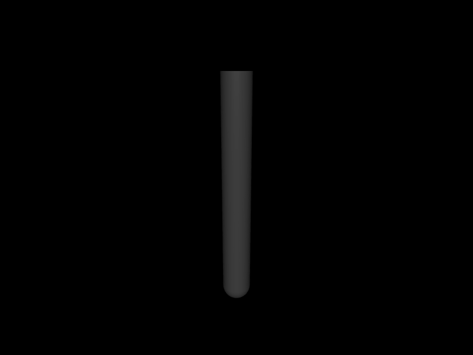

# 第 23 章　非线性最小二乘与系统辨识

官方 `least_squares.ipynb` 的核心动机不是展示一个 Python 工具，而是解决两类机器人问题：用仿真匹配测量的系统辨识，以及用位姿残差求逆运动学。本章在 C++ 中从残差定义开始实现一个最小 Gauss–Newton/Levenberg–Marquardt（LM）闭环，并解释正式工程实现还需要哪些保护。

## 23.1 学习目标

- 从一般 Newton 法推导最小二乘的 Gauss–Newton Hessian；
- 解释 LM 阻尼怎样在 Newton 步与小梯度步之间过渡；
- 为仿真残差选择有限差分尺度、边界与并行策略；
- 区分测量噪声、状态误差、模型结构误差和参数不可辨识；
- 使用 box constraint 约束质量、摩擦、阻尼等物理参数。

## 23.2 从 Newton 法开始

一般优化问题

\[
x^*=\arg\min_x f(x)
\]

在 \(x_k\) 附近的二次近似为

\[
f(x_k+\delta x)\approx f(x_k)+g^T\delta x+
\frac12\delta x^TH\delta x.
\]

令导数为零得到 Newton 步

\[
H\delta x=-g.
\]

但非线性函数的局部二次模型可能只在很小邻域有效，Hessian 也可能不正定。直接求逆既没有必要也数值不稳；实现中应解线性系统并配合正则化或 trust region。

## 23.3 最小二乘结构

定义残差向量 \(r(x)\in\mathbb R^m\)：

\[
f(x)=\frac12r(x)^Tr(x).
\]

残差 Jacobian \(J=\partial r/\partial x\) 给出

\[
g=J^Tr,
\qquad
H=J^TJ+\sum_i r_i\nabla^2r_i.
\]

Gauss–Newton 丢弃第二项：

\[
H_{GN}=J^TJ.
\]

它只需一阶导数，而且半正定。当残差已经较小、局部模型较线性时，近似尤其好；若最优点仍有很大结构性残差，被丢弃的二阶项可能重要。

## 23.4 Levenberg–Marquardt

LM 步满足

\[
(J^TJ+\mu I)\delta x=-J^Tr.
\]

- \(\mu\to0\)：接近 Gauss–Newton，局部收敛快；
- \(\mu\) 很大：\(\delta x\approx-\frac1\mu J^Tr\)，成为保守梯度步；
- 每次接受真正降低代价的候选后减小 \(\mu\)，拒绝后增大 \(\mu\) 并重试。

官方 notebook 强调有效 \(\mu\) 往往集中在狭窄数量级范围，因此固定一个“神奇阻尼”不是健壮算法。正式实现应根据实际下降量与局部模型预测下降量之比调节信赖程度。

## 23.5 Box constraint

系统辨识参数通常有自然边界：

\[
l\preccurlyeq x\preccurlyeq u.
\]

质量和摩擦不能为负，关节角不能越限，时间常数应大于 timestep。简单地先算无约束步再 clip 候选可用于一维教学，但多维耦合问题应解 box-constrained quadratic program。MuJoCo 提供 `mju_boxQP`；它求的是局部 QP，外层仍需 LM/line search 管理非线性。

在边界附近做有限差分时，中心差分可能越界。应自动改用可行方向的前向/后向差分，或按距离边界缩短扰动。

## 23.6 有限差分 Jacobian

若仿真 rollout 定义残差，解析 \(J\) 通常不可得。第 \(j\) 列中心差分：

\[
J_{:j}\approx\frac{r(x+\epsilon_je_j)-r(x-\epsilon_je_j)}{2\epsilon_j}.
\]

`epsilon` 太大有截断误差，太小会被浮点舍入、solver tolerance 和接触模式切换淹没。参数量纲不同，应使用

\[
\epsilon_j=\epsilon_{rel}\max(1,|x_j|)

\]

并结合参数边界尺度。每列差分 rollout 相互独立，是 CPU 多线程或批量 rollout 的自然并行维度。

接触事件会让残差关于参数分段光滑甚至不连续。此时更小 epsilon 不一定更准确；可延长统计窗口、使用平滑特征或无导数方法，并报告多初值结果。

## 23.7 系统辨识残差设计

设测量 \(y_{t,s}\) 与模拟输出 \(\hat y_{t,s}(x)\)，标准化残差可写成

\[
r_{t,s}(x)=\frac{\hat y_{t,s}(x)-y_{t,s}}{\sigma_s}.
\]

`sigma_s` 可以是传感噪声标准差或工程容差，使角度、速度、力等不同单位可比较。不要仅拟合一个终点：许多参数组合能得到相同终态，却产生不同瞬态。

一次可信辨识应拆分：

1. training trajectory 用于拟合；
2. validation trajectory 使用不同初态/激励验证；
3. 参数扰动或 profile cost 检查可辨识性；
4. 多初值重复，区分局部极小值；
5. 保留物理上合理的参数范围与先验。

如果激励轨迹中关节几乎不动，阻尼无法辨识；若速度范围过小，粘性与库仑摩擦也可能高度相关。优化器不能创造数据中不存在的信息。

## 23.8 独立实验：从轨迹辨识阻尼

`examples/33_damping_identification/` 先用隐藏的真值阻尼生成单摆角度轨迹，再从错误初值出发。每次候选都创建独立 `mjData`、重放同一初态，有限差分残差，使用一维 LM 步并施加 `[0,2]` box constraint。

```bash
cd examples/33_damping_identification
cmake -S . -B build -DCMAKE_BUILD_TYPE=Release
cmake --build build -j
./build/demo model.xml
```

这是无噪声闭环自检，证明代码和参数通道正确，不等于真实辨识已经解决。练习中加入测量噪声、质量偏差及第二条验证轨迹，会看到估计不再精确等于生成参数。

<!-- EMBEDDED_EXAMPLE_BEGIN: 33_damping_identification -->
### 可视化运行与效果

```bash
../../mujoco-3.11.0/bin/simulate model.xml
```

该命令使用发布包自带的官方 `simulate` 界面，可暂停、单步、施加扰动并开启接触等可视化标志。



*33_damping_identification 的真实 MuJoCo 原生渲染结果。*

### 实验完整源码

以下文件与 `examples/33_damping_identification/` 中可直接编译的版本一致。

#### 模型文件：`model.xml`

```xml
<mujoco model="damping identification">
  <option timestep="0.002" integrator="RK4"/>
  <worldbody>
    <body>
      <joint name="hinge" axis="0 1 0" damping="0"/>
      <geom type="capsule" fromto="0 0 0 0 0 -.6" size=".035" mass="1"/>
    </body>
  </worldbody>
</mujoco>
```

#### 程序源码：`main.cc`

```cpp
#include <cmath>
#include <cstdio>
#include <cstdlib>
#include <vector>
#include <mujoco/mujoco.h>

std::vector<double> trajectory(mjModel* m, double damping) {
  m->dof_damping[0] = damping;
  mjData* d = mj_makeData(m);
  d->qpos[0] = 1.0;
  mj_forward(m, d);
  std::vector<double> y;
  for (int k = 0; k <= 1000; ++k) {
    if (k % 10 == 0) y.push_back(d->qpos[0]);
    mj_step(m, d);
  }
  mj_deleteData(d);
  return y;
}

double cost(const std::vector<double>& a, const std::vector<double>& b) {
  double value = 0;
  for (size_t i = 0; i < a.size(); ++i) {
    double r = a[i]-b[i]; value += 0.5*r*r;
  }
  return value;
}

int main(int argc, char** argv) {
  if (argc != 2) { std::fprintf(stderr, "用法: %s model.xml\n", argv[0]); return 1; }
  char error[1024] = {0};
  mjModel* m = mj_loadXML(argv[1], NULL, error, sizeof(error));
  if (!m) { std::fprintf(stderr, "%s\n", error); return 1; }
  const std::vector<double> measured = trajectory(m, 0.35);
  double x = 1.2, mu = 1e-3;
  std::puts("iter   damping       cost          mu");
  for (int iter = 0; iter < 15; ++iter) {
    std::vector<double> r0 = trajectory(m, x);
    double f0 = cost(r0, measured), eps = 1e-4;
    std::vector<double> rp = trajectory(m, x+eps);
    double g = 0, h = 0;
    for (size_t i = 0; i < r0.size(); ++i) {
      double r = r0[i]-measured[i];
      double j = (rp[i]-r0[i])/eps;
      g += j*r; h += j*j;
    }
    std::printf("%3d   %.9f   %.6e   %.3g\n", iter, x, f0, mu);
    bool accepted = false;
    for (int trial = 0; trial < 12; ++trial) {
      double candidate = mju_clip(x-g/(h+mu), 0.0, 2.0);
      double f1 = cost(trajectory(m, candidate), measured);
      if (f1 < f0) { x = candidate; mu *= 0.3; accepted = true; break; }
      mu *= 10.0;
    }
    if (!accepted || std::fabs(g/(h+mu)) < 1e-10) break;
  }
  std::printf("estimated damping = %.9f, true damping = 0.350000000\n", x);
  mj_deleteModel(m); return 0;
}
```

#### 构建文件：`CMakeLists.txt`

```cmake
cmake_minimum_required(VERSION 3.16)
project(33_damping_identification LANGUAGES CXX)

set(CMAKE_CXX_STANDARD 17)
add_executable(demo main.cc)

set(MUJOCO_ROOT ${CMAKE_CURRENT_LIST_DIR}/../../mujoco-3.11.0)
target_include_directories(demo PRIVATE ${MUJOCO_ROOT}/include)
target_link_directories(demo PRIVATE ${MUJOCO_ROOT}/lib)
target_link_libraries(demo PRIVATE mujoco)
set_target_properties(demo PROPERTIES BUILD_RPATH ${MUJOCO_ROOT}/lib)
```
<!-- EMBEDDED_EXAMPLE_END: 33_damping_identification -->

## 23.9 非二次 norm

异常值会在平方损失中获得巨大权重。可用 smooth L1、Cauchy 等鲁棒损失 \(n(r)\)。一般化的 Gauss–Newton 形式为

\[
g=J^T\nabla n,
\qquad
H_{GN}=J^T\nabla^2nJ.
\]

鲁棒损失不能修复时间同步错误、坐标系错误或错误模型结构；它只降低少量大残差对拟合的支配。

## 23.10 常见误区

- 每次参数评估没有 reset 完整初态，残差变成有历史的随机函数；
- 直接修改质量/惯量等编译常量却未调用所需的 `mj_setConst` 或重新编译；
- 参数使用米、毫米、N·m 等混合尺度，却共用绝对 epsilon；
- 只在生成数据的同一轨迹报告训练误差；
- 把低损失当成参数唯一：相关参数可能沿长谷地互相补偿；
- 优化穿过接触模式边界，却期待光滑二阶收敛；
- 显式计算矩阵逆，而不是 Cholesky/QR/SVD 解线性系统。

## 23.11 习题与答案

1. Gauss–Newton Hessian 为什么不会负定？  
   **答案：**任意向量 `z` 都有 `zᵀJᵀJz=||Jz||²≥0`，所以它半正定。

2. LM 参数增大时，更新为何趋向梯度方向？  
   **答案：**当 `mu I` 主导时，逆矩阵近似 `(1/mu)I`，步长约为 `-(1/mu)Jᵀr`。

3. 为什么辨识阻尼需要足够速度激励？  
   **答案：**粘性阻尼力与速度成正比；速度接近零时残差对阻尼的敏感度接近零。

4. validation loss 远大于 training loss 说明什么？  
   **答案：**可能过拟合、激励覆盖不足、初态/噪声处理错误或模型结构无法泛化，需要逐项诊断。

5. box constraint 能否保证物理正确？  
   **答案：**只能保证参数落在给定区间，无法保证结构、坐标、激励和残差定义正确。
