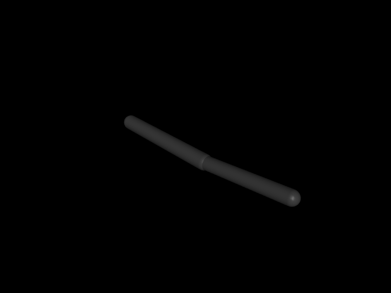

# 第 24 章　轨迹生成与计算力矩控制

PD 只根据误差“推回去”，没有显式考虑关节耦合、重力和惯量随姿态变化。计算力矩控制（computed torque）利用 MuJoCo 的动力学量把非线性系统局部变成期望的二阶误差系统。本章同时强调：前馈再精确，也不能替代平滑轨迹、反馈和饱和管理。

## 24.1 学习目标

- 构造位置、速度、加速度连续的关节轨迹；
- 推导逆动力学前馈与 computed-torque 反馈；
- 从 `qM`、`qfrc_bias` 正确生成电机 torque command；
- 识别 actuator transmission、约束和模型误差造成的偏差；
- 用 tracking、torque、power 和鲁棒性指标评价控制器。

## 24.2 为什么轨迹必须包含三阶信息

控制器通常需要 \(q_d,\dot q_d,\ddot q_d\)。若只给离散位置点再差分，速度和加速度会尖峰，前馈力矩随之剧烈变化。

从 \(q_0\) 到 \(q_f\)，令归一化时间 \(s=t/T\)。三次 smoothstep

\[
h(s)=3s^2-2s^3
\]

保证端点速度为零，但端点加速度不为零。五次多项式

\[
h(s)=10s^3-15s^4+6s^5
\]

使端点速度、加速度都为零：

\[
q_d=q_0+(q_f-q_0)h(s).
\]

其一、二阶导数分别除以 \(T\)、\(T^2\)。时间缩短一半时，所需速度约翻倍、加速度约四倍，这解释了“几何路径可达但动态轨迹不可执行”。

## 24.3 逆动力学前馈

无活动约束时动力学为

\[
M(q)\ddot q+c(q,\dot q)=\tau.
\]

若模型与状态完全准确，可令

\[
\tau_{ff}=M(q)\ddot q_d+c(q,\dot q).
\]

MuJoCo 中 `qfrc_bias` 对应 Coriolis、离心和重力等偏置；`qM` 是稀疏质量矩阵。可用 `mj_mulM` 直接算 \(M\ddot q_d\)，避免不必要地展开稠密矩阵。

另一条路径是把期望 `qacc` 写入临时 `mjData` 后调用 `mj_inverse`。但必须明确 applied/passive/constraint force 的状态，否则得到的“所需力”可能包含或扣除了意外项。

## 24.4 计算力矩控制

定义辅助加速度

\[
v_c=\ddot q_d+K_d(\dot q_d-\dot q)+K_p(q_d-q),
\]

再令

\[
\tau=M(q)v_c+c(q,dot q).
\]

代入理想模型得到误差系统

\[
\ddot e+K_d\dot e+K_pe=0.
\]

因此可按自然频率与阻尼比选对角增益：\(K_p=\omega_n^2\)、\(K_d=2\zeta\omega_n\)。注意这里增益作用在“期望加速度”层，与直接 torque PD 的单位不同；质量矩阵随后将其映射为力矩。

实际闭环存在模型参数误差、离散延迟、摩擦、接触和 actuator saturation，所以反馈不可省略。模型越差，computed torque 越像带有不准前馈的反馈控制器。

## 24.5 MuJoCo 数据流

每个控制时刻：

1. 确保当前 `qpos/qvel` 的派生量有效（正常 `mj_step` 循环中上一帧已完成；手工改状态后调用 `mj_forward`）；
2. 计算轨迹 `qd/vd/ad`；
3. 构造 `vc`；
4. `mj_mulM(m,d,tau,vc)`；
5. 加 `d->qfrc_bias`；
6. 根据 actuator transmission 把广义力转换为 `ctrl`；
7. 应用 control/force/功率限制并 `mj_step`。

只有每个 DoF 都由 unit-gear motor 独立驱动时，才能直接 `ctrl[i]=tau[i]`。带减速器、肌腱、欠驱动或多个 actuator 的系统需要解 transmission force allocation。

## 24.6 接触系统中的边界

对自由空间机械臂，computed torque 很直接。对双足人形，浮动基座 6 DoF 没有 actuator，接触力还必须满足摩擦锥和单边约束。不能对全 `nv` 直接命令 \(M v_c+c\)。全身控制通常解带接触动力学与 actuator bounds 的 QP：

\[
M\dot v+c=S^T\tau+J_c^Tf_c,
\]

同时约束接触加速度、摩擦锥和力矩范围。computed torque 仍是理解该 QP 的基础，但不是浮动基系统的完整答案。

## 24.7 独立实验：两连杆轨迹跟踪

`examples/34_computed_torque/` 在同一模型、同一正弦轨迹上运行直接 torque PD 与 computed torque。后者每个物理步使用 `mj_mulM` 和 `qfrc_bias`，两个 unit motor 直接接收关节力矩。

```bash
cd examples/34_computed_torque
cmake -S . -B build -DCMAKE_BUILD_TYPE=Release
cmake --build build -j
./build/demo model.xml
```

程序输出 RMS joint error 和峰值 torque。对比必须同时看误差与控制代价：把力矩无限增大换来的小误差不是更好的工程方案。

<!-- EMBEDDED_EXAMPLE_BEGIN: 34_computed_torque -->
### 可视化运行与效果

```bash
../../mujoco-3.11.0/bin/simulate model.xml
```

该命令使用发布包自带的官方 `simulate` 界面，可暂停、单步、施加扰动并开启接触等可视化标志。



*34_computed_torque 的真实 MuJoCo 原生渲染结果。*

### 实验完整源码

以下文件与 `examples/34_computed_torque/` 中可直接编译的版本一致。

#### 模型文件：`model.xml`

```xml
<mujoco model="computed torque">
  <option timestep="0.001" integrator="implicitfast"/>
  <worldbody>
    <body>
      <joint name="q1" axis="0 1 0" damping=".05" armature=".01"/>
      <geom type="capsule" fromto="0 0 0 .5 0 0" size=".035" mass="2"/>
      <body pos=".5 0 0">
        <joint name="q2" axis="0 1 0" damping=".04" armature=".01"/>
        <geom type="capsule" fromto="0 0 0 .4 0 0" size=".03" mass="1"/>
      </body>
    </body>
  </worldbody>
  <actuator>
    <motor joint="q1" ctrlrange="-30 30" ctrllimited="true"/>
    <motor joint="q2" ctrlrange="-30 30" ctrllimited="true"/>
  </actuator>
</mujoco>
```

#### 程序源码：`main.cc`

```cpp
#include <cmath>
#include <cstdio>
#include <cstdlib>
#include <mujoco/mujoco.h>

struct Result { double rms, peak_torque; };

Result run(const mjModel* m, bool computed) {
  mjData* d = mj_makeData(m);
  mj_forward(m, d);
  double sum2 = 0, peak = 0;
  const int steps = 5000;
  for (int k = 0; k < steps; ++k) {
    double t = d->time, qd[2] = {0.6*std::sin(1.5*t), -0.5*std::sin(1.5*t)};
    double vd[2] = {0.9*std::cos(1.5*t), -0.75*std::cos(1.5*t)};
    double ad[2] = {-1.35*std::sin(1.5*t), 1.125*std::sin(1.5*t)};
    mjtNum tau[2];
    if (computed) {
      mjtNum desired_acc[2];
      for (int j = 0; j < 2; ++j)
        desired_acc[j] = ad[j] + 80*(qd[j]-d->qpos[j]) + 18*(vd[j]-d->qvel[j]);
      mj_mulM(m, d, tau, desired_acc);
      for (int j = 0; j < 2; ++j) tau[j] += d->qfrc_bias[j];
    } else {
      for (int j = 0; j < 2; ++j)
        tau[j] = 8*(qd[j]-d->qpos[j]) + 1.8*(vd[j]-d->qvel[j]);
    }
    for (int j = 0; j < 2; ++j) {
      d->ctrl[j] = mju_clip(tau[j], -30.0, 30.0);
      peak = mju_max(peak, std::fabs(d->ctrl[j]));
      double e = qd[j]-d->qpos[j]; sum2 += e*e;
    }
    mj_step(m, d);
  }
  Result r{std::sqrt(sum2/(2*steps)), peak};
  mj_deleteData(d); return r;
}

int main(int argc, char** argv) {
  if (argc != 2) { std::fprintf(stderr, "用法: %s model.xml\n", argv[0]); return 1; }
  char error[1024] = {0};
  mjModel* m = mj_loadXML(argv[1], NULL, error, sizeof(error));
  if (!m) { std::fprintf(stderr, "%s\n", error); return 1; }
  Result pd = run(m, false), ct = run(m, true);
  std::printf("torque PD:       RMS error = %.6f rad, peak torque = %.3f Nm\n", pd.rms, pd.peak_torque);
  std::printf("computed torque: RMS error = %.6f rad, peak torque = %.3f Nm\n", ct.rms, ct.peak_torque);
  mj_deleteModel(m); return 0;
}
```

#### 构建文件：`CMakeLists.txt`

```cmake
cmake_minimum_required(VERSION 3.16)
project(34_computed_torque LANGUAGES CXX)

set(CMAKE_CXX_STANDARD 17)
add_executable(demo main.cc)

set(MUJOCO_ROOT ${CMAKE_CURRENT_LIST_DIR}/../../mujoco-3.11.0)
target_include_directories(demo PRIVATE ${MUJOCO_ROOT}/include)
target_link_directories(demo PRIVATE ${MUJOCO_ROOT}/lib)
target_link_libraries(demo PRIVATE mujoco)
set_target_properties(demo PROPERTIES BUILD_RPATH ${MUJOCO_ROOT}/lib)
```
<!-- EMBEDDED_EXAMPLE_END: 34_computed_torque -->

## 24.8 操作空间控制预告

若任务定义在末端，可以设计期望 wrench

\[
F=K_p(x_d-x)+K_d(\dot x_d-Jv)+F_{ff}

\]

再用 \(\tau=J^TF\) 映射。这是第 20 章虚功实验的反向应用。更完整的 operational space formulation 使用

\[
\Lambda=(JM^{-1}J^T)^{-1}
\]

补偿任务空间惯量，并配合动态一致伪逆与零空间。奇异点附近同样需要阻尼。

## 24.9 常见误区

- 轨迹只有 position，`vd/ad` 用噪声差分；
- 把直接 torque PD 的增益原样放入辅助加速度层；
- 将 `qfrc_bias` 和额外重力补偿重复相加；
- 假设 `ctrl` 永远等于 joint torque，忽略 gear/transmission；
- 使用 stale `qM/qfrc_bias`；
- 只报告末端终值，不报告整段 RMS、峰值力矩和功率；
- 将 fully-actuated 固定基方法直接用于浮动基人形；
- 前馈模型由同一模拟器生成和验证，却声称已经证明 sim-to-real 鲁棒性。

## 24.10 习题与答案

1. 五次轨迹时长减半，理想加速度尺度怎样变化？  
   **答案：**约增大四倍，因为二阶时间导数按 `1/T²` 缩放。

2. computed torque 为何仍需要 PD 项？  
   **答案：**前馈模型、状态和执行器不可能完全准确，反馈用于稳定误差并抗扰动。

3. 什么时候可令 `ctrl=tau`？  
   **答案：**每个目标 DoF 由独立 unit-gear direct motor 驱动，且没有额外 actuator 映射时。

4. `mj_mulM` 相比先 `mj_fullM` 有何优势？  
   **答案：**直接利用内部稀疏/结构化质量矩阵做乘法，避免展开和存储完整 `nv×nv` 矩阵。

5. 为什么浮动基座的六个 DoF 不能直接 computed torque？  
   **答案：**它们没有直接 actuator，所需基座 wrench 必须通过关节驱动和环境接触间接产生。
