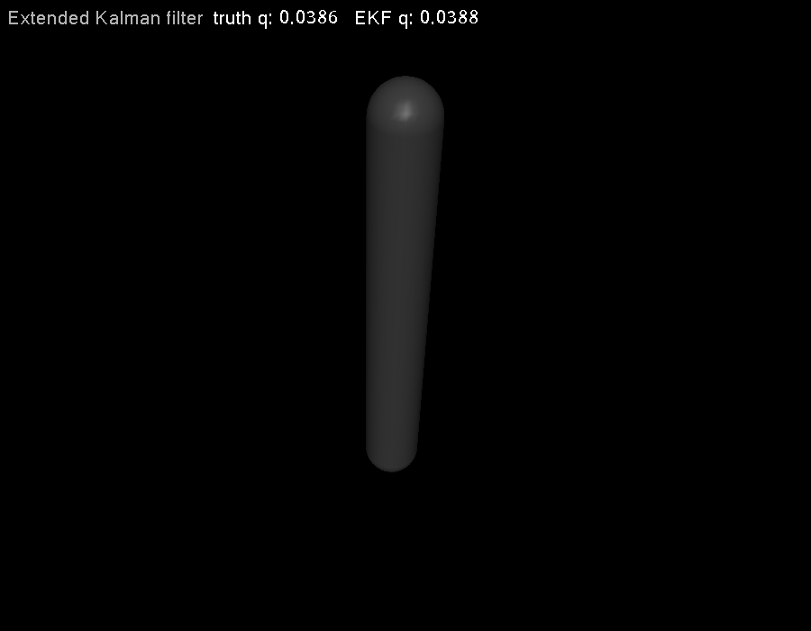

# 第 27 章　状态估计：从仿真真值到 EKF

> 本书示例代码仓库：[libing403/mujoco_tutorial](https://github.com/libing403/mujoco_tutorial)

控制器直接读取 `d->qpos/qvel` 很方便，却会形成“真值泄漏”：真实机器人只能获得带噪声、延迟、偏置和丢包的 sensor streams。本章建立真值、测量、估计三层边界，并用 MuJoCo transition linearization 实现一个扩展 Kalman 滤波器（EKF）。

## 27.1 学习目标

- 区分仿真 ground truth、sensor output 和 estimator state；
- 写出离散预测、协方差传播和测量更新；
- 使用 `mjd_transitionFD` 在线更新 EKF 的 A；
- 理解 Q/R 的物理意义、可观测性和一致性；
- 处理角度、四元数、接触切换、偏置和延迟。

## 27.2 三层数据边界

```text
MuJoCo truth x ──sensor model──> z ──estimator──> x_hat ──controller──> u
      │                         │                    │
  仅用于评分/调试          噪声、延迟、偏置       控制器唯一可见状态
```

若控制器一边接收 noisy sensor，一边又读取 `qvel` 真值，估计实验就失去意义。建议把 truth `mjData*` 封装在仿真层，控制接口只暴露带时间戳 sensor packet；日志可以同时保存 truth 用于离线评分。

MuJoCo 默认仿真是确定性的。即使 MJCF sensor 有 noise 元数据，也应核对版本语义；工程上常由外部测量模型显式注入白噪声、random walk、bias、quantization、latency 和 dropout，以便固定随机种子和测试边界。

## 27.3 状态空间模型

非线性离散系统：

\[
x_{k+1}=f(x_k,u_k)+w_k,
\qquad
z_k=h(x_k)+n_k,
\]

其中 \(w\sim\mathcal N(0,Q)\)、\(n\sim\mathcal N(0,R)\)。Q 不是“仿真随机力”的同义词，而是 estimator 对模型误差和未建模扰动的置信描述；R 描述测量不确定度。

EKF 在当前估计附近线性化：

\[
A_k=\frac{\partial f}{\partial x},
\qquad
H_k=\frac{\partial h}{\partial x}.
\]

对 MuJoCo 动力学，A 可由 `mjd_transitionFD` 得到；复杂 sensor 的 H 可用其 C 输出或独立有限差分，但必须核对 sensor 是当前还是 next-step convention。

## 27.4 预测

均值通过完整非线性模型传播：

\[
\hat x^-_{k+1}=f(\hat x^+_k,u_k),
\]

协方差使用局部线性模型：

\[
P^-_{k+1}=A_kP^+_kA_k^T+Q.
\]

这就是“extended”的含义：不是用 A 传播均值，而是用非线性 `mj_step` 传播均值，只用 A 传播小误差协方差。

若 estimator model 与 truth 共用同一个 `mjModel*` 是合理的，因为 model 只读；必须各自拥有独立 `mjData*`。若要模拟参数失配，则需要独立 model 或谨慎管理运行时参数。

## 27.5 测量更新

innovation：

\[
y=z-h(\hat x^-),
\]

innovation covariance 与 Kalman gain：

\[
S=HP^-H^T+R,
\qquad
K=P^-H^TS^{-1}.
\]

更新：

\[
\hat x^+=\hat x^-+Ky,
\qquad
P^+=(I-KH)P^-.
\]

数值实现推荐 Joseph form

\[
P^+=(I-KH)P^-(I-KH)^T+KRK^T,
\]

它更好地保持对称半正定。教学示例为二维标量测量，普通形式足够展示核心，但仍主动对称化协方差。

## 27.6 流形误差

浮动基姿态不能在 quaternion 四维空间做普通加减。应采用 error-state EKF：名义 quaternion 保持在流形上，协方差中的姿态误差是三维小旋转。innovation 使用 `mju_subQuat`，状态修正用 `mj_integratePos`。

关节角若具有周期性，也要把 innovation wrap 到合理区间；否则从 `+π` 到 `-π` 的小变化会被误认为接近 `2π` 的大跳变。

## 27.7 可观测性

线性化系统的 observability matrix：

\[
\mathcal O=\begin{bmatrix}H\\HA\\HA^2\\\vdots\end{bmatrix}.
\]

单摆只有 angle sensor 时，速度仍可通过连续时间演化间接观测；但静止 bias、未知重力方向和基座姿态可能耦合。人形状态估计通常融合 IMU、编码器、足底 contact/force 与运动学约束。

“加更多 sensor”不必然增加可观测性：共线测量可能重复同一信息，错误 contact assumption 还会注入系统偏差。

## 27.8 独立实验：带噪位置的 EKF

`examples/37_ekf_pendulum/` 使用两个独立 `mjData`：truth 按真实动力学运行，estimator 用同一 control 做非线性预测。程序给 joint position 加固定种子的高斯噪声，每步用 `mjd_transitionFD` 传播二维协方差，再融合 position measurement。

```bash
cd examples/37_ekf_pendulum
cmake -S . -B build -DCMAKE_BUILD_TYPE=Release
cmake --build build -j
./build/demo model.xml
```

输出 raw position、estimated position 与 estimated velocity 的 RMS error。速度没有直接测量，却通过动力学和位置序列被估计出来。

<!-- EMBEDDED_EXAMPLE_BEGIN: 37_ekf_pendulum -->
### 可视化运行与效果

```bash
./build/demo model.xml --view
```

窗口显示的是示例算法正在修改和推进的同一个 `mjData`。源码有意不封装 viewer：先用 GLFW 创建 OpenGL context，再初始化 `mjvScene/mjrContext`，用 `mjv_updateScene`读取算法使用的 `mjData`，再调用 `mjr_render` 和交换缓冲区，最后按创建的逆序释放资源。



*37_ekf_pendulum 的真实 MuJoCo 原生渲染结果。*

### 实验完整源码

以下文件与 `examples/37_ekf_pendulum/` 中可直接编译的版本一致。

#### 模型文件：`model.xml`

```xml
<mujoco model="EKF pendulum">
  <option timestep="0.005" integrator="implicitfast"/>
  <worldbody>
    <body>
      <joint name="hinge" axis="0 1 0" damping=".08" armature=".02"/>
      <geom type="capsule" fromto="0 0 0 0 0 -.5" size=".035" mass="1"/>
    </body>
  </worldbody>
  <actuator><motor joint="hinge"/></actuator>
  <sensor><jointpos joint="hinge"/></sensor>
</mujoco>
```

#### 程序源码：`main.cc`

```cpp
#include <cmath>
#include <cstdio>
#include <cstdlib>
#include <cstring>
#include <random>
#define GLFW_INCLUDE_NONE
#include <GLFW/glfw3.h>
#include <mujoco/mujoco.h>

int main(int argc, char** argv) {
  bool view=argc==3 && std::strcmp(argv[2],"--view")==0;
  if (argc<2 || argc>3 || (argc==3 && !view)) {
    std::fprintf(stderr,"用法: %s model.xml [--view]\n",argv[0]); return 1;
  }
  char error[1024] = {0}; mjModel* m = mj_loadXML(argv[1], NULL, error, sizeof(error));
  if (!m) { std::fprintf(stderr, "%s\n", error); return 1; }
  mjData* truth = mj_makeData(m); mjData* est = mj_makeData(m);
  truth->qpos[0] = 0.8; est->qpos[0] = 0.65; mj_forward(m, truth); mj_forward(m, est);
  double P[4] = {.04, 0, 0, .25};
  const double Q[2] = {1e-7, 2e-5}, R = .03*.03;
  std::mt19937 rng(7); std::normal_distribution<double> noise(0, .03);
  double raw2=0, pos2=0, vel2=0;

  for (int k = 0; k < 2000; ++k) {
    double u = 0.35*std::sin(1.3*truth->time);
    truth->ctrl[0] = u; mj_step(m, truth);
    double z = truth->sensordata[0] + noise(rng);

    est->ctrl[0] = u;
    mjtNum A[4]; mjd_transitionFD(m, est, 1e-6, 0, A, NULL, NULL, NULL);
    double AP[4] = {A[0]*P[0]+A[1]*P[2], A[0]*P[1]+A[1]*P[3],
                    A[2]*P[0]+A[3]*P[2], A[2]*P[1]+A[3]*P[3]};
    double nextP[4] = {AP[0]*A[0]+AP[1]*A[1]+Q[0], AP[0]*A[2]+AP[1]*A[3],
                       AP[2]*A[0]+AP[3]*A[1], AP[2]*A[2]+AP[3]*A[3]+Q[1]};
    mj_step(m, est);

    double innovation = z-est->qpos[0], S = nextP[0]+R;
    double K[2] = {nextP[0]/S, nextP[2]/S};
    est->qpos[0] += K[0]*innovation; est->qvel[0] += K[1]*innovation;
    P[0] = (1-K[0])*nextP[0]; P[1] = (1-K[0])*nextP[1];
    P[2] = nextP[2]-K[1]*nextP[0]; P[3] = nextP[3]-K[1]*nextP[1];
    double offdiag = 0.5*(P[1]+P[2]); P[1]=P[2]=offdiag;
    mj_forward(m, est);

    raw2 += (z-truth->qpos[0])*(z-truth->qpos[0]);
    pos2 += (est->qpos[0]-truth->qpos[0])*(est->qpos[0]-truth->qpos[0]);
    vel2 += (est->qvel[0]-truth->qvel[0])*(est->qvel[0]-truth->qvel[0]);
  }
  std::printf("raw position RMS       = %.6f rad\n", std::sqrt(raw2/2000));
  std::printf("estimated position RMS = %.6f rad\n", std::sqrt(pos2/2000));
  std::printf("estimated velocity RMS = %.6f rad/s\n", std::sqrt(vel2/2000));
  if (view) {
    if (!glfwInit()) return 1;
    GLFWwindow* window=glfwCreateWindow(900,700,"37 EKF pendulum",NULL,NULL);
    if (!window) { glfwTerminate(); return 1; }
    glfwMakeContextCurrent(window);
    mjvCamera cam; mjv_defaultCamera(&cam); mjv_defaultFreeCamera(m,&cam);
    mjvOption opt; mjv_defaultOption(&opt);
    mjvScene scene; mjv_defaultScene(&scene); mjv_makeScene(m,&scene,1000);
    mjrContext con; mjr_defaultContext(&con); mjr_makeContext(m,&con,mjFONTSCALE_150);
    while (!glfwWindowShouldClose(window)) {
      int width,height; glfwGetFramebufferSize(window,&width,&height);
      mjrRect viewport={0,0,width,height};
      mjv_updateScene(m,truth,&opt,NULL,&cam,mjCAT_ALL,&scene);
      mjr_render(viewport,&scene,&con);
      char status[120]; std::snprintf(status,sizeof(status),
          "truth q: %.4f   EKF q: %.4f",truth->qpos[0],est->qpos[0]);
      mjr_overlay(mjFONT_NORMAL,mjGRID_TOPLEFT,viewport,
                  "Extended Kalman filter",status,&con);
      glfwSwapBuffers(window); glfwPollEvents();
    }
    mjr_freeContext(&con); mjv_freeScene(&scene);
    glfwDestroyWindow(window); glfwTerminate();
  }
  mj_deleteData(est); mj_deleteData(truth); mj_deleteModel(m); return 0;
}
```

#### 构建文件：`CMakeLists.txt`

```cmake
cmake_minimum_required(VERSION 3.16)
project(37_ekf_pendulum LANGUAGES CXX)

set(CMAKE_CXX_STANDARD 17)
add_executable(demo main.cc)

set(MUJOCO_ROOT ${CMAKE_CURRENT_LIST_DIR}/../../mujoco-3.11.0)
target_include_directories(demo PRIVATE ${MUJOCO_ROOT}/include ${MUJOCO_ROOT}/third_party/glfw/include)
target_link_directories(demo PRIVATE ${MUJOCO_ROOT}/lib ${MUJOCO_ROOT}/third_party/glfw/lib)
target_link_libraries(demo PRIVATE mujoco glfw)
set_target_properties(demo PROPERTIES BUILD_RPATH "${MUJOCO_ROOT}/lib;${MUJOCO_ROOT}/third_party/glfw/lib")
```
<!-- EMBEDDED_EXAMPLE_END: 37_ekf_pendulum -->

## 27.9 Q/R 调参和一致性

- R 增大：更不信测量，估计平滑但跟踪真实扰动慢；
- Q 增大：更不信模型，更快跟测量但噪声更大；
- 二者都缩放并不完全等价，因为初始 P、非线性和数值误差也参与。

不要只看 RMSE。innovation 应近似零均值，其 normalized innovation squared

\[
NIS=y^TS^{-1}y
\]

应与测量维数对应的卡方分布大致一致。长期 NIS 过大说明滤波器过度自信、模型/噪声假设错误；过小可能过度保守。

## 27.10 常见误区

- 控制器偷偷读取 truth velocity；
- 每次 reset 没有重置 estimator mean、P、bias 和延迟队列；
- 把 sensor noise 标准差直接写进 R，而 R 应是方差；
- 用线性 A 同时传播均值，忘记 EKF 应使用非线性模型；
- quaternion 直接四维相减更新；
- 每个 sensor 到达就假设同一时间戳，忽略异步延迟；
- 接触建立/断开时继续相信旧线性模型和零足速约束；
- 只报告滤波曲线“更平滑”，不报告相对 truth 的误差和 NIS。

## 27.11 习题与答案

1. 测量标准差为 0.03 rad，R 应取多少？  
   **答案：**标量测量下为 `0.03²=0.0009 rad²`。

2. 只有 position sensor 为何能估 velocity？  
   **答案：**动力学把相邻位置与速度耦合；在可观测条件下，时间序列提供速度信息。

3. Q=0 是否代表最佳模型？  
   **答案：**通常不现实，会使滤波器对模型过度自信，无法吸收参数误差、外扰和离散误差。

4. 为什么 estimator 应使用独立 `mjData`？  
   **答案：**其均值状态不同于 truth，预测过程不能覆盖真实仿真状态；`mjData` 也包含独立缓存和 warmstart。

5. contact mode 改变时应关注什么？  
   **答案：**A/H 和噪声模型突变、足端约束是否仍有效、innovation 是否异常，需要重新线性化或切换 estimator mode。
