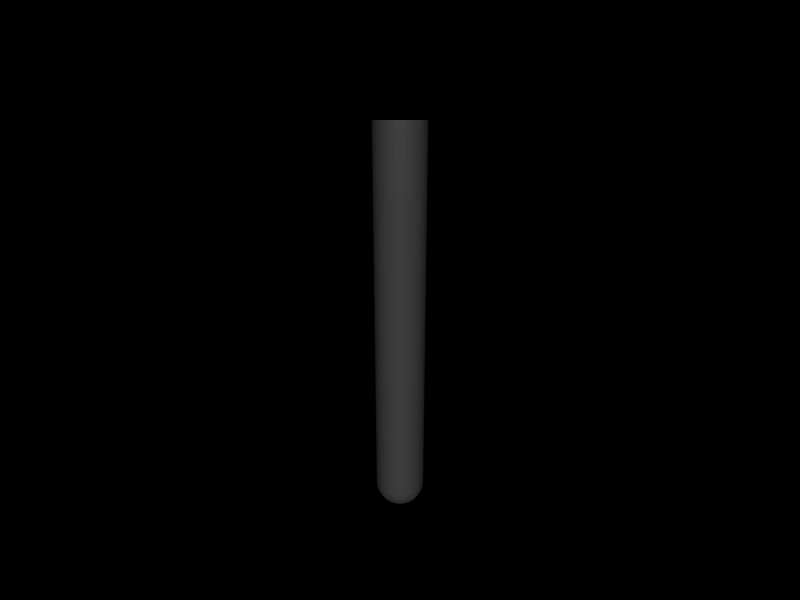

# 第 29 章　批量 rollout、状态规范与 CPU 并行

> 本书示例代码仓库：[libing403/mujoco_tutorial](https://github.com/libing403/mujoco_tutorial)

rollout 是从多个初始状态出发，执行一段 control sequence 并收集 state/sensor trajectory。它是系统辨识、随机 shooting、策略评估、有限差分和强化学习的共同计算内核。官方 Python `rollout` 模块用底层 C++ 和轻量线程池消除 Python 循环开销；在原生 C++ 应用中，我们需要自己建立同样清晰的数据契约。

## 29.1 学习目标

- 定义 batch、horizon、state/control/output 的内存形状；
- 使用 `mj_stateSize`、`mj_getState`、`mj_setState` 避免手工拼状态；
- 让多个 worker 共享只读 model、各自独占 data；
- 理解 warmstart、chunk size、不同 model 参数与可复现边界；
- 设计不把初始化、线程创建和日志混入稳态物理的 benchmark。

## 29.2 Rollout 契约

设 batch 数 \(N\)、步数 \(H\)、状态维数 \(n_x\)、control specification 维数 \(n_u'\)。典型扁平布局：

```text
initial_state[N][nx]
control[N][H][ncontrol]
state[N][H][nx]
sensor[N][H][nsensordata]
```

每条 trajectory 必须明确：

- 初始状态在哪个时刻；
- 输出 state 是 step 前还是 step 后；
- 第 `k` 个 control 作用于哪个 transition；
- 遇到 warning、NaN 或提前终止时剩余输出如何填充；
- controller 是预生成 open-loop control，还是依赖当前 state 的闭环函数。

这些约定比 API 名称更重要。off-by-one 会让 trajectory optimization gradient 和 supervised learning label 全部错位。

## 29.3 State specification

不要假设 rollout state 永远只是 `qpos+qvel`。MuJoCo 用 `mjtState` bitmask 描述状态子集：

```cpp
mjtState spec = mjSTATE_PHYSICS;
int nstate = mj_stateSize(m, spec);
mj_getState(m, d, buffer, spec);
mj_setState(m, d, buffer, spec);
```

可按任务加入 time、control、applied force、mocap、equality activation、plugin state、warmstart 等。官方 rollout 的 `control_spec` 也通过相同 state API 将 actuator control、广义力、Cartesian force、mocap pose 等统一写入 `mjData`。

`mjSTATE_PHYSICS` 适合连续仿真主状态，但若 actuator activation、plugin 或控制器隐藏状态未覆盖，分块 rollout 仍可能与连续轨迹不同。必须按模型查询 state size，不能硬编码。

## 29.4 一 model，多 data

`mjModel` 在仿真期间应只读，可由多个线程安全共享。每个并行 worker 必须独占 `mjData`：

```text
                const mjModel
          ┌─────────┼─────────┐
       worker 0  worker 1  worker 2
        mjData 0  mjData 1  mjData 2
```

绝不能让两条 trajectory 同时写一个 data；里面不仅有 qpos，还有 contact buffers、solver workspace、warning 和临时缓存。

若 batch 中每条使用不同 model，允许浮点参数不同，但输出布局必须兼容：至少 state/control/DoF/sensor 维数一致。结构不同的 model 混在同一矩形 batch 中，需要 padding 或分桶，官方 rollout 也要求相同相关维数。

## 29.5 Worker 调度与 chunk

最简单调度是 atomic index：worker 每次领取下一条 trajectory。它负载均衡好，但每条很短时 atomic 和调度开销明显。chunking 一次领取多条：

- chunk 太小：同步开销高、cache locality 差；
- chunk 太大：某个线程拖尾，负载不均；
- workload 均匀时可静态连续分块，最容易复现；
- contact-rich trajectory 耗时差异大时动态 chunk 更合适。

官方 Python rollout 默认按 batch/thread 比例估计 chunk，并允许高级用户调节。没有跨模型通用最佳值，应该对目标 batch/horizon/model 实测。

## 29.6 Warmstart 与分块连续性

constraint solver 使用 `qacc_warmstart`。一次连续 6000-step rollout 与 100 次 60-step chunk 若只传 qpos/qvel，chunk 边界丢失 warmstart；低迭代 CG/PGS 与混沌接触系统可能逐渐分叉。

若要求 chunk 与连续轨迹尽量一致：

1. state spec 包含 warmstart，或单独保存 `qacc_warmstart`；
2. 保留 actuator/plugin/control filter state；
3. 不在边界额外调用改变状态的 reset/forward；
4. 使用相同 solver/tolerance/iterations；
5. 对比短期误差与任务统计，不对混沌长轨迹承诺逐位一致。

Newton 通常收敛快，warmstart 影响可能小，但不能据此删除状态契约。

## 29.7 Open-loop 与 closed-loop

open-loop control tensor 可预先生成，worker 只按索引复制，最易并行。closed-loop policy 读取 state/sensor：

- policy 必须线程安全；
- 每 worker 可有独立 inference context/scratch；
- 随机策略使用每 trajectory 独立 RNG seed；
- recurrent policy hidden state 属于 rollout state；
- policy latency 是否计入 benchmark 必须说明。

当神经网络在 GPU、physics 在 CPU 时，逐环境同步会产生巨大传输开销。常见模式是批量收集 observations、一次 policy inference、再并行推进若干环境。

## 29.8 独立实验：原生 C++ batch

`examples/39_parallel_rollout/` 生成 128 个不同初始角速度的单摆 trajectory，先单线程，再用四个 worker。每个 worker 自己创建一个 `mjData`，共享 model；两次结果用 checksum 验证一致。

```bash
cd examples/39_parallel_rollout
cmake -S . -B build -DCMAKE_BUILD_TYPE=Release
cmake --build build -j
./build/demo model.xml
```

示例为了可读性每次调用创建 worker threads。生产中短 rollout 应复用持久线程池，否则线程创建可能比物理计算更贵，这也是官方 `Rollout` class 提供 persistent pool 的原因。

<!-- EMBEDDED_EXAMPLE_BEGIN: 39_parallel_rollout -->
### 可视化运行与效果

```bash
../../mujoco-3.11.0/bin/simulate model.xml
```

该命令使用发布包自带的官方 `simulate` 界面，可暂停、单步、施加扰动并开启接触等可视化标志。



*39_parallel_rollout 的真实 MuJoCo 原生渲染结果。*

### 实验完整源码

以下文件与 `examples/39_parallel_rollout/` 中可直接编译的版本一致。

#### 模型文件：`model.xml`

```xml
<mujoco model="parallel rollout">
  <option timestep="0.001" integrator="implicitfast"/>
  <worldbody>
    <body>
      <joint axis="0 1 0" damping=".03"/>
      <geom type="capsule" fromto="0 0 0 0 0 -.5" size=".03" mass="1"/>
    </body>
  </worldbody>
</mujoco>
```

#### 程序源码：`main.cc`

```cpp
#include <atomic>
#include <chrono>
#include <cstdio>
#include <cstdlib>
#include <thread>
#include <vector>
#include <mujoco/mujoco.h>

double run(const mjModel* m, int nthread, std::vector<double>& output) {
  std::atomic<int> next(0);
  auto worker = [&]() {
    mjData* d = mj_makeData(m);
    while (true) {
      int batch = next.fetch_add(1);
      if (batch >= static_cast<int>(output.size())) break;
      mj_resetData(m, d);
      d->qpos[0] = 0.7;
      d->qvel[0] = -2.0 + 4.0*batch/(output.size()-1);
      mj_forward(m, d);
      for (int k = 0; k < 4000; ++k) mj_step(m, d);
      output[batch] = d->qpos[0];
    }
    mj_deleteData(d);
  };
  auto begin = std::chrono::steady_clock::now();
  std::vector<std::thread> threads;
  for (int i = 0; i < nthread; ++i) threads.emplace_back(worker);
  for (auto& thread : threads) thread.join();
  auto end = std::chrono::steady_clock::now();
  return std::chrono::duration<double, std::milli>(end-begin).count();
}

int main(int argc, char** argv) {
  if (argc != 2) { std::fprintf(stderr, "用法: %s model.xml\n", argv[0]); return 1; }
  char error[1024] = {0}; mjModel* m = mj_loadXML(argv[1], NULL, error, sizeof(error));
  if (!m) { std::fprintf(stderr, "%s\n", error); return 1; }
  std::vector<double> serial(128), parallel(128);
  double t1 = run(m, 1, serial), t4 = run(m, 4, parallel);
  double checksum1=0, checksum4=0, maxdiff=0;
  for (size_t i = 0; i < serial.size(); ++i) {
    checksum1 += serial[i]; checksum4 += parallel[i];
    maxdiff = mju_max(maxdiff, std::abs(serial[i]-parallel[i]));
  }
  std::printf("1 worker: %.3f ms, checksum=%.12f\n", t1, checksum1);
  std::printf("4 workers: %.3f ms, checksum=%.12f, speedup=%.2fx\n", t4, checksum4, t1/t4);
  std::printf("max trajectory result difference = %.3g\n", maxdiff);
  mj_deleteModel(m); return 0;
}
```

#### 构建文件：`CMakeLists.txt`

```cmake
cmake_minimum_required(VERSION 3.16)
project(39_parallel_rollout LANGUAGES CXX)

set(CMAKE_CXX_STANDARD 17)
add_executable(demo main.cc)

set(MUJOCO_ROOT ${CMAKE_CURRENT_LIST_DIR}/../../mujoco-3.11.0)
target_include_directories(demo PRIVATE ${MUJOCO_ROOT}/include)
target_link_directories(demo PRIVATE ${MUJOCO_ROOT}/lib)
target_link_libraries(demo PRIVATE mujoco pthread)
set_target_properties(demo PROPERTIES BUILD_RPATH ${MUJOCO_ROOT}/lib)
```
<!-- EMBEDDED_EXAMPLE_END: 39_parallel_rollout -->

## 29.9 Benchmark 方法

至少分开测量：

1. XML compile 与 asset loading；
2. `mjData`/thread pool 初始化；
3. policy/control generation；
4. 稳态 physics rollout；
5. output copy/serialization；
6. GPU JIT compile 与 host-device transfer（如适用）。

报告 simulated steps/s 和 simulated seconds/wall second，同时给出 batch、horizon、thread、CPU affinity、solver、contact 数量和是否保存全 state/sensor。只报 FPS 无法复现。

官方 `skip_checks` 在 batch 极大、horizon 极短时能减少 shape checking 和 allocation 开销；原生 C++ 的对应原则是：在外层一次验证所有 buffer size，内层 hot loop 不再重复检查。但跳过检查意味着调用者承担越界风险，不能把不可信输入直接送入 fast path。

## 29.10 CPU rollout 与 MJX 的边界

CPU native rollout 适合低到中 batch、复杂 feature、较长 horizon 和需要 C engine 完整语义的任务。MJX 适合足够大 batch，尤其 policy/learning 已在 accelerator 上时。单独把一个小模型放到 GPU 并不自动更快；JIT、同步和数据传输可能主导。

迁移前应在相同初态/control 上比较 state、sensor、contact 与任务 return，核对 feature parity，再比较吞吐。不要用“每秒 step”掩盖两种 backend 实际求解了不同模型。

## 29.11 常见误区

- 多线程共享一个 `mjData`；
- worker 修改共享 `mjModel.opt` 或 model 参数；
- 初态 buffer 只存 qpos/qvel，遗漏 activation/plugin/warmstart；
- 线程池创建时间混入 1-step rollout benchmark；
- 不同 model 的 state/sensor 维数不同仍强行放入矩形 batch；
- closed-loop policy 使用全局 RNG，结果依赖线程调度；
- output 保存全轨迹造成内存带宽瓶颈，却误诊 physics 慢；
- CPU 与 GPU benchmark 包含范围不同。

## 29.12 习题与答案

1. 16 个 worker 最少需要多少 `mjData` 才能真正同时仿真？  
   **答案：**通常每个并发 worker 一个，共 16 个；batch 可以远大于 16，由 worker 复用 data。

2. 为什么 model 可以共享而 data 不行？  
   **答案：**model 在 step 中只读；data 包含每条 trajectory 的状态、缓存和求解工作区，会被持续写入。

3. recurrent policy 的 hidden state 放在哪里？  
   **答案：**属于应用 rollout state，需按 trajectory 独立保存、reset 和在 chunk 间传递。

4. 两次并行 checksum 不同应先查什么？  
   **答案：**共享可变状态、RNG seed/调度、control callback 全局数据、initial/warmstart state 是否完整。

5. 何时持久线程池收益最大？  
   **答案：**单次 rollout 很短且频繁调用时，线程创建/销毁占比最高。
