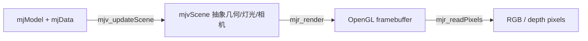

# 第 31 章　抽象场景、相机、选择与交互扰动

MuJoCo 将“把物理状态转换为可画的场景”和“调用 GPU 真正画像素”分成两层。`mjv_*` 是不依赖 OpenGL context 的抽象 visualization；`mjr_*` 才是 renderer。本章先掌握前一层，因此实验可在无桌面环境运行。

## 31.1 学习目标

- 区分 model geom、`mjvScene` geom 与 framebuffer pixels；
- 建立 free、tracking、fixed、user camera；
- 使用 category mask 和 visualization flags 诊断 contact、force、frame；
- 理解 selection 从屏幕坐标到 body/geom ID 的过程；
- 正确应用 pose perturbation 和 force perturbation。

## 31.2 三层图形流水线



`mjv_updateScene` 不画像素。它把当前 world pose、visual options、camera 和 perturbation 编译为 `mjvScene.geoms/lights/camera`。这样同一物理引擎可以服务窗口渲染、离屏相机、VR 和自定义 renderer。

`mjvScene` 是有容量的工作对象，`mjv_makeScene(m,&scn,maxgeom)` 分配资源，最终 `mjv_freeScene`。若用户追加 debug geoms 导致超过 `maxgeom`，场景会截断并产生 warning；容量应按模型和 overlay 上限设计。

## 31.3 Category mask

`mjCAT_STATIC`、`mjCAT_DYNAMIC`、`mjCAT_DECOR` 可按 bit 组合：

- static：世界静态 geom；
- dynamic：随 body 移动的模型 geom；
- decor：contact point、force arrow、frame 等装饰几何。

用 `mjCAT_ALL` 最方便；性能敏感的传感相机可只保留需要类别。category 与 MJCF geom `group` 不同：group 是模型分组，category 是 scene 级静态/动态/装饰分类。

## 31.4 Visualization options

`mjvOption` 中的 `geomgroup/sitegroup/jointgroup/tendongroup` 控制分组可见性，`flags[mjVIS_*]` 控制诊断层。常用：

- contact point、contact force、constraint force；
- joint axis、body frame、geom frame、site frame；
- center of mass、inertia box；
- actuator/tendon、range finder、camera/light；
- collision geom 与 visual geom 分组切换。

诊断时只开一两类 overlay，避免箭头遮满画面。接触 force 的视觉长度还受 `mjModel.vis.map.force` 等 scaling 影响，不能从截图像素直接读 N。

## 31.5 Camera 类型

`mjvCamera` 的核心 mode：

- free camera：围绕 lookat，以 azimuth/elevation/distance 描述；
- tracking camera：lookat 跟随指定 body，视角仍可旋转；
- fixed camera：使用 MJCF `<camera>` 的位姿/投影；
- user camera：应用直接填充 scene GL cameras，适合 VR/外部标定。

free camera 的 `lookat` 是模型空间点。鼠标归一化位移交给 `mjv_moveCamera`，action 决定 rotate、move、zoom。窗口尺寸变化会改变归一化尺度，UI 层应以 viewport 宽高转换，而不是传原始 pixel delta。

固定相机适合作机器人视觉 sensor：它能随 body 移动，fovy、resolution、intrinsic/sensor size 等属性定义投影。可视化 viewer camera 与模型 sensor data 不是同一概念；渲染图像需要 renderer/context。

## 31.6 Screen selection

`mjv_select` 根据当前 scene camera、aspect ratio 和归一化屏幕坐标进行 ray selection，返回 body ID，并可返回 geom/flex/skin ID 与世界系选中点。

调用前必须：

1. `mj_forward` 保证 pose 有效；
2. 用当前 camera 更新 scene；
3. 使用实际 viewport aspect ratio；
4. 将鼠标坐标正确转换到 API convention；
5. 对返回 `-1` 做空选中处理。

不要根据渲染颜色自己反查 object；透明、skin、decor 和重叠几何都会使颜色拾取脆弱。

## 31.7 Perturbation

simulate 中鼠标拖动物体有两种语义：

- **pose perturbation**：暂停时直接改变 free body pose，或更新 mocap body；
- **force perturbation**：运行时通过弹簧式交互产生 `xfrc_applied`。

流程：选择 body → `mjv_initPerturb` → `mjv_movePerturb` 更新目标 → `mjv_applyPerturbPose/Force` 写入 data。

force perturbation 会修改 `xfrc_applied`。若控制器也写该数组，应建立明确的合力策略和清零顺序；否则 viewer 与控制线程会互相覆盖。pose perturbation 直接改 qpos 后还需 forward，且会使 controller/estimator 的内部状态与新 pose 不一致，交互 reset 应同步处理。

## 31.8 用户 debug geom

可在 `mjv_updateScene` 后追加 scene geom：

```cpp
mjvGeom* g = scn.geoms + scn.ngeom++;
mjv_initGeom(g, mjGEOM_SPHERE, size, pos, NULL, rgba);
g->category = mjCAT_DECOR;
```

线段、箭头、胶囊使用 `mjv_connector` 设置 from/to。典型用途：目标位姿、CoM projection、support polygon、Jacobian direction、规划路径和 estimated state。

scene 每帧重建，用户 geom 也应每帧重新追加；不要保存 `scn.geoms` 内部指针跨越 scene resize/free。

## 31.9 独立实验：无窗口构建 scene

`examples/41_abstract_scene/` 创建 model/data、配置 tracking camera、开启 contact point overlay，并调用 `mjv_updateScene`。它不创建 OpenGL context，只打印 scene geom 分类与实际 camera vector，因此 CI/headless 环境也可运行。

```bash
cd examples/41_abstract_scene
cmake -S . -B build -DCMAKE_BUILD_TYPE=Release
cmake --build build -j
./build/demo model.xml
```

下一章会将同一个 `mjvScene` 送入 renderer，生成离屏 RGB/depth。

## 31.10 线程架构

physics 与 rendering 常在不同线程。安全模式是：physics thread 在同步点复制最小 physics state；render thread 将副本写入独立 render `mjData` 并 forward/update scene。不要一边 `mj_step` 同一 data，一边 `mjv_updateScene` 读取它。

`mjModel` 可共享只读；scene、camera、perturb、render context 和窗口事件通常归 render/UI thread。双缓冲 state snapshot 能避免长锁，但要保证时间、qpos、mocap 和需要显示的状态属于同一帧。

## 31.11 常见误区

- 认为 `mjv_updateScene` 已经得到图像；
- scene maxgeom 太小，debug overlay 静默缺失；
- 用错误 aspect ratio 做 selection；
- render thread 与 physics thread 同时访问一个 data；
- force perturbation 清零了控制器外力，或反之；
- 修改 qpos 后只更新 scene，不做 forward；
- 把 contact arrow 屏幕长度当真实牛顿值；
- 保存 scene geom pointer 跨帧使用。

## 31.12 习题与答案

1. `mjvScene` 是否需要 OpenGL context？  
   **答案：**不需要；它是抽象场景。`mjrContext/mjr_render` 才需要图形 context。

2. tracking camera 与 fixed body camera 的区别？  
   **答案：**tracking camera 的 lookat 跟随 body、观察视角由 viewer 控制；fixed camera 位姿由模型 camera 元素定义并随其父 body 变换。

3. 为什么 render 应有独立 data？  
   **答案：**避免 step 写状态/缓存时 scene 同时读取造成 data race 和帧内不一致。

4. 用户 debug arrow 属于哪类 category？  
   **答案：**通常设为 `mjCAT_DECOR`，便于按 mask 控制。

5. paused pose drag 后控制器为何可能突然发力？  
   **答案：**物理 pose 改了，但控制 reference、积分器或 estimator 未同步，产生巨大瞬时误差。
