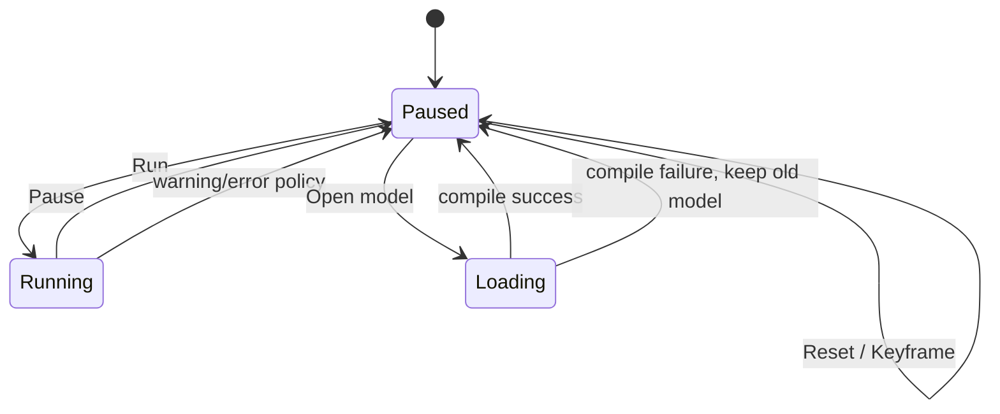

# 第 33 章　UI、Studio 架构与物理—渲染线程同步

> 本书示例代码仓库：[libing403/mujoco_tutorial](https://github.com/libing403/mujoco_tutorial)

一个能打开窗口的 demo 不等于生产级仿真应用。MuJoCo UI 是 immediate-mode 风格的通用控件系统；官方 simulate/Studio 还要协调文件加载、物理线程、render thread、鼠标扰动、profiler 和错误恢复。本章讲清架构边界，使读者能读懂官方 sample，也能避免 data race。

## 33.1 学习目标

- 理解 `mjUI`、`mjuiState`、platform adapter 与 `mjrContext` 的分层；
- 将 OS event 转换为 MuJoCo UI event，并处理控件变化；
- 设计 physics、render、loader 三线程的状态所有权；
- 实现 pause、single-step、reset、real-time factor 和 model hot reload；
- 把 profiler、warning、solver statistics 变成可操作诊断。

## 33.2 UI 分层

```text
GLFW / SDL / platform event
       │ adapter: mouse, key, text, rect, dpi
       ▼
    mjuiState ──mjui_event──> changed mjuiItem
       │
       └──mjui_render──> active mjrContext framebuffer
```

`mjUI` 保存 section/item 定义与绑定数据；`mjuiState` 保存鼠标、键盘、rect、drag 等瞬时输入。MuJoCo 不负责 OS window event loop，platform adapter 负责把 GLFW/SDL 事件填入 state。

`mjui_add` 从 `mjuiDef` 数组构建 sections/items；`mjui_resize` 在 viewport/DPI 变化后更新布局；`mjui_event` 返回发生语义变化的 item，应用据此修改 simulation option；`mjui_update` 刷新显示；最后 `mjui_render` 画到 context。

不要在每帧重建全部 UI 定义。静态 controls 初始化一次，动态 value 通过绑定指针和 update 刷新。

## 33.3 Viewport partition

窗口 framebuffer 可划分为 scene、left/right UI、figure/profiler 区域。HiDPI 下 window logical size 与 framebuffer pixels 不同：鼠标事件通常用逻辑坐标，OpenGL viewport 用 framebuffer pixels，adapter 必须统一 scale。

scene selection 的 aspect ratio 应使用 scene viewport，不是整个 window；否则 UI panel 打开/关闭后 ray picking 偏移。

## 33.4 核心状态机



single-step 应只推进一次 physics step，不依赖 render frame。reset 应同时重置 physics data、controller/estimator、history buffers、UI selection 和 timing accumulator。keyframe reset 同理。

model load 在临时 spec/model/data 上完成；成功且 audit 通过后再原子切换。加载失败应保留旧模型和错误文本，而不是让 render thread 看到半初始化指针。

## 33.5 三线程所有权

推荐：

| 线程 | 独占对象 | 可共享只读 |
|---|---|---|
| physics | simulation `mjData`、controller/estimator | active `mjModel` |
| render/UI | render `mjData`、scene/camera/perturb/context/window | active `mjModel`、state snapshot |
| loader | candidate spec/model/data/assets | 无或 immutable config |

physics 线程发布 snapshot，不把 simulation data 裸指针交给 render。render 在自己的 data 上 `mj_setState` + `mj_forward`。model 切换使用 generation ID/共享所有权，保证旧 model 直到所有线程停止使用才释放。

简单 mutex 包住整个 `mj_step+mjr_render` 虽安全但会让 GPU/vsync 阻塞 physics。更好的做法是短临界区复制 state，或双/三缓冲 snapshot。

## 33.6 Real-time pacing

目标 real-time factor \(r\)，wall elapsed \(\Delta t_w\) 对应目标 simulated time \(r\Delta t_w\)。render frame 中可循环 step 直到 simulation 追上目标；若落后太多，应限制 catch-up budget，避免 UI 永久无响应。

不要每 step `sleep(timestep)`：OS scheduler 粒度与计算耗时会累积漂移。使用绝对 deadline 或 time accumulator。暂停时不要让 accumulator 累积，否则恢复瞬间会疯狂补步。

physics 频率与 render refresh 解耦。1 kHz physics 在 60 Hz 显示下每帧约 16～17 step；控制仍按第 21 章独立周期运行。

## 33.7 V-sync 与 benchmark

窗口 viewer 通常开 v-sync，render loop 被限制到显示刷新率；这与 physics 性能无关。性能基准应关闭/排除 render、UI、日志和 sleep，使用第 29 章 rollout 或 testspeed 风格测量。

相反，用户交互应用不应为追求最大 FPS 占满 CPU。官方 simulate 会按 real-time pacing sleep；观察到低 CPU utilization 不代表 engine 慢。

## 33.8 Profiler 与 figures

`mjvFigure` 可画 time series/bar graph，适合 sensor、control、energy 与 solver history。环形 buffer 应预分配，禁止每帧移动大数组。显示统计建议包括：

- physics step wall time 与 real-time factor；
- `ncon/nefc`、solver iteration/gradient/improvement；
- energy、constraint violation、forward-inverse residual；
- controller deadline miss、saturation ratio；
- render time、readback time、snapshot age。

UI 不是“漂亮图表”，而是故障定位工具。每个数字应有单位、采样窗口和 reset 语义。

## 33.9 鼠标扰动与线程

render thread 更新 `mjvPerturb`；physics thread 才能写 simulation `xfrc_applied/qpos`。可发布 perturb command（selected body、target pose/force parameters），由 physics 在 step 边界应用。

若 paused pose drag 需要即时画面，可先仅修改 render data 预览，用户确认或同步点再提交 simulation；或者加锁短暂修改并 forward。无论哪种都要同步 controller/estimator reset。

## 33.10 Error 与 warning 恢复

MuJoCo error handler/callback 是进程级基础设施。不要从任意库模块长期覆盖全局 handler。应用入口安装统一策略：把可恢复的 model parse/compile 错误转为 UI message；不可恢复 engine error 记录上下文并安全终止当前 simulation session。

warning 应带 model generation、simulation time 和 occurrence count，避免每步刷屏。重复 bad QPOS/QVEL、contact full、solver warning 应触发 pause/snapshot，保留最小复现状态。

## 33.11 阅读官方 sample 的方法

- `basic.cc`：最小 GLFW window、callbacks、scene/context 生命周期；
- `record.cc`：GLFW/OSMesa/EGL 离屏和 video frame pacing；
- `simulate` / Studio：完整 UI、加载、线程、perturb、profiler；
- `testspeed`：排除 UI/render 的 physics benchmark；
- `compile`：XML/MJB 转换与 compiler diagnostics。

不要把 simulate 整个复制进机器人产品。先明确所需子系统，再抽取官方已验证的生命周期和 event convention。

## 33.12 常见误区

- physics/render 同时访问一个 data；
- model load 直接覆盖 active pointer，失败后崩溃；
- 每 physics step sleep 相对时长，长期漂移；
- 用 viewer FPS 评价 physics；
- reset 只调用 `mj_resetData`，遗漏控制和估计状态；
- UI 打开后 selection 仍用全窗口 aspect ratio；
- render thread 直接写 simulation external forces；
- context 在非 current 线程 free；
- warning 每帧打印导致实时循环更慢。

## 33.13 习题与答案

1. 为什么 render data 与 simulation data 应分离？  
   **答案：**避免并发读写和缓存不一致；render 可消费稳定 snapshot，不阻塞 physics 长操作。

2. model hot reload 失败应怎样处理？  
   **答案：**候选对象中解析编译，失败显示错误并保留旧 active model；成功后在同步点切换。

3. 60 Hz viewer 是否意味着 simulation 只能 60 Hz？  
   **答案：**不是；每个 render frame 可推进多个 physics step，二者独立调度。

4. pause 恢复时为何要重置 timing accumulator？  
   **答案：**否则暂停 wall time 被当作落后量，恢复后会大量 catch-up steps。

5. 为什么 UI warning 需要 rate limit？  
   **答案：**重复日志会淹没首个根因并严重扰动实时性能。
