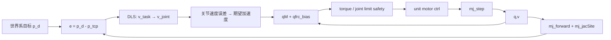
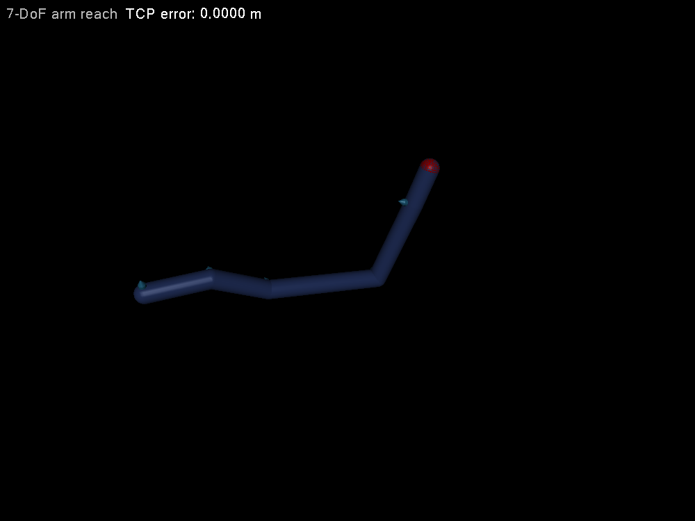

# 第 36 章　综合项目一：7-DoF 机械臂从模型审计到任务空间控制

前面章节逐个验证 API；综合项目要求建立端到端证据链。本章以 7-DoF 冗余机械臂为对象，从模型接口审计、目标可达性、DLS 任务速度、动力学补偿、限幅到回归指标，最终得到可独立运行的任务空间到达控制器。

## 36.1 项目验收目标

给定世界系目标点，机械臂从 nominal pose 出发：

- 5 s 内 TCP position error 小于 5 mm；
- 全程 joint limit 不越界；
- command torque 不超过设定限值；
- timestep 减半后最终 error 变化小于阈值；
- target 不可达时稳定停止，不产生 NaN/极端 torque；
- 记录 model/version、初态、目标、RMS/peak 指标。

本章示例只做 position task，留出 4-DoF redundancy。完整抓取还需姿态、轨迹、夹爪、接触和状态机；本章末给出扩展路线。

## 36.2 系统图



这不是解析 IK 后一次性跳到目标，而是 resolved-rate closed loop。每步重新计算 Jacobian，所以能随配置变化修正线性化误差。

## 36.3 模型审计

加载后先断言：

1. `nv==nu==7`，每个 DoF 有独立 unit motor；
2. joint/actuator 名称和地址按预期；
3. TCP site 存在且属于末端 body；
4. joint limits 有效，nominal qpos 在范围内；
5. body mass/inertia 正值，total mass 合理；
6. visual/collision geometry 分组符合任务；
7. timestep、integrator、gravity 与控制增益一致。

不能只检查计数。若 actuator gear 不是 1，`ctrl=tau` 不成立；若 tendon coupling，`nu==nv` 也不代表一一对应。

## 36.4 任务 Jacobian

`mj_jacSite` 返回 \(J_p\in\mathbb R^{3\times7}\)。目标速度采用比例 feedback：

\[
v^*=k_x(p_d-p).
\]

DLS joint velocity：

\[
v_q^*=J_p^T(J_pJ_p^T+\lambda^2I)^{-1}v^*.
\]

这里求解 3×3 SPD system，源码用 `mju_cholFactor/mju_cholSolve`，不显式求 inverse。最大 joint velocity 统一缩放，保持方向而满足限速。

若目标远离当前 TCP，纯比例速度会一开始很大；限速相当于 trajectory shaping 的最简形式。生产中应给目标生成 S-curve/五次轨迹，并同时提供 acceleration feedforward。

## 36.5 Redundancy 与限位

position task rank 最多 3，null space 有约 4 维。最小范数 DLS 不主动远离 limits。可加入

\[
v_q=v_{primary}+(I-J^+J)v_{null},
\]

其中 limit avoidance potential：

\[
V(q)=\sum_i\left(\frac{q_i-q_{mid,i}}{q_{range,i}/2}\right)^2,
\qquad v_{null}=-k_n\nabla V.
\]

示例为保持源码聚焦，使用 joint range 内的 nominal target，最终 torque safety 仍检查接近限位时阻止继续向外的 desired velocity。练习要求加入显式 null-space。

## 36.6 从期望速度到 torque

构造期望 acceleration：

\[
a^*=k_v(v_q^*-v).
\]

然后

\[
\tau=M(q)a^*+c(q,v).
\]

源码用 `mj_mulM` 和 `qfrc_bias`。这相当于 velocity-level resolved rate 外接 computed-torque inner loop。没有 desired joint acceleration feedforward，快速曲线路径会有滞后；但静态目标到达足够清楚。

每个 torque clamp 后写 motor `ctrl`。若发生 saturation，实际 acceleration 不再等于 \(a^*\)，但外层每步 feedback 会修正。持续 saturation 意味着轨迹/增益/模型不可行，不能无限等待。

## 36.7 独立综合实验

`examples/45_arm_reach/` 包含 7-link MJCF 和一个 `main.cc`。代码段按审计、DLS、动力学映射、safety、metrics 顺序排列，无 `common.h` 或控制器类。

```bash
cd examples/45_arm_reach
cmake -S . -B build -DCMAKE_BUILD_TYPE=Release
cmake --build build -j
./build/demo model.xml
```

预期输出包括初始/最终 TCP、最终误差、peak torque 和 PASS/FAIL。修改 target site 是最直接实验；超过最大 reach 时应得到有限残差，而非矩阵求解失败。

<!-- EMBEDDED_EXAMPLE_BEGIN: 45_arm_reach -->
### 可视化运行与效果

```bash
./build/demo model.xml --view
```

窗口显示的是示例算法正在修改和推进的同一个 `mjData`。源码有意不封装 viewer：先用 GLFW 创建 OpenGL context，再初始化 `mjvScene/mjrContext`，用 `mjv_updateScene`读取算法使用的 `mjData`，再调用 `mjr_render` 和交换缓冲区，最后按创建的逆序释放资源。



*45_arm_reach 的真实 MuJoCo 原生渲染结果。*

### 实验完整源码

以下文件与 `examples/45_arm_reach/` 中可直接编译的版本一致。

#### 模型文件：`model.xml`

```xml
<mujoco model="7 DoF arm reach">
  <option timestep="0.001" integrator="implicitfast"/>
  <default>
    <joint damping=".08" armature=".015" limited="true" range="-170 170"/>
    <geom type="capsule" size=".035" mass=".7" rgba=".25 .35 .65 1"/>
    <motor ctrlrange="-35 35" ctrllimited="true"/>
  </default>
  <worldbody>
    <body name="base" pos="0 0 .5">
      <joint name="j1" axis="0 0 1"/><geom fromto="0 0 0 .22 0 0"/>
      <body pos=".22 0 0"><joint name="j2" axis="0 1 0"/><geom fromto="0 0 0 .22 0 0"/>
        <body pos=".22 0 0"><joint name="j3" axis="0 1 0"/><geom fromto="0 0 0 .22 0 0"/>
          <body pos=".22 0 0"><joint name="j4" axis="1 0 0"/><geom fromto="0 0 0 .20 0 0"/>
            <body pos=".20 0 0"><joint name="j5" axis="0 1 0"/><geom fromto="0 0 0 .18 0 0"/>
              <body pos=".18 0 0"><joint name="j6" axis="1 0 0"/><geom fromto="0 0 0 .16 0 0"/>
                <body pos=".16 0 0"><joint name="j7" axis="0 0 1"/><geom fromto="0 0 0 .14 0 0"/>
                  <site name="tcp" pos=".14 0 0" size=".025" rgba="0 1 0 1"/>
                </body>
              </body>
            </body>
          </body>
        </body>
      </body>
    </body>
    <site name="target" pos=".95 .35 .75" size=".035" rgba="1 0 0 1"/>
  </worldbody>
  <actuator>
    <motor joint="j1"/><motor joint="j2"/><motor joint="j3"/><motor joint="j4"/>
    <motor joint="j5"/><motor joint="j6"/><motor joint="j7"/>
  </actuator>
</mujoco>
```

#### 程序源码：`main.cc`

```cpp
#include <cmath>
#include <cstdio>
#include <cstdlib>
#include <cstring>
#define GLFW_INCLUDE_NONE
#include <GLFW/glfw3.h>
#include <mujoco/mujoco.h>

int main(int argc, char** argv) {
  bool view=argc==3 && std::strcmp(argv[2],"--view")==0;
  if (argc<2 || argc>3 || (argc==3 && !view)) {
    std::fprintf(stderr,"用法: %s model.xml [--view]\n",argv[0]); return 1;
  }
  char error[1024]={0}; mjModel* m=mj_loadXML(argv[1],NULL,error,sizeof(error));
  if (!m) { std::fprintf(stderr,"%s\n",error); return 1; }
  if (m->nv!=7 || m->nu!=7) { std::fprintf(stderr,"审计失败: 需要 nv=nu=7\n"); return 1; }
  mjData* d=mj_makeData(m); int tcp=mj_name2id(m,mjOBJ_SITE,"tcp");
  int target=mj_name2id(m,mjOBJ_SITE,"target"); mj_forward(m,d);
  double initial[3]={d->site_xpos[3*tcp],d->site_xpos[3*tcp+1],d->site_xpos[3*tcp+2]};
  double peak=0;
  for (int step=0;step<5000;++step) {
    mjtNum J[21], Jr[21]; mj_jacSite(m,d,J,Jr,tcp);
    mjtNum e[3], task[3];
    for (int i=0;i<3;++i) {
      e[i]=d->site_xpos[3*target+i]-d->site_xpos[3*tcp+i];
      task[i]=1.5*e[i];
    }
    mjtNum normal[9]={0};
    for (int r=0;r<3;++r) for (int c=0;c<3;++c) {
      for (int j=0;j<7;++j) normal[3*r+c]+=J[7*r+j]*J[7*c+j];
      if (r==c) normal[3*r+c]+=0.03*0.03;
    }
    mjtNum y[3];
    if (mju_cholFactor(normal,3,1e-12)<3) { std::fprintf(stderr,"DLS 分解失败\n"); break; }
    mju_cholSolve(y,normal,task,3);
    mjtNum vdes[7]={0};
    for (int j=0;j<7;++j) for (int i=0;i<3;++i) vdes[j]+=J[7*i+j]*y[i];
    double vmax=0; for (double v:vdes) vmax=mju_max(vmax,std::fabs(v));
    double scale=vmax>1.5 ? 1.5/vmax : 1.0;
    mjtNum ades[7],tau[7];
    for (int j=0;j<7;++j) ades[j]=6.0*(scale*vdes[j]-d->qvel[j]);
    mj_mulM(m,d,tau,ades);
    for (int j=0;j<7;++j) {
      tau[j]+=d->qfrc_bias[j]; d->ctrl[j]=mju_clip(tau[j],-35.0,35.0);
      peak=mju_max(peak,std::fabs(d->ctrl[j]));
    }
    mj_step(m,d);
  }
  double final[3],err2=0;
  for (int i=0;i<3;++i) { final[i]=d->site_xpos[3*tcp+i];
    double e=d->site_xpos[3*target+i]-final[i]; err2+=e*e; }
  double err=std::sqrt(err2);
  std::printf("initial TCP = [%.4f %.4f %.4f]\n",initial[0],initial[1],initial[2]);
  std::printf("final TCP   = [%.4f %.4f %.4f]\n",final[0],final[1],final[2]);
  std::printf("position error=%.6f m, peak torque=%.3f Nm, %s\n",err,peak,err<.005?"PASS":"FAIL");
  if (view) {
    if (!glfwInit()) return 1;
    GLFWwindow* window=glfwCreateWindow(1000,750,"45 arm reach",NULL,NULL);
    if (!window) { glfwTerminate(); return 1; }
    glfwMakeContextCurrent(window);
    mjvCamera cam; mjv_defaultCamera(&cam); mjv_defaultFreeCamera(m,&cam);
    mjvOption opt; mjv_defaultOption(&opt); opt.flags[mjVIS_JOINT]=1;
    mjvScene scene; mjv_defaultScene(&scene); mjv_makeScene(m,&scene,2000);
    mjrContext con; mjr_defaultContext(&con); mjr_makeContext(m,&con,mjFONTSCALE_150);
    while (!glfwWindowShouldClose(window)) {
      int width,height; glfwGetFramebufferSize(window,&width,&height);
      mjrRect viewport={0,0,width,height};
      mjv_updateScene(m,d,&opt,NULL,&cam,mjCAT_ALL,&scene);
      mjr_render(viewport,&scene,&con);
      char status[100]; std::snprintf(status,sizeof(status),"TCP error: %.4f m",err);
      mjr_overlay(mjFONT_NORMAL,mjGRID_TOPLEFT,viewport,
                  "7-DoF arm reach",status,&con);
      glfwSwapBuffers(window); glfwPollEvents();
    }
    mjr_freeContext(&con); mjv_freeScene(&scene);
    glfwDestroyWindow(window); glfwTerminate();
  }
  mj_deleteData(d); mj_deleteModel(m); return err<.005?0:2;
}
```

#### 构建文件：`CMakeLists.txt`

```cmake
cmake_minimum_required(VERSION 3.16)
project(45_arm_reach LANGUAGES CXX)

set(CMAKE_CXX_STANDARD 17)
add_executable(demo main.cc)

set(MUJOCO_ROOT ${CMAKE_CURRENT_LIST_DIR}/../../mujoco-3.11.0)
target_include_directories(demo PRIVATE ${MUJOCO_ROOT}/include ${MUJOCO_ROOT}/third_party/glfw/include)
target_link_directories(demo PRIVATE ${MUJOCO_ROOT}/lib ${MUJOCO_ROOT}/third_party/glfw/lib)
target_link_libraries(demo PRIVATE mujoco glfw)
set_target_properties(demo PROPERTIES BUILD_RPATH "${MUJOCO_ROOT}/lib;${MUJOCO_ROOT}/third_party/glfw/lib")
```
<!-- EMBEDDED_EXAMPLE_END: 45_arm_reach -->

## 36.8 逐层调试

若不收敛，按层隔离：

1. 固定 q，打印 TCP 和 target，确认世界系；
2. 用第 24 章 finite difference 验证 `Jp`；
3. 单独运行 DLS，打印 `J vq` 是否接近 task velocity；
4. 检查 Cholesky rank 与 damping；
5. 禁用 gravity，验证 torque mapping；
6. 打印 `qfrc_bias` 和 saturation；
7. timestep 减半，排除积分不稳；
8. 最后才调 gains。

直接同时修改 target、lambda、gains、timestep 会失去归因。

## 36.9 加入姿态

扩展到 6D pose：position residual 与 `mju_subQuat` orientation residual 拼接，使用 6×7 Jacobian。权重按可接受误差归一：例如 1 cm position 与 5° orientation 具有相似单位代价。

7-DoF 对 6D task 只剩一维 redundancy，limit avoidance 更重要。接近 wrist singularity 时自适应 damping，并报告最小 singular value/manipulability。

## 36.10 加入抓取

端到端抓取状态机：

```text
Pregrasp → Approach → Contact detect → Close → Lift → Hold → Release
```

- pregrasp/approach：pose IK + collision-free trajectory；
- contact detect：finger sensor/contact wrench，带 debounce；
- close：force/position hybrid control，限制 fingertip force；
- lift：保持 grasp，监测 object relative pose/slip；
- failure：超时、目标丢失、过力、joint limit、object drop。

不能用 equality weld 直接替代夹爪物理，再声称验证了接触抓取；weld 可作为上层规划早期简化，但最终验收必须使用 collision/friction/actuator。

## 36.11 Sim-to-real 接口

保持 controller 输入只来自 estimator state 与 sensor，不能读取 object truth pose（除非真实系统视觉会提供）。加入 control period、command delay、encoder noise、motor torque/speed curve、joint friction 与 calibration offset。

domain randomization 不是随意扩大范围：每个参数应来自 CAD tolerance、辨识 covariance 或供应商规格。报告 worst-case/percentile success，不只 nominal。

## 36.12 回归矩阵

| 维度 | 扫描 |
|---|---|
| target | workspace 中心、边缘、不可达 |
| initial q | nominal、靠近 limit、近 singular |
| timestep | 1×、1/2× |
| payload | nominal、±20% |
| latency | 0、1、2 control cycles |
| actuator | nominal、torque derating |

保存 success、time-to-target、RMS error、peak torque/power、min limit margin。对每个 failure 给 termination reason。

## 36.13 常见误区

- `nu==nv` 就假设 ctrl 等于 torque；
- DLS 显式求 inverse；
- 位置/姿态单位不加权；
- 只有最终 error，没有 torque/limit/timestep 指标；
- 不可达目标无限积分；
- resolved-rate 直接输出无限 joint velocity；
- computed torque 重复 gravity compensation；
- 仿真 controller 读取真实 object pose，实机没有对应 sensor；
- equality weld 冒充抓取成功。

## 36.14 习题与答案

1. 7-DoF position task 通常有多少维 null space？  
   **答案：**Jacobian 满 3 行秩时为 `7-3=4` 维。

2. 为什么使用 `J Jᵀ` 形式？  
   **答案：**position task 只有 3 维，只需求解 3×3 system，比 7×7 形式更小。

3. torque 长期饱和时应怎样处理？  
   **答案：**判定目标/轨迹/增益不可行，降低速度/加速度或重新规划，并给出 timeout/失败状态。

4. 怎样验证 `ctrl=tau`？  
   **答案：**审计每个 actuator 的 transmission、gear、gain/bias 和 force limits，并在单 DoF 实验比较 `qfrc_actuator`。

5. 为何 timestep 减半是项目验收项？  
   **答案：**确认结果不是特定离散误差/不稳定性偶然产生，并估计数值收敛。
