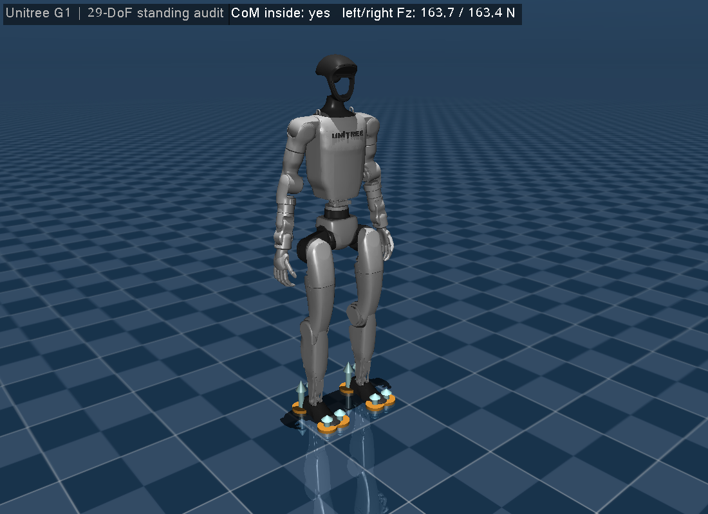

# 第 37 章　综合项目二：Unitree G1 人形机器人站立审计

> 本书示例代码仓库：[libing403/mujoco_tutorial](https://github.com/libing403/mujoco_tutorial)

人形机器人项目不应从“画几根胶囊”直接跳到平衡控制。真实工程的第一关，是证明模型拓扑、质量惯量、执行器、初始状态、足底接触和坐标约定可信。

本章使用 MuJoCo Menagerie 中的 Unitree G1 29-DoF 模型。它不是为教材虚构的玩具人形，而是由公开机器人描述整理而来的开源 MJCF：包含 29 个可动关节、真实网格、逐刚体质量/惯量、关节限位、力限制、双 IMU、站立 keyframe 和每只脚 4 个接触点。

## 37.1 项目产出

完成本章后，读者应能：

- 审计浮动基人形的 `nq/nv/nu`，并解释它们为何不相等；
- 从 keyframe 同时恢复 qpos 和 actuator control reference；
- 区分视觉 mesh、碰撞 mesh 与足底点接触；
- 将多个 contact wrench 按左右脚聚合到世界系支撑力；
- 从足底接触几何构造支撑区域，检查整机 CoM 投影；
- 同时检查躯干姿态、关节跟踪误差、双脚接触和力平衡；
- 用示例内嵌的 `mjv/mjr` viewer 看到同一份仿真状态。

## 37.2 模型来源与许可证

模型来自 Google DeepMind 策展的 MuJoCo Menagerie，其 G1 目录说明该 MJCF 派生自 Unitree 公开的 G1 29-DoF 描述，并标注最低需要 MuJoCo 2.3.4。本书锁定 3.11.0，因此满足版本要求。

G1 模型和网格使用 BSD-3-Clause。完整声明保存在 `examples/46_biped_standing/LICENSE`，原始模型说明保存在 `MENAGERIE_README.md`，引入的上游 commit 和文件取舍记录在 `MODEL_SOURCE.md`。引入开源机器人时，不能只保留 XML 而丢掉资产的单独许可证。

本书只保留 `g1.xml` 实际引用的 35 个 STL，没有引入未使用的灵巧手网格和宣传图片。这是可重现性、仓库体积与许可证完整性之间的工程权衡。

## 37.3 从文件边界读模型

实验使用两层 MJCF：

```text
model.xml             场景层：地面、天空、灯光、默认相机
└─ include g1.xml     机器人层：刚体树、惯量、几何、执行器、传感器、keyframe
   └─ assets/*.STL  视觉/部分碰撞网格
```

这个边界很重要：机器人文件可被不同任务场景复用，地面材质、障碍物和相机不会混入机器人本体。

### 浮动基尺寸

G1 的 pelvis 使用 free joint，29 个关节使用标量旋转坐标：

\[
n_q=7+29=36,\qquad n_v=6+29=35,\qquad n_u=29.
\]

`nq-nv=1` 来自 free joint 的单位四元数，不是“多出一个自由度”。整机有 30 个 joint：1 个 free joint 加 29 个执行关节。

### 身体分组

- 双腿：每侧 hip pitch/roll/yaw、knee、ankle pitch/roll，共 12 DoF；
- 腰部：yaw/roll/pitch，共 3 DoF；
- 双臂：每侧 shoulder pitch/roll/yaw、elbow、wrist roll/pitch/yaw，共 14 DoF。

12+3+14=29。这种显式盘点能及时发现模型版本变更、漏关节或 actuator 错配。

## 37.4 visual、collision 和 inertia 的真实分层

G1 模型的 visual geom 使用 `group=2`、`contype=conaffinity=0`、`density=0`，只负责外观。惯量由每个 body 的 `<inertial>` 显式给出，不会因为换了渲染网格就改变质量分布。

碰撞几何采用混合策略：

- pelvis、大腿、小腿、躯干等保留 collision mesh；
- 肩部部分使用 cylinder 简化碰撞；
- 每只脚使用 4 个小 sphere 建立可控、可解释的支撑点。

足底不直接用复杂 STL 做接触，是一个典型的控制导向建模决策：四个点明确定义前后/左右支撑边界，同时降低接触求解复杂度。

## 37.5 站立 keyframe 不只是姿势

`stand` keyframe 同时保存 free-base pose、29 个关节位置和 29 个 position actuator reference。程序使用：

```cpp
int stand = mj_name2id(m, mjOBJ_KEY, "stand");
mj_resetDataKeyframe(m, d, stand);
mj_forward(m, d);
```

如果只复制 qpos 而忘记 ctrl，手臂尤其会立即被位置执行器拉向另一个 reference。这是人形初始化中常见的“加载后突然抽动”来源。

position actuator 是站立 plant baseline，不是完整平衡算法。它用来先回答：模型在合理的关节参考下，能否形成双脚支撑并保持躯干竖直？

## 37.6 可执行的模型审计

程序不假设 ID 或数组下标，而是通过名称查找：

- `stand` keyframe；
- `pelvis` 与 `torso_link`；
- 左右 `ankle_roll_link`。

任意一项缺失都立即报错。比起程序后面在 `qpos[17]` 上悄悄控制错关节，这种失败方式更安全。

程序还输出编译后真值：

```text
Unitree G1: nq=36 nv=35 nu=29 bodies=31 joints=30
mass=33.341 kg, timestep=0.0020 s, stand keyframe=0
```

这些数字可以作为模型升级时的接口契约。

## 37.7 从 8 个接触点得到双脚支撑力

MuJoCo 的一只脚不对应“一个接触力”。G1 每脚有 4 个 sphere，每个 sphere 又可能产生独立 `mjContact`。程序遍历 `d->contact`，通过 `m->geom_bodyid` 将 contact 归属到左右 ankle body，再调用：

```cpp
mjtNum wrench[6];
mj_contactForce(m, d, contact, wrench);
```

`wrench` 位于 contact frame。程序用 `contact.frame` 将力投影到世界 z 轴，然后按脚求和。稳态时应满足：

\[
F_{L,z}+F_{R,z}\approx mg.
\]

本实验的典型输出是：

```text
left Fz=163.66 N (4), right Fz=163.42 N (4), weight=327.08 N
support error=0.000%
```

左右脚不要强求逐位相等；模型轻微非对称、数值容差或姿态小偏差都可以转移载荷。真正的守恒检查是合力与重量。

## 37.8 CoM 投影和支撑区域

`d->subtree_com + 3*pelvis` 给出 pelvis 整棵子树，也就是整机的世界系 CoM。本实验遍历左右 ankle 上的足底 geom，由 sphere 中心和半径构造双脚 axis-aligned support bounds，再检查 CoM xy 是否落在其中。

```text
CoM xy=[0.0031 0.0001]
support x=[-0.055 0.125] y=[-0.157 0.157], inside=yes
```

这是双脚平行站立的教学性近似。当脚部旋转、只有部分接触点激活或处于行走过程时，应使用 active contact points 的 2D convex hull，并计算 CoM 投影到边界的 signed margin。

CoM 在支撑多边形内只是准静态直觉，不是动态稳定的充分条件。行走和强扰动还需要 capture point、centroidal momentum 或预测控制指标。

## 37.9 四项联合验收

程序将“看起来站住了”拆成四项可执行条件：

1. 左右脚都有 active contact；
2. 总竖直支撑力与重量的相对误差小于 8%；
3. CoM xy 位于双脚支撑 bounds 内，躯干 z 轴与世界 z 轴点积大于 0.98；
4. 29 个关节相对 actuator reference 的最大误差小于 0.08 rad。

只有四项同时成立才输出 `PASS`。这种组合指标比单独检查 pelvis height 更难被偶然姿态“骗过”。

## 37.10 独立构建、数值验收与 viewer

```bash
cd examples/46_biped_standing
cmake -S . -B build -DCMAKE_BUILD_TYPE=Release
cmake --build build -j
./build/demo model.xml
```

默认模式在无窗口环境也可运行，适合 CI 和回归测试。预期关键结果：

```text
Unitree G1: nq=36 nv=35 nu=29 bodies=31 joints=30
mass=33.341 kg, timestep=0.0020 s, stand keyframe=0
pelvis z=0.7916 m, torso up dot world-z=0.999996
CoM xy=[0.0031 0.0001], support x=[-0.055 0.125] y=[-0.157 0.157], inside=yes
left Fz=163.66 N (4), right Fz=163.42 N (4), weight=327.08 N
support error=0.000%, max joint error=0.00277 rad, PASS
```

加上 `--view` 后，程序直接渲染这份完成 2 s 站立验收的 `mjData`，并开启 contact point、contact force 和 site frame 显示。窗口 overlay 同时给出 CoM 支撑判定和左右脚支撑力。

<!-- EMBEDDED_EXAMPLE_BEGIN: 46_biped_standing -->
### 可视化运行与效果

```bash
./build/demo model.xml --view
```

窗口显示的是示例算法正在修改和推进的同一个 `mjData`。源码有意不封装 viewer：先用 GLFW 创建 OpenGL context，再初始化 `mjvScene/mjrContext`，用 `mjv_updateScene`读取算法使用的 `mjData`，再调用 `mjr_render` 和交换缓冲区，最后按创建的逆序释放资源。



*46_biped_standing 的真实 MuJoCo 原生渲染结果。*

### 实验完整源码

以下文件与 `examples/46_biped_standing/` 中可直接编译的版本一致。

#### 模型文件：`model.xml`

```xml
<mujoco model="g1_29dof_rev_1_0 scene">
  <include file="g1.xml"/>

  <visual>
    <headlight diffuse="0.6 0.6 0.6" ambient="0.1 0.1 0.1" specular="0.9 0.9 0.9"/>
    <rgba haze="0.15 0.25 0.35 1"/>
    <global azimuth="140" elevation="-20"/>
  </visual>

  <asset>
    <texture type="skybox" builtin="gradient" rgb1="0.3 0.5 0.7" rgb2="0 0 0" width="512" height="3072"/>
    <texture type="2d" name="groundplane" builtin="checker" mark="edge" rgb1="0.2 0.3 0.4" rgb2="0.1 0.2 0.3"
      markrgb="0.8 0.8 0.8" width="300" height="300"/>
    <material name="groundplane" texture="groundplane" texuniform="true" texrepeat="5 5" reflectance="0.2"/>
  </asset>

  <worldbody>
    <geom name="floor" size="0 0 0.05" type="plane" material="groundplane"/>
  </worldbody>
</mujoco>
```

#### 机器人模型：`g1.xml`

```xml
<mujoco model="g1_29dof_rev_1_0">
  <compiler angle="radian" meshdir="assets"/>

  <option integrator="implicitfast"/>

  <default>
    <default class="g1">
      <site rgba="1 0 0 1" size="0.01" group="5"/>
      <joint armature="0.01" frictionloss="0.3"/>
      <position kp="500" dampratio="1" inheritrange="1"/>
      <default class="visual">
        <geom group="2" type="mesh" contype="0" conaffinity="0" density="0" material="metal"/>
      </default>
      <default class="collision">
        <geom group="3" type="mesh"/>
        <default class="foot">
          <geom type="sphere" size="0.005" priority="1" friction="0.6" condim="3"/>
        </default>
      </default>
    </default>
  </default>

  <asset>
    <material name="black" rgba="0.2 0.2 0.2 1"/>
    <material name="metal" rgba="0.7 0.7 0.7 1"/>

    <mesh file="pelvis.STL"/>
    <mesh file="pelvis_contour_link.STL"/>
    <mesh file="left_hip_pitch_link.STL"/>
    <mesh file="left_hip_roll_link.STL"/>
    <mesh file="left_hip_yaw_link.STL"/>
    <mesh file="left_knee_link.STL"/>
    <mesh file="left_ankle_pitch_link.STL"/>
    <mesh file="left_ankle_roll_link.STL"/>
    <mesh file="right_hip_pitch_link.STL"/>
    <mesh file="right_hip_roll_link.STL"/>
    <mesh file="right_hip_yaw_link.STL"/>
    <mesh file="right_knee_link.STL"/>
    <mesh file="right_ankle_pitch_link.STL"/>
    <mesh file="right_ankle_roll_link.STL"/>
    <mesh name="waist_yaw_link" file="waist_yaw_link_rev_1_0.STL"/>
    <mesh name="waist_roll_link" file="waist_roll_link_rev_1_0.STL"/>
    <mesh name="torso_link" file="torso_link_rev_1_0.STL"/>
    <mesh file="logo_link.STL"/>
    <mesh file="head_link.STL"/>
    <mesh file="left_shoulder_pitch_link.STL"/>
    <mesh file="left_shoulder_roll_link.STL"/>
    <mesh file="left_shoulder_yaw_link.STL"/>
    <mesh file="left_elbow_link.STL"/>
    <mesh file="left_wrist_roll_link.STL"/>
    <mesh file="left_wrist_pitch_link.STL"/>
    <mesh file="left_wrist_yaw_link.STL"/>
    <mesh file="left_rubber_hand.STL"/>
    <mesh file="right_shoulder_pitch_link.STL"/>
    <mesh file="right_shoulder_roll_link.STL"/>
    <mesh file="right_shoulder_yaw_link.STL"/>
    <mesh file="right_elbow_link.STL"/>
    <mesh file="right_wrist_roll_link.STL"/>
    <mesh file="right_wrist_pitch_link.STL"/>
    <mesh file="right_wrist_yaw_link.STL"/>
    <mesh file="right_rubber_hand.STL"/>
  </asset>

  <worldbody>
    <light pos="1 0 3.5" dir="0 0 -1" directional="true"/>
    <body name="pelvis" pos="0 0 0.793" childclass="g1">
      <inertial pos="0 0 -0.07605" quat="1 0 -0.000399148 0" mass="3.813" diaginertia="0.010549 0.0093089 0.0079184"/>
      <freejoint name="floating_base_joint"/>
      <geom class="visual" material="black" mesh="pelvis"/>
      <geom class="visual" mesh="pelvis_contour_link"/>
      <geom class="collision" mesh="pelvis_contour_link"/>
      <site name="imu_in_pelvis" pos="0.04525 0 -0.08339" size="0.01"/>
      <body name="left_hip_pitch_link" pos="0 0.064452 -0.1027">
        <inertial pos="0.002741 0.047791 -0.02606" quat="0.954862 0.293964 0.0302556 0.030122" mass="1.35"
          diaginertia="0.00181517 0.00153422 0.00116212"/>
        <joint name="left_hip_pitch_joint" axis="0 1 0" range="-2.5307 2.8798" actuatorfrcrange="-88 88"/>
        <geom class="visual" material="black" mesh="left_hip_pitch_link"/>
        <geom class="collision" material="black" mesh="left_hip_pitch_link"/>
        <body name="left_hip_roll_link" pos="0 0.052 -0.030465" quat="0.996179 0 -0.0873386 0">
          <inertial pos="0.029812 -0.001045 -0.087934" quat="0.977808 -1.97119e-05 0.205576 -0.0403793" mass="1.52"
            diaginertia="0.00254986 0.00241169 0.00148755"/>
          <joint name="left_hip_roll_joint" axis="1 0 0" range="-0.5236 2.9671" actuatorfrcrange="-139 139"/>
          <geom class="visual" mesh="left_hip_roll_link"/>
          <geom class="collision" mesh="left_hip_roll_link"/>
          <body name="left_hip_yaw_link" pos="0.025001 0 -0.12412">
            <inertial pos="-0.057709 -0.010981 -0.15078" quat="0.600598 0.15832 0.223482 0.751181" mass="1.702"
              diaginertia="0.00776166 0.00717575 0.00160139"/>
            <joint name="left_hip_yaw_joint" axis="0 0 1" range="-2.7576 2.7576" actuatorfrcrange="-88 88"/>
            <geom class="visual" mesh="left_hip_yaw_link"/>
            <geom class="collision" mesh="left_hip_yaw_link"/>
            <body name="left_knee_link" pos="-0.078273 0.0021489 -0.17734" quat="0.996179 0 0.0873386 0">
              <inertial pos="0.005457 0.003964 -0.12074" quat="0.923418 -0.0327699 0.0158246 0.382067" mass="1.932"
                diaginertia="0.0113804 0.0112778 0.00146458"/>
              <joint name="left_knee_joint" axis="0 1 0" range="-0.087267 2.8798" actuatorfrcrange="-139 139"/>
              <geom class="visual" mesh="left_knee_link"/>
              <geom class="collision" mesh="left_knee_link"/>
              <body name="left_ankle_pitch_link" pos="0 -9.4445e-05 -0.30001">
                <inertial pos="-0.007269 0 0.011137" quat="0.603053 0.369225 0.369225 0.603053" mass="0.074"
                  diaginertia="1.89e-05 1.40805e-05 6.9195e-06"/>
                <joint name="left_ankle_pitch_joint" axis="0 1 0" range="-0.87267 0.5236" actuatorfrcrange="-50 50"/>
                <geom class="visual" mesh="left_ankle_pitch_link"/>
                <geom class="collision" mesh="left_ankle_pitch_link"/>
                <body name="left_ankle_roll_link" pos="0 0 -0.017558">
                  <inertial pos="0.026505 0 -0.016425" quat="-0.000481092 0.728482 -0.000618967 0.685065" mass="0.608"
                    diaginertia="0.00167218 0.0016161 0.000217621"/>
                  <joint name="left_ankle_roll_joint" axis="1 0 0" range="-0.2618 0.2618" actuatorfrcrange="-50 50"/>
                  <geom class="visual" material="black" mesh="left_ankle_roll_link"/>
                  <geom class="foot" pos="-0.05 0.025 -0.03"/>
                  <geom class="foot" pos="-0.05 -0.025 -0.03"/>
                  <geom class="foot" pos="0.12 0.03 -0.03"/>
                  <geom class="foot" pos="0.12 -0.03 -0.03"/>
                  <site name="left_foot"/>
                </body>
              </body>
            </body>
          </body>
        </body>
      </body>
      <body name="right_hip_pitch_link" pos="0 -0.064452 -0.1027">
        <inertial pos="0.002741 -0.047791 -0.02606" quat="0.954862 -0.293964 0.0302556 -0.030122" mass="1.35"
          diaginertia="0.00181517 0.00153422 0.00116212"/>
        <joint name="right_hip_pitch_joint" axis="0 1 0" range="-2.5307 2.8798" actuatorfrcrange="-88 88"/>
        <geom class="visual" material="black" mesh="right_hip_pitch_link"/>
        <geom class="collision" material="black" mesh="right_hip_pitch_link"/>
        <body name="right_hip_roll_link" pos="0 -0.052 -0.030465" quat="0.996179 0 -0.0873386 0">
          <inertial pos="0.029812 0.001045 -0.087934" quat="0.977808 1.97119e-05 0.205576 0.0403793" mass="1.52"
            diaginertia="0.00254986 0.00241169 0.00148755"/>
          <joint name="right_hip_roll_joint" axis="1 0 0" range="-2.9671 0.5236" actuatorfrcrange="-139 139"/>
          <geom class="visual" mesh="right_hip_roll_link"/>
          <geom class="collision" mesh="right_hip_roll_link"/>
          <body name="right_hip_yaw_link" pos="0.025001 0 -0.12412">
            <inertial pos="-0.057709 0.010981 -0.15078" quat="0.751181 0.223482 0.15832 0.600598" mass="1.702"
              diaginertia="0.00776166 0.00717575 0.00160139"/>
            <joint name="right_hip_yaw_joint" axis="0 0 1" range="-2.7576 2.7576" actuatorfrcrange="-88 88"/>
            <geom class="visual" mesh="right_hip_yaw_link"/>
            <geom class="collision" mesh="right_hip_yaw_link"/>
            <body name="right_knee_link" pos="-0.078273 -0.0021489 -0.17734" quat="0.996179 0 0.0873386 0">
              <inertial pos="0.005457 -0.003964 -0.12074" quat="0.923439 0.0345276 0.0116333 -0.382012" mass="1.932"
                diaginertia="0.011374 0.0112843 0.00146452"/>
              <joint name="right_knee_joint" axis="0 1 0" range="-0.087267 2.8798" actuatorfrcrange="-139 139"/>
              <geom class="visual" mesh="right_knee_link"/>
              <geom class="collision" mesh="right_knee_link"/>
              <body name="right_ankle_pitch_link" pos="0 9.4445e-05 -0.30001">
                <inertial pos="-0.007269 0 0.011137" quat="0.603053 0.369225 0.369225 0.603053" mass="0.074"
                  diaginertia="1.89e-05 1.40805e-05 6.9195e-06"/>
                <joint name="right_ankle_pitch_joint" axis="0 1 0" range="-0.87267 0.5236" actuatorfrcrange="-50 50"/>
                <geom class="visual" mesh="right_ankle_pitch_link"/>
                <geom class="collision" mesh="right_ankle_pitch_link"/>
                <body name="right_ankle_roll_link" pos="0 0 -0.017558">
                  <inertial pos="0.026505 0 -0.016425" quat="0.000481092 0.728482 0.000618967 0.685065" mass="0.608"
                    diaginertia="0.00167218 0.0016161 0.000217621"/>
                  <joint name="right_ankle_roll_joint" axis="1 0 0" range="-0.2618 0.2618" actuatorfrcrange="-50 50"/>
                  <geom class="visual" material="black" mesh="right_ankle_roll_link"/>
                  <geom class="foot" pos="-0.05 0.025 -0.03"/>
                  <geom class="foot" pos="-0.05 -0.025 -0.03"/>
                  <geom class="foot" pos="0.12 0.03 -0.03"/>
                  <geom class="foot" pos="0.12 -0.03 -0.03"/>
                  <site name="right_foot"/>
                </body>
              </body>
            </body>
          </body>
        </body>
      </body>
      <body name="waist_yaw_link">
        <inertial pos="0.003494 0.000233 0.018034" quat="0.289697 0.591001 -0.337795 0.672821" mass="0.214"
          diaginertia="0.000163531 0.000107714 0.000102205"/>
        <joint name="waist_yaw_joint" axis="0 0 1" range="-2.618 2.618" actuatorfrcrange="-88 88"/>
        <geom class="visual" mesh="waist_yaw_link"/>
        <body name="waist_roll_link" pos="-0.0039635 0 0.044">
          <inertial pos="0 2.3e-05 0" quat="0.5 0.5 -0.5 0.5" mass="0.086" diaginertia="8.245e-06 7.079e-06 6.339e-06"/>
          <joint name="waist_roll_joint" axis="1 0 0" range="-0.52 0.52" actuatorfrcrange="-50 50"/>
          <geom class="visual" mesh="waist_roll_link"/>
          <body name="torso_link">
            <inertial pos="0.00203158 0.000339683 0.184568" quat="0.999803 -6.03319e-05 0.0198256 0.00131986"
              mass="7.818" diaginertia="0.121847 0.109825 0.0273735"/>
            <joint name="waist_pitch_joint" axis="0 1 0" range="-0.52 0.52" actuatorfrcrange="-50 50"/>
            <geom class="visual" mesh="torso_link"/>
            <geom class="collision" mesh="torso_link"/>
            <geom pos="0.0039635 0 -0.044" quat="1 0 0 0" class="visual" material="black" mesh="logo_link"/>
            <geom pos="0.0039635 0 -0.044" quat="1 0 0 0" class="collision" material="black" mesh="logo_link"/>
            <geom pos="0.0039635 0 -0.044" quat="1 0 0 0" class="visual" material="black" mesh="head_link"/>
            <geom pos="0.0039635 0 -0.044" quat="1 0 0 0" class="collision" material="black" mesh="head_link"/>
            <site name="imu_in_torso" pos="-0.03959 -0.00224 0.14792" size="0.01"/>
            <body name="left_shoulder_pitch_link" pos="0.0039563 0.10022 0.24778"
              quat="0.990264 0.139201 1.38722e-05 -9.86868e-05">
              <inertial pos="0 0.035892 -0.011628" quat="0.654152 0.0130458 -0.326267 0.68225" mass="0.718"
                diaginertia="0.000465864 0.000432842 0.000406394"/>
              <joint name="left_shoulder_pitch_joint" axis="0 1 0" range="-3.0892 2.6704" actuatorfrcrange="-25 25"/>
              <geom class="visual" mesh="left_shoulder_pitch_link"/>
              <geom size="0.03 0.025" pos="0 0.04 -0.01" quat="0.707107 0 0.707107 0" type="cylinder"
                rgba="0.7 0.7 0.7 1" class="collision"/>
              <body name="left_shoulder_roll_link" pos="0 0.038 -0.013831" quat="0.990268 -0.139172 0 0">
                <inertial pos="-0.000227 0.00727 -0.063243" quat="0.701256 -0.0196223 -0.00710317 0.712604" mass="0.643"
                  diaginertia="0.000691311 0.000618011 0.000388977"/>
                <joint name="left_shoulder_roll_joint" axis="1 0 0" range="-1.5882 2.2515" actuatorfrcrange="-25 25"/>
                <geom class="visual" mesh="left_shoulder_roll_link"/>
                <geom size="0.03 0.015" pos="-0.004 0.006 -0.053" type="cylinder" rgba="0.7 0.7 0.7 1"
                  class="collision"/>
                <body name="left_shoulder_yaw_link" pos="0 0.00624 -0.1032">
                  <inertial pos="0.010773 -0.002949 -0.072009" quat="0.716879 -0.0964829 -0.0679942 0.687134"
                    mass="0.734" diaginertia="0.00106187 0.00103217 0.000400661"/>
                  <joint name="left_shoulder_yaw_joint" axis="0 0 1" range="-2.618 2.618" actuatorfrcrange="-25 25"/>
                  <geom class="visual" mesh="left_shoulder_yaw_link"/>
                  <geom class="collision" mesh="left_shoulder_yaw_link"/>
                  <body name="left_elbow_link" pos="0.015783 0 -0.080518">
                    <inertial pos="0.064956 0.004454 -0.010062" quat="0.541765 0.636132 0.388821 0.388129" mass="0.6"
                      diaginertia="0.000443035 0.000421612 0.000259353"/>
                    <joint name="left_elbow_joint" axis="0 1 0" range="-1.0472 2.0944" actuatorfrcrange="-25 25"/>
                    <geom class="visual" mesh="left_elbow_link"/>
                    <geom class="collision" mesh="left_elbow_link"/>
                    <body name="left_wrist_roll_link" pos="0.1 0.00188791 -0.01">
                      <inertial pos="0.0171394 0.000537591 4.8864e-07" quat="0.575338 0.411667 -0.574906 0.411094"
                        mass="0.085445" diaginertia="5.48211e-05 4.96646e-05 3.57798e-05"/>
                      <joint name="left_wrist_roll_joint" axis="1 0 0" range="-1.97222 1.97222"
                        actuatorfrcrange="-25 25"/>
                      <geom class="visual" mesh="left_wrist_roll_link"/>
                      <geom class="collision" mesh="left_wrist_roll_link"/>
                      <body name="left_wrist_pitch_link" pos="0.038 0 0">
                        <inertial pos="0.0229999 -0.00111685 -0.00111658" quat="0.249998 0.661363 0.293036 0.643608"
                          mass="0.48405" diaginertia="0.000430353 0.000429873 0.000164648"/>
                        <joint name="left_wrist_pitch_joint" axis="0 1 0" range="-1.61443 1.61443"
                          actuatorfrcrange="-5 5"/>
                        <geom class="visual" mesh="left_wrist_pitch_link"/>
                        <geom class="collision" mesh="left_wrist_pitch_link"/>
                        <body name="left_wrist_yaw_link" pos="0.046 0 0">
                          <inertial pos="0.0708244 0.000191745 0.00161742" quat="0.510571 0.526295 0.468078 0.493188"
                            mass="0.254576" diaginertia="0.000646113 0.000559993 0.000147566"/>
                          <joint name="left_wrist_yaw_joint" axis="0 0 1" range="-1.61443 1.61443"
                            actuatorfrcrange="-5 5"/>
                          <geom class="visual" mesh="left_wrist_yaw_link"/>
                          <geom class="collision" mesh="left_wrist_yaw_link"/>
                          <geom pos="0.0415 0.003 0" quat="1 0 0 0" class="visual" mesh="left_rubber_hand"/>
                        </body>
                      </body>
                    </body>
                  </body>
                </body>
              </body>
            </body>
            <body name="right_shoulder_pitch_link" pos="0.0039563 -0.10021 0.24778"
              quat="0.990264 -0.139201 1.38722e-05 9.86868e-05">
              <inertial pos="0 -0.035892 -0.011628" quat="0.68225 -0.326267 0.0130458 0.654152" mass="0.718"
                diaginertia="0.000465864 0.000432842 0.000406394"/>
              <joint name="right_shoulder_pitch_joint" axis="0 1 0" range="-3.0892 2.6704" actuatorfrcrange="-25 25"/>
              <geom class="visual" mesh="right_shoulder_pitch_link"/>
              <geom size="0.03 0.025" pos="0 -0.04 -0.01" quat="0.707107 0 0.707107 0" type="cylinder"
                rgba="0.7 0.7 0.7 1" class="collision"/>
              <body name="right_shoulder_roll_link" pos="0 -0.038 -0.013831" quat="0.990268 0.139172 0 0">
                <inertial pos="-0.000227 -0.00727 -0.063243" quat="0.712604 -0.00710317 -0.0196223 0.701256"
                  mass="0.643" diaginertia="0.000691311 0.000618011 0.000388977"/>
                <joint name="right_shoulder_roll_joint" axis="1 0 0" range="-2.2515 1.5882" actuatorfrcrange="-25 25"/>
                <geom class="visual" mesh="right_shoulder_roll_link"/>
                <geom size="0.03 0.015" pos="-0.004 -0.006 -0.053" type="cylinder" rgba="0.7 0.7 0.7 1"
                  class="collision"/>
                <body name="right_shoulder_yaw_link" pos="0 -0.00624 -0.1032">
                  <inertial pos="0.010773 0.002949 -0.072009" quat="0.687134 -0.0679942 -0.0964829 0.716879"
                    mass="0.734" diaginertia="0.00106187 0.00103217 0.000400661"/>
                  <joint name="right_shoulder_yaw_joint" axis="0 0 1" range="-2.618 2.618" actuatorfrcrange="-25 25"/>
                  <geom class="visual" mesh="right_shoulder_yaw_link"/>
                  <geom class="collision" mesh="right_shoulder_yaw_link"/>
                  <body name="right_elbow_link" pos="0.015783 0 -0.080518">
                    <inertial pos="0.064956 -0.004454 -0.010062" quat="0.388129 0.388821 0.636132 0.541765" mass="0.6"
                      diaginertia="0.000443035 0.000421612 0.000259353"/>
                    <joint name="right_elbow_joint" axis="0 1 0" range="-1.0472 2.0944" actuatorfrcrange="-25 25"/>
                    <geom class="visual" mesh="right_elbow_link"/>
                    <geom class="collision" mesh="right_elbow_link"/>
                    <body name="right_wrist_roll_link" pos="0.1 -0.00188791 -0.01">
                      <inertial pos="0.0171394 -0.000537591 4.8864e-07" quat="0.411667 0.575338 -0.411094 0.574906"
                        mass="0.085445" diaginertia="5.48211e-05 4.96646e-05 3.57798e-05"/>
                      <joint name="right_wrist_roll_joint" axis="1 0 0" range="-1.97222 1.97222"
                        actuatorfrcrange="-25 25"/>
                      <geom class="visual" mesh="right_wrist_roll_link"/>
                      <geom class="collision" mesh="right_wrist_roll_link"/>
                      <body name="right_wrist_pitch_link" pos="0.038 0 0">
                        <inertial pos="0.0229999 0.00111685 -0.00111658" quat="0.643608 0.293036 0.661363 0.249998"
                          mass="0.48405" diaginertia="0.000430353 0.000429873 0.000164648"/>
                        <joint name="right_wrist_pitch_joint" axis="0 1 0" range="-1.61443 1.61443"
                          actuatorfrcrange="-5 5"/>
                        <geom class="visual" mesh="right_wrist_pitch_link"/>
                        <geom class="collision" mesh="right_wrist_pitch_link"/>
                        <body name="right_wrist_yaw_link" pos="0.046 0 0">
                          <inertial pos="0.0708244 -0.000191745 0.00161742" quat="0.493188 0.468078 0.526295 0.510571"
                            mass="0.254576" diaginertia="0.000646113 0.000559993 0.000147566"/>
                          <joint name="right_wrist_yaw_joint" axis="0 0 1" range="-1.61443 1.61443"
                            actuatorfrcrange="-5 5"/>
                          <geom class="visual" mesh="right_wrist_yaw_link"/>
                          <geom class="collision" mesh="right_wrist_yaw_link"/>
                          <geom pos="0.0415 -0.003 0" quat="1 0 0 0" class="visual" mesh="right_rubber_hand"/>
                        </body>
                      </body>
                    </body>
                  </body>
                </body>
              </body>
            </body>
          </body>
        </body>
      </body>
    </body>
  </worldbody>

  <actuator>
    <position class="g1" name="left_hip_pitch_joint" joint="left_hip_pitch_joint"/>
    <position class="g1" name="left_hip_roll_joint" joint="left_hip_roll_joint"/>
    <position class="g1" name="left_hip_yaw_joint" joint="left_hip_yaw_joint"/>
    <position class="g1" name="left_knee_joint" joint="left_knee_joint"/>
    <position class="g1" name="left_ankle_pitch_joint" joint="left_ankle_pitch_joint"/>
    <position class="g1" name="left_ankle_roll_joint" joint="left_ankle_roll_joint"/>

    <position class="g1" name="right_hip_pitch_joint" joint="right_hip_pitch_joint"/>
    <position class="g1" name="right_hip_roll_joint" joint="right_hip_roll_joint"/>
    <position class="g1" name="right_hip_yaw_joint" joint="right_hip_yaw_joint"/>
    <position class="g1" name="right_knee_joint" joint="right_knee_joint"/>
    <position class="g1" name="right_ankle_pitch_joint" joint="right_ankle_pitch_joint"/>
    <position class="g1" name="right_ankle_roll_joint" joint="right_ankle_roll_joint"/>

    <position class="g1" name="waist_yaw_joint" joint="waist_yaw_joint"/>
    <position class="g1" name="waist_roll_joint" joint="waist_roll_joint"/>
    <position class="g1" name="waist_pitch_joint" joint="waist_pitch_joint"/>

    <position class="g1" name="left_shoulder_pitch_joint" joint="left_shoulder_pitch_joint"/>
    <position class="g1" name="left_shoulder_roll_joint" joint="left_shoulder_roll_joint"/>
    <position class="g1" name="left_shoulder_yaw_joint" joint="left_shoulder_yaw_joint"/>
    <position class="g1" name="left_elbow_joint" joint="left_elbow_joint"/>
    <position class="g1" name="left_wrist_roll_joint" joint="left_wrist_roll_joint"/>
    <position class="g1" name="left_wrist_pitch_joint" joint="left_wrist_pitch_joint"/>
    <position class="g1" name="left_wrist_yaw_joint" joint="left_wrist_yaw_joint"/>

    <position class="g1" name="right_shoulder_pitch_joint" joint="right_shoulder_pitch_joint"/>
    <position class="g1" name="right_shoulder_roll_joint" joint="right_shoulder_roll_joint"/>
    <position class="g1" name="right_shoulder_yaw_joint" joint="right_shoulder_yaw_joint"/>
    <position class="g1" name="right_elbow_joint" joint="right_elbow_joint"/>
    <position class="g1" name="right_wrist_roll_joint" joint="right_wrist_roll_joint"/>
    <position class="g1" name="right_wrist_pitch_joint" joint="right_wrist_pitch_joint"/>
    <position class="g1" name="right_wrist_yaw_joint" joint="right_wrist_yaw_joint"/>
  </actuator>

  <sensor>
    <gyro site="imu_in_torso" name="imu-torso-angular-velocity" cutoff="34.9" noise="0.0005"/>
    <accelerometer site="imu_in_torso" name="imu-torso-linear-acceleration" cutoff="157" noise="0.01"/>
    <gyro site="imu_in_pelvis" name="imu-pelvis-angular-velocity" cutoff="34.9" noise="0.0005"/>
    <accelerometer site="imu_in_pelvis" name="imu-pelvis-linear-acceleration" cutoff="157" noise="0.01"/>
  </sensor>

  <keyframe>
    <key name="stand" qpos="0 0 0.79 1 0 0 0 0 0 0 0 0 0 0 0 0 0 0 0 0 0 0 0.2 0.2 0 1.28 0 0 0 0.2 -0.2 0 1.28 0 0 0"
      ctrl="0 0 0 0 0 0 0 0 0 0 0 0 0 0 0 0.2 0.2 0 1.28 0 0 0 0.2 -0.2 0 1.28 0 0 0"/>
  </keyframe>
</mujoco>
```

#### 程序源码：`main.cc`

```cpp
#include <cmath>
#include <cstdio>
#include <cstdlib>
#include <cstring>

#define GLFW_INCLUDE_NONE
#include <GLFW/glfw3.h>
#include <mujoco/mujoco.h>

int main(int argc, char** argv) {
  bool view = argc == 3 && std::strcmp(argv[2], "--view") == 0;
  if (argc < 2 || argc > 3 || (argc == 3 && !view)) {
    std::fprintf(stderr, "用法: %s model.xml [--view]\n", argv[0]);
    return EXIT_FAILURE;
  }

  char error[1024] = {0};
  mjModel* m = mj_loadXML(argv[1], nullptr, error, sizeof(error));
  if (!m) {
    std::fprintf(stderr, "模型加载失败:\n%s\n", error);
    return EXIT_FAILURE;
  }
  mjData* d = mj_makeData(m);

  int stand = mj_name2id(m, mjOBJ_KEY, "stand");
  int pelvis = mj_name2id(m, mjOBJ_BODY, "pelvis");
  int torso = mj_name2id(m, mjOBJ_BODY, "torso_link");
  int left_ankle = mj_name2id(m, mjOBJ_BODY, "left_ankle_roll_link");
  int right_ankle = mj_name2id(m, mjOBJ_BODY, "right_ankle_roll_link");
  if (stand < 0 || pelvis < 0 || torso < 0 || left_ankle < 0 || right_ankle < 0) {
    std::fprintf(stderr, "模型接口审计失败：缺少关键 keyframe/body\n");
    return EXIT_FAILURE;
  }

  mj_resetDataKeyframe(m, d, stand);
  mj_forward(m, d);
  std::printf("Unitree G1: nq=%lld nv=%lld nu=%lld bodies=%lld joints=%lld\n",
              static_cast<long long>(m->nq), static_cast<long long>(m->nv),
              static_cast<long long>(m->nu), static_cast<long long>(m->nbody),
              static_cast<long long>(m->njnt));
  std::printf("mass=%.3f kg, timestep=%.4f s, stand keyframe=%d\n",
              m->body_subtreemass[pelvis], m->opt.timestep, stand);

  while (d->time < 2.0) {
    // stand keyframe 已把 29 个位置执行器的目标写入 ctrl。
    mj_step(m, d);
  }

  double max_joint_error = 0;
  for (int actuator = 0; actuator < m->nu; ++actuator) {
    int joint = m->actuator_trnid[2*actuator];
    int qadr = m->jnt_qposadr[joint];
    max_joint_error = mju_max(max_joint_error,
                              std::fabs(d->ctrl[actuator] - d->qpos[qadr]));
  }

  double foot_force[2] = {0, 0};
  int foot_contacts[2] = {0, 0};
  for (int contact = 0; contact < d->ncon; ++contact) {
    const mjContact& c = d->contact[contact];
    int body0 = m->geom_bodyid[c.geom[0]];
    int body1 = m->geom_bodyid[c.geom[1]];
    int side = body0 == left_ankle || body1 == left_ankle ? 0 :
               body0 == right_ankle || body1 == right_ankle ? 1 : -1;
    if (side < 0) continue;
    mjtNum wrench[6];
    mj_contactForce(m, d, contact, wrench);
    double world_z = c.frame[2]*wrench[0] +
                     c.frame[5]*wrench[1] + c.frame[8]*wrench[2];
    foot_force[side] += world_z;
    ++foot_contacts[side];
  }

  double xmin = 1e9, xmax = -1e9, ymin = 1e9, ymax = -1e9;
  for (int geom = 0; geom < m->ngeom; ++geom) {
    int body = m->geom_bodyid[geom];
    if (body != left_ankle && body != right_ankle) continue;
    double radius = m->geom_size[3*geom];
    xmin = mju_min(xmin, d->geom_xpos[3*geom] - radius);
    xmax = mju_max(xmax, d->geom_xpos[3*geom] + radius);
    ymin = mju_min(ymin, d->geom_xpos[3*geom+1] - radius);
    ymax = mju_max(ymax, d->geom_xpos[3*geom+1] + radius);
  }

  const mjtNum* com = d->subtree_com + 3*pelvis;
  double weight = m->body_subtreemass[pelvis] * std::fabs(m->opt.gravity[2]);
  double support_error = std::fabs(foot_force[0] + foot_force[1] - weight) / weight;
  bool com_inside = com[0] >= xmin && com[0] <= xmax &&
                    com[1] >= ymin && com[1] <= ymax;
  double torso_up = d->xmat[9*torso + 8];
  bool pass = foot_contacts[0] > 0 && foot_contacts[1] > 0 &&
              support_error < 0.08 && com_inside && torso_up > 0.98 &&
              max_joint_error < 0.08;

  std::printf("pelvis z=%.4f m, torso up dot world-z=%.6f\n",
              d->xpos[3*pelvis+2], torso_up);
  std::printf("CoM xy=[%.4f %.4f], support x=[%.3f %.3f] y=[%.3f %.3f], inside=%s\n",
              com[0], com[1], xmin, xmax, ymin, ymax, com_inside ? "yes" : "no");
  std::printf("left Fz=%.2f N (%d), right Fz=%.2f N (%d), weight=%.2f N\n",
              foot_force[0], foot_contacts[0], foot_force[1], foot_contacts[1], weight);
  std::printf("support error=%.3f%%, max joint error=%.5f rad, %s\n",
              100*support_error, max_joint_error, pass ? "PASS" : "FAIL");

  if (view) {
    if (!glfwInit()) return EXIT_FAILURE;
    GLFWwindow* window = glfwCreateWindow(1100, 800, "46 Unitree G1 standing", nullptr, nullptr);
    if (!window) { glfwTerminate(); return EXIT_FAILURE; }
    glfwMakeContextCurrent(window);
    mjvCamera cam; mjv_defaultCamera(&cam); mjv_defaultFreeCamera(m, &cam);
    cam.azimuth = 140; cam.elevation = -18;
    mjvOption opt; mjv_defaultOption(&opt);
    opt.flags[mjVIS_CONTACTPOINT] = 1;
    opt.flags[mjVIS_CONTACTFORCE] = 1;
    opt.frame = mjFRAME_SITE;
    mjvScene scene; mjv_defaultScene(&scene); mjv_makeScene(m, &scene, 3000);
    mjrContext con; mjr_defaultContext(&con); mjr_makeContext(m, &con, mjFONTSCALE_150);
    while (!glfwWindowShouldClose(window)) {
      int width, height; glfwGetFramebufferSize(window, &width, &height);
      mjrRect viewport = {0, 0, width, height};
      mjv_updateScene(m, d, &opt, nullptr, &cam, mjCAT_ALL, &scene);
      mjr_render(viewport, &scene, &con);
      char status[160];
      std::snprintf(status, sizeof(status),
                    "CoM inside: %s   left/right Fz: %.1f / %.1f N",
                    com_inside ? "yes" : "no", foot_force[0], foot_force[1]);
      mjr_overlay(mjFONT_NORMAL, mjGRID_TOPLEFT, viewport,
                  "Unitree G1 | 29-DoF standing audit", status, &con);
      glfwSwapBuffers(window); glfwPollEvents();
    }
    mjr_freeContext(&con); mjv_freeScene(&scene);
    glfwDestroyWindow(window); glfwTerminate();
  }

  mj_deleteData(d);
  mj_deleteModel(m);
  return pass ? EXIT_SUCCESS : EXIT_FAILURE;
}
```

#### 构建文件：`CMakeLists.txt`

```cmake
cmake_minimum_required(VERSION 3.16)
project(46_biped_standing LANGUAGES CXX)

set(CMAKE_CXX_STANDARD 17)
add_executable(demo main.cc)

set(MUJOCO_ROOT ${CMAKE_CURRENT_LIST_DIR}/../../mujoco-3.11.0)
target_include_directories(demo PRIVATE ${MUJOCO_ROOT}/include ${MUJOCO_ROOT}/third_party/glfw/include)
target_link_directories(demo PRIVATE ${MUJOCO_ROOT}/lib ${MUJOCO_ROOT}/third_party/glfw/lib)
target_link_libraries(demo PRIVATE mujoco glfw)
set_target_properties(demo PROPERTIES BUILD_RPATH "${MUJOCO_ROOT}/lib;${MUJOCO_ROOT}/third_party/glfw/lib")
```
<!-- EMBEDDED_EXAMPLE_END: 46_biped_standing -->

## 37.11 从站立审计到全身控制

本实验的 position-servo baseline 能验证模型与接触，但不应被称为通用平衡控制器。它没有显式规划 CoM、躯干角动量或左右足载荷分配，大扰动下也不会迈步。

下一阶段可沿三条路线扩展：

- 平衡点 + LQR：在固定双脚 contact mode 内用 `mjd_transitionFD` 线性化；
- centroidal/WBC QP：以 \(\dot v,\tau,f_c\) 为决策变量，同时满足动力学、接触和力矩限制；
- policy/MPC：在多接触模式下优化行为，但继续用本章的质量、接触、CoM 和姿态指标做 plant audit。

无论算法多复杂，都不能绕过本章的基础问题：模型是否对？脚是否真的在承重？CoM 和躯干是否与任务一致？

## 37.12 练习与参考答案

1. 为什么 G1 的 `nq=36`、`nv=35`？  
   **答案：**29 个 hinge 对 qpos/qvel 各贡献 29；free joint 对 qpos 贡献 7、对 qvel 贡献 6。

2. 为什么不能只求 `d->ncon` 个法向力后平分给左右脚？  
   **答案：**contact 的 geom 归属和载荷不同，必须通过 geom/body 标识聚合，否则无法反映载荷转移。

3. 为什么 `stand` qpos 不能单独作为初态？  
   **答案：**position actuator reference 在 ctrl 中；若两者不同步，初始时刻就会产生大力矩。

4. CoM 在支撑区域内是否能证明机器人永远不会倒？  
   **答案：**不能。该条件主要表达准静态几何可行性，没有包含速度、角动量、接触切换和可达控制力。

5. 把 axis-aligned bounds 升级为通用 support polygon 需要哪三步？  
   **答案：**收集 active foot contact 的世界 xy，计算 2D convex hull，再执行 point-in-polygon 并计算到边界的 signed distance。
