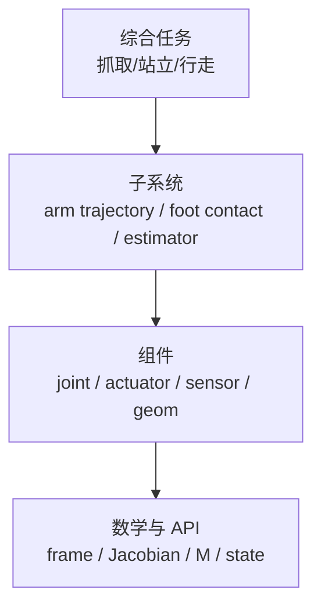

# 第 38 章　验证、回归与 sim-to-real 交付

全书最后一章回答“怎样证明仿真可信”。验证不是寻找一条漂亮轨迹，而是从结构、运动学、动力学、接触、控制、性能和部署逐层建立独立证据，并在模型、代码或 MuJoCo 升级后自动重放。

## 38.1 学习目标

- 区分 verification、validation、calibration 和 uncertainty quantification；
- 建立机器人模型的分层 V&V matrix；
- 选择不受混沌误导的 golden metrics；
- 设计 timestep/solver/parameter convergence 与 sensitivity tests；
- 形成可交付的 model card、replay bundle 和 release gate。

## 38.2 四个不同问题

- **Code/implementation verification**：程序是否正确调用 API、实现公式？例如 `J` 与 finite difference 一致。
- **Numerical verification**：离散/solver 是否收敛？例如 timestep 减半后指标稳定。
- **Model validation**：参数/结构是否与真实机器人测量一致？例如 free-swing trajectory、motor step response。
- **Calibration/identification**：怎样从数据估参数？第 23 章 LM 只是方法，不能替代独立 validation data。

“仿真和自己生成的数据一致”只能证明内部自洽，不能证明真实准确。

## 38.3 验证金字塔

底层失败时不应继续调上层 controller。每层都有独立 oracle：解析公式、CAD、标定台架、实机日志或守恒关系。

## 38.4 结构审计

加载即检查：

- compile error/warning 为零；
- body/joint/geom/actuator/sensor count 与 interface manifest；
- names 唯一、关键 ID 存在、address/dimension 不越界；
- mass/inertia positive，triangle inequality 与 total mass；
- free/ball quaternion unit；
- joint range/ref/springref、actuator range/gear、sensor frame；
- mesh units、visual/collision 分层、contact masks；
- keyframe state/control dimensions。

将 audit 输出 JSON/文本随模型版本保存；计数意外变化通常比长轨迹差异更早暴露 include/attach 错误。

## 38.5 运动学验证

选择多个姿态（nominal、limit 附近、随机）：

- body/site world pose 与 CAD/独立 FK；
- `mj_jacSite` 与 manifold-centered finite difference；
- `Jv` 与短时 pose difference；
- orientation residual convention；
- CoM 与质量加权 body positions；
- tendon length/velocity 与解析关系。

阈值按长度尺度和 epsilon sweep 设置，不能所有模型统一 `1e-12`。

## 38.6 动力学验证

- `M` symmetry/positive definiteness；
- kinetic energy `0.5 vᵀMv` 与 engine energy；
- static gravity torque 与独立/实验值；
- forward-inverse residual；
- applied Cartesian force 与 `Jᵀf`；
- passive damping energy dissipation；
- actuator scalar force→generalized force mapping；
- conservation test（关闭 gravity/damping/contact）。

质量矩阵通过不代表 inertia 参数真实；它只证明数学结构自洽。

## 38.7 接触验证

由简单到复杂：单球落地 → 单 box 四点 → 单脚 → 双脚 → 抓取。检查：

- contact point/normal 与几何；
- static support force 等于重量；
- wrench frame 和 sign；
- friction threshold/slip；
- penetration/peak force 对 `solref/timestep`；
- contact count/capacity；
- PGS/CG/Newton 收敛与任务指标；
- collision filtering 只生成预期 pairs。

真实 contact validation 应比较力板/六维力传感器和 motion capture，不只比较视觉。

## 38.8 Timestep convergence

用 \(h,h/2,h/4\) 重复同一物理时间，比较任务 metric \(g(h)\)。若

\[
|g(h/2)-g(h/4)| \ll |g(h)-g(h/2)|,
\]

说明趋于收敛区。控制 period 必须保持实际秒数不变，不能随 physics step 数错误缩放。

contact mode/chaos 会让长时逐点轨迹不收敛；改用短 horizon、事件时间、energy/contact impulse 或 statistical distribution。

## 38.9 Solver convergence

在固定 timestep 下：iterations 翻倍、tolerance 收紧、比较 Newton/CG；记录 `solver_niter`、gradient/improvement、penetration 和任务指标。若任务已不敏感，无需追求机器精度 solver；若迭代打满且指标变化，先修 condition/mass/contact，再增加预算。

有限差分/回归可暂设 tolerance=0 固定迭代路径，但 production 性能配置仍应使用合理 early termination。

## 38.10 参数辨识与验证拆分

按 excitation 划分 train/validation/test，而非从同一 trajectory 随机抽 time samples（相邻点高度相关）。报告 parameter bounds、initial guesses、loss surface/profile、covariance/sensitivity 和多初值。

模型结构误差会让参数吸收错误。例如未建 Coulomb friction 时，viscous damping 可能拟合出速度相关偏差。validation residual 应按状态/速度/contact phase 可视化，不只给总 RMSE。

## 38.11 Controller 验证

逐级：

1. truth state、无 delay、nominal model；
2. actuator saturation/rate/power；
3. sampled control + latency；
4. sensor noise + estimator；
5. payload/friction/inertia randomization；
6. external disturbance；
7. contact/goal/task distribution；
8. hardware-in-loop/实机低能量测试。

每级不只 success rate，还记录 RMS/peak error、torque/power、limit margin、contact force/slip、deadline miss 和 failure taxonomy。

## 38.12 Golden metrics 而非 golden long trajectory

相同版本/机器/单线程下短 trajectory 可做精确回归；跨硬件/solver/version 的长接触轨迹会因末位差异和混沌分叉。更稳健 golden：

- model counts/constants/hash；
- FK/Jacobian/M/inverse residual；
- 前 1～10 step state tolerance；
- equilibrium support wrench；
- energy drift、event time；
- task RMS/peak/statistical quantiles；
- warning/termination count；
- p50/p95 step time（宽容忍带）。

更新 golden 必须附原因和审查；不能把 regression failure 一键“接受新结果”。

## 38.13 随机测试

使用固定 master seed，为每 case 派生独立 seed，避免 thread schedule 改变随机序列。random qpos 应尊重 joint ranges/quaternion manifold；random velocity/force 按物理尺度。property-based invariants：

- quaternion norm；
- finite model/data arrays；
- M symmetric positive；
- state snapshot round-trip；
- force mapping virtual work；
- zero-control passive energy behavior；
- no unexpected collision pair。

失败保存 seed + full replay state，能单 case 重放。

## 38.14 性能回归

先确定测量范围：compile、data allocation、forward、step、controller、render、readback、batch throughput。预热、重复、报告 distribution；固定 CPU power/affinity 尽可能控制噪声。

性能与 correctness 双 gate：优化不能改变容许范围外的 physics metrics；solver/timestep 降级带来的速度必须明确标为 accuracy tradeoff。

## 38.15 Model card

每个发布模型附：

- purpose/non-goals；
- MuJoCo version、source commit、assets/licenses；
- units/frame/joint/actuator/sensor interface；
- mass/inertia/geometry 来源；
- calibrated parameters/data/日期；
- recommended timestep/integrator/solver；
- validated tasks/ranges/metrics；
- known gaps（cable、thermal、flex、contact、sensor）；
- reproducible commands 与 hardware；
- change history。

这让“高保真”变成有边界的工程声明。

## 38.16 全书仓库验收

最终发布前自动/人工确认：

1. 每个 `examples/*/CMakeLists.txt` 独立 configure/build；
2. 每个 executable 按其 README command 运行并满足输出 invariant；
3. 每目录只有一个 `main.cc`，无 shared `common.h`；
4. 无 root aggregate CMake、`enable_testing()`、`add_test()`；
5. 示例只引用 vendored SDK，不引用 `../mujoco` source；
6. Markdown internal links 全部存在；
7. SUMMARY、BOOK_OUTLINE、coverage matrix、example index 一致；
8. EGL/plugin/VFS 等 platform experiments 明确额外 system boundary；
9. SDK license/notices 保留；
10. 全书官方主题矩阵逐项有证据。

## 38.17 Sim-to-real release gate

从 simulation 进入 hardware 前：torque/position/velocity limit 双重保护，emergency stop，workspace/collision safety，低 gain/低速度分阶段放开；验证 joint sign、zero、gear、gravity direction、sensor timestamp/frame。

先单关节悬空/支撑台架，再固定基低能量，再局部任务，最后全系统。仿真成功不授权跳过机器人安全流程。

## 38.18 常见误区

- 同一 simulator 生成和验证全部数据；
- 只验证 nominal pose；
- 长混沌 trajectory 要求跨平台逐位一致；
- timestep 减半时控制频率也翻倍；
- regression fail 直接更新 golden；
- random test 不保存 seed/state；
- performance benchmark 混入 render/log/sleep；
- model card 只写“高保真”；
- simulation pass 直接上全功率实机。

## 38.19 习题与答案

1. verification 与 validation 区别？  
   **答案：**verification 问公式/API/数值是否正确实现；validation 问模型是否代表真实系统。

2. 为什么 train/validation 不应随机拆同一连续轨迹的相邻点？  
   **答案：**强时间相关会泄漏相同 excitation/状态，夸大泛化。

3. timestep convergence 时 control period 怎样保持？  
   **答案：**保持实际秒数，例如 5 ms；h 从 1 ms 变 0.5 ms 时更新间隔从 5 step 变 10 step。

4. 哪些指标适合混沌接触回归？  
   **答案：**短期 invariants、event/energy/contact impulse、任务成功率和统计分布，而非长轨迹逐点。

5. model card 的 known gaps 为什么重要？  
   **答案：**限定验证声明，防止模型在未经验证的速度、载荷、接触或传感场景被误用。
